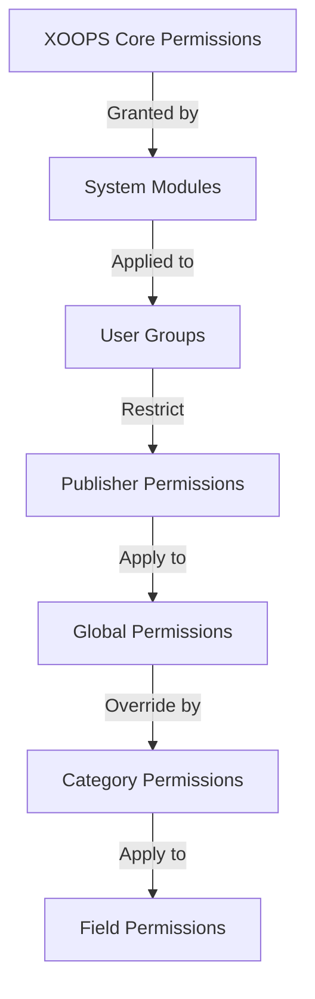

# Uitgeversmachtigingen instellen

> Volledige gids voor het configureren van groepsrechten, toegangscontrole en het beheren van gebruikerstoegang in Publisher.

---

## Basisprincipes van rechten

### Wat zijn machtigingen?

Machtigingen bepalen wat verschillende gebruikersgroepen kunnen doen in Publisher:

```
Who can:
  - View articles
  - Submit articles
  - Edit articles
  - Approve articles
  - Manage categories
  - Configure settings
```

### Machtigingsniveaus

```
Anonymous
  └── View published articles only

Registered Users
  ├── View articles
  ├── Submit articles (pending approval)
  └── Edit own articles

Editors/Moderators
  ├── All registered permissions
  ├── Approve articles
  ├── Edit all articles
  └── Manage some categories

Administrators
  └── Full access to everything
```

---

## Beheer van toegangsrechten

### Navigeer naar Machtigingen

```
Admin Panel
└── Modules
    └── Publisher
        ├── Permissions
        ├── Category Permissions
        └── Group Management
```

### Snelle toegang

1. Log in als **Beheerder**
2. Ga naar **Beheer → Modules**
3. Klik op **Uitgever → Beheerder**
4. Klik op **Permissies** in het linkermenu

---

## Algemene machtigingen

### Machtigingen op moduleniveau

Beheer de toegang tot de Publisher-module en -functies:

```
Permissions configuration view:
┌─────────────────────────────────────┐
│ Permission             │ Anon │ Reg │ Editor │ Admin │
├────────────────────────┼──────┼─────┼────────┼───────┤
│ View articles          │  ✓   │  ✓  │   ✓    │  ✓   │
│ Submit articles        │  ✗   │  ✓  │   ✓    │  ✓   │
│ Edit own articles      │  ✗   │  ✓  │   ✓    │  ✓   │
│ Edit all articles      │  ✗   │  ✗  │   ✓    │  ✓   │
│ Approve articles       │  ✗   │  ✗  │   ✓    │  ✓   │
│ Manage categories      │  ✗   │  ✗  │   ✗    │  ✓   │
│ Access admin panel     │  ✗   │  ✗  │   ✓    │  ✓   │
└─────────────────────────────────────┘
```

### Toestemmingsbeschrijvingen

| Toestemming | Gebruikers | Effect |
|-----------|-------|--------|
| **Bekijk artikelen** | Alle groepen | Kan gepubliceerde artikelen op front-end zien |
| **Artikelen indienen** | Geregistreerd+ | Kan nieuwe artikelen aanmaken (in afwachting van goedkeuring) |
| **Eigen artikelen bewerken** | Geregistreerd+ | Kunnen hun eigen artikelen bewerken/verwijderen |
| **Alle artikelen bewerken** | Redacteuren+ | Kan de artikelen van elke gebruiker bewerken |
| **Eigen artikelen verwijderen** | Geregistreerd+ | Kunnen hun eigen niet-gepubliceerde artikelen verwijderen |
| **Verwijder alle artikelen** | Redacteuren+ | Kan elk artikel verwijderen |
| **Artikelen goedkeuren** | Redacteuren+ | Kan in behandeling zijnde artikelen publiceren |
| **Categorieën beheren** | Beheerders | Categorieën maken, bewerken, verwijderen |
| **Beheerderstoegang** | Redacteuren+ | Toegang tot beheerdersinterface |

---

## Algemene machtigingen configureren

### Stap 1: Toegang tot toestemmingsinstellingen

1. Ga naar **Beheer → Modules**
2. Zoek **Uitgever**
3. Klik op **Machtigingen** (of de beheerderslink en vervolgens Machtigingen)
4. U ziet de toestemmingsmatrix

### Stap 2: Groepsrechten instellen

Configureer voor elke groep wat ze kunnen doen:

#### Anonieme gebruikers

```yaml
Anonymous Group Permissions:
  View articles: ✓ YES
  Submit articles: ✗ NO
  Edit articles: ✗ NO
  Delete articles: ✗ NO
  Approve articles: ✗ NO
  Manage categories: ✗ NO
  Admin access: ✗ NO

Result: Anonymous users can only view published content
```

#### Geregistreerde gebruikers

```yaml
Registered Group Permissions:
  View articles: ✓ YES
  Submit articles: ✓ YES (with approval required)
  Edit own articles: ✓ YES
  Edit all articles: ✗ NO
  Delete own articles: ✓ YES (drafts only)
  Delete all articles: ✗ NO
  Approve articles: ✗ NO
  Manage categories: ✗ NO
  Admin access: ✗ NO

Result: Registered users can contribute content after approval
```

#### Redacteursgroep

```yaml
Editors Group Permissions:
  View articles: ✓ YES
  Submit articles: ✓ YES
  Edit own articles: ✓ YES
  Edit all articles: ✓ YES
  Delete own articles: ✓ YES
  Delete all articles: ✓ YES
  Approve articles: ✓ YES
  Manage categories: ✓ LIMITED
  Admin access: ✓ YES
  Configure settings: ✗ NO

Result: Editors manage content but not settings
```

#### Beheerders

```yaml
Admins Group Permissions:
  ✓ FULL ACCESS to all features

  - All editor permissions
  - Manage all categories
  - Configure all settings
  - Manage permissions
  - Install/uninstall
```

### Stap 3: Machtigingen opslaan

1. Configureer de machtigingen van elke groep
2. Vink vakjes aan voor toegestane acties
3. Schakel de selectievakjes voor geweigerde acties uit
4. Klik op **Machtigingen opslaan**
5. Er verschijnt een bevestigingsbericht

---

## Machtigingen op categorieniveau

### Categorietoegang instellen

Bepaal wie specifieke categorieën kan bekijken/inzenden:

```
Admin → Publisher → Categories
→ Select category → Permissions
```

### Categoriemachtigingsmatrix

```
                 Anonymous  Registered  Editor  Admin
View category        ✓         ✓         ✓       ✓
Submit to category   ✗         ✓         ✓       ✓
Edit own in category ✗         ✓         ✓       ✓
Edit all in category ✗         ✗         ✓       ✓
Approve in category  ✗         ✗         ✓       ✓
Manage category      ✗         ✗         ✗       ✓
```

### Categoriemachtigingen configureren

1. Ga naar het **Categorieën**-beheer
2. Zoek categorie
3. Klik op de knop **Machtigingen**
4. Selecteer voor elke groep:
   - [ ] Bekijk deze categorie
   - [ ] Artikelen indienen
   - [ ] Eigen artikelen bewerken
   - [ ] Bewerk alle artikelen
   - [ ] Artikelen goedkeuren
   - [ ] Categorie beheren
5. Klik op **Opslaan**

### Voorbeelden van categorierechten

#### Categorie openbaar nieuws

```
Anonymous: View only
Registered: View + Submit (pending approval)
Editors: Approve + Edit
Admins: Full control
```

#### Categorie Interne updates

```
Anonymous: No access
Registered: View only
Editors: Submit + Approve
Admins: Full control
```

#### Gastblogcategorie

```
Anonymous: View only
Registered: Submit (pending approval)
Editors: Approve
Admins: Full control
```

---

## Machtigingen op veldniveau

### Controleformulier Veldzichtbaarheid

Beperk welke formuliervelden gebruikers kunnen zien/bewerken:

```
Admin → Publisher → Permissions → Fields
```

### Veldopties

```yaml
Visible Fields for Registered Users:
  ✓ Title
  ✓ Description
  ✓ Content (body)
  ✓ Featured image
  ✓ Category
  ✓ Tags
  ✗ Author (auto-set)
  ✗ Publication date (editors only)
  ✗ Scheduled date (editors only)
  ✗ Featured flag (editors only)
  ✗ Permissions (admins only)
```

### Voorbeelden

#### Beperkte inzending voor geregistreerd

Geregistreerde gebruikers zien minder opties:

```
Available fields:
  - Title ✓
  - Description ✓
  - Content ✓
  - Featured image ✓
  - Category ✓

Hidden fields:
  - Author (auto-current user)
  - Publication date (editors decide)
  - Scheduled date (admins only)
  - Featured status (editors choose)
```

#### Volledig formulier voor redacteuren

Bewerkers zien alle opties:

```
Available fields:
  - All basic fields
  - All metadata
  - Author selection ✓
  - Publication date/time ✓
  - Scheduled date ✓
  - Featured status ✓
  - Expiration date ✓
  - Permissions ✓
```

---

## Configuratie gebruikersgroep

### Aangepaste groep maken

1. Ga naar **Beheer → Gebruikers → Groepen**
2. Klik op **Groep maken**
3. Groepsgegevens invoeren:

```
Group Name: "Community Bloggers"
Group Description: "Users who contribute blog content"
Type: Regular group
```

4. Klik op **Groep opslaan**
5. Ga terug naar Uitgeversrechten
6. Stel machtigingen in voor een nieuwe groep

### Groepsvoorbeelden

```
Suggested Groups for Publisher:

Group: Contributors
  - Regular members who submit articles
  - Can edit own articles
  - Cannot approve articles

Group: Reviewers
  - Can see submitted articles
  - Can approve/reject articles
  - Cannot delete others' articles

Group: Editors
  - Can edit any article
  - Can approve articles
  - Can moderate comments
  - Can manage some categories

Group: Publishers
  - Can edit any article
  - Can publish directly (no approval)
  - Can manage all categories
  - Can configure settings
```

---

## Toestemmingshiërarchieën

### Toestemmingsstroom



### Overerving van toestemming

```
Base: Global module permissions
  ↓
Category: Overrides for specific categories
  ↓
Field: Further restricts available fields
  ↓
User: Has permission if ALL levels allow
```

**Voorbeeld:**

```
User wants to edit article:
1. User group must have "edit articles" permission (global)
2. Category must allow editing (category level)
3. Field restrictions must allow (if applicable)
4. User must be author OR editor (for own vs all)

If ANY level denies → Permission denied
```

---

## Goedkeuringswerkstroommachtigingen

### Configureer goedkeuring van indiening

Bepaal of artikelen goedkeuring nodig hebben:

```
Admin → Publisher → Preferences → Workflow
```

#### Goedkeuringsopties

```yaml
Submission Workflow:
  Require Approval: Yes

  For Registered Users:
    - New articles: Draft (pending approval)
    - Editors must approve
    - User can edit while pending
    - After approval: User can still edit

  For Editors:
    - New articles: Publish directly (optional)
    - Skip approval queue
    - Or always require approval
```

#### Configureer per groep

1. Ga naar Voorkeuren
2. Ga naar "Inzendingsworkflow"
3. Stel voor elke groep het volgende in:

```
Group: Registered Users
  Require approval: ✓ YES
  Default status: Draft
  Can modify while pending: ✓ YES

Group: Editors
  Require approval: ✗ NO
  Default status: Published
  Can modify published: ✓ YES
```

4. Klik op **Opslaan**

---

## Gematigde artikelen

### In behandeling zijnde artikelen goedkeuren

Voor gebruikers met de machtiging 'artikelen goedkeuren':

1. Ga naar **Beheerder → Uitgever → Artikelen**
2. Filter op **Status**: In behandeling
3. Klik op het artikel dat u wilt beoordelen
4. Controleer de inhoudskwaliteit
5. Stel **Status** in: Gepubliceerd
6. Optioneel: voeg redactionele opmerkingen toe
7. Klik op **Opslaan**

### Artikelen afwijzenAls het artikel niet aan de normen voldoet:

1. Artikel openen
2. Stel **Status** in: Concept
3. Voeg een afwijzingsreden toe (in reactie of e-mail)
4. Klik op **Opslaan**
5. Stuur een bericht naar de auteur met uitleg over de afwijzing

### Gematigde reacties

Als u reacties modereert:

1. Ga naar **Beheerder → Uitgever → Opmerkingen**
2. Filter op **Status**: In behandeling
3. Reactie beoordelen
4. Opties:
   - Goedkeuren: klik op **Goedkeuren**
   - Weigeren: klik op **Verwijderen**
   - Bewerken: klik op **Bewerken**, repareren, opslaan
5. Klik op **Opslaan**

---

## Beheer gebruikerstoegang

### Gebruikersgroepen bekijken

Bekijk welke gebruikers tot groepen behoren:

```
Admin → Users → User Groups

For each user:
  - Primary group (one)
  - Secondary groups (multiple)

Permissions apply from all groups (union)
```

### Gebruiker toevoegen aan groep

1. Ga naar **Beheerder → Gebruikers**
2. Zoek gebruiker
3. Klik op **Bewerken**
4. Vink onder **Groepen** de groepen aan die u wilt toevoegen
5. Klik op **Opslaan**

### Wijzig gebruikersrechten

Voor individuele gebruikers (indien ondersteund):

1. Ga naar Gebruikersbeheer
2. Zoek gebruiker
3. Klik op **Bewerken**
4. Zoek naar individuele toestemmingsoverschrijvingen
5. Configureer indien nodig
6. Klik op **Opslaan**

---

## Algemene toestemmingsscenario's

### Scenario 1: Blog openen

Iedereen toestaan om in te dienen:

```
Anonymous: View
Registered: Submit, edit own, delete own
Editors: Approve, edit all, delete all
Admins: Full control

Result: Open community blog
```

### Scenario 2: Gemodereerde nieuwssite

Strikt goedkeuringsproces:

```
Anonymous: View only
Registered: Cannot submit
Editors: Submit, approve others
Admins: Full control

Result: Only approved professionals publish
```

### Scenario 3: Personeelsblog

Medewerkers kunnen bijdragen:

```
Create group: "Staff"
Anonymous: View
Registered: View only (non-staff)
Staff: Submit, edit own, publish directly
Admins: Full control

Result: Staff-authored blog
```

### Scenario 4: Meerdere categorieën met verschillende editors

Verschillende editors voor verschillende categorieën:

```
News category:
  Editors group A: Full control

Reviews category:
  Editors group B: Full control

Tutorials category:
  Editors group C: Full control

Result: Decentralized editorial control
```

---

## Toestemming testen

### Controleer of de machtigingen werken

1. Maak in elke groep een testgebruiker aan
2. Log in als elke testgebruiker
3. Probeer:
   - Bekijk artikelen
   - Artikel indienen (zou een concept moeten maken, indien toegestaan)
   - Artikel bewerken (eigen en anderen)
   - Artikel verwijderen
   - Toegang tot het beheerderspaneel
   - Toegang tot categorieën

4. Controleer of de resultaten overeenkomen met de verwachte machtigingen

### Veelvoorkomende testgevallen

```
Test Case 1: Anonymous user
  [ ] Can view published articles: ✓
  [ ] Cannot submit articles: ✓
  [ ] Cannot access admin: ✓

Test Case 2: Registered user
  [ ] Can submit articles: ✓
  [ ] Articles go to Draft: ✓
  [ ] Can edit own article: ✓
  [ ] Cannot edit others: ✓
  [ ] Cannot access admin: ✓

Test Case 3: Editor
  [ ] Can approve articles: ✓
  [ ] Can edit any article: ✓
  [ ] Can access admin: ✓
  [ ] Cannot delete all: ✓ (or ✓ if allowed)

Test Case 4: Admin
  [ ] Can do everything: ✓
```

---

## Problemen met rechten oplossen

### Probleem: Gebruiker kan geen artikelen indienen

**Controleer:**
```
1. User group has "submit articles" permission
   Admin → Publisher → Permissions

2. User belongs to allowed group
   Admin → Users → Edit user → Groups

3. Category allows submission from user's group
   Admin → Publisher → Categories → Permissions

4. User is registered (not anonymous)
```

**Oplossing:**
```bash
1. Verify registered user group has submission permission
2. Add user to appropriate group
3. Check category permissions
4. Clear user session cache
```

### Probleem: Editor kan artikelen niet goedkeuren

**Controleer:**
```
1. Editor group has "approve articles" permission
2. Articles exist with "Pending" status
3. Editor is in correct group
4. Category allows approval from editor's group
```

**Oplossing:**
```bash
1. Go to Permissions, check "approve articles" is checked for editor group
2. Create test article, set to Draft
3. Try to approve as editor
4. Check error messages in system log
```

### Probleem: Kan artikelen zien, maar heeft geen toegang tot de categorie

**Controleer:**
```
1. Category is not disabled/hidden
2. Category permissions allow viewing
3. User's group is permitted to view category
4. Category is published
```

**Oplossing:**
```bash
1. Go to Categories, check category status is "Enabled"
2. Check category permissions are set
3. Add user's group to category view permission
```

### Probleem: Machtigingen gewijzigd, maar worden niet van kracht

**Oplossing:**
```bash
1. Clear cache: Admin → Tools → Clear Cache
2. Clear session: Logout and login again
3. Check system log for errors
4. Verify permissions actually saved
5. Try different browser/incognito window
```

---

## Toestemming Back-up en export

### Exportrechten

Sommige systemen staan exporteren toe:

1. Ga naar **Beheer → Uitgever → Tools**
2. Klik op **Exportrechten**
3. Sla het `.xml`- of `.json`-bestand op
4. Bewaar als back-up

### Importrechten

Herstellen vanaf back-up:

1. Ga naar **Beheer → Uitgever → Tools**
2. Klik op **Machtigingen importeren**
3. Selecteer een back-upbestand
4. Wijzigingen beoordelen
5. Klik op **Importeren**

---

## Beste praktijken

### Controlelijst voor machtigingsconfiguratie

- [ ] Bepaal gebruikersgroepen
- [ ] Wijs duidelijke namen toe aan groepen
- [ ] Stel basisrechten in voor elke groep
- [ ] Test elk toestemmingsniveau
- [ ] Documentmachtigingsstructuur
- [ ] Goedkeuringsworkflow maken
- [ ] Train redacteuren op moderatie
- [ ] Toestemmingsgebruik controleren
- [ ] Permissies per kwartaal beoordelen
- [ ] Instellingen voor back-uprechten

### Beste praktijken op het gebied van beveiliging

```
✓ Principle of Least Privilege
  - Grant minimum necessary permissions

✓ Role-Based Access
  - Use groups for roles (editor, moderator, etc)

✓ Audit Permissions
  - Review who has what access

✓ Separate Duties
  - Submitter, approver, publisher are different

✓ Regular Review
  - Check permissions quarterly
  - Remove access when users leave
  - Update for new requirements
```

---

## Gerelateerde gidsen

- Artikelen maken
- Categorieën beheren
- Basisconfiguratie
- Installatie

---

## Volgende stappen

- Stel machtigingen in voor uw workflow
- Maak artikelen met de juiste machtigingen
- Configureer categorieën met machtigingen
- Train gebruikers bij het maken van artikelen

---

#publisher #permissions #groups #access-control #security #moderation #xoops