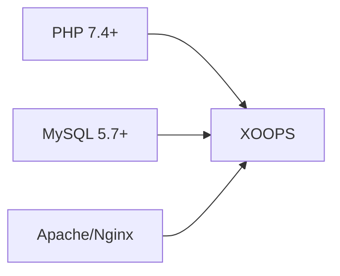
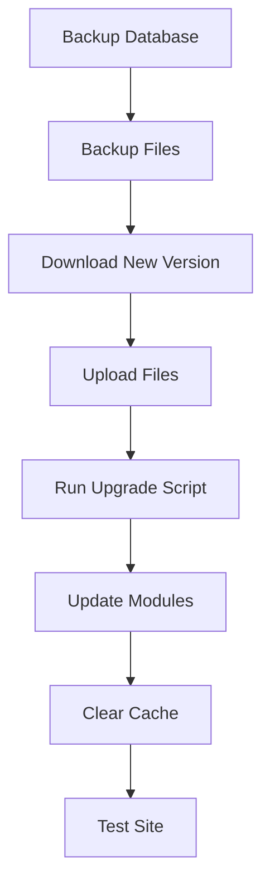

> Veelgestelde vragen en antwoorden over het installeren van XOOPS.

---

## Pre-installatie

### V: Wat zijn de minimale serververeisten?

**A:** XOOPS 2.5.x vereist:
- PHP 7.4 of hoger (PHP 8.x aanbevolen)
- MySQL 5.7+ of MariaDB 10.3+
- Apache met mod_rewrite of Nginx
- Minimaal 64 MB PHP geheugenlimiet (128 MB+ aanbevolen)



### V: Kan ik XOOPS op gedeelde hosting installeren?

**A:** Ja, XOOPS werkt goed op de meeste gedeelde hosting die aan de vereisten voldoet. Controleer of uw host het volgende biedt:
- PHP met vereiste extensies (mysqli, gd, curl, json, mbstring)
- Toegang tot MySQL-database
- Mogelijkheid voor het uploaden van bestanden
- .htaccess-ondersteuning (voor Apache)

### V: Welke PHP-extensies zijn vereist?

**A:** Vereiste extensies:
- `mysqli` - Databaseconnectiviteit
- `gd` - Beeldverwerking
- `json` - JSON-bediening
- `mbstring` - Ondersteuning voor meerdere bytes

Aanbevolen:
- `curl` - Externe API-oproepen
- `zip` - Module-installatie
- `intl` - Internationalisering

---

## Installatieproces

### V: De installatiewizard toont een lege pagina

**A:** Dit is meestal een PHP-fout. Probeer:

1. Foutweergave tijdelijk inschakelen:
```php
// Add to htdocs/install/index.php at the top
error_reporting(E_ALL);
ini_set('display_errors', 1);
```

2. Controleer het foutenlogboek PHP
3. Controleer de compatibiliteit van de PHP-versie
4. Zorg ervoor dat alle vereiste extensies zijn geladen

### V: Ik krijg de melding "Kan niet schrijven naar mainfile.php"

**A:** Stel schrijfrechten in vóór de installatie:

```bash
chmod 666 mainfile.php
# After installation, secure it:
chmod 444 mainfile.php
```

### V: Databasetabellen worden niet gemaakt

**A:** Controleer:

1. MySQL-gebruiker heeft CREATE TABLE-rechten:
```sql
GRANT ALL PRIVILEGES ON xoopsdb.* TO 'xoopsuser'@'localhost';
FLUSH PRIVILEGES;
```

2. Database bestaat:
```sql
CREATE DATABASE xoopsdb CHARACTER SET utf8mb4 COLLATE utf8mb4_unicode_ci;
```

3. De referenties in de wizard komen overeen met de database-instellingen

### V: De installatie is voltooid, maar de site vertoont fouten

**A:** Veelvoorkomende oplossingen na installatie:

1. Installatiemap verwijderen of hernoemen:
```bash
mv htdocs/install htdocs/install.bak
```

2. Stel de juiste rechten in:
```bash
chmod -R 755 htdocs/
chmod -R 777 xoops_data/
chmod 444 mainfile.php
```

3. Cache wissen:
```bash
rm -rf xoops_data/caches/smarty_cache/*
rm -rf xoops_data/caches/smarty_compile/*
```

---

## Configuratie

### V: Waar is het configuratiebestand?

**A:** De hoofdconfiguratie bevindt zich in `mainfile.php` in de XOOPS root. Belangrijkste instellingen:

```php
define('XOOPS_ROOT_PATH', '/path/to/htdocs');
define('XOOPS_VAR_PATH', '/path/to/xoops_data');
define('XOOPS_URL', 'https://yoursite.com');
define('XOOPS_DB_HOST', 'localhost');
define('XOOPS_DB_USER', 'username');
define('XOOPS_DB_PASS', 'password');
define('XOOPS_DB_NAME', 'database');
define('XOOPS_DB_PREFIX', 'xoops');
```

### V: Hoe wijzig ik de site URL?

**A:** Bewerk `mainfile.php`:

```php
define('XOOPS_URL', 'https://newdomain.com');
```

Wis vervolgens de cache en update eventuele hardgecodeerde URL's in de database.

### V: Hoe verplaats ik XOOPS naar een andere map?

**EEN:**

1. Verplaats bestanden naar een nieuwe locatie
2. Paden bijwerken in `mainfile.php`:
```php
define('XOOPS_ROOT_PATH', '/new/path/to/htdocs');
define('XOOPS_VAR_PATH', '/new/path/to/xoops_data');
```
3. Update de database indien nodig
4. Wis alle caches

---

## Upgrades

### V: Hoe upgrade ik XOOPS?

**EEN:**



1. **Back-up van alles** (database + bestanden)
2. Download de nieuwe XOOPS-versie
3. Bestanden uploaden (`mainfile.php` niet overschrijven)
4. Voer `htdocs/upgrade/` uit, indien aanwezig
5. Update modules via het beheerderspaneel
6. Wis alle caches
7. Grondig testen

### V: Kan ik versies overslaan tijdens het upgraden?

**A:** Over het algemeen nee. Upgrade sequentieel via de belangrijkste versies om ervoor te zorgen dat databasemigraties correct worden uitgevoerd. Controleer de release-opmerkingen voor specifieke richtlijnen.

### V: Mijn modules werken niet meer na de upgrade

**EEN:**

1. Controleer de modulecompatibiliteit met de nieuwe XOOPS-versie
2. Update modules naar de nieuwste versies
3. Genereer sjablonen opnieuw: Beheerder → Systeem → Onderhoud → Sjablonen
4. Wis alle caches
5. Controleer de PHP-foutlogboeken op specifieke fouten

---

## Problemen oplossen

### V: Ik ben het beheerderswachtwoord vergeten

**A:** Resetten via database:

```sql
-- Generate new password hash
UPDATE xoops_users
SET pass = MD5('newpassword')
WHERE uname = 'admin';
```

Of gebruik de functie voor het opnieuw instellen van het wachtwoord als e-mail is geconfigureerd.

### V: Site is erg traag na installatie

**EEN:**

1. Schakel caching in in Beheer → Systeem → Voorkeuren
2. Database optimaliseren:
```sql
OPTIMIZE TABLE xoops_session;
OPTIMIZE TABLE xoops_online;
```
3. Controleer op trage query's in de foutopsporingsmodus
4. Schakel PHP OpCache in

### V: Afbeeldingen/CSS worden niet geladen

**EEN:**

1. Controleer de bestandsrechten (644 voor bestanden, 755 voor mappen)
2. Controleer of `XOOPS_URL` correct is in `mainfile.php`
3. Controleer .htaccess op herschrijfconflicten
4. Inspecteer de browserconsole op 404-fouten

---

## Gerelateerde documentatie

- Installatiehandleiding
- Basisconfiguratie
- Wit scherm van de dood

---#xoops #faq #installatie #probleemoplossing