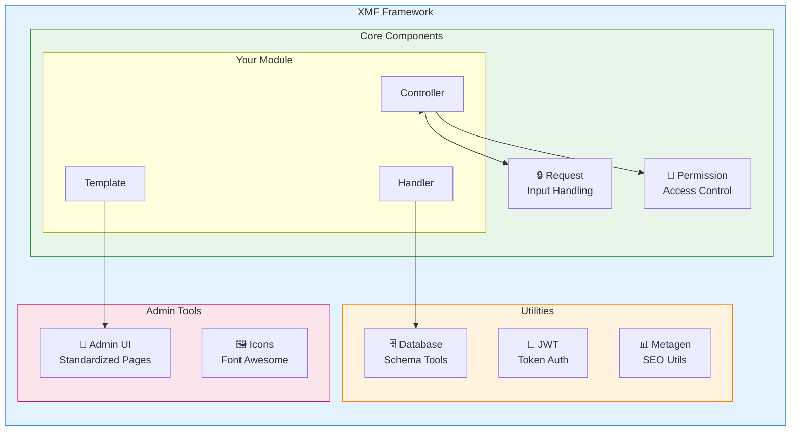
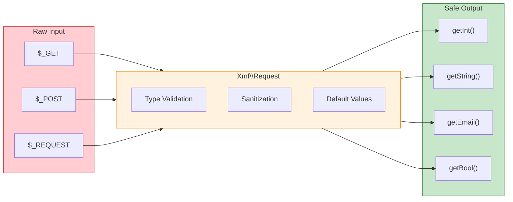

<span class="version-badge versie-25x">2.5.x ✅</span> <span class="version-badge versie-40x">4.0.x ✅</span>

:::tip[De brug naar het moderne XOOPS]
XMF werkt in **zowel XOOPS 2.5.x als XOOPS 4.0.x**. Het is de aanbevolen manier om uw modules vandaag nog te moderniseren terwijl u zich voorbereidt op XOOPS 4.0. XMF biedt PSR-4 automatisch laden, naamruimten en helpers die de overgang soepel maken.
:::

Het **XOOPS Module Framework (XMF)** is een krachtige bibliotheek die is ontworpen om de ontwikkeling van XOOPS-modules te vereenvoudigen en te standaardiseren. XMF biedt moderne PHP-praktijken, waaronder naamruimten, automatisch laden en een uitgebreide set helperklassen die de standaardcode verminderen en de onderhoudbaarheid verbeteren.

## Wat is XMF?

XMF is een verzameling klassen en hulpprogramma's die het volgende bieden:

- **Moderne PHP-ondersteuning** - Volledige naamruimte-ondersteuning met automatisch laden van PSR-4
- **Verzoekafhandeling** - Veilige invoervalidatie en opschoning
- **Modulehelpers** - Vereenvoudigde toegang tot moduleconfiguraties en objecten
- **Permissiesysteem** - Eenvoudig te gebruiken machtigingsbeheer
- **Databasehulpprogramma's** - Hulpmiddelen voor schemamigratie en tabelbeheer
- **JWT-ondersteuning** - JSON Web Token-implementatie voor veilige authenticatie
- **Metadata genereren** - SEO en hulpprogramma's voor het extraheren van inhoud
- **Beheerinterface** - Gestandaardiseerde modulebeheerpagina's

### XMF Componentoverzicht



## Belangrijkste kenmerken

### Naamruimten en automatisch laden

Alle XMF-klassen bevinden zich in de `Xmf`-naamruimte. Klassen worden automatisch geladen wanneer ernaar wordt verwezen - er is geen handleiding vereist.

```php
use Xmf\Request;
use Xmf\Module\Helper;

// Classes load automatically when used
$input = Request::getString('input', '');
$helper = Helper::getHelper('mymodule');
```

### Veilige afhandeling van verzoeken

De [Request class](../05-XMF-Framework/Basics/XMF-Request.md) biedt typeveilige toegang tot HTTP-verzoekgegevens met ingebouwde opschoning:



```php
use Xmf\Request;

$id = Request::getInt('id', 0);
$name = Request::getString('name', '');
$email = Request::getEmail('email', '');
```

### Modulehelpersysteem

De [Module Helper](../05-XMF-Framework/Basics/XMF-Module-Helper.md) biedt gemakkelijke toegang tot modulegerelateerde functionaliteit:

```php
$helper = \Xmf\Module\Helper::getHelper('mymodule');

// Access module configuration
$configValue = $helper->getConfig('setting_name', 'default');

// Get module object
$module = $helper->getModule();

// Access handlers
$handler = $helper->getHandler('items');
```

### Toestemmingsbeheer

De [Permission-Helper](../05-XMF-Framework/Recipes/Permission-Helper.md) vereenvoudigt de verwerking van XOOPS-machtigingen:

```php
$permHelper = new \Xmf\Module\Helper\Permission();

// Check user permission
if ($permHelper->checkPermission('view', $itemId)) {
    // User has permission
}
```

## Documentatiestructuur

### Basisprincipes

- [Aan de slag met-XMF](../05-XMF-Framework/Basics/Getting-Started-with-XMF.md) - Installatie en basisgebruik
- [XMF-Request](../05-XMF-Framework/Basics/XMF-Request.md) - Verzoekafhandeling en invoervalidatie
- [XMF-Module-Helper](../05-XMF-Framework/Basics/XMF-Module-Helper.md) - Gebruik van modulehelperklasse

### Recepten

- [Permissie-Helper](../05-XMF-Framework/Recipes/Permission-Helper.md) - Werken met machtigingen
- [Module-Admin-Pages](../05-XMF-Framework/Recipes/Module-Admin-Pages.md) - Gestandaardiseerde beheerdersinterfaces maken

### Referentie

- [JWT](../05-XMF-Framework/Reference/JWT.md) - JSON Web Token-implementatie
- [Database](../05-XMF-Framework/Reference/Database.md) - Databasehulpprogramma's en schemabeheer
- [Metagen](Reference/Metagen.md) - Metagegevens en SEO-hulpprogramma's

## Vereisten

- XOOPS 2.5.8 of hoger
- PHP 7.2 of hoger (PHP 8.x aanbevolen)

## Installatie

XMF wordt meegeleverd met XOOPS 2.5.8 en latere versies. Voor eerdere versies of handmatige installatie:

1. Download het XMF-pakket uit de XOOPS-repository
2. Uitpakken naar uw map XOOPS `/class/xmf/`
3. De autoloader verwerkt het laden van klassen automatisch

## Snelstartvoorbeeld

Hier is een compleet voorbeeld van veelgebruikte XMF-gebruikspatronen:

```php
<?php
use Xmf\Request;
use Xmf\Module\Helper;
use Xmf\Module\Helper\Permission;

// Get module helper
$helper = Helper::getHelper('mymodule');

// Get configuration values
$itemsPerPage = $helper->getConfig('items_per_page', 10);

// Handle request input
$op = Request::getCmd('op', 'list');
$id = Request::getInt('id', 0);

// Check permissions
$permHelper = new Permission();
if (!$permHelper->checkPermission('view', $id)) {
    redirect_header('index.php', 3, 'Access denied');
}

// Process based on operation
switch ($op) {
    case 'view':
        $handler = $helper->getHandler('items');
        $item = $handler->get($id);
        // ... display item
        break;
    case 'list':
    default:
        // ... list items
        break;
}
```

## Bronnen

- [XMF GitHub-opslagplaats](https://github.com/XOOPS/XMF)
- [XOOPS-projectwebsite](https://xoops.org)

---

#xmf #xoops #framework #PHP #module-ontwikkeling