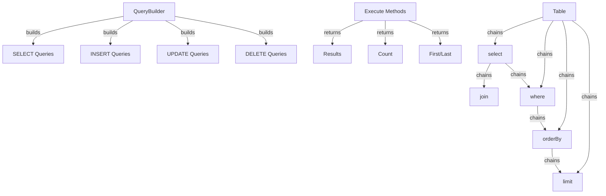

Konstruktor Zapytań XOOPS zapewnia nowoczesny, fluent interfejs do budowania zapytań SQL. Pomaga w zapobieganiu wstrzykiwaniu SQL, poprawia czytelność i zapewnia abstrakcję bazy danych dla wielu systemów baz danych.

## Architektura Konstruktora Zapytań



## Klasa QueryBuilder

Główna klasa konstruktora zapytań z fluent interfejsem.

### Przegląd Klasy

```php
namespace Xoops\Database;

class QueryBuilder
{
    protected string $table = '';
    protected string $type = 'SELECT';
    protected array $selects = [];
    protected array $joins = [];
    protected array $wheres = [];
    protected array $orders = [];
    protected int $limit = 0;
    protected int $offset = 0;
    protected array $bindings = [];
}
```

### Metody Statyczne

#### table

Tworzy nowy konstruktor zapytań dla tabeli.

```php
public static function table(string $table): QueryBuilder
```

**Parametry:**

| Parametr | Typ | Opis |
|----------|-----|------|
| `$table` | string | Nazwa tabeli (z prefiksem lub bez) |

**Zwraca:** `QueryBuilder` - Instancja konstruktora zapytań

**Przykład:**
```php
$query = QueryBuilder::table('users');
$query = QueryBuilder::table('xoops_users'); // Z prefiksem
```

## Zapytania SELECT

### select

Określa kolumny do wybrania.

```php
public function select(...$columns): self
```

**Parametry:**

| Parametr | Typ | Opis |
|----------|-----|------|
| `...$columns` | array | Nazwy kolumn lub wyrażenia |

**Zwraca:** `self` - Do łańcuchowania metod

**Przykład:**
```php
// Proste wybranie
QueryBuilder::table('users')
    ->select('id', 'username', 'email')
    ->get();

// Wybierz z aliasami
QueryBuilder::table('users')
    ->select('id as user_id', 'username as name')
    ->get();

// Wybierz wszystkie kolumny
QueryBuilder::table('users')
    ->select('*')
    ->get();

// Wybierz z wyrażeniami
QueryBuilder::table('orders')
    ->select('id', 'COUNT(*) as total_items')
    ->groupBy('id')
    ->get();
```

### where

Dodaje warunek WHERE.

```php
public function where(string $column, string $operator = '=', mixed $value = null): self
```

**Parametry:**

| Parametr | Typ | Opis |
|----------|-----|------|
| `$column` | string | Nazwa kolumny |
| `$operator` | string | Operator porównania |
| `$value` | mixed | Wartość do porównania |

**Zwraca:** `self` - Do łańcuchowania metod

**Operatory:**

| Operator | Opis | Przykład |
|----------|------|---------|
| `=` | Równe | `->where('status', '=', 'active')` |
| `!=` lub `<>` | Nie równe | `->where('status', '!=', 'deleted')` |
| `>` | Większe niż | `->where('price', '>', 100)` |
| `<` | Mniejsze niż | `->where('price', '<', 100)` |
| `>=` | Większe lub równe | `->where('age', '>=', 18)` |
| `<=` | Mniejsze lub równe | `->where('age', '<=', 65)` |
| `LIKE` | Dopasowanie wzorca | `->where('name', 'LIKE', '%john%')` |
| `IN` | W liście | `->where('status', 'IN', ['active', 'pending'])` |
| `NOT IN` | Nie w liście | `->where('id', 'NOT IN', [1, 2, 3])` |
| `BETWEEN` | Zakres | `->where('age', 'BETWEEN', [18, 65])` |
| `IS NULL` | Jest null | `->where('deleted_at', 'IS NULL')` |
| `IS NOT NULL` | Nie jest null | `->where('deleted_at', 'IS NOT NULL')` |

**Przykład:**
```php
// Pojedynczy warunek
QueryBuilder::table('users')
    ->select('*')
    ->where('status', '=', 'active')
    ->get();

// Wiele warunków (AND)
QueryBuilder::table('users')
    ->select('*')
    ->where('status', '=', 'active')
    ->where('age', '>=', 18)
    ->get();

// Operator IN
QueryBuilder::table('products')
    ->select('*')
    ->where('category_id', 'IN', [1, 2, 3])
    ->get();

// Operator LIKE
QueryBuilder::table('users')
    ->select('*')
    ->where('email', 'LIKE', '%@example.com')
    ->get();

// Sprawdzenie NULL
QueryBuilder::table('users')
    ->select('*')
    ->where('deleted_at', 'IS NULL')
    ->get();
```

### orWhere

Dodaje warunek OR.

```php
public function orWhere(string $column, string $operator = '=', mixed $value = null): self
```

**Przykład:**
```php
QueryBuilder::table('users')
    ->select('*')
    ->where('status', '=', 'active')
    ->orWhere('premium', '=', 1)
    ->get();
    // SELECT * FROM users WHERE status = 'active' OR premium = 1
```

### whereIn / whereNotIn

Metody wygodne dla IN/NOT IN.

```php
public function whereIn(string $column, array $values): self
public function whereNotIn(string $column, array $values): self
```

**Przykład:**
```php
QueryBuilder::table('posts')
    ->select('*')
    ->whereIn('status', ['published', 'scheduled'])
    ->get();

QueryBuilder::table('comments')
    ->select('*')
    ->whereNotIn('spam_score', [8, 9, 10])
    ->get();
```

### whereNull / whereNotNull

Metody wygodne dla sprawdzania NULL.

```php
public function whereNull(string $column): self
public function whereNotNull(string $column): self
```

**Przykład:**
```php
QueryBuilder::table('users')
    ->select('*')
    ->whereNotNull('verified_at')
    ->get();
```

### whereBetween

Sprawdza czy wartość jest między dwoma wartościami.

```php
public function whereBetween(string $column, array $values): self
```

**Przykład:**
```php
QueryBuilder::table('products')
    ->select('*')
    ->whereBetween('price', [10, 100])
    ->get();

QueryBuilder::table('orders')
    ->select('*')
    ->whereBetween('created_at', ['2024-01-01', '2024-12-31'])
    ->get();
```

### join

Dodaje INNER JOIN.

```php
public function join(
    string $table,
    string $first,
    string $operator = '=',
    string $second = null
): self
```

**Przykład:**
```php
QueryBuilder::table('posts')
    ->select('posts.*', 'users.username', 'categories.name')
    ->join('users', 'posts.user_id', '=', 'users.id')
    ->join('categories', 'posts.category_id', '=', 'categories.id')
    ->where('posts.published', '=', 1)
    ->get();
```

### leftJoin / rightJoin

Alternatywne typy joinu.

```php
public function leftJoin(
    string $table,
    string $first,
    string $operator = '=',
    string $second = null
): self

public function rightJoin(
    string $table,
    string $first,
    string $operator = '=',
    string $second = null
): self
```

**Przykład:**
```php
QueryBuilder::table('users')
    ->select('users.*', 'COUNT(posts.id) as post_count')
    ->leftJoin('posts', 'users.id', '=', 'posts.user_id')
    ->groupBy('users.id')
    ->get();
```

### groupBy

Grupuje wyniki po kolumnie(ach).

```php
public function groupBy(...$columns): self
```

**Przykład:**
```php
QueryBuilder::table('orders')
    ->select('user_id', 'COUNT(*) as order_count', 'SUM(total) as total_spent')
    ->groupBy('user_id')
    ->get();

QueryBuilder::table('sales')
    ->select('department', 'region', 'SUM(amount) as total')
    ->groupBy('department', 'region')
    ->get();
```

### having

Dodaje warunek HAVING.

```php
public function having(string $column, string $operator = '=', mixed $value = null): self
```

**Przykład:**
```php
QueryBuilder::table('orders')
    ->select('user_id', 'COUNT(*) as order_count')
    ->groupBy('user_id')
    ->having('order_count', '>', 5)
    ->get();
```

### orderBy

Porządkuje wyniki.

```php
public function orderBy(string $column, string $direction = 'ASC'): self
```

**Parametry:**

| Parametr | Typ | Opis |
|----------|-----|------|
| `$column` | string | Kolumna do porządkowania |
| `$direction` | string | `ASC` lub `DESC` |

**Przykład:**
```php
// Pojedyncze porządkowanie
QueryBuilder::table('users')
    ->select('*')
    ->orderBy('created_at', 'DESC')
    ->get();

// Wiele porządkowań
QueryBuilder::table('posts')
    ->select('*')
    ->orderBy('category_id', 'ASC')
    ->orderBy('created_at', 'DESC')
    ->get();

// Losowe porządkowanie
QueryBuilder::table('quotes')
    ->select('*')
    ->orderBy('RAND()')
    ->get();
```

### limit / offset

Ogranicza i przesywa wyniki.

```php
public function limit(int $limit): self
public function offset(int $offset): self
```

**Przykład:**
```php
// Prosty limit
QueryBuilder::table('posts')
    ->select('*')
    ->limit(10)
    ->get();

// Paginacja
$page = 2;
$perPage = 20;
$offset = ($page - 1) * $perPage;

QueryBuilder::table('posts')
    ->select('*')
    ->limit($perPage)
    ->offset($offset)
    ->get();
```

## Metody Wykonania

### get

Wykonuje zapytanie i zwraca wszystkie wyniki.

```php
public function get(): array
```

**Zwraca:** `array` - Tablica wierszy wyniku

**Przykład:**
```php
$users = QueryBuilder::table('users')
    ->select('id', 'username', 'email')
    ->where('status', '=', 'active')
    ->orderBy('username')
    ->get();

foreach ($users as $user) {
    echo $user['username'] . ' (' . $user['email'] . ')' . "\n";
}
```

### first

Pobiera pierwszy wynik.

```php
public function first(): ?array
```

**Zwraca:** `?array` - Pierwszy wiersz lub null

**Przykład:**
```php
$user = QueryBuilder::table('users')
    ->select('*')
    ->where('id', '=', 123)
    ->first();

if ($user) {
    echo 'Found: ' . $user['username'];
}
```

### last

Pobiera ostatni wynik.

```php
public function last(): ?array
```

**Przykład:**
```php
$latestPost = QueryBuilder::table('posts')
    ->select('*')
    ->orderBy('created_at', 'DESC')
    ->last();
```

### count

Pobiera liczbę wyników.

```php
public function count(): int
```

**Zwraca:** `int` - Liczba wierszy

**Przykład:**
```php
$activeUsers = QueryBuilder::table('users')
    ->where('status', '=', 'active')
    ->count();

echo "Active users: $activeUsers";
```

### exists

Sprawdza czy zapytanie zwraca jakiekolwiek wyniki.

```php
public function exists(): bool
```

**Zwraca:** `bool` - True jeśli istnieją wyniki

**Przykład:**
```php
if (QueryBuilder::table('users')->where('email', '=', 'test@example.com')->exists()) {
    echo 'User already exists';
}
```

### aggregate

Pobiera wartości zagregowane.

```php
public function aggregate(string $function, string $column): mixed
```

**Przykład:**
```php
$maxPrice = QueryBuilder::table('products')
    ->aggregate('MAX', 'price');

$avgAge = QueryBuilder::table('users')
    ->aggregate('AVG', 'age');

$totalSales = QueryBuilder::table('orders')
    ->aggregate('SUM', 'total');
```

## Zapytania INSERT

### insert

Wstawia wiersz.

```php
public function insert(array $values): bool
```

**Przykład:**
```php
QueryBuilder::table('users')->insert([
    'username' => 'john',
    'email' => 'john@example.com',
    'password' => password_hash('secret', PASSWORD_BCRYPT),
    'created_at' => date('Y-m-d H:i:s')
]);
```

### insertMany

Wstawia wiele wierszy.

```php
public function insertMany(array $rows): bool
```

**Przykład:**
```php
QueryBuilder::table('log_entries')->insertMany([
    ['action' => 'login', 'user_id' => 1, 'timestamp' => time()],
    ['action' => 'logout', 'user_id' => 2, 'timestamp' => time()],
    ['action' => 'update', 'user_id' => 3, 'timestamp' => time()]
]);
```

## Zapytania UPDATE

### update

Aktualizuje wiersze.

```php
public function update(array $values): int
```

**Zwraca:** `int` - Liczba dotkniętych wierszy

**Przykład:**
```php
// Aktualizuj pojedynczego użytkownika
QueryBuilder::table('users')
    ->where('id', '=', 123)
    ->update([
        'email' => 'newemail@example.com',
        'updated_at' => date('Y-m-d H:i:s')
    ]);

// Aktualizuj wiele wierszy
QueryBuilder::table('posts')
    ->where('status', '=', 'draft')
    ->where('created_at', '<', date('Y-m-d', strtotime('-30 days')))
    ->update([
        'status' => 'archived'
    ]);
```

### increment / decrement

Zwiększa lub zmniejsza kolumnę.

```php
public function increment(string $column, int $amount = 1): int
public function decrement(string $column, int $amount = 1): int
```

**Przykład:**
```php
// Zwiększ liczbę wyświetleń
QueryBuilder::table('posts')
    ->where('id', '=', 123)
    ->increment('views');

// Zmniejsz zapasy
QueryBuilder::table('products')
    ->where('id', '=', 456)
    ->decrement('stock', 5);
```

## Zapytania DELETE

### delete

Usuwa wiersze.

```php
public function delete(): int
```

**Zwraca:** `int` - Liczba usuniętych wierszy

**Przykład:**
```php
// Usuń jeden rekord
QueryBuilder::table('comments')
    ->where('id', '=', 789)
    ->delete();

// Usuń wiele rekordów
QueryBuilder::table('log_entries')
    ->where('created_at', '<', date('Y-m-d', strtotime('-30 days')))
    ->delete();
```

### truncate

Usuwa wszystkie wiersze z tabeli.

```php
public function truncate(): bool
```

**Przykład:**
```php
// Wyczyść wszystkie sesje
QueryBuilder::table('sessions')->truncate();
```

## Zaawansowane Funkcje

### Wyrażenia Surowe

```php
QueryBuilder::table('products')
    ->select('id', 'name', QueryBuilder::raw('price * quantity as total'))
    ->get();
```

### Podzapytania

```php
$recentPostIds = QueryBuilder::table('posts')
    ->select('id')
    ->where('created_at', '>', date('Y-m-d', strtotime('-7 days')))
    ->toSql();

$comments = QueryBuilder::table('comments')
    ->select('*')
    ->whereIn('post_id', $recentPostIds)
    ->get();
```

### Pobieranie SQL

```php
public function toSql(): string
```

**Przykład:**
```php
$sql = QueryBuilder::table('users')
    ->select('id', 'username')
    ->where('status', '=', 'active')
    ->toSql();

echo $sql;
// SELECT id, username FROM xoops_users WHERE status = ?
```

## Kompletne Przykłady

### Złożone Wybranie z Joinami

```php
<?php
/**
 * Pobierz posty z informacją autora i kategorii
 */

$posts = QueryBuilder::table('posts')
    ->select(
        'posts.id',
        'posts.title',
        'posts.content',
        'posts.created_at',
        'users.username as author',
        'categories.name as category'
    )
    ->join('users', 'posts.user_id', '=', 'users.id')
    ->join('categories', 'posts.category_id', '=', 'categories.id')
    ->where('posts.published', '=', 1)
    ->orderBy('posts.created_at', 'DESC')
    ->limit(10)
    ->get();

foreach ($posts as $post) {
    echo '<article>';
    echo '<h2>' . htmlspecialchars($post['title']) . '</h2>';
    echo '<p class="meta">By ' . htmlspecialchars($post['author']) . ' in ' . htmlspecialchars($post['category']) . '</p>';
    echo '<p>' . htmlspecialchars($post['content']) . '</p>';
    echo '</article>';
}
```

### Paginacja z QueryBuilder

```php
<?php
/**
 * Paginated results
 */

$page = isset($_GET['page']) ? (int)$_GET['page'] : 1;
$perPage = 20;
$offset = ($page - 1) * $perPage;

// Pobierz całkowitą liczbę
$total = QueryBuilder::table('articles')
    ->where('status', '=', 'published')
    ->count();

// Pobierz wyniki strony
$articles = QueryBuilder::table('articles')
    ->select('*')
    ->where('status', '=', 'published')
    ->orderBy('created_at', 'DESC')
    ->limit($perPage)
    ->offset($offset)
    ->get();

// Oblicz paginację
$pages = ceil($total / $perPage);

// Wyświetl wyniki
foreach ($articles as $article) {
    echo '<div class="article">' . htmlspecialchars($article['title']) . '</div>';
}

// Wyświetl linki paginacji
if ($pages > 1) {
    echo '<nav class="pagination">';
    for ($i = 1; $i <= $pages; $i++) {
        if ($i == $page) {
            echo '<span class="current">' . $i . '</span>';
        } else {
            echo '<a href="?page=' . $i . '">' . $i . '</a>';
        }
    }
    echo '</nav>';
}
```

### Analiza Danych z Zagregowaniami

```php
<?php
/**
 * Analiza sprzedaży
 */

// Całkowita sprzedaż po regionach
$regionSales = QueryBuilder::table('orders')
    ->select('region', QueryBuilder::raw('SUM(total) as total_sales'), QueryBuilder::raw('COUNT(*) as order_count'))
    ->groupBy('region')
    ->orderBy('total_sales', 'DESC')
    ->get();

foreach ($regionSales as $region) {
    echo $region['region'] . ': $' . number_format($region['total_sales'], 2) . ' (' . $region['order_count'] . ' orders)' . "\n";
}

// Średnia wartość zamówienia
$avgOrderValue = QueryBuilder::table('orders')
    ->aggregate('AVG', 'total');

echo 'Average order value: $' . number_format($avgOrderValue, 2);
```

## Najlepsze Praktyki

1. **Używaj Sparametryzowanych Zapytań** - QueryBuilder obsługuje powiązanie parametrów automatycznie
2. **Łańcuchuj Metody** - Wykorzystaj fluent interfejs do czytelnego kodu
3. **Testuj Wyjście SQL** - Używaj `toSql()` aby zweryfikować generowane zapytania
4. **Używaj Indeksów** - Upewnij się że częste zapytane kolumny są indeksowane
5. **Ogranicz Wyniki** - Zawsze używaj `limit()` dla dużych zbiorów danych
6. **Używaj Zagregowań** - Pozwól bazie danych na liczenie/sumowanie zamiast PHP
7. **Uciekaj od Wyjścia** - Zawsze uciekaj wyświetlanym danym z `htmlspecialchars()`
8. **Wydajność Indeksów** - Monitoruj powolne zapytania i optymalizuj odpowiednio

## Powiązana Dokumentacja

- XoopsDatabase - Warstwa bazy danych i połączenia
- Criteria - Starszy system zapytań oparty na Criteria
- ../Core/XoopsObject - Trwałość obiektu danych
- ../Module/Module-System - Operacje bazy danych modułu

---

*Patrz też: [API Bazy Danych XOOPS](https://github.com/XOOPS/XoopsCore27/tree/master/htdocs/class)*
