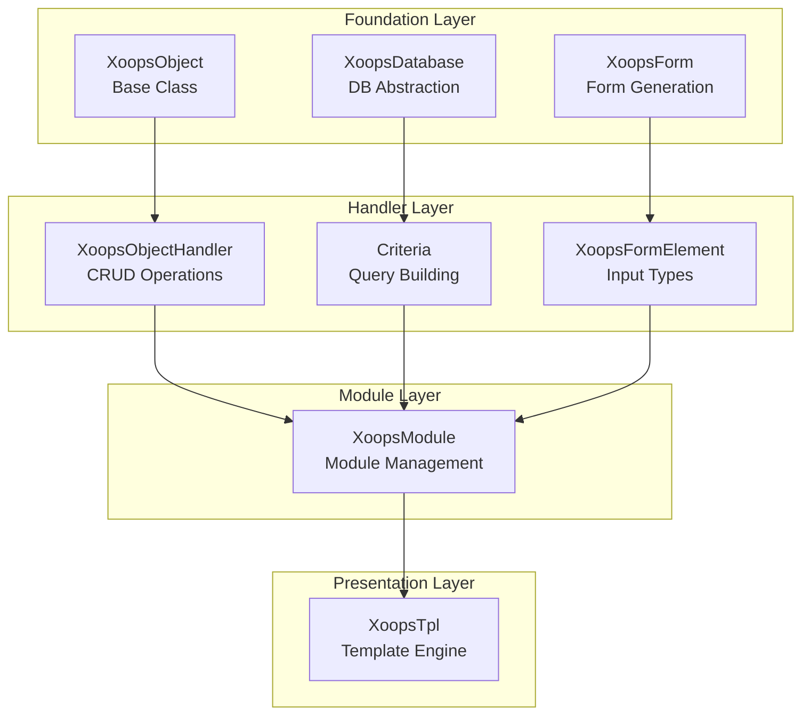
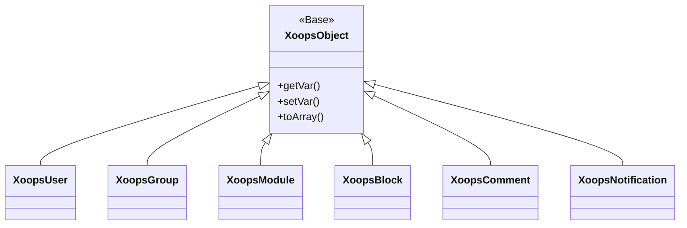
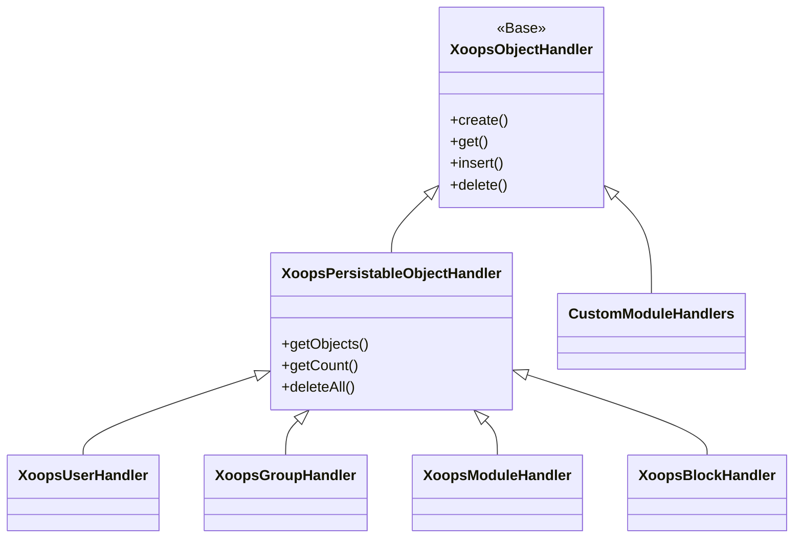
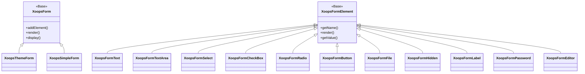

Witaj w kompleksowej dokumentacji Odniesienia API XOOPS. Ta sekcja zawiera szczegółową dokumentację wszystkich klas rdzenia, metod i systemów, które tworzą System Zarządzania Treścią XOOPS.

## Przegląd

API XOOPS jest zorganizowane w kilka głównych podsystemów, każdy odpowiedzialny za konkretny aspekt funkcjonalności CMS. Zrozumienie tych interfejsów API jest niezbędne do rozwijania modułów, motywów i rozszerzeń dla XOOPS.

## Sekcje API

### Klasy Podstawowe

Klasy fundamentalne, na których budują się wszystkie inne komponenty XOOPS.

| Dokumentacja | Opis |
|--------------|------|
| XoopsObject | Klasa bazowa dla wszystkich obiektów danych w XOOPS |
| XoopsObjectHandler | Wzorzec handlera dla operacji CRUD |

### Warstwa Bazy Danych

Abstrakcja bazy danych i narzędzia do budowania zapytań.

| Dokumentacja | Opis |
|--------------|------|
| XoopsDatabase | Warstwa abstrakcji bazy danych |
| System Kryteriów | Kryteria zapytań i warunki |
| QueryBuilder | Nowoczesne fluent budowanie zapytań |

### System Formularzy

Generowanie i walidacja formularzy HTML.

| Dokumentacja | Opis |
|--------------|------|
| XoopsForm | Kontener i renderowanie formularzy |
| Elementy Formularza | Wszystkie dostępne typy elementów formularza |

### Klasy Rdzenia

Główne komponenty systemu i usługi.

| Dokumentacja | Opis |
|--------------|------|
| Klasy Rdzenia | System rdzenia i główne komponenty |

### System Modułów

Zarządzanie modułami i cykl życia.

| Dokumentacja | Opis |
|--------------|------|
| System Modułów | Ładowanie, instalacja i zarządzanie modułami |

### System Szablonów

Integracja szablonów Smarty.

| Dokumentacja | Opis |
|--------------|------|
| System Szablonów | Integracja Smarty i zarządzanie szablonami |

### System Użytkowników

Zarządzanie użytkownikami i uwierzytelnianie.

| Dokumentacja | Opis |
|--------------|------|
| System Użytkowników | Konta użytkowników, grupy i uprawnienia |

## Przegląd Architektury



## Hierarchia Klas

### Model Obiektów



### Model Handlera



### Model Formularza



## Wzorce Projektowe

API XOOPS implementuje kilka znanych wzorców projektowych:

### Wzorzec Singleton
Używany dla globalnych usług, takich jak połączenia z bazą danych i instancje kontenerów.

```php
$db = XoopsDatabase::getInstance();
$container = XoopsContainer::getInstance();
```

### Wzorzec Factory
Handlery obiektów tworzą obiekty domeny w spójny sposób.

```php
$handler = xoops_getHandler('user');
$user = $handler->create();
```

### Wzorzec Composite
Formularze zawierają wiele elementów formularza; kryteria mogą zawierać zagnieżdżone kryteria.

```php
$criteria = new CriteriaCompo();
$criteria->add(new Criteria('status', 1));
$criteria->add(new CriteriaCompo(...)); // Nested
```

### Wzorzec Observer
System zdarzeń umożliwia luźne połączenie między modułami.

```php
$dispatcher->addListener('module.news.article_published', $callback);
```

## Przykłady Szybkiego Startu

### Tworzenie i Zapisywanie Obiektu

```php
// Get the handler
$handler = xoops_getHandler('user');

// Create a new object
$user = $handler->create();
$user->setVar('uname', 'newuser');
$user->setVar('email', 'user@example.com');

// Save to database
$handler->insert($user);
```

### Wykonywanie Zapytań za Pomocą Kryteriów

```php
// Build criteria
$criteria = new CriteriaCompo();
$criteria->add(new Criteria('level', 0, '>'));
$criteria->setSort('uname');
$criteria->setOrder('ASC');
$criteria->setLimit(10);

// Get objects
$handler = xoops_getHandler('user');
$users = $handler->getObjects($criteria);
```

### Tworzenie Formularza

```php
$form = new XoopsThemeForm('User Profile', 'userform', 'save.php', 'post', true);
$form->addElement(new XoopsFormText('Username', 'uname', 50, 255, $user->getVar('uname')));
$form->addElement(new XoopsFormTextArea('Bio', 'bio', $user->getVar('bio')));
$form->addElement(new XoopsFormButton('', 'submit', _SUBMIT, 'submit'));
echo $form->render();
```

## Konwencje API

### Konwencje Nazewnictwa

| Typ | Konwencja | Przykład |
|-----|-----------|---------|
| Klasy | PascalCase | `XoopsUser`, `CriteriaCompo` |
| Metody | camelCase | `getVar()`, `setVar()` |
| Właściwości | camelCase (protected) | `$_vars`, `$_handler` |
| Stałe | UPPER_SNAKE_CASE | `XOBJ_DTYPE_INT` |
| Tabele Bazy Danych | snake_case | `users`, `groups_users_link` |

### Typy Danych

XOOPS definiuje standardowe typy danych dla zmiennych obiektów:

| Stała | Typ | Opis |
|-------|-----|------|
| `XOBJ_DTYPE_TXTBOX` | String | Wejście tekstowe (oczyść) |
| `XOBJ_DTYPE_TXTAREA` | String | Zawartość obszaru tekstowego |
| `XOBJ_DTYPE_INT` | Integer | Wartości liczbowe |
| `XOBJ_DTYPE_URL` | String | Walidacja URL |
| `XOBJ_DTYPE_EMAIL` | String | Walidacja poczty e-mail |
| `XOBJ_DTYPE_ARRAY` | Array | Serializowane tablice |
| `XOBJ_DTYPE_OTHER` | Mixed | Obsługa niestandardowa |
| `XOBJ_DTYPE_SOURCE` | String | Kod źródłowy (minimalna dezinfekcja) |
| `XOBJ_DTYPE_STIME` | Integer | Krótka sygnatura czasowa |
| `XOBJ_DTYPE_MTIME` | Integer | Średnia sygnatura czasowa |
| `XOBJ_DTYPE_LTIME` | Integer | Długa sygnatura czasowa |

## Metody Uwierzytelniania

API obsługuje wiele metod uwierzytelniania:

### Uwierzytelnianie za Pomocą Klucza API
```
X-API-Key: your-api-key
```

### Token Okaziciela OAuth
```
Authorization: Bearer your-oauth-token
```

### Uwierzytelnianie Oparte na Sesji
Wykorzystuje istniejącą sesję XOOPS, gdy jest zalogowany.

## Punkty Końcowe REST API

Gdy jest włączony REST API:

| Punkt Końcowy | Metoda | Opis |
|---------------|--------|------|
| `/api.php/rest/users` | GET | Lista użytkowników |
| `/api.php/rest/users/{id}` | GET | Pobierz użytkownika po ID |
| `/api.php/rest/users` | POST | Utwórz użytkownika |
| `/api.php/rest/users/{id}` | PUT | Zaktualizuj użytkownika |
| `/api.php/rest/users/{id}` | DELETE | Usuń użytkownika |
| `/api.php/rest/modules` | GET | Lista modułów |

## Powiązana Dokumentacja

- Przewodnik Rozwoju Modułów
- Przewodnik Rozwoju Motywów
- Konfiguracja Systemu
- Najlepsze Praktyki Bezpieczeństwa

## Historia Wersji

| Wersja | Zmiany |
|--------|--------|
| 2.5.11 | Obecny wydanie stabilne |
| 2.5.10 | Dodano obsługę GraphQL API |
| 2.5.9 | Udoskonalony system Kryteriów |
| 2.5.8 | Obsługa autouzupełniania PSR-4 |

---

*Ta dokumentacja jest częścią Bazy Wiedzy XOOPS. Aby uzyskać najnowsze aktualizacje, odwiedź [repozytorium XOOPS na GitHub](https://github.com/XOOPS).*
