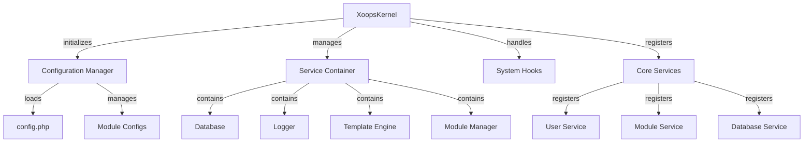

Rdzeń XOOPS zapewnia framework fundamentalny do bootstrap systemu, zarządzania konfiguracjami, obsługi zdarzeń systemowych i dostarczania narzędzi głównych. Te klasy tworzą páteżowę aplikacji XOOPS.

## Architektura Systemu



## Klasa XoopsKernel

Główna klasa rdzenia, która inicjalizuje i zarządza systemem XOOPS.

### Przegląd Klasy

```php
namespace Xoops;

class XoopsKernel
{
    private static ?XoopsKernel $instance = null;
    protected ServiceContainer $services;
    protected ConfigurationManager $config;
    protected array $modules = [];
    protected bool $isLoaded = false;
}
```

### Konstruktor

```php
private function __construct()
```

Prywatny konstruktor wymusza wzorzec singleton.

### getInstance

Pobiera instancję singleton rdzenia.

```php
public static function getInstance(): XoopsKernel
```

**Zwraca:** `XoopsKernel` - Instancja singleton rdzenia

**Przykład:**
```php
$kernel = XoopsKernel::getInstance();
```

### Proces Boot

Proces boot rdzenia przebiega następujące kroki:

1. **Inicjalizacja** - Ustaw obsługi błędów, zdefiniuj stałe
2. **Konfiguracja** - Załaduj pliki konfiguracji
3. **Rejestracja Serwisów** - Zarejestruj główne serwisy
4. **Detekcja Modułów** - Skanuj i zidentyfikuj aktywne moduły
5. **Inicjalizacja Bazy Danych** - Połącz z bazą danych
6. **Czyszczenie** - Przygotuj do obsługi żądań

```php
public function boot(): void
```

**Przykład:**
```php
$kernel = XoopsKernel::getInstance();
$kernel->boot();
```

### Metody Kontenera Serwisów

#### registerService

Rejestruje serwis w kontenerze serwisów.

```php
public function registerService(
    string $name,
    callable|object $definition
): void
```

**Parametry:**

| Parametr | Typ | Opis |
|----------|-----|------|
| `$name` | string | Identyfikator serwisu |
| `$definition` | callable\|object | Fabryka serwisu lub instancja |

**Przykład:**
```php
$kernel->registerService('custom.handler', function($c) {
    return new CustomHandler();
});
```

#### getService

Pobiera zarejestrowany serwis.

```php
public function getService(string $name): mixed
```

**Parametry:**

| Parametr | Typ | Opis |
|----------|-----|------|
| `$name` | string | Identyfikator serwisu |

**Zwraca:** `mixed` - Żądany serwis

**Przykład:**
```php
$database = $kernel->getService('database');
$logger = $kernel->getService('logger');
```

#### hasService

Sprawdza czy serwis jest zarejestrowany.

```php
public function hasService(string $name): bool
```

**Przykład:**
```php
if ($kernel->hasService('cache')) {
    $cache = $kernel->getService('cache');
}
```

## Menedżer Konfiguracji

Zarządza konfiguracją aplikacji i ustawieniami modułów.

### Przegląd Klasy

```php
namespace Xoops\Core;

class ConfigurationManager
{
    protected array $config = [];
    protected array $defaults = [];
    protected string $configPath;
}
```

### Metody

#### load

Ładuje konfigurację z pliku lub tablicy.

```php
public function load(string|array $source): void
```

**Parametry:**

| Parametr | Typ | Opis |
|----------|-----|------|
| `$source` | string\|array | Ścieżka pliku konfiguracji lub tablica |

**Przykład:**
```php
$config = $kernel->getService('config');
$config->load(XOOPS_ROOT_PATH . '/include/config.php');
$config->load(['sitename' => 'My Site', 'admin_email' => 'admin@example.com']);
```

#### get

Pobiera wartość konfiguracji.

```php
public function get(string $key, mixed $default = null): mixed
```

**Parametry:**

| Parametr | Typ | Opis |
|----------|-----|------|
| `$key` | string | Klucz konfiguracji (notacja kropkowa) |
| `$default` | mixed | Wartość domyślna jeśli nie znaleziona |

**Zwraca:** `mixed` - Wartość konfiguracji

**Przykład:**
```php
$siteName = $config->get('sitename');
$adminEmail = $config->get('admin.email', 'admin@example.com');
```

#### set

Ustawia wartość konfiguracji.

```php
public function set(string $key, mixed $value): void
```

**Parametry:**

| Parametr | Typ | Opis |
|----------|-----|------|
| `$key` | string | Klucz konfiguracji |
| `$value` | mixed | Wartość konfiguracji |

**Przykład:**
```php
$config->set('sitename', 'New Site Name');
$config->set('features.cache_enabled', true);
```

#### getModuleConfig

Pobiera konfigurację dla konkretnego modułu.

```php
public function getModuleConfig(
    string $moduleName
): array
```

**Parametry:**

| Parametr | Typ | Opis |
|----------|-----|------|
| `$moduleName` | string | Nazwa katalogu modułu |

**Zwraca:** `array` - Tablica konfiguracji modułu

**Przykład:**
```php
$publisherConfig = $config->getModuleConfig('publisher');
```

## Haki Systemowe

Haki systemowe pozwalają modułom i pluginom wykonywać kod w określonych punktach cyklu życia aplikacji.

### Klasa HookManager

```php
namespace Xoops\Core;

class HookManager
{
    protected array $hooks = [];
    protected array $listeners = [];
}
```

### Metody

#### addHook

Rejestruje punkt haka.

```php
public function addHook(string $name): void
```

**Parametry:**

| Parametr | Typ | Opis |
|----------|-----|------|
| `$name` | string | Identyfikator haka |

**Przykład:**
```php
$hooks = $kernel->getService('hooks');
$hooks->addHook('system.startup');
$hooks->addHook('user.login');
$hooks->addHook('module.install');
```

#### listen

Przywiązuje słuchacza do haka.

```php
public function listen(
    string $hookName,
    callable $callback,
    int $priority = 10
): void
```

**Parametry:**

| Parametr | Typ | Opis |
|----------|-----|------|
| `$hookName` | string | Identyfikator haka |
| `$callback` | callable | Funkcja do wykonania |
| `$priority` | int | Priorytet wykonania (wyższy uruchamia się wcześniej) |

**Przykład:**
```php
$hooks->listen('user.login', function($user) {
    error_log('User ' . $user->uname . ' logged in');
}, 10);

$hooks->listen('module.install', function($module) {
    // Niestandardowa logika instalacji modułu
    echo "Installing " . $module->getName();
}, 5);
```

#### trigger

Wykonuje wszystkich słuchaczy dla haka.

```php
public function trigger(
    string $hookName,
    mixed $arguments = null
): array
```

**Parametry:**

| Parametr | Typ | Opis |
|----------|-----|------|
| `$hookName` | string | Identyfikator haka |
| `$arguments` | mixed | Dane do przesłania słuchaczom |

**Zwraca:** `array` - Wyniki ze wszystkich słuchaczy

**Przykład:**
```php
$results = $hooks->trigger('system.startup');
$results = $hooks->trigger('user.created', $newUser);
```

## Przegląd Głównych Serwisów

Rdzeń rejestruje kilka głównych serwisów podczas boot:

| Serwis | Klasa | Cel |
|--------|-------|------|
| `database` | XoopsDatabase | Warstwa abstrakcji bazy danych |
| `config` | ConfigurationManager | Zarządzanie konfiguracją |
| `logger` | Logger | Logowanie aplikacji |
| `template` | XoopsTpl | Silnik szablonów |
| `user` | UserManager | Serwis zarządzania użytkownikami |
| `module` | ModuleManager | Zarządzanie modułami |
| `cache` | CacheManager | Warstwa cachowania |
| `hooks` | HookManager | Haki zdarzeń systemowych |

## Kompletny Przykład Użycia

```php
<?php
/**
 * Niestandardowy proces boot modułu wykorzystujący rdzeń
 */

// Pobierz instancję rdzenia
$kernel = XoopsKernel::getInstance();

// Boot systemu
$kernel->boot();

// Pobierz serwisy
$config = $kernel->getService('config');
$database = $kernel->getService('database');
$logger = $kernel->getService('logger');
$hooks = $kernel->getService('hooks');

// Uzyskaj dostęp do konfiguracji
$siteName = $config->get('sitename');
$adminEmail = $config->get('admin.email');

// Zarejestruj haki specyficzne dla modułu
$hooks->listen('user.login', function($user) {
    // Loguj login użytkownika
    $logger->info('User login: ' . $user->uname);

    // Śledzenie w bazie danych
    $database->query(
        'INSERT INTO ' . $database->prefix('event_log') .
        ' (type, user_id, message, timestamp) VALUES (?, ?, ?, ?)',
        ['login', $user->uid(), 'User login', time()]
    );
});

$hooks->listen('module.install', function($module) {
    $logger->info('Module installed: ' . $module->getName());
});

// Wyzwól haki
$hooks->trigger('system.startup');

// Użyj serwisu bazy danych
$result = $database->query(
    'SELECT * FROM ' . $database->prefix('users') .
    ' LIMIT 10'
);

while ($row = $database->fetchArray($result)) {
    echo "User: " . htmlspecialchars($row['uname']) . "\n";
}

// Zarejestruj niestandardowy serwis
$kernel->registerService('custom.repository', function($c) {
    return new CustomRepository($c->getService('database'));
});

// Później uzyskaj dostęp do niestandardowego serwisu
$repo = $kernel->getService('custom.repository');
```

## Główne Stałe

Rdzeń definiuje kilka ważnych stałych podczas boot:

```php
// Ścieżki systemu
define('XOOPS_ROOT_PATH', '/var/www/xoops');
define('XOOPS_HTDOCS_PATH', XOOPS_ROOT_PATH . '/htdocs');
define('XOOPS_MODULES_PATH', XOOPS_ROOT_PATH . '/htdocs/modules');
define('XOOPS_THEMES_PATH', XOOPS_ROOT_PATH . '/htdocs/themes');

// Ścieżki sieci web
define('XOOPS_URL', 'http://example.com');
define('XOOPS_HTDOCS_URL', XOOPS_URL . '/htdocs');

// Baza danych
define('XOOPS_DB_PREFIX', 'xoops_');
```

## Obsługa Błędów

Rdzeń ustawia obsługi błędów podczas boot:

```php
// Ustaw niestandardową obsługę błędów
set_error_handler(function($errno, $errstr, $errfile, $errline) {
    $kernel->getService('logger')->error(
        "Error: $errstr in $errfile:$errline"
    );
});

// Ustaw obsługę wyjątków
set_exception_handler(function($exception) {
    $kernel->getService('logger')->critical(
        "Exception: " . $exception->getMessage()
    );
});
```

## Najlepsze Praktyki

1. **Jeden Boot** - Wywołaj `boot()` tylko raz podczas startup aplikacji
2. **Używaj Kontenera Serwisów** - Zarejestruj i pobierz serwisy poprzez rdzeń
3. **Obsługuj Haki Wcześnie** - Zarejestruj słuchaczy haków przed ich wyzwalaniem
4. **Loguj Ważne Zdarzenia** - Używaj serwisu logowania do debugowania
5. **Cachuj Konfigurację** - Załaduj config raz i ponownie go używaj
6. **Obsługa Błędów** - Zawsze ustaw obsługi błędów przed przetwarzaniem żądań

## Powiązana Dokumentacja

- ../Module/Module-System - System modułów i cykl życia
- ../Template/Template-System - Integracja silnika szablonów
- ../User/User-System - Uwierzytelnianie i zarządzanie użytkownikami
- ../Database/XoopsDatabase - Warstwa bazy danych

---

*Patrz też: [Kod Źródłowy Rdzenia XOOPS](https://github.com/XOOPS/XoopsCore27/tree/master/htdocs/class)*
