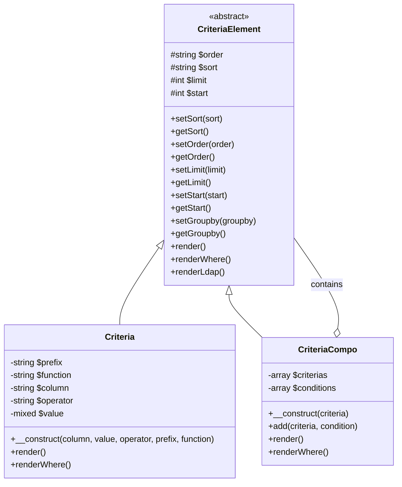
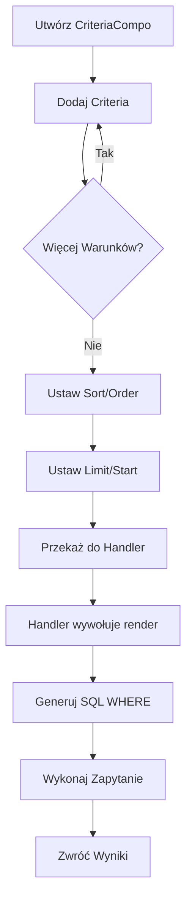
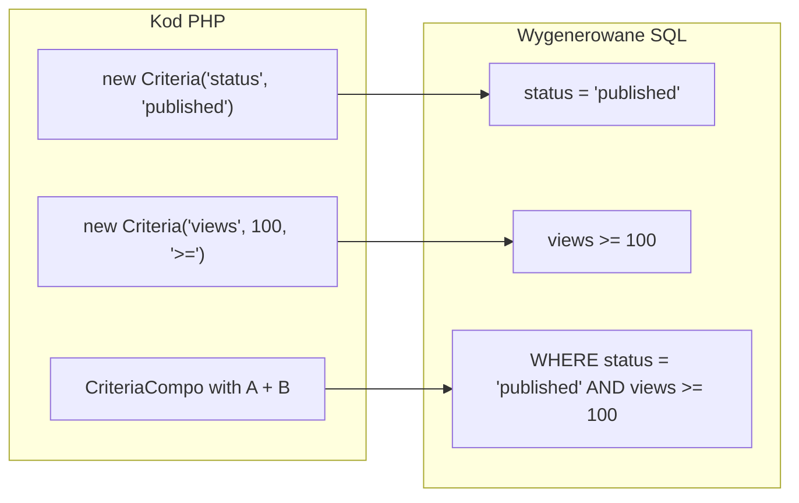
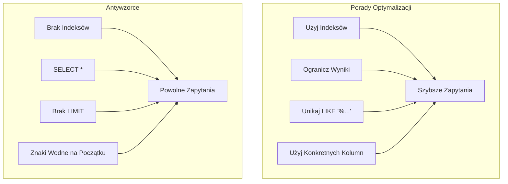

> Kompletna dokumentacja API dla systemu budowania zapytań XOOPS Criteria.

---

## Architektura Systemu Criteria



---

## Klasa Criteria

### Konstruktor

```php
public function __construct(
    string $column,           // Nazwa kolumny
    mixed $value = '',        // Wartość do porównania
    string $operator = '=',   // Operator porównania
    string $prefix = '',      // Prefiks tabeli
    string $function = ''     // Opakowanie funkcji SQL
)
```

### Operatory

| Operator | Przykład | Wyjście SQL |
|----------|----------|------------|
| `=` | `new Criteria('status', 1)` | `status = 1` |
| `!=` | `new Criteria('status', 0, '!=')` | `status != 0` |
| `<>` | `new Criteria('status', 0, '<>')` | `status <> 0` |
| `<` | `new Criteria('age', 18, '<')` | `age < 18` |
| `<=` | `new Criteria('age', 18, '<=')` | `age <= 18` |
| `>` | `new Criteria('age', 18, '>')` | `age > 18` |
| `>=` | `new Criteria('age', 18, '>=')` | `age >= 18` |
| `LIKE` | `new Criteria('title', '%php%', 'LIKE')` | `title LIKE '%php%'` |
| `NOT LIKE` | `new Criteria('title', '%spam%', 'NOT LIKE')` | `title NOT LIKE '%spam%'` |
| `IN` | `new Criteria('id', '(1,2,3)', 'IN')` | `id IN (1,2,3)` |
| `NOT IN` | `new Criteria('id', '(1,2,3)', 'NOT IN')` | `id NOT IN (1,2,3)` |
| `IS NULL` | `new Criteria('deleted', null, 'IS NULL')` | `deleted IS NULL` |
| `IS NOT NULL` | `new Criteria('email', null, 'IS NOT NULL')` | `email IS NOT NULL` |
| `BETWEEN` | `new Criteria('created', '1000 AND 2000', 'BETWEEN')` | `created BETWEEN 1000 AND 2000` |

### Przykłady Użycia

```php
// Prosta równość
$criteria = new Criteria('status', 'published');

// Porównanie liczbowe
$criteria = new Criteria('views', 100, '>=');

// Dopasowanie wzorca
$criteria = new Criteria('title', '%XOOPS%', 'LIKE');

// Z prefiksem tabeli
$criteria = new Criteria('uid', 1, '=', 'u');
// Renders: u.uid = 1

// Z funkcją SQL
$criteria = new Criteria('title', '', '!=', '', 'LOWER');
// Renders: LOWER(title) != ''
```

---

## Klasa CriteriaCompo

### Konstruktor i Metody

```php
// Utwórz puste compo
$criteria = new CriteriaCompo();

// Lub z początkową kryteriami
$criteria = new CriteriaCompo(new Criteria('status', 'active'));

// Dodaj kryteria (domyślnie AND)
$criteria->add(new Criteria('views', 10, '>='));

// Dodaj z OR
$criteria->add(new Criteria('featured', 1), 'OR');

// Zagnieżdżanie
$subCriteria = new CriteriaCompo();
$subCriteria->add(new Criteria('author', 1));
$subCriteria->add(new Criteria('author', 2), 'OR');
$criteria->add($subCriteria); // (author = 1 OR author = 2)
```

### Sortowanie i Paginacja

```php
$criteria = new CriteriaCompo();
$criteria->add(new Criteria('status', 'published'));

// Jedno sortowanie
$criteria->setSort('created');
$criteria->setOrder('DESC');

// Wiele kolumn sortowania
$criteria->setSort('category_id, created');
$criteria->setOrder('ASC, DESC');

// Paginacja
$criteria->setLimit(10);    // Elementy na stronę
$criteria->setStart(0);     // Przesunięcie (strona * limit)

// Grupuj po
$criteria->setGroupby('category_id');
```

---

## Przepływ Budowania Zapytań



---

## Złożone Przykłady Zapytań

### Wyszukiwanie z Wieloma Warunkami

```php
$criteria = new CriteriaCompo();

// Status musi być opublikowany
$criteria->add(new Criteria('status', 'published'));

// Kategoria to 1, 2, lub 3
$criteria->add(new Criteria('category_id', '(1, 2, 3)', 'IN'));

// Utworzony w ostatnich 30 dniach
$thirtyDaysAgo = time() - (30 * 24 * 60 * 60);
$criteria->add(new Criteria('created', $thirtyDaysAgo, '>='));

// Termin wyszukiwania w tytule LUB zawartości
$searchCriteria = new CriteriaCompo();
$searchCriteria->add(new Criteria('title', '%' . $searchTerm . '%', 'LIKE'));
$searchCriteria->add(new Criteria('content', '%' . $searchTerm . '%', 'LIKE'), 'OR');
$criteria->add($searchCriteria);

// Sortuj po wyświetleniach malejąco
$criteria->setSort('views');
$criteria->setOrder('DESC');

// Paginuj
$criteria->setLimit($perPage);
$criteria->setStart($page * $perPage);

// Wykonaj
$items = $itemHandler->getObjects($criteria);
$total = $itemHandler->getCount($criteria);
```

### Zapytanie Zakresu Dat

```php
$criteria = new CriteriaCompo();

// Między dwiema datami
$startDate = strtotime('2024-01-01');
$endDate = strtotime('2024-12-31');

$criteria->add(new Criteria('created', $startDate, '>='));
$criteria->add(new Criteria('created', $endDate, '<='));

// Lub używając BETWEEN
$criteria->add(new Criteria('created', "$startDate AND $endDate", 'BETWEEN'));
```

### Filtr Uprawnień Użytkownika

```php
$criteria = new CriteriaCompo();
$criteria->add(new Criteria('status', 'published'));

// Jeśli nie admin, pokazuj tylko własne elementy lub publiczne
if (!$xoopsUser || !$xoopsUser->isAdmin()) {
    $permCriteria = new CriteriaCompo();
    $permCriteria->add(new Criteria('visibility', 'public'));

    if (is_object($xoopsUser)) {
        $permCriteria->add(new Criteria('author_id', $xoopsUser->getVar('uid')), 'OR');
    }

    $criteria->add($permCriteria);
}
```

### Zapytanie Podobne do Join

```php
// Pobierz elementy gdzie kategoria jest aktywna
// (Używając podejścia podzapytania)
$categoryHandler = xoops_getHandler('category');
$activeCatCriteria = new Criteria('status', 'active');
$activeCategories = $categoryHandler->getIds($activeCatCriteria);

if (!empty($activeCategories)) {
    $criteria->add(new Criteria('category_id', '(' . implode(',', $activeCategories) . ')', 'IN'));
}
```

---

## Wizualizacja Criteria na SQL



---

## Integracja Handler

```php
// Standardowe metody handlera, które akceptują Criteria

// Pobierz wiele obiektów
$objects = $handler->getObjects($criteria);
$objects = $handler->getObjects($criteria, true);  // Jako tablica
$objects = $handler->getObjects($criteria, true, true); // Jako tablica, id jako klucz

// Pobierz liczbę
$count = $handler->getCount($criteria);

// Pobierz listę (id => identifier)
$list = $handler->getList($criteria);

// Usuń pasujące
$deleted = $handler->deleteAll($criteria);

// Aktualizuj pasujące
$handler->updateAll('status', 'archived', $criteria);
```

---

## Rozważania Wydajności



### Najlepsze Praktyki

1. **Zawsze ustaw LIMIT** dla dużych tabel
2. **Używaj indeksów** na kolumnach używanych w kryteriach
3. **Unikaj poprzedzających znaków wieloznacznych** w LIKE (`'%term'` jest powolny)
4. **Pre-filtruj w PHP** gdy to możliwe dla złożonej logiki
5. **Używaj COUNT ostrożnie** - cachuj wyniki gdy to możliwe

---

## Powiązana Dokumentacja

- Warstwa Bazy Danych
- API XoopsObjectHandler
- Zapobieganie Wstrzykiwaniu SQL

---

#xoops #api #criteria #database #query #reference
