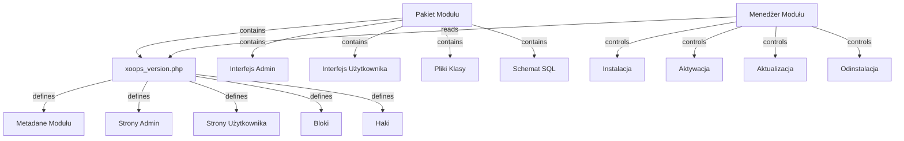

System Modułów XOOPS zapewnia kompletny framework do tworzenia, instalowania, zarządzania i rozszerzania funkcjonalności modułu. Moduły są samodzielnymi pakietami, które rozszerzają XOOPS o dodatkowe funkcje i możliwości.

## Architektura Modułu



## Struktura Modułu

Standardowa struktura katalogu modułu XOOPS:

```
mymodule/
├── xoops_version.php          # Manifest i konfiguracja modułu
├── admin.php                  # Główna strona admin
├── index.php                  # Główna strona użytkownika
├── admin/                     # Katalog stron admin
│   ├── main.php
│   ├── manage.php
│   └── settings.php
├── class/                     # Klasy modułu
│   ├── Handler/
│   │   ├── ItemHandler.php
│   │   └── CategoryHandler.php
│   └── Objects/
│       ├── Item.php
│       └── Category.php
├── sql/                       # Schematy bazy danych
│   ├── mysql.sql
│   └── postgres.sql
├── include/                   # Pliki dołączenia
│   ├── common.inc.php
│   └── functions.php
├── templates/                 # Szablony modułu
│   ├── admin/
│   │   └── main.tpl
│   └── user/
│       ├── index.tpl
│       └── item.tpl
├── blocks/                    # Bloki modułu
│   └── blocks.php
├── tests/                     # Testy jednostkowe
├── language/                  # Pliki językowe
│   ├── english/
│   │   └── main.php
│   └── spanish/
│       └── main.php
└── docs/                      # Dokumentacja
```

## Klasa XoopsModule

Klasa XoopsModule reprezentuje zainstalowany moduł XOOPS.

### Przegląd Klasy

```php
namespace Xoops\Core\Module;

class XoopsModule extends XoopsObject
{
    protected int $moduleid = 0;
    protected string $name = '';
    protected string $dirname = '';
    protected string $version = '';
    protected string $description = '';
    protected array $config = [];
    protected array $blocks = [];
    protected array $adminPages = [];
    protected array $userPages = [];
}
```

### Właściwości

| Właściwość | Typ | Opis |
|-----------|-----|------|
| `$moduleid` | int | Unikalny ID modułu |
| `$name` | string | Nazwa wyświetlana modułu |
| `$dirname` | string | Nazwa katalogu modułu |
| `$version` | string | Bieżąca wersja modułu |
| `$description` | string | Opis modułu |
| `$config` | array | Konfiguracja modułu |
| `$blocks` | array | Bloki modułu |
| `$adminPages` | array | Strony panelu admin |
| `$userPages` | array | Strony zwrócone do użytkownika |

### Konstruktor

```php
public function __construct()
```

Tworzy nową instancję modułu i inicjalizuje zmienne.

### Metody Podstawowe

#### getName

Pobiera nazwę wyświetlaną modułu.

```php
public function getName(): string
```

**Zwraca:** `string` - Nazwa wyświetlana modułu

**Przykład:**
```php
$module = new XoopsModule();
$module->setVar('name', 'Publisher');
echo $module->getName(); // "Publisher"
```

#### getDirname

Pobiera nazwę katalogu modułu.

```php
public function getDirname(): string
```

**Zwraca:** `string` - Nazwa katalogu modułu

**Przykład:**
```php
echo $module->getDirname(); // "publisher"
```

#### getVersion

Pobiera bieżącą wersję modułu.

```php
public function getVersion(): string
```

**Zwraca:** `string` - Ciąg wersji

**Przykład:**
```php
echo $module->getVersion(); // "2.1.0"
```

#### getDescription

Pobiera opis modułu.

```php
public function getDescription(): string
```

**Zwraca:** `string` - Opis modułu

**Przykład:**
```php
$desc = $module->getDescription();
```

#### getConfig

Pobiera konfigurację modułu.

```php
public function getConfig(string $key = null): mixed
```

**Parametry:**

| Parametr | Typ | Opis |
|----------|-----|------|
| `$key` | string | Klucz konfiguracji (null dla wszystkich) |

**Zwraca:** `mixed` - Wartość konfiguracji lub tablica

**Przykład:**
```php
$config = $module->getConfig();
$itemsPerPage = $module->getConfig('items_per_page');
```

#### setConfig

Ustawia konfigurację modułu.

```php
public function setConfig(string $key, mixed $value): void
```

**Parametry:**

| Parametr | Typ | Opis |
|----------|-----|------|
| `$key` | string | Klucz konfiguracji |
| `$value` | mixed | Wartość konfiguracji |

**Przykład:**
```php
$module->setConfig('items_per_page', 20);
$module->setConfig('enable_cache', true);
```

#### getPath

Pobiera pełną ścieżkę systemu plików do modułu.

```php
public function getPath(): string
```

**Zwraca:** `string` - Bezwzględna ścieżka katalogu modułu

**Przykład:**
```php
$path = $module->getPath(); // "/var/www/xoops/modules/publisher"
$classPath = $module->getPath() . '/class';
```

#### getUrl

Pobiera URL do modułu.

```php
public function getUrl(): string
```

**Zwraca:** `string` - URL modułu

**Przykład:**
```php
$url = $module->getUrl(); // "http://example.com/modules/publisher"
```

## Proces Instalacji Modułu

### Funkcja xoops_module_install

Funkcja instalacji modułu zdefiniowana w `xoops_version.php`:

```php
function xoops_module_install_modulename($module)
{
    // $module jest instancją XoopsModule

    // Utwórz tabele bazy danych
    // Inicjalizuj domyślną konfigurację
    // Utwórz domyślne foldery
    // Ustaw uprawnienia do pliku

    return true; // Sukces
}
```

**Parametry:**

| Parametr | Typ | Opis |
|----------|-----|------|
| `$module` | XoopsModule | Instalowany moduł |

**Zwraca:** `bool` - True na powodzenie, false na niepowodzenie

**Przykład:**
```php
function xoops_module_install_publisher($module)
{
    // Pobierz ścieżkę modułu
    $modulePath = $module->getPath();

    // Utwórz katalog uploads
    $uploadsPath = XOOPS_ROOT_PATH . '/uploads/publisher';
    if (!is_dir($uploadsPath)) {
        mkdir($uploadsPath, 0755, true);
    }

    // Pobierz połączenie z bazą danych
    global $xoopsDB;

    // Wykonaj skrypt instalacji SQL
    $sqlFile = $modulePath . '/sql/mysql.sql';
    if (file_exists($sqlFile)) {
        $sqlQueries = file_get_contents($sqlFile);
        // Wykonaj zapytania (uproszczone)
        $xoopsDB->queryFromFile($sqlFile);
    }

    // Ustaw domyślną konfigurację
    $module->setConfig('items_per_page', 10);
    $module->setConfig('enable_comments', true);

    return true;
}
```

### Funkcja xoops_module_uninstall

Funkcja odinstalacji modułu:

```php
function xoops_module_uninstall_modulename($module)
{
    // Usunięcie tabel bazy danych
    // Usuń przesłane pliki
    // Oczyść konfigurację

    return true;
}
```

**Przykład:**
```php
function xoops_module_uninstall_publisher($module)
{
    global $xoopsDB;

    // Usuń tabele
    $tables = ['publisher_items', 'publisher_categories', 'publisher_comments'];
    foreach ($tables as $table) {
        $xoopsDB->query('DROP TABLE IF EXISTS ' . $xoopsDB->prefix($table));
    }

    // Usuń folder upload
    $uploadsPath = XOOPS_ROOT_PATH . '/uploads/publisher';
    if (is_dir($uploadsPath)) {
        // Rekurencyjne usuwanie katalogu
        $this->recursiveRemoveDir($uploadsPath);
    }

    return true;
}
```

## Haki Modułu

Haki modułu pozwalają modułom integrować się z innymi modułami i systemem.

### Deklaracja Haka

W `xoops_version.php`:

```php
$modversion['hooks'] = [
    'system.page.footer' => [
        'function' => 'publisher_page_footer'
    ],
    'user.profile.view' => [
        'function' => 'publisher_user_articles'
    ],
];
```

### Implementacja Haka

```php
// W pliku modułu (np. include/hooks.php)

function publisher_page_footer()
{
    // Zwróć HTML dla stopki
    return '<div class="publisher-footer">Publisher Footer Content</div>';
}

function publisher_user_articles($user_id)
{
    global $xoopsDB;

    // Pobierz artykuły użytkownika
    $result = $xoopsDB->query(
        'SELECT * FROM ' . $xoopsDB->prefix('publisher_articles') .
        ' WHERE author_id = ? ORDER BY published DESC LIMIT 5',
        [$user_id]
    );

    $articles = [];
    while ($row = $xoopsDB->fetchAssoc($result)) {
        $articles[] = $row;
    }

    return $articles;
}
```

### Dostępne Haki Systemowe

| Hak | Parametry | Opis |
|-----|-----------|------|
| `system.page.header` | Brak | Wyjście nagłówka strony |
| `system.page.footer` | Brak | Wyjście stopki strony |
| `user.login.success` | obiekt $user | Po logowaniu użytkownika |
| `user.logout` | obiekt $user | Po wylogowaniu użytkownika |
| `user.profile.view` | $user_id | Przeglądanie profilu użytkownika |
| `module.install` | obiekt $module | Instalacja modułu |
| `module.uninstall` | obiekt $module | Odinstalacja modułu |

## Serwis Menedżera Modułu

Serwis ModuleManager obsługuje operacje modułu.

### Metody

#### getModule

Pobiera moduł po nazwie.

```php
public function getModule(string $dirname): ?XoopsModule
```

**Parametry:**

| Parametr | Typ | Opis |
|----------|-----|------|
| `$dirname` | string | Nazwa katalogu modułu |

**Zwraca:** `?XoopsModule` - Instancja modułu lub null

**Przykład:**
```php
$moduleManager = $kernel->getService('module');
$publisher = $moduleManager->getModule('publisher');
if ($publisher) {
    echo $publisher->getName();
}
```

#### getAllModules

Pobiera wszystkie zainstalowane moduły.

```php
public function getAllModules(bool $activeOnly = true): array
```

**Parametry:**

| Parametr | Typ | Opis |
|----------|-----|------|
| `$activeOnly` | bool | Zwróć tylko aktywne moduły |

**Zwraca:** `array` - Tablica obiektów XoopsModule

**Przykład:**
```php
$activeModules = $moduleManager->getAllModules(true);
foreach ($activeModules as $module) {
    echo $module->getName() . " - " . $module->getVersion() . "\n";
}
```

#### isModuleActive

Sprawdza czy moduł jest aktywny.

```php
public function isModuleActive(string $dirname): bool
```

**Przykład:**
```php
if ($moduleManager->isModuleActive('publisher')) {
    // Moduł Publisher jest aktywny
}
```

#### activateModule

Aktywuje moduł.

```php
public function activateModule(string $dirname): bool
```

**Przykład:**
```php
if ($moduleManager->activateModule('publisher')) {
    echo "Publisher activated";
}
```

#### deactivateModule

Deaktywuje moduł.

```php
public function deactivateModule(string $dirname): bool
```

**Przykład:**
```php
if ($moduleManager->deactivateModule('publisher')) {
    echo "Publisher deactivated";
}
```

## Best Practices

1. **Przestrzeń Nazw Klas** - Używaj przestrzeni nazw specyficznych dla modułu, aby uniknąć konfliktów

2. **Używaj Handlerów** - Zawsze używaj klas handlerów do operacji bazodanowych

3. **Internacjonalizuj Zawartość** - Używaj stałych języka dla wszystkich ciągów zwróconych do użytkownika

4. **Twórz Skrypty Instalacji** - Zapewniaj schematy SQL dla tabel bazy danych

5. **Dokumentuj Haki** - Jasno udokumentuj jakie haki twój moduł zapewnia

6. **Wersjonuj Swój Moduł** - Inkrementuj numery wersji z wydaniami

7. **Testuj Instalację** - Dokładnie testuj procesy instalacji/odinstalacji

8. **Obsługuj Uprawnienia** - Sprawdzaj uprawnienia użytkownika przed zezwoleniem na działania

## Powiązana Dokumentacja

- ../Kernel/Kernel-Classes - Inicjalizacja rdzenia i usługi podstawowe
- ../Template/Template-System - Szablony modułu i integracja motywu
- ../Database/QueryBuilder - Budowanie zapytań do bazy danych
- ../Core/XoopsObject - Klasa obiektu bazowego

---

*Patrz też: [Przewodnik Rozwoju Modułów XOOPS](https://github.com/XOOPS/XoopsCore27/wiki/Module-Development)*
