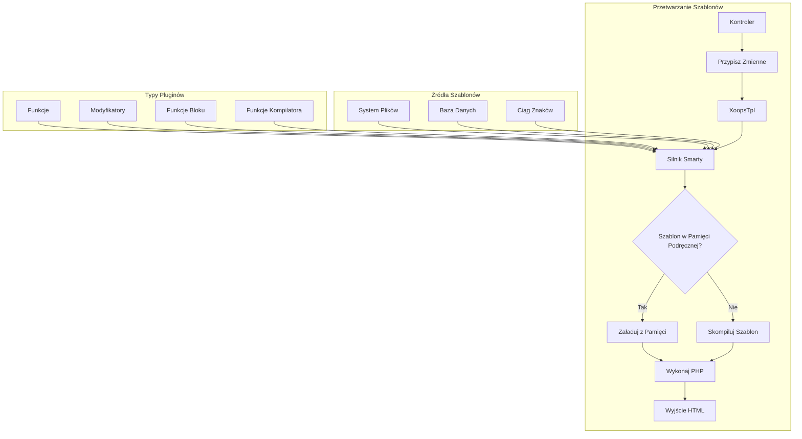
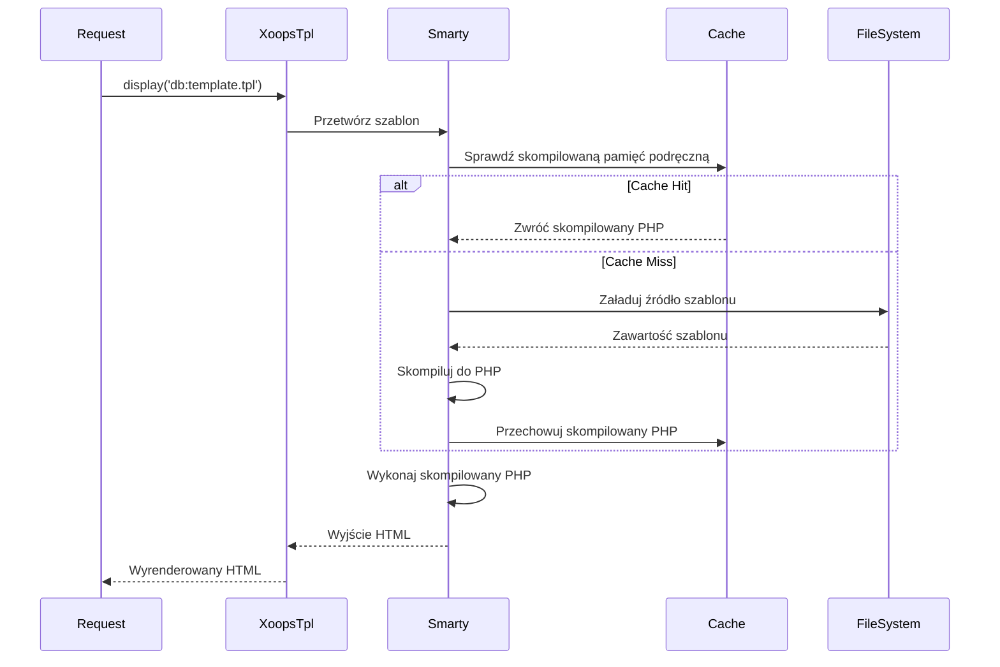
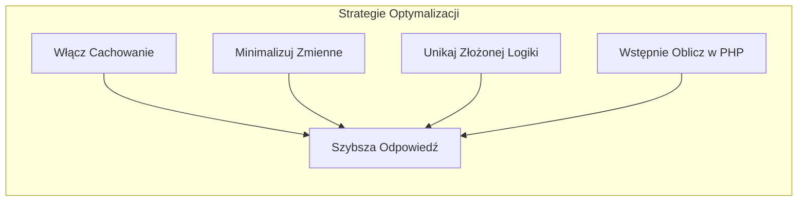

> Kompletna dokumentacja API dla szablonów Smarty w XOOPS.

---

## Architektura Silnika Szablonów



---

## Klasa XoopsTpl

### Inicjalizacja

```php
// Globalny obiekt szablonu
global $xoopsTpl;

// Lub utwórz nową instancję
$tpl = new XoopsTpl();

// Dostępne w modułach
$GLOBALS['xoopsTpl']->assign('myvar', $value);
```

### Główne Metody

| Metoda | Parametry | Opis |
|--------|-----------|------|
| `assign` | `string $name, mixed $value` | Przypisz zmienną do szablonu |
| `assignByRef` | `string $name, mixed &$value` | Przypisz przez referencję |
| `append` | `string $name, mixed $value, bool $merge = false` | Dołącz do zmiennej tablicy |
| `display` | `string $template` | Renderuj i wyświetl szablon |
| `fetch` | `string $template` | Renderuj i zwróć szablon |
| `clearAssign` | `string $name` | Wyczyść przypisaną zmienną |
| `clearAllAssign` | - | Wyczyść wszystkie zmienne |
| `getTemplateVars` | `string $name = null` | Pobierz przypisane zmienne |
| `templateExists` | `string $template` | Sprawdź czy szablon istnieje |
| `isCached` | `string $template` | Sprawdź czy szablon jest w pamięci podręcznej |
| `clearCache` | `string $template = null` | Wyczyść pamięć podręczną szablonu |

### Przypisywanie Zmiennych

```php
// Proste przypisanie
$xoopsTpl->assign('title', 'My Page Title');
$xoopsTpl->assign('count', 42);
$xoopsTpl->assign('is_admin', true);

// Przypisanie tablicy
$xoopsTpl->assign('items', [
    ['id' => 1, 'name' => 'Item 1'],
    ['id' => 2, 'name' => 'Item 2'],
]);

// Przypisanie obiektu
$xoopsTpl->assign('user', $xoopsUser);

// Wiele przypisań
$xoopsTpl->assign([
    'title' => 'My Title',
    'content' => 'My Content',
    'author' => 'John Doe'
]);

// Dołącz do tablicy
$xoopsTpl->append('items', ['id' => 3, 'name' => 'Item 3']);
```

### Ładowanie Szablonów

```php
// Z bazy danych (skompilowany)
$xoopsTpl->display('db:mymodule_index.tpl');

// Z systemu plików
$xoopsTpl->display('file:' . XOOPS_ROOT_PATH . '/modules/mymodule/templates/custom.tpl');

// Pobierz bez wyjścia
$html = $xoopsTpl->fetch('db:mymodule_item.tpl');

// Z ciągu znaków
$template = '<h1>{$title}</h1><p>{$content}</p>';
$html = $xoopsTpl->fetch('string:' . $template);
```

---

## Odniesienie Składni Smarty

### Zmienne

```smarty
{* Prosta zmienna *}
<{$title}>

{* Dostęp do tablicy *}
<{$item.name}>
<{$item['name']}>

{* Właściwość obiektu *}
<{$user->name}>
<{$user->getVar('uname')}>

{* Zmienna konfiguracyjna *}
<{$xoops_sitename}>

{* Stała *}
<{$smarty.const._MD_MYMODULE_TITLE}>

{* Zmienne serwera *}
<{$smarty.server.REQUEST_URI}>
<{$smarty.get.id}>
<{$smarty.post.name}>
```

### Modyfikatory

```smarty
{* Modyfikatory ciągu znaków *}
<{$title|upper}>
<{$title|lower}>
<{$title|capitalize}>
<{$title|truncate:50:"..."}>
<{$content|strip_tags}>
<{$content|nl2br}>
<{$text|escape:'html'}>
<{$text|escape:'url'}>

{* Formatowanie daty *}
<{$timestamp|date_format:"%Y-%m-%d"}>
<{$timestamp|date_format:"%B %e, %Y"}>

{* Formatowanie liczb *}
<{$price|number_format:2:".":","}>

{* Wartość domyślna *}
<{$optional|default:"N/A"}>

{* Łańcuchowe modyfikatory *}
<{$title|strip_tags|truncate:50|escape}>

{* Liczba elementów tablicy *}
<{$items|@count}>
```

### Struktury Kontrolne

```smarty
{* If/else *}
<{if $is_admin}>
    <p>Admin content</p>
<{elseif $is_moderator}>
    <p>Moderator content</p>
<{else}>
    <p>User content</p>
<{/if}>

{* Pętla foreach *}
<{foreach from=$items item=item key=key}>
    <li><{$key}>: <{$item.name}></li>
<{/foreach}>

{* Foreach z właściwościami *}
<{foreach from=$items item=item name=itemLoop}>
    <{if $smarty.foreach.itemLoop.first}>
        <ul>
    <{/if}>

    <li class="<{if $smarty.foreach.itemLoop.iteration is odd}>odd<{else}>even<{/if}>">
        <{$smarty.foreach.itemLoop.iteration}>. <{$item.name}>
    </li>

    <{if $smarty.foreach.itemLoop.last}>
        </ul>
        <p>Total: <{$smarty.foreach.itemLoop.total}></p>
    <{/if}>
<{/foreach}>

{* Pętla for *}
<{for $i=1 to 10}>
    <{$i}>
<{/for}>

{* Pętla while *}
<{while $count < 10}>
    <{$count}>
    <{$count = $count + 1}>
<{/while}>
```

### Dołączenia

```smarty
{* Dołącz inny szablon *}
<{include file="db:mymodule_header.tpl"}>

{* Dołącz ze zmiennymi *}
<{include file="db:mymodule_item.tpl" item=$currentItem showAuthor=true}>

{* Dołącz z motywu *}
<{include file="$theme_template_set/header.tpl"}>
```

### Komentarze

```smarty
{* To jest komentarz Smarty - nie renderuje się w wyjściu *}

{*
    Komentarz wieloliniowy
    wyjaśniający szablon
*}
```

---

## Funkcje Specyficzne XOOPS

### Renderowanie Bloków

```smarty
{* Renderuj blok po ID *}
<{xoBlock id=5}>

{* Renderuj blok po nazwie *}
<{xoBlock name="mymodule_recent"}>

{* Renderuj wszystkie bloki w pozycji *}
<{foreach item=block from=$xoBlocks.canvas_left}>
    <div class="block">
        <h3><{$block.title}></h3>
        <{$block.content}>
    </div>
<{/foreach}>
```

### Obsługa Obrazów i Zasobów

```smarty
{* Obraz modułu *}
/modules/<{$xoops_dirname}>/assets/images/logo.png">

{* Obraz motywu *}
icon.png">

{* Katalog przesyłanych plików *}
/<{$item.image}>">
```

### Generowanie URL

```smarty
{* URL modułu *}
<a href="<{$xoops_url}>/modules/<{$xoops_dirname}>/item.php?id=<{$item.id}>">
    <{$item.title}>
</a>

{* Z przyjaznym dla SEO URL (jeśli włączony) *}
<a href="<{$item.url}>"><{$item.title}></a>
```

---

## Przepływ Kompilacji Szablonów



---

## Niestandardowe Pluginy Smarty

### Plugin Funkcji

```php
// plugins/function.myfunction.php
function smarty_function_myfunction($params, $smarty)
{
    $name = $params['name'] ?? 'World';
    return "Hello, {$name}!";
}

// Użycie w szablonie:
// <{myfunction name="John"}>
```

### Plugin Modyfikatora

```php
// plugins/modifier.timeago.php
function smarty_modifier_timeago($timestamp)
{
    $diff = time() - $timestamp;

    if ($diff < 60) {
        return 'just now';
    } elseif ($diff < 3600) {
        $mins = floor($diff / 60);
        return "{$mins} minute(s) ago";
    } elseif ($diff < 86400) {
        $hours = floor($diff / 3600);
        return "{$hours} hour(s) ago";
    } else {
        $days = floor($diff / 86400);
        return "{$days} day(s) ago";
    }
}

// Użycie w szablonie:
// <{$item.created|timeago}>
```

### Plugin Bloku

```php
// plugins/block.cache.php
function smarty_block_cache($params, $content, $smarty, &$repeat)
{
    if ($repeat) {
        // Tag otwarcia
        return '';
    } else {
        // Tag zamknięcia - przetwórz zawartość
        $ttl = $params['ttl'] ?? 3600;
        $key = md5($content);

        // Sprawdź pamięć podręczną...
        return $content;
    }
}

// Użycie w szablonie:
// <{cache ttl=3600}>
//     Droga zawartość tutaj
// <{/cache}>
```

---

## Porady Wydajności



### Najlepsze Praktyki

1. **Włącz cachowanie szablonów** w produkcji
2. **Przypisuj tylko potrzebne zmienne** - nie przekazuj całych obiektów
3. **Używaj modyfikatorów oszczędnie** - wstępnie formatuj w PHP gdy to możliwe
4. **Unikaj zagnieżdżonych pętli** - zmień strukturę danych w PHP
5. **Cachuj droższe bloki** - używaj cachowania bloków dla złożonych zapytań

---

## Powiązana Dokumentacja

- Podstawy Smarty
- Rozwój Motywów
- Migracja Smarty 4

---

#xoops #api #smarty #templates #reference
