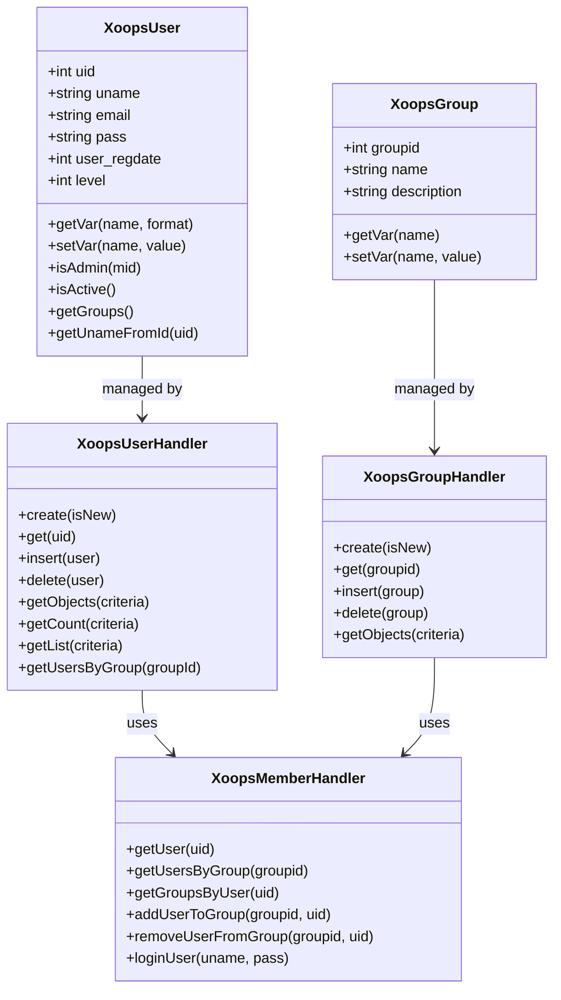
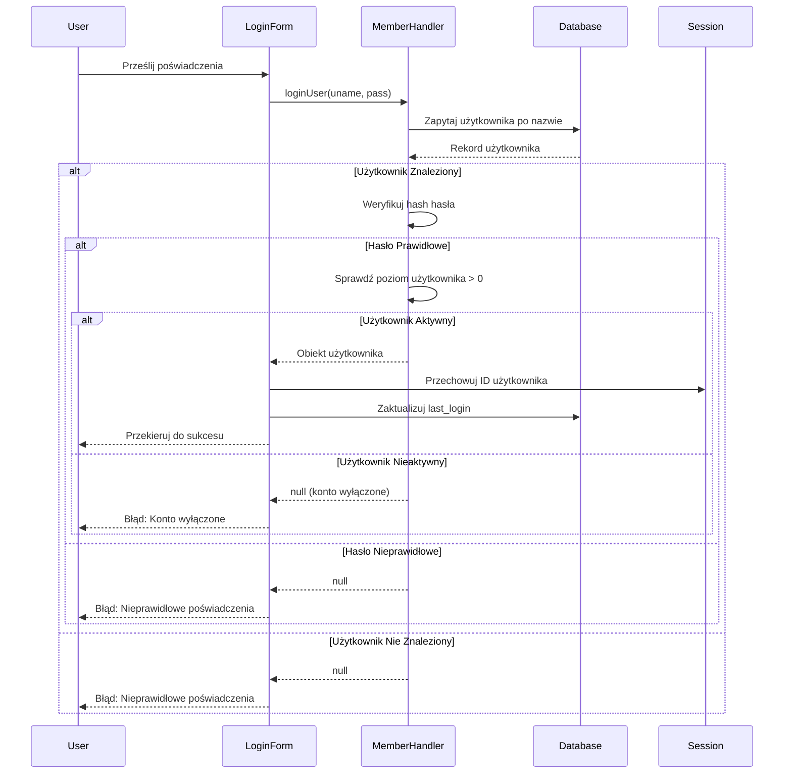
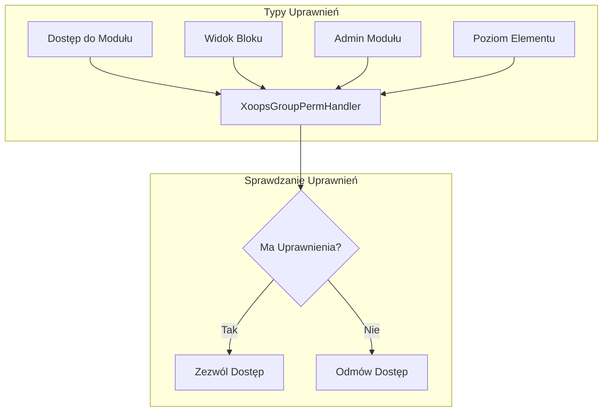
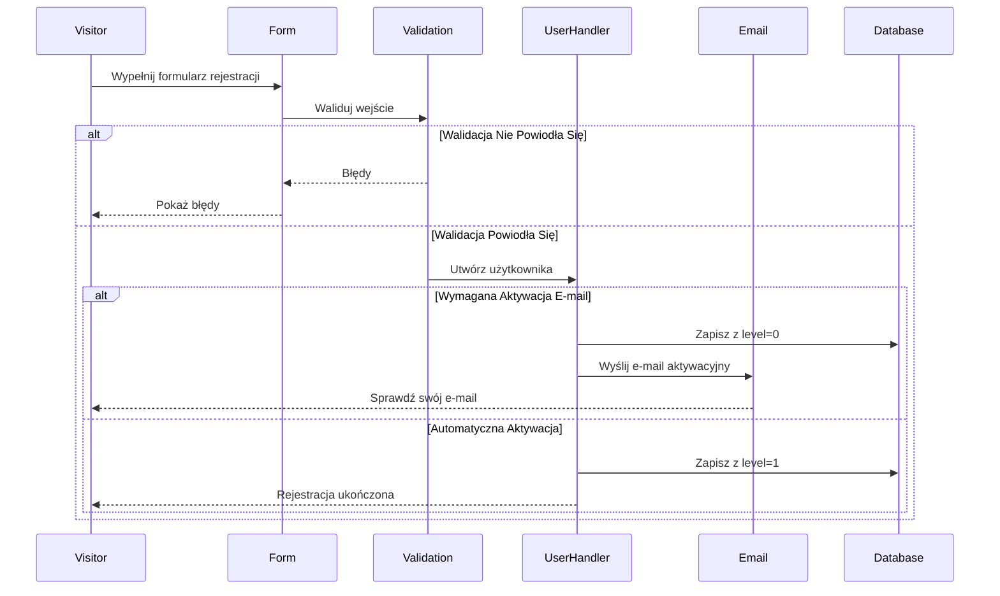

> Kompletna dokumentacja API systemu użytkowników XOOPS.

---

## Architektura Systemu Użytkowników



---

## Klasa XoopsUser

### Właściwości

| Właściwość | Typ | Opis |
|-----------|-----|------|
| `uid` | int | ID użytkownika (klucz główny) |
| `uname` | string | Nazwa użytkownika |
| `name` | string | Imię i nazwisko |
| `email` | string | Adres e-mail |
| `pass` | string | Hash hasła |
| `url` | string | URL witryny |
| `user_avatar` | string | Nazwa pliku awatara |
| `user_regdate` | int | Timestamp rejestracji |
| `user_from` | string | Lokalizacja |
| `user_sig` | string | Podpis |
| `user_occ` | string | Zawód |
| `user_intrest` | string | Zainteresowania |
| `bio` | string | Biografia |
| `posts` | int | Liczba postów |
| `rank` | int | Ranga użytkownika |
| `level` | int | Poziom użytkownika (0=nieaktywny, 1=aktywny) |
| `theme` | string | Preferowany motyw |
| `timezone` | float | Przesunięcie strefy czasowej |
| `last_login` | int | Timestamp ostatniego logowania |

### Główne Metody

```php
// Pobierz bieżącego użytkownika
global $xoopsUser;

// Sprawdź czy zalogowany
if (is_object($xoopsUser)) {
    // Użytkownik jest zalogowany
    $uid = $xoopsUser->getVar('uid');
    $username = $xoopsUser->getVar('uname');
}

// Pobierz sformatowane wartości
$uname = $xoopsUser->getVar('uname');           // Wartość surowa
$unameDisplay = $xoopsUser->getVar('uname', 's'); // Oczyszczona do wyświetlenia
$unameEdit = $xoopsUser->getVar('uname', 'e');    // Do edycji formularza

// Sprawdź czy admin
$isAdmin = $xoopsUser->isAdmin();              // Administrator witryny
$isModuleAdmin = $xoopsUser->isAdmin($mid);    // Administrator modułu

// Pobierz grupy użytkownika
$groups = $xoopsUser->getGroups();             // Tablica ID grup

// Sprawdź czy aktywny
$isActive = $xoopsUser->isActive();
```

---

## XoopsUserHandler

### Operacje CRUD Użytkownika

```php
// Pobierz handler
$userHandler = xoops_getHandler('user');

// Utwórz nowego użytkownika
$user = $userHandler->create();
$user->setVar('uname', 'newuser');
$user->setVar('email', 'user@example.com');
$user->setVar('pass', password_hash('password123', PASSWORD_DEFAULT));
$user->setVar('user_regdate', time());
$user->setVar('level', 1);

if ($userHandler->insert($user)) {
    $newUid = $user->getVar('uid');
}

// Pobierz użytkownika po ID
$user = $userHandler->get(123);

// Zaktualizuj użytkownika
$user->setVar('email', 'newemail@example.com');
$userHandler->insert($user);

// Usuń użytkownika
$userHandler->delete($user);
```

### Zapytania do Użytkowników

```php
// Pobierz wszystkich aktywnych użytkowników
$criteria = new Criteria('level', 1);
$users = $userHandler->getObjects($criteria);

// Pobierz użytkowników wg kryteriów
$criteria = new CriteriaCompo();
$criteria->add(new Criteria('level', 1));
$criteria->add(new Criteria('posts', 10, '>='));
$criteria->setSort('posts');
$criteria->setOrder('DESC');
$criteria->setLimit(10);
$activePosters = $userHandler->getObjects($criteria);

// Pobierz liczbę użytkowników
$count = $userHandler->getCount($criteria);

// Pobierz listę użytkowników (uid => uname)
$userList = $userHandler->getList($criteria);

// Szukaj użytkowników
$criteria = new CriteriaCompo();
$criteria->add(new Criteria('uname', '%john%', 'LIKE'));
$criteria->add(new Criteria('email', '%john%', 'LIKE'), 'OR');
$searchResults = $userHandler->getObjects($criteria);
```

---

## XoopsMemberHandler

### Zarządzanie Grupami

```php
$memberHandler = xoops_getHandler('member');

// Pobierz użytkownika z grupami
$user = $memberHandler->getUser($uid);
$groups = $memberHandler->getGroupsByUser($uid);

// Pobierz użytkowników w grupie
$users = $memberHandler->getUsersByGroup($groupId);
$users = $memberHandler->getUsersByGroup($groupId, true); // Obiekty
$users = $memberHandler->getUsersByGroup($groupId, false); // Tylko ID użytkowników

// Dodaj użytkownika do grupy
$memberHandler->addUserToGroup($groupId, $uid);

// Usuń użytkownika z grupy
$memberHandler->removeUserFromGroup($groupId, $uid);
```

### Uwierzytelnianie

```php
// Zaloguj użytkownika
$user = $memberHandler->loginUser($username, $password);

if ($user) {
    // Login powiódł się
    $_SESSION['xoopsUserId'] = $user->getVar('uid');
    $user->setVar('last_login', time());
    $userHandler->insert($user);
} else {
    // Login nie powiódł się
}

// Wyloguj
$_SESSION = [];
session_destroy();
redirect_header(XOOPS_URL, 3, 'Logged out');
```

---

## Przepływ Uwierzytelniania



---

## System Grup

### Grupy Domyślne

| ID Grupy | Nazwa | Opis |
|----------|-------|------|
| 1 | Webmasters | Pełny dostęp administracyjny |
| 2 | Registered Users | Standardowymi zarejestrowani użytkownicy |
| 3 | Anonymous | Odwiedzający nieprawidłowo zalogowani |

### Uprawnienia Grupowe



### Sprawdź Uprawnienia

```php
$gpermHandler = xoops_getHandler('groupperm');

// Sprawdź dostęp do modułu
$groups = is_object($xoopsUser) ? $xoopsUser->getGroups() : [XOOPS_GROUP_ANONYMOUS];
$hasAccess = $gpermHandler->checkRight('module_read', $moduleId, $groups);

// Sprawdź admin modułu
$isAdmin = $gpermHandler->checkRight('module_admin', $moduleId, $groups);

// Sprawdź niestandardowe uprawnienia
$hasPermission = $gpermHandler->checkRight(
    'item_view',      // Nazwa uprawnienia
    $itemId,          // ID elementu
    $groups,          // ID grup
    $moduleId         // ID modułu
);

// Pobierz elementy do których użytkownik ma dostęp
$itemIds = $gpermHandler->getItemIds('item_view', $groups, $moduleId);
```

---

## Przepływ Rejestracji Użytkownika



---

## Kompletny Przykład

```php
<?php
require_once __DIR__ . '/mainfile.php';

use Xmf\Request;

$memberHandler = xoops_getHandler('member');
$userHandler = xoops_getHandler('user');

// Handler rejestracji
if (Request::hasVar('register', 'POST')) {
    // Weryfikuj CSRF
    if (!$GLOBALS['xoopsSecurity']->check()) {
        redirect_header('register.php', 3, 'Security error');
    }

    $uname = Request::getString('uname', '', 'POST');
    $email = Request::getEmail('email', '', 'POST');
    $pass = Request::getString('pass', '', 'POST');
    $passConfirm = Request::getString('pass_confirm', '', 'POST');

    $errors = [];

    // Waliduj nazwę użytkownika
    if (strlen($uname) < 3 || strlen($uname) > 25) {
        $errors[] = 'Username must be 3-25 characters';
    }

    // Sprawdź czy nazwa użytkownika istnieje
    $criteria = new Criteria('uname', $uname);
    if ($userHandler->getCount($criteria) > 0) {
        $errors[] = 'Username already taken';
    }

    // Waliduj e-mail
    if (!filter_var($email, FILTER_VALIDATE_EMAIL)) {
        $errors[] = 'Invalid email address';
    }

    // Sprawdź czy e-mail istnieje
    $criteria = new Criteria('email', $email);
    if ($userHandler->getCount($criteria) > 0) {
        $errors[] = 'Email already registered';
    }

    // Waliduj hasło
    if (strlen($pass) < 8) {
        $errors[] = 'Password must be at least 8 characters';
    }

    if ($pass !== $passConfirm) {
        $errors[] = 'Passwords do not match';
    }

    if (empty($errors)) {
        // Utwórz użytkownika
        $user = $userHandler->create();
        $user->setVar('uname', $uname);
        $user->setVar('email', $email);
        $user->setVar('pass', password_hash($pass, PASSWORD_DEFAULT));
        $user->setVar('user_regdate', time());
        $user->setVar('level', 1); // Automatyczna aktywacja

        if ($userHandler->insert($user)) {
            // Dodaj do grupy Registered Users
            $memberHandler->addUserToGroup(XOOPS_GROUP_USERS, $user->getVar('uid'));

            redirect_header('index.php', 3, 'Registration successful!');
        } else {
            $errors[] = 'Error creating account';
        }
    }
}

// Wyświetl formularz rejestracji
require_once XOOPS_ROOT_PATH . '/header.php';

if (!empty($errors)) {
    foreach ($errors as $error) {
        echo "<div class='errorMsg'>$error</div>";
    }
}

// Formularz rejestracji tutaj...

require_once XOOPS_ROOT_PATH . '/footer.php';
```

---

## Powiązana Dokumentacja

- Przewodnik Zarządzania Użytkownikami
- System Uprawnień
- Uwierzytelnianie

---

#xoops #api #user #authentication #reference
