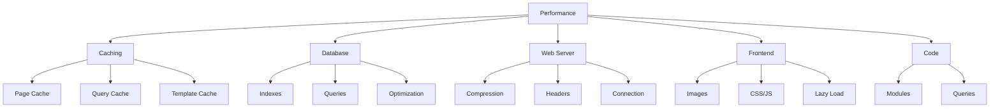

# Optymalizacja wydajności XOOPS

Kompleksowy przewodnik optymalizacji XOOPS pod kątem maksymalnej szybkości i wydajności.

## Przegląd optymalizacji wydajności



## Konfiguracja buforowania

Buforowanie to najszybszy sposób na poprawę wydajności.

### Buforowanie na poziomie strony

Włącz pełne buforowanie strony w XOOPS:

**Panel administracyjny > System > Preferencje > Ustawienia cache**

```
Włącz cache: Tak
Typ cache: Pamięć podręczna pliku (lub APCu/Memcache)
Czas życia cache: 3600 sekund (1 godzina)
Tabela modułów w cache: Tak
Konfiguracja w cache: Tak
Wyniki wyszukiwania w cache: Tak
```

### Buforowanie oparte na plikach

Skonfiguruj lokalizację pamięci podręcznej pliku:

```bash
# Utwórz katalog pamięci podręcznej poza katalogiem internetowym (bezpieczniej)
mkdir -p /var/cache/xoops
chown www-data:www-data /var/cache/xoops
chmod 755 /var/cache/xoops

# Edytuj mainfile.php
define('XOOPS_CACHE_PATH', '/var/cache/xoops/');
```

### Buforowanie APCu

APCu zapewnia buforowanie w pamięci (bardzo szybkie):

```bash
# Zainstaluj APCu
apt-get install php-apcu

# Weryfikuj instalację
php -m | grep apcu

# Skonfiguruj w php.ini
apc.enabled = 1
apc.memory_size = 128M
apc.ttl = 0
apc.user_ttl = 3600
apc.shm_size = 128
```

Włącz w XOOPS:

**Panel administracyjny > System > Preferencje > Ustawienia cache**

```
Typ cache: APCu
```

### Buforowanie Memcache/Redis

Rozproszone buforowanie dla witryn o dużym ruchu:

**Zainstaluj Memcache:**

```bash
# Zainstaluj serwer Memcache
apt-get install memcached

# Uruchom usługę
systemctl start memcached
systemctl enable memcached

# Weryfikuj uruchomienie
netstat -tlnp | grep memcached
# Powinno pokazać nasłuchiwanie na porcie 11211
```

**Skonfiguruj w XOOPS:**

Edytuj mainfile.php:

```php
// Konfiguracja Memcache
define('XOOPS_CACHE_TYPE', 'memcache');
define('XOOPS_CACHE_HOST', 'localhost');
define('XOOPS_CACHE_PORT', 11211);
define('XOOPS_CACHE_TIMEOUT', 0);
```

Lub w panelu administracyjnym:

```
Typ cache: Memcache
Host Memcache: localhost:11211
```

### Buforowanie szablonów

Kompiluj i buforuj szablony XOOPS:

```bash
# Upewnij się, że templates_c jest zapisywalny
chmod 777 /var/www/html/xoops/templates_c/

# Wyczyść stare szablony w pamięci podręcznej
rm -rf /var/www/html/xoops/templates_c/*
```

Skonfiguruj w motywie:

```html
<!-- W pliku xoops_version.php motywu -->
{smarty.const.XOOPS_VAR_PATH|constant}
<{$xoops_meta}>

<!-- Szablony korzystają z buforowania -->
{cache}
    [Treść w pamięci podręcznej tutaj]
{/cache}
```

## Optymalizacja bazy danych

### Dodaj indeksy bazy danych

Prawidłowo indeksowane bazy danych działają znacznie szybciej.

```sql
-- Sprawdź bieżące indeksy
SHOW INDEXES FROM xoops_users;

-- Typowe indeksy do dodania
ALTER TABLE xoops_users ADD INDEX idx_uname (uname);
ALTER TABLE xoops_users ADD INDEX idx_email (email);
ALTER TABLE xoops_users ADD INDEX idx_uid_active (uid, user_actkey);

-- Dodaj indeksy do tabel postów/zawartości
ALTER TABLE xoops_posts ADD INDEX idx_post_published (post_published);
ALTER TABLE xoops_posts ADD INDEX idx_post_uid (post_uid);
ALTER TABLE xoops_posts ADD INDEX idx_post_created (post_created);

-- Weryfikuj utworzone indeksy
SHOW INDEXES FROM xoops_users\G
```

### Optymalizuj tabele

Regularna optymalizacja tabel poprawia wydajność:

```sql
-- Optymalizuj wszystkie tabele
OPTIMIZE TABLE xoops_users;
OPTIMIZE TABLE xoops_posts;
OPTIMIZE TABLE xoops_config;
OPTIMIZE TABLE xoops_comments;

-- Lub optymalizuj wszystko na raz
REPAIR TABLE xoops_users;
OPTIMIZE TABLE xoops_users;
REPAIR TABLE xoops_posts;
OPTIMIZE TABLE xoops_posts;
```

Utwórz automatyczny skrypt optymalizacji:

```bash
#!/bin/bash
# Skrypt optymalizacji bazy danych

echo "Optymalizowanie bazy danych XOOPS..."

mysql -u xoops_user -p xoops_db << EOF
-- Optymalizuj wszystkie tabele
OPTIMIZE TABLE xoops_users;
OPTIMIZE TABLE xoops_posts;
OPTIMIZE TABLE xoops_config;
OPTIMIZE TABLE xoops_comments;
OPTIMIZE TABLE xoops_users_online;

-- Pokaż rozmiar bazy danych
SELECT table_schema,
       ROUND(SUM(data_length + index_length) / 1024 / 1024, 2) as total_mb
FROM information_schema.tables
WHERE table_schema = 'xoops_db'
GROUP BY table_schema;
EOF

echo "Optymalizacja bazy danych ukończona!"
```

Zaplanuj za pomocą cron:

```bash
# Tygodniowa optymalizacja
crontab -e
# Dodaj: 0 3 * * 0 /usr/local/bin/optimize-xoops-db.sh
```

### Optymalizacja zapytań

Przejrzyj wolne zapytania:

```sql
-- Włącz dziennik wolnych zapytań
SET GLOBAL slow_query_log = 'ON';
SET GLOBAL long_query_time = 2;

-- Wyświetl wolne zapytania
SELECT * FROM mysql.slow_log;

-- Lub sprawdź plik dziennika wolnych zapytań
tail -100 /var/log/mysql/slow.log
```

Typowe techniki optymalizacji:

```php
// WOLNE - Unikaj niepotrzebnych zapytań w pętlach
foreach ($users as $user) {
    $profile = getUserProfile($user['uid']);  // Zapytanie w pętli!
    echo $profile['name'];
}

// SZYBKIE - Pobierz wszystkie dane na raz
$profiles = getAllUserProfiles($user_ids);
foreach ($users as $user) {
    echo $profiles[$user['uid']]['name'];
}
```

### Zwiększ pulę buforów

Skonfiguruj MySQL na potrzeby lepszego buforowania:

Edytuj `/etc/mysql/mysql.conf.d/mysqld.cnf`:

```ini
# Pula buforów InnoDB (50-80% pamięci RAM systemu)
innodb_buffer_pool_size = 1G

# Pamięć podręczna zapytań (opcjonalne, można wyłączyć w MySQL 5.7+)
query_cache_size = 64M
query_cache_type = 1

# Maksymalne połączenia
max_connections = 500

# Maksymalny pakiet
max_allowed_packet = 256M

# Limit czasu połączenia
connect_timeout = 10
```

Uruchom ponownie MySQL:

```bash
systemctl restart mysql
```

## Optymalizacja serwera internetowego

### Włącz kompresję Gzip

Kompresuj odpowiedzi aby zmniejszyć przepustowość:

**Konfiguracja Apache:**

```apache
<IfModule mod_deflate.c>
    AddOutputFilterByType DEFLATE text/html text/plain text/xml text/css text/javascript application/javascript application/json

    # Nie kompresuj obrazów i już skompresowanych plików
    SetEnvIfNoCase Request_URI \.(jpg|jpeg|png|gif|zip|gzip)$ no-gzip dont-vary

    # Zaloguj skompresowane odpowiedzi
    DeflateBufferSize 8096
</IfModule>
```

**Konfiguracja Nginx:**

```nginx
gzip on;
gzip_types text/html text/plain text/css text/javascript application/javascript application/json;
gzip_min_length 1000;
gzip_vary on;
gzip_comp_level 6;

# Nie kompresuj już skompresowanych formatów
gzip_disable "msie6";
```

Weryfikuj kompresję:

```bash
# Sprawdź czy odpowiedź jest skompresowana
curl -I -H "Accept-Encoding: gzip" http://your-domain.com/xoops/

# Powinno pokazać:
# Content-Encoding: gzip
```

### Nagłówki buforowania przeglądarki

Ustaw wygaśnięcie pamięci podręcznej dla zasobów statycznych:

**Apache:**

```apache
<IfModule mod_expires.c>
    ExpiresActive On

    # Buforuj obrazy przez 30 dni
    ExpiresByType image/jpeg "access plus 30 days"
    ExpiresByType image/gif "access plus 30 days"
    ExpiresByType image/png "access plus 30 days"
    ExpiresByType image/svg+xml "access plus 30 days"

    # Buforuj CSS/JS przez 30 dni
    ExpiresByType text/css "access plus 30 days"
    ExpiresByType application/javascript "access plus 30 days"
    ExpiresByType text/javascript "access plus 30 days"

    # Buforuj czcionki przez 1 rok
    ExpiresByType font/eot "access plus 1 year"
    ExpiresByType font/ttf "access plus 1 year"
    ExpiresByType font/woff "access plus 1 year"
    ExpiresByType font/woff2 "access plus 1 year"

    # Nie buforuj HTML
    ExpiresByType text/html "access plus 1 hour"
</IfModule>
```

**Nginx:**

```nginx
location ~* \.(jpg|jpeg|png|gif|ico|svg|woff|woff2|ttf|eot)$ {
    expires 30d;
    add_header Cache-Control "public, immutable";
}

location ~* \.(css|js)$ {
    expires 30d;
    add_header Cache-Control "public";
}

location ~ \.html$ {
    expires 1h;
    add_header Cache-Control "public";
}
```

### Utrzymanie połączenia

Włącz trwałe połączenia HTTP:

**Apache:**

```apache
<IfModule mod_http.c>
    KeepAlive On
    KeepAliveTimeout 15
    MaxKeepAliveRequests 100
</IfModule>
```

**Nginx:**

```nginx
keepalive_timeout 15s;
keepalive_requests 100;
```

## Optymalizacja frontendu

### Optymalizuj obrazy

Zmniejsz rozmiar plików obrazów:

```bash
# Zbiorczą kompresję obrazów JPEG
for img in *.jpg; do
    convert "$img" -quality 85 "optimized_$img"
done

# Zbiorczą kompresję obrazów PNG
for img in *.png; do
    optipng -o2 "$img"
done

# Lub użyj imagemin CLI
npm install -g imagemin-cli
imagemin images/ --out-dir=images-optimized
```

### Minifikuj CSS i JavaScript

Zmniejsz rozmiar plików CSS/JS:

**Używając narzędzi Node.js:**

```bash
# Zainstaluj minifikatory
npm install -g uglify-js clean-css-cli

# Minifikuj JavaScript
uglifyjs script.js -o script.min.js

# Minifikuj CSS
cleancss style.css -o style.min.css
```

**Używając narzędzi internetowych:**
- Minifikator CSS: https://cssminifier.com/
- Minifikator JavaScript: https://www.minifycode.com/javascript-minifier/

### Leniwego ładowania obrazów

Ładuj obrazy tylko gdy potrzeba:

```html
<!-- Dodaj atrybut loading="lazy" -->


<!-- Lub użyj biblioteki JavaScript dla starszych przeglądarek -->


<script src="https://cdnjs.cloudflare.com/ajax/libs/vanilla-lazyload/17.1.2/lazyload.min.js"></script>
<script>
    var lazyLoad = new LazyLoad({
        elements_selector: ".lazy"
    });
</script>
```

### Zmniejsz zasoby blokujące renderowanie

Ładuj CSS/JS strategicznie:

```html
<!-- Ładuj krytyczne CSS w wierszu -->
<style>
    /* Krytyczne style dla zawartości powyżej linii zmiany -->
</style>

<!-- Opóźnij niekrytyczne CSS -->
<link rel="stylesheet" href="style.css" media="print" onload="this.media='all'">

<!-- Opóźnij JavaScript -->
<script src="script.js" defer></script>

<!-- Lub użyj async dla niekrytycznych skryptów -->
<script src="analytics.js" async></script>
```

## Integracja CDN

Użyj sieci dostarczania zawartości dla szybszego dostępu globalnego.

### Popularne CDNs

| CDN | Koszt | Funkcje |
|---|---|---|
| Cloudflare | Bezplatne/Płatne | DDoS, DNS, Cache, Analytics |
| AWS CloudFront | Płatne | Wysoka wydajność, globalne |
| Bunny CDN | Tanie | Storage, wideo, cache |
| jsDelivr | Bezplatne | Biblioteki JavaScript |
| cdnjs | Bezplatne | Popularne biblioteki |

### Konfiguracja Cloudflare

1. Zarejestruj się na https://www.cloudflare.com/
2. Dodaj domenę
3. Zaktualizuj serwery nazw za pomocą Cloudflare
4. Włącz opcje buforowania:
   - Poziom cache: Agresywny
   - Buforowanie wszystkiego: Włączone
   - TTL cache przeglądarki: 1 miesiąc

5. W XOOPS zaktualizuj domenę aby korzystać z DNS Cloudflare

### Skonfiguruj CDN w XOOPS

Zaktualizuj adresy URL obrazów do CDN:

Edytuj szablon motywu:

```html
<!-- Oryginał -->


<!-- Z CDN -->

```

Lub ustaw w PHP:

```php
// W mainfile.php lub konfiguracji
define('XOOPS_CDN_URL', 'https://cdn.your-domain.com');

// W szablonie

```

## Monitorowanie wydajności

### Testowanie PageSpeed Insights

Przetestuj wydajność witryny:

1. Odwiedź Google PageSpeed Insights: https://pagespeed.web.dev/
2. Wprowadź adres URL XOOPS
3. Przejrzyj rekomendacje
4. Wdrażaj sugerowane ulepszenia

### Monitorowanie wydajności serwera

Monitoruj metryki serwera w czasie rzeczywistym:

```bash
# Zainstaluj narzędzia monitorowania
apt-get install htop iotop nethogs

# Monitoruj CPU i pamięć
htop

# Monitoruj I/O dysku
iotop

# Monitoruj sieć
nethogs
```

### Profilowanie wydajności PHP

Zidentyfikuj powolny kod PHP:

```php
<?php
// Użyj Xdebug do profilowania
xdebug_start_trace('profile');

// Twój kod tutaj
$result = someExpensiveFunction();

xdebug_stop_trace();
?>
```

### Monitorowanie zapytań MySQL

Śledź wolne zapytania:

```bash
# Włącz rejestrowanie zapytań
mysql -u root -p

SET GLOBAL general_log = 'ON';
SET GLOBAL log_output = 'FILE';
SET GLOBAL general_log_file = '/var/log/mysql/query.log';

# Przejrzyj wolne zapytania
tail -f /var/log/mysql/slow.log

# Analizuj zapytanie za pomocą EXPLAIN
EXPLAIN SELECT * FROM xoops_users WHERE uid = 1\G
```

## Checklist optymalizacji wydajności

Wdrażaj dla najlepszej wydajności:

- [ ] **Buforowanie:** Włącz buforowanie pliku/APCu/Memcache
- [ ] **Baza danych:** Dodaj indeksy, optymalizuj tabele
- [ ] **Kompresja:** Włącz kompresję Gzip
- [ ] **Cache przeglądarki:** Ustaw nagłówki cache
- [ ] **Obrazy:** Optymalizuj i kompresuj
- [ ] **CSS/JS:** Minifikuj pliki
- [ ] **Leniwe ładowanie:** Wdróż dla obrazów
- [ ] **CDN:** Użyj dla zasobów statycznych
- [ ] **Keep-Alive:** Włącz trwałe połączenia
- [ ] **Moduły:** Wyłącz nieużywane moduły
- [ ] **Motywy:** Użyj lekkich, zoptymalizowanych motywów
- [ ] **Monitorowanie:** Śledź metryki wydajności
- [ ] **Regularną konserwację:** Wyczyść cache, optymalizuj BD

## Skrypt optymalizacji wydajności

Automatyczna optymalizacja:

```bash
#!/bin/bash
# Skrypt optymalizacji wydajności

echo "=== Optymalizacja wydajności XOOPS ==="

# Wyczyść cache
echo "Czyszczenie cache..."
rm -rf /var/www/html/xoops/cache/*
rm -rf /var/www/html/xoops/templates_c/*

# Optymalizuj bazę danych
echo "Optymalizowanie bazy danych..."
mysql -u xoops_user -p xoops_db << EOF
OPTIMIZE TABLE xoops_users;
OPTIMIZE TABLE xoops_posts;
OPTIMIZE TABLE xoops_config;
OPTIMIZE TABLE xoops_comments;
EOF

# Sprawdzaj uprawnienia do plików
echo "Weryfikowanie uprawnień do plików..."
find /var/www/html/xoops -type f -exec chmod 644 {} \;
find /var/www/html/xoops -type d -exec chmod 755 {} \;
chmod 777 /var/www/html/xoops/cache
chmod 777 /var/www/html/xoops/templates_c
chmod 777 /var/www/html/xoops/uploads
chmod 777 /var/www/html/xoops/var

# Generuj raport wydajności
echo "Optymalizacja wydajności ukończona!"
echo ""
echo "Następne kroki:"
echo "1. Przetestuj witrynę na https://pagespeed.web.dev/"
echo "2. Monitoruj wydajność w panelu administracyjnym"
echo "3. Rozważ CDN dla zasobów statycznych"
echo "4. Przejrzyj wolne zapytania w MySQL"
```

## Metryki przed i po optymalizacji

Śledź ulepszenia:

```
Przed optymalizacją:
- Czas ładowania strony: 3,5 sekundy
- Zapytania bazy danych: 45
- Wskaźnik trafień cache: 0%
- Rozmiar bazy danych: 250MB

Po optymalizacji:
- Czas ładowania strony: 0,8 sekundy (77% szybciej)
- Zapytania bazy danych: 8 (buforowane)
- Wskaźnik trafień cache: 85%
- Rozmiar bazy danych: 120MB (optymalizowane)
```

## Następne kroki

1. Przejrzyj konfigurację podstawową
2. Upewnij się, że są środki bezpieczeństwa
3. Wdrażaj buforowanie
4. Monitoruj wydajność za pomocą narzędzi
5. Dostosowuj na podstawie metryki

---

**Tagi:** #wydajność #optymalizacja #buforowanie #baza-danych #cdn

**Powiązane artykuły:**
- ../../06-Publisher-Module/User-Guide/Basic-Configuration
- System-Settings
- Security-Configuration
- ../Installation/Server-Requirements
