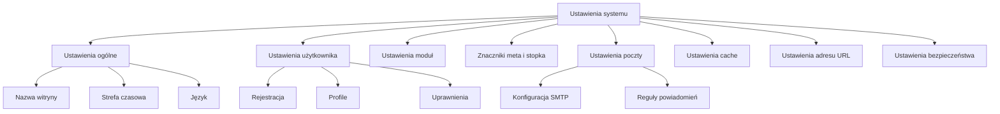

# Ustawienia systemu XOOPS

Ten przewodnik obejmuje kompletne ustawienia systemu dostępne w panelu administracyjnym XOOPS, zorganizowane по kategorii.

## Architektura ustawień systemu



## Dostęp do ustawień systemu

### Lokalizacja

**Panel administracyjny > System > Preferencje**

Lub przejdź bezpośrednio:

```
http://your-domain.com/xoops/admin/index.php?fct=preferences
```

### Wymagania dotyczące uprawnień

- Tylko administratorzy (webmasterowie) mogą uzyskać dostęp do ustawień systemu
- Zmiany wpływają na całą witrynę
- Większość zmian wchodzi w życie natychmiast

## Ustawienia ogólne

Konfiguracja fundamentalna instalacji XOOPS.

### Informacje podstawowe

```
Nazwa witryny: [Nazwa Twojej witryny]
Opis domyślny: [Krótki opis witryny]
Slogan witryny: [Przyciągający slogan]
Email administratora: admin@your-domain.com
Nazwa webmastera: Nazwa administratora
Email webmastera: admin@your-domain.com
```

### Ustawienia wyglądu

```
Domyślny motyw: [Wybierz motyw]
Domyślny język: Polski (lub preferowany język)
Elementów na stronie: 15 (zazwyczaj 10-25)
Słów w skrócie: 25 (dla wyników wyszukiwania)
Uprawnienie przesyłania motywu: Wyłączone (bezpieczeństwo)
```

### Ustawienia regionalne

```
Domyślna strefa czasowa: [Twoja strefa czasowa]
Format daty: %Y-%m-%d (format RRRR-MM-DD)
Format czasu: %H:%M:%S (format GG:MM:SS)
Czas letni: [Auto/Ręczny/Brak]
```

**Tabela formatów stref czasowych:**

| Region | Strefa czasowa | Przesunięcie UTC |
|---|---|---|
| US Eastern | America/New_York | -5 / -4 |
| US Central | America/Chicago | -6 / -5 |
| US Mountain | America/Denver | -7 / -6 |
| US Pacific | America/Los_Angeles | -8 / -7 |
| UK/Londyn | Europe/London | 0 / +1 |
| Francja/Niemcy | Europe/Paris | +1 / +2 |
| Europa/Warszawa | Europe/Warsaw | +1 / +2 |
| Japonia | Asia/Tokyo | +9 |
| Chiny | Asia/Shanghai | +8 |
| Australia/Sydney | Australia/Sydney | +10 / +11 |

### Konfiguracja wyszukiwania

```
Włącz wyszukiwanie: Tak
Szukaj na stronach administracyjnych: Tak/Nie
Szukaj w archiwach: Tak
Domyślny typ wyszukiwania: Wszystko / Tylko strony
Słowa wyłączone z wyszukiwania: [Lista oddzielona przecinkami]
```

**Powszechnie wyłączone słowa:** the, a, an, and, or, but, in, on, at, by, to, from

## Ustawienia użytkownika

Kontroluj zachowanie konta użytkownika i proces rejestracji.

### Rejestracja użytkownika

```
Zezwól na rejestrację użytkownika: Tak/Nie
Typ rejestracji:
  ☐ Autouzaktywnienie (Dostęp natychmiastowy)
  ☐ Zatwierdzenie administracyjne (Admin musi zatwierdzić)
  ☐ Weryfikacja wiadomości e-mail (Użytkownik musi zweryfikować wiadomość e-mail)

Powiadomienie dla użytkowników: Tak/Nie
Weryfikacja wiadomości e-mail użytkownika: Wymagana/Opcjonalna
```

### Konfiguracja nowego użytkownika

```
Automatyczne logowanie nowych użytkowników: Tak/Nie
Przypisz domyślną grupę użytkowników: Tak
Domyślna grupa użytkowników: [Wybierz grupę]
Utwórz awatar użytkownika: Tak/Nie
Awatar początkowy: [Wybierz domyślny]
```

### Ustawienia profilu użytkownika

```
Zezwól na profile użytkownika: Tak
Pokaż listę członków: Tak
Pokaż statystykę użytkownika: Tak
Pokaż ostatni czas online: Tak
Zezwól na awatar użytkownika: Tak
Maksymalny rozmiar awatara: 100KB
Wymiary awatara: 100x100 pikseli
```

### Ustawienia poczty użytkownika

```
Zezwól użytkownikom na ukrywanie wiadomości e-mail: Tak
Pokaż wiadomość e-mail na profilu: Tak
Interwał powiadomień e-mail: Natychmiast/Codziennie/Co tydzień/Nigdy
```

### Śledzenie aktywności użytkownika

```
Śledź aktywność użytkownika: Tak
Zaloguj logowania użytkownika: Tak
Zaloguj nieudane logowania: Tak
Śledź adres IP: Tak
Wyczyść dzienniki aktywności starsze niż: 90 dni
```

### Limity konta

```
Zezwól na zduplikowany e-mail: Nie
Minimalna długość nazwy użytkownika: 3 znaki
Maksymalna długość nazwy użytkownika: 15 znaków
Minimalna długość hasła: 6 znaków
Wymagaj znaków specjalnych: Tak
Wymagaj liczb: Tak
Wygaśnięcie hasła: 90 dni (lub Nigdy)
Nieaktywne konta do usunięcia po dni: 365 dni
```

## Ustawienia moduł

Skonfiguruj zachowanie poszczególnych modułów.

### Typowe opcje modułu

Dla każdego zainstalowanego modułu możesz ustawić:

```
Status modułu: Aktywny/Nieaktywny
Wyświetl w menu: Tak/Nie
Waga modułu: [1-999] (wyższa = niższa w wyświetlaniu)
Domyślna strona główna: Ten moduł pokazuje się podczas odwiedzenia /
Dostęp administracyjny: [Dozwolone grupy użytkowników]
Dostęp użytkownika: [Dozwolone grupy użytkowników]
```

### Ustawienia modułu systemowego

```
Pokaż stronę główną jako: Portal / Moduł / Strona statyczna
Domyślny moduł strony głównej: [Wybierz moduł]
Pokaż menu stopki: Tak
Kolor stopki: [Selektor koloru]
Pokaż statystykę systemu: Tak
Pokaż użycie pamięci: Tak
```

### Konfiguracja na moduł

Każdy moduł może mieć ustawienia specyficzne dla modułu:

**Przykład - Moduł strony:**
```
Włącz komentarze: Tak/Nie
Moderuj komentarze: Tak/Nie
Komentarzy na stronie: 10
Włącz oceny: Tak
Zezwól na anonimowe oceny: Tak
```

**Przykład - Moduł użytkownika:**
```
Folder przesyłania awatara: ./uploads/
Maksymalny rozmiar przesyłania: 100KB
Zezwól na przesyłanie pliku: Tak
Dozwolone typy plików: jpg, gif, png
```

Dostęp do ustawień specyficznych dla modułu:
- **Admin > Moduły > [Nazwa modułu] > Preferencje**

## Ustawienia znaczników meta i SEO

Skonfiguruj znaczniki meta do optymalizacji dla wyszukiwarek.

### Globalne znaczniki meta

```
Słowa kluczowe meta: xoops, cms, system zarządzania zawartością
Opis meta: Potężny system zarządzania zawartością do budowania dynamicznych witryn
Autor meta: Twoje imię i nazwisko
Copyright meta: Copyright 2025, Twoja firma
Meta robots: index, follow
Meta revisit: 30 dni
```

### Najlepsze praktyki znaczników meta

| Znacznik | Cel | Rekomendacja |
|---|---|---|
| Słowa kluczowe | Terminy wyszukiwania | 5-10 istotnych słów kluczowych, oddzielonych przecinkami |
| Opis | Wynik wyszukiwania | 150-160 znaków |
| Autor | Autor strony | Twoje imię i nazwisko lub firma |
| Copyright | Prawne | Twoje powiadomienie o prawach autorskich |
| Robots | Instrukcje crawlera | index, follow (zezwól na indeksowanie) |

### Ustawienia stopki

```
Pokaż stopkę: Tak
Kolor stopki: Ciemny/Jasny
Tło stopki: [Kod koloru]
Tekst stopki: [HTML dozwolone]
Dodatkowe linki stopki: [Pary adresu URL i tekstu]
```

**Przykład HTML stopki:**
```html
<p>Copyright &copy; 2025 Twoja firma. Wszystkie prawa zastrzeżone.</p>
<p><a href="/privacy">Polityka prywatności</a> | <a href="/terms">Warunki korzystania</a></p>
```

### Społeczne znaczniki meta (Open Graph)

```
Włącz Open Graph: Tak
Facebook App ID: [App ID]
Typ karty Twittera: summary / summary_large_image / player
Domyślny obraz udostępniania: [Adres URL obrazu]
```

## Ustawienia poczty elektronicznej

Skonfiguruj system dostarczania poczty i powiadomień.

### Metoda dostarczania poczty

```
Użyj SMTP: Tak/Nie

Jeśli SMTP:
  Host SMTP: smtp.gmail.com
  Port SMTP: 587 (TLS) lub 465 (SSL)
  Bezpieczeństwo SMTP: TLS / SSL / Brak
  Nazwa użytkownika SMTP: [email@example.com]
  Hasło SMTP: [hasło]
  Uwierzytelnianie SMTP: Tak/Nie
  Timeout SMTP: 10 sekund

Jeśli PHP mail():
  Ścieżka sendmail: /usr/sbin/sendmail -t -i
```

### Konfiguracja poczty

```
Adres nadawcy: noreply@your-domain.com
Nazwa nadawcy: Nazwa Twojej witryny
Adres zwrotny: support@your-domain.com
Ukryta kopia dla administratora: Tak/Nie
```

### Ustawienia powiadomień

```
Wyślij powitalną wiadomość e-mail: Tak/Nie
Temat powitalnej wiadomości e-mail: Zapraszamy do [nazwa witryny]
Treść powitalnej wiadomości e-mail: [Niestandardowa wiadomość]

Wyślij wiadomość e-mail resetowania hasła: Tak/Nie
Dołącz losowe hasło: Tak/Nie
Wygaśnięcie tokena: 24 godziny
```

### Powiadomienia dla administracji

```
Powiadom administrację o rejestracji: Tak
Powiadom administrację o komentarzach: Tak
Powiadom administrację o przesyłaniach: Tak
Powiadom administrację o błędach: Tak
```

### Powiadomienia dla użytkowników

```
Powiadom użytkownika o rejestracji: Tak
Powiadom użytkownika o komentarzach: Tak
Powiadom użytkownika o prywatnych wiadomościach: Tak
Zezwól użytkownikom wyłączyć powiadomienia: Tak
Domyślna częstotliwość powiadomień: Natychmiast
```

### Szablony poczty elektronicznej

Dostosuj wiadomości powiadomień w panelu administracyjnym:

**Ścieżka:** System > Szablony poczty

Dostępne szablony:
- Rejestracja użytkownika
- Resetowanie hasła
- Powiadomienie komentarza
- Wiadomość prywatna
- Alerty systemu
- Wiadomości e-mail specyficzne dla modułu

## Ustawienia cache

Optymalizuj wydajność poprzez buforowanie.

### Konfiguracja cache

```
Włącz cache: Tak/Nie
Typ cache:
  ☐ Pamięć podręczna pliku
  ☐ APCu (Alternatywna pamięć podręczna PHP)
  ☐ Memcache (Rozproszone buforowanie)
  ☐ Redis (Zaawansowane buforowanie)

Czas życia cache: 3600 sekund (1 godzina)
```

### Opcje cache wg typu

**Pamięć podręczna pliku:**
```
Katalog cache: /var/www/html/xoops/cache/
Interwał czyszczenia: Codziennie
Maksymalna liczba plików cache: 1000
```

**Cache APCu:**
```
Alokacja pamięci: 128MB
Poziom fragmentacji: Niski
```

**Memcache/Redis:**
```
Host serwera: localhost
Port serwera: 11211 (Memcache) / 6379 (Redis)
Połączenie trwałe: Tak
```

### Co jest buforowane

```
Tabela modułów w cache: Tak
Dane konfiguracji w cache: Tak
Dane szablonu w cache: Tak
Dane sesji użytkownika w cache: Tak
Wyniki wyszukiwania w cache: Tak
Zapytania bazy danych w cache: Tak
Kanały RSS w cache: Tak
Obrazy w cache: Tak
```

## Ustawienia adresu URL

Skonfiguruj przepisywanie i formatowanie adresów URL.

### Ustawienia przyjaznych adresów URL

```
Włącz przyjazne adresy URL: Tak/Nie
Typ przyjaznego adresu URL:
  ☐ Path Info: /page/about
  ☐ Query String: /index.php?p=about

Slash na końcu: Dołącz / Pomiń
Wielkość liter adresu URL: Małe litery / Rozróżniaj wielkość liter
```

### Reguły przepisywania adresu URL

```
Reguły .htaccess: [Wyświetl bieżące]
Reguły Nginx: [Wyświetl bieżące jeśli Nginx]
Reguły IIS: [Wyświetl bieżące jeśli IIS]
```

## Ustawienia bezpieczeństwa

Kontroluj konfigurację powiązaną z bezpieczeństwem.

### Bezpieczeństwo hasła

```
Polityka haseł:
  ☐ Wymagaj wielkich liter
  ☐ Wymagaj małych liter
  ☐ Wymagaj liczb
  ☐ Wymagaj znaków specjalnych

Minimalna długość hasła: 8 znaków
Wygaśnięcie hasła: 90 dni
Historia hasła: Zapamiętaj ostatnie 5 haseł
Wymuś zmianę hasła: Przy następnym logowaniu
```

### Bezpieczeństwo logowania

```
Blokuj konto po nieudanych próbach: 5 prób
Czas trwania blokady: 15 minut
Zaloguj wszystkie próby logowania: Tak
Zaloguj nieudane logowania: Tak
Alert logowania administracyjnego: Wyślij wiadomość e-mail przy logowaniu administracyjnym
Uwierzytelnianie dwuczynnikowe: Wyłączone/Włączone
```

### Bezpieczeństwo przesyłania pliku

```
Zezwól na przesyłanie pliku: Tak/Nie
Maksymalny rozmiar pliku: 128MB
Dozwolone typy plików: jpg, gif, png, pdf, zip, doc, docx
Skanuj przesyłania pod kątem złośliwego oprogramowania: Tak (jeśli dostępne)
Umieść podejrzane pliki w kwarantannie: Tak
```

### Bezpieczeństwo sesji

```
Zarządzanie sesją: Baza danych/Pliki
Timeout sesji: 1800 sekund (30 minut)
Czas życia pliku cookie sesji: 0 (do zamknięcia przeglądarki)
Bezpieczny plik cookie: Tak (tylko HTTPS)
Plik cookie HTTP Only: Tak (zapobiegaj dostępowi JavaScript)
```

### Ustawienia CORS

```
Zezwól na żądania Cross-Origin: Nie
Dozwolone źródła: [Lista domen]
Zezwól na poświadczenia: Nie
Dozwolone metody: GET, POST
```

## Ustawienia zaawansowane

Dodatkowe opcje konfiguracji dla zaawansowanych użytkowników.

### Tryb debugowania

```
Tryb debugowania: Wyłączony/Włączony
Poziom dziennika: Error / Warning / Info / Debug
Plik dziennika debugowania: /var/log/xoops_debug.log
Wyświetl błędy: Wyłączone (produkcja)
```

### Tuning wydajności

```
Optymalizuj zapytania bazy danych: Tak
Użyj cache zapytań: Tak
Kompresuj dane wyjściowe: Tak
Minifikuj CSS/JavaScript: Tak
Leniwe ładowanie obrazów: Tak
```

### Ustawienia zawartości

```
Zezwól na HTML w postach: Tak/Nie
Dozwolone znaczniki HTML: [Skonfiguruj]
Usuń szkodliwy kod: Tak
Zezwól na osadzanie: Tak/Nie
Moderacja zawartości: Automatyczna/Ręczna
Wykrywanie spamu: Tak
```

## Eksport/import ustawień

### Ustawienia kopii zapasowej

Eksportuj bieżące ustawienia:

**Panel administracyjny > System > Narzędzia > Eksportuj ustawienia**

```bash
# Ustawienia eksportowane jako plik JSON
# Pobierz i przechowuj bezpiecznie
```

### Przywróć ustawienia

Zaimportuj poprzednio eksportowane ustawienia:

**Panel administracyjny > System > Narzędzia > Importuj ustawienia**

```bash
# Prześlij plik JSON
# Weryfikuj zmiany przed potwierdzeniem
```

## Hierarchia konfiguracji

Hierarchia ustawień XOOPS (od góry do dołu - wygrywa pierwszy mecz):

```
1. mainfile.php (Stałe)
2. Konfiguracja specyficzna dla modułu
3. Ustawienia systemu administracyjnego
4. Konfiguracja motywu
5. Preferencje użytkownika (dla ustawień specyficznych dla użytkownika)
```

## Skrypt kopii zapasowej ustawień

Utwórz kopię zapasową bieżących ustawień:

```php
<?php
// Skrypt kopii zapasowej: /var/www/html/xoops/backup-settings.php
require_once __DIR__ . '/mainfile.php';

$config_handler = xoops_getHandler('config');
$configs = $config_handler->getConfigs();

$backup = [
    'exported_date' => date('Y-m-d H:i:s'),
    'xoops_version' => XOOPS_VERSION,
    'php_version' => PHP_VERSION,
    'settings' => []
];

foreach ($configs as $config) {
    $backup['settings'][$config->getVar('conf_name')] = [
        'value' => $config->getVar('conf_value'),
        'description' => $config->getVar('conf_desc'),
        'type' => $config->getVar('conf_type'),
    ];
}

// Zapisz do pliku JSON
file_put_contents(
    '/backups/xoops_settings_' . date('YmdHis') . '.json',
    json_encode($backup, JSON_PRETTY_PRINT)
);

echo "Ustawienia zostały pomyślnie zapisane!";
?>
```

## Typowe zmiany ustawień

### Zmień nazwę witryny

1. Admin > System > Preferencje > Ustawienia ogólne
2. Zmodyfikuj "Nazwa witryny"
3. Kliknij "Zapisz"

### Włącz/wyłącz rejestrację

1. Admin > System > Preferencje > Ustawienia użytkownika
2. Przełącz "Zezwól na rejestrację użytkownika"
3. Wybierz typ rejestracji
4. Kliknij "Zapisz"

### Zmień domyślny motyw

1. Admin > System > Preferencje > Ustawienia ogólne
2. Wybierz "Domyślny motyw"
3. Kliknij "Zapisz"
4. Wyczyść cache aby zmiany weszły w życie

### Zaktualizuj email kontaktowy

1. Admin > System > Preferencje > Ustawienia ogólne
2. Zmodyfikuj "Email administracyjny"
3. Zmodyfikuj "Email webmastera"
4. Kliknij "Zapisz"

## Checklist weryfikacji

Po skonfigurowaniu ustawień systemu, weryfikuj:

- [ ] Nazwa witryny wyświetla się prawidłowo
- [ ] Strefa czasowa pokazuje poprawny czas
- [ ] Powiadomienia e-mail wysyłają się prawidłowo
- [ ] Rejestracja użytkownika działa zgodnie z konfiguracją
- [ ] Strona główna wyświetla wybrany domyślny
- [ ] Funkcjonalność wyszukiwania działa
- [ ] Cache poprawia czas ładowania strony
- [ ] Przyjazne adresy URL działają (jeśli włączone)
- [ ] Znaczniki meta pojawiają się w źródle strony
- [ ] Powiadomienia administracyjne otrzymane
- [ ] Ustawienia bezpieczeństwa wymuszane

## Rozwiązywanie problemów z ustawieniami

### Ustawienia nie są zapisywane

**Rozwiązanie:**
```bash
# Sprawdzaj uprawnienia do plików w katalogu konfiguracji
chmod 755 /var/www/html/xoops/var/

# Weryfikuj bazę danych z możliwością zapisu
# Spróbuj ponownie zapisać w panelu administracyjnym
```

### Zmiany nie wchodzą w życie

**Rozwiązanie:**
```bash
# Wyczyść cache
rm -rf /var/www/html/xoops/cache/*
rm -rf /var/www/html/xoops/templates_c/*

# Jeśli nadal nie działa, uruchom serwer internetowy ponownie
systemctl restart apache2
```

### Poczta e-mail nie jest wysyłana

**Rozwiązanie:**
1. Weryfikuj poświadczenia SMTP w ustawieniach poczty
2. Przetestuj za pomocą przycisku "Wyślij testową wiadomość e-mail"
3. Sprawdź dzienniki błędów
4. Spróbuj użyć PHP mail() zamiast SMTP

## Następne kroki

Po konfiguracji ustawień systemu:

1. Skonfiguruj ustawienia bezpieczeństwa
2. Optymalizuj wydajność
3. Przeglądaj funkcje panelu administracyjnego
4. Skonfiguruj zarządzanie użytkownikami

---

**Tagi:** #ustawienia-systemu #konfiguracja #preferencje #panel-administracyjny

**Powiązane artykuły:**
- ../../06-Publisher-Module/User-Guide/Basic-Configuration
- Security-Configuration
- Performance-Optimization
- ../First-Steps/Admin-Panel-Overview
