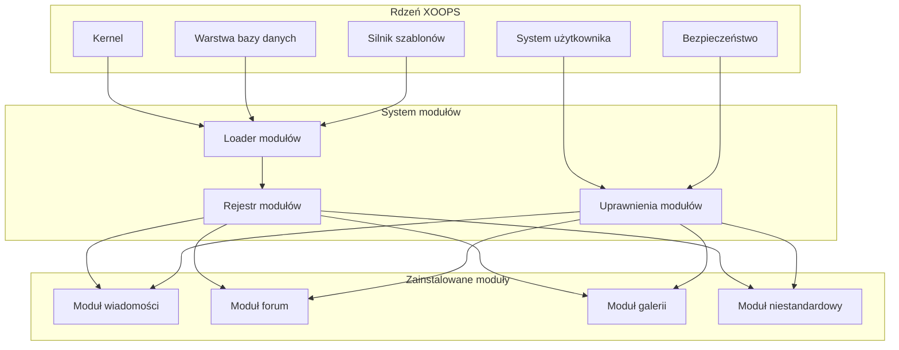
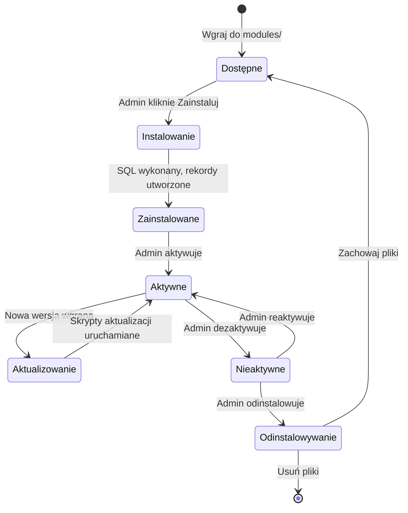

# ADR-001: Architektura modularna

> Rekord decyzji architektonicznej dla filozofii projektowania modularnego XOOPS.

---

## Status

**Accepted** - Fundamentalna decyzja od powstania XOOPS

---

## Kontekst

XOOPS (eXtensible Object-Oriented Portal System) potrzebował architektury, która by:

1. Pozwalała programistom trzecich stron na rozszerzanie funkcjonalności
2. Umożliwiała administratorom witryn dostosowanie bez kodowania
3. Wspierała niezależny rozwój i aktualizacje
4. Zapewniała izolację między różnymi funkcjami
5. Skalowała się od prostych blogów do złożonych portali

Krajobraz CMS z wczesnych 2000 roku oferował monolityczne systemy, które były trudne do dostosowania i rozszerzenia.

---

## Diagram decyzji



---

## Decyzja

Wdrożymy **architekturę modularną**, w której:

### 1. Rdzeń zapewnia infrastrukturę
- Abstrakcja bazy danych
- Uwierzytelnianie użytkowników i uprawnienia
- Renderowanie szablonów (Smarty)
- Narzędzia bezpieczeństwa
- Generowanie formularzy
- Wspólne narzędzia

### 2. Moduły są samodzielne
Każdy moduł:
- Ma swoją własną strukturę katalogów
- Zawiera własne klasy, szablony, SQL
- Definiuje własną konfigurację
- Może być instalowany/odinstalowywany niezależnie
- Ma śledzenie wersji

### 3. Standardowa struktura modułu
```
modules/modulename/
├── admin/                  # Interfejs administracyjny
│   ├── index.php
│   └── menu.php
├── class/                  # Klasy PHP
├── include/                # Pliki include
├── language/               # Tłumaczenia
├── sql/                    # Schema bazy danych
├── templates/              # Szablony Smarty
├── blocks/                 # Definicje bloków
├── xoops_version.php       # Manifest modułu
├── index.php               # Punkt wejścia
└── header.php              # Bootstrap modułu
```

### 4. Manifest modułu (xoops_version.php)
```php
<?php
$modversion['name']        = 'Nazwa modułu';
$modversion['version']     = '1.0.0';
$modversion['description'] = 'Opis modułu';
$modversion['dirname']     = basename(__DIR__);
$modversion['hasMain']     = 1;
$modversion['hasAdmin']    = 1;
$modversion['sqlfile']['mysql'] = 'sql/mysql.sql';
$modversion['tables']      = ['modulename_table1'];
$modversion['templates']   = [...];
$modversion['config']      = [...];
$modversion['blocks']      = [...];
```

### 5. Komunikacja modułu
- Za pośrednictwem interfejsów API rdzenia (handlery, zdarzenia)
- Relacje bazy danych
- Haki preload
- Usługi wspólne

---

## Cykl życia modułu



---

## Konsekwencje

### Pozytywne

1. **Rozszerzalność**: Tysiące modułów utworzonych przez społeczność
2. **Niezależność**: Moduły mogą być opracowywane oddzielnie
3. **Elastyczność**: Witryny mogą mieszać i dopasowywać funkcje
4. **Utrzymywalność**: Aktualizacje nie wpływają na inne moduły
5. **Marketplace**: Ekosystem modułów się pojawił
6. **Krzywa nauki**: Programiści uczą się jednego wzorca

### Negatywne

1. **Narzut**: Każdy moduł ma koszt bootstrap
2. **Duplikacja**: Wspólny kod może być powtarzany
3. **Integracja**: Funkcje między modułami wymagają starannego projektowania
4. **Wersjonowanie**: Potrzebne zarządzanie kompatybilnością modułu
5. **Zmienność jakości**: Jakość modułu trzeciej strony się różni

### Neutralne

1. **Baza danych**: Każdy moduł zarządza własnymi tabelami
2. **Szablony**: Motyw musi uwzględnić różne moduły
3. **Aktualizacje**: Rdzeń i moduły aktualizują się niezależnie

---

## Rozważane alternatywy

### 1. Architektura monolityczna
**Odrzucone** - Za sztywne, trudne do dostosowania

### 2. Architektura plug-in (w stylu WordPress)
**Częściowo przyjęte** - Bloki i preloads zapewniają hook-i podobne do wtyczek w obrębie modułów

### 3. Architektura komponentów (w stylu Joomla)
**Odrzucone** - Bardziej złożona, mniej przyjazna dla programistów

### 4. Mikrousługi
**Nie dotyczy** - Za złożone dla ery hostingu współdzielonego

---

## Powiązane decyzje

- ADR-002: Obiektowy dostęp do bazy danych
- ADR-003: Silnik szablonów Smarty
- ADR-005: System uprawnień

---

## Odwołania

- Historia projektu XOOPS
- Wzorce architektoniczne aplikacji PHP
- Badania porównawcze CMS (2001-2005)

---

#xoops #architektura #adr #moduły #decyzja-projektowa
