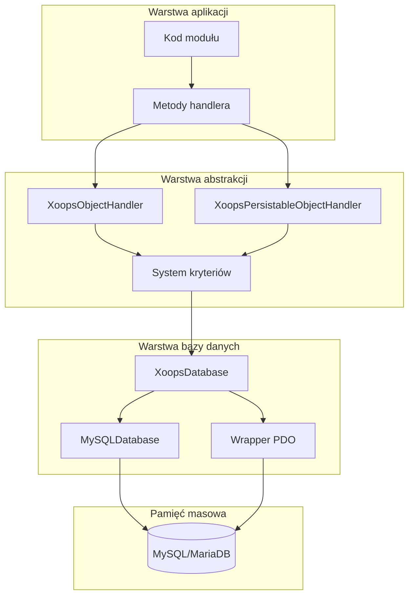
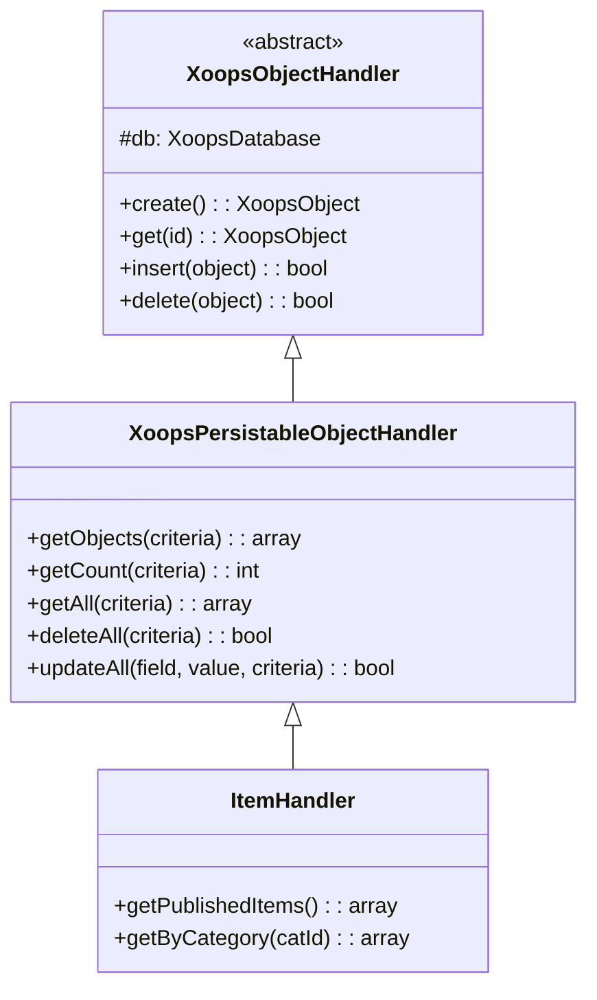
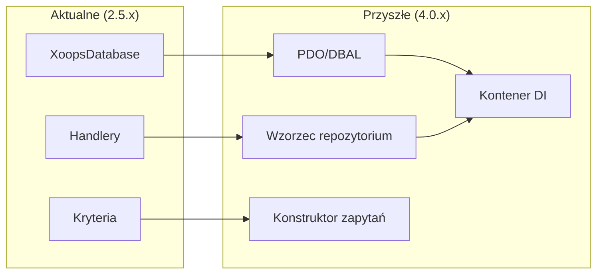

# ADR-002: Abstrakcja bazy danych

> Rekord decyzji architektonicznej dla wzorca dostępu do bazy danych zorientowanego obiektowo w XOOPS.

---

## Status

**Accepted** - Wzorzec rdzenia od XOOPS 2.0

---

## Kontekst

XOOPS potrzebował strategii interakcji z bazą danych, która by:

1. Abstrahowała składnię SQL specyficzną dla bazy danych
2. Zapewniała spójne operacje CRUD na wszystkich modułach
3. Umożliwiała automatyczne oczyszczanie i escaping danych
4. Wspierała przyszłe zmiany silnika bazy danych
5. Uproszczała typowe operacje dla programistów

Alternatywy były:
- Raw SQL w całej bazie kodu
- Pełny ORM (Doctrine, Eloquent)
- Niestandardowa lekka abstrakcja

---

## Diagram decyzji



---

## Decyzja

Wdrożymy **Wzorzec handlera** z:

### 1. XoopsObject - Kontener danych

Każda jednostka danych rozszerza XoopsObject:

```php
class Item extends XoopsObject
{
    public function __construct()
    {
        $this->initVar('id', XOBJ_DTYPE_INT, null, false);
        $this->initVar('title', XOBJ_DTYPE_TXTBOX, '', true, 255);
        $this->initVar('content', XOBJ_DTYPE_TXTAREA, '', false);
        $this->initVar('status', XOBJ_DTYPE_INT, 0, false);
    }
}
```

### 2. Handler - Menadżer operacji

Każdy obiekt ma odpowiadający handler:

```php
class ItemHandler extends XoopsPersistableObjectHandler
{
    public function __construct($db)
    {
        parent::__construct($db, 'mymodule_items', Item::class, 'id', 'title');
    }

    // Odziedziczone metody CRUD:
    // - create(), get(), insert(), delete()
    // - getObjects(), getCount(), getAll()
}
```

### 3. Criteria - Konstruktor zapytań

Warunki zapytań zorientowane obiektowo:

```php
$criteria = new CriteriaCompo();
$criteria->add(new Criteria('status', 1));
$criteria->add(new Criteria('created', time() - 86400, '>='));
$criteria->setSort('created');
$criteria->setOrder('DESC');
$criteria->setLimit(10);

$items = $handler->getObjects($criteria);
```

---

## Stałe typu danych

```php
// Typy zmiennych z automatycznym oczyszczaniem
XOBJ_DTYPE_INT       // Liczba całkowita
XOBJ_DTYPE_TXTBOX    // Tekst jednolinijkowy (escaped)
XOBJ_DTYPE_TXTAREA   // Tekst wielolinijkowy (escaped)
XOBJ_DTYPE_EMAIL     // Weryfikacja poczty elektronicznej
XOBJ_DTYPE_URL       // Weryfikacja URL
XOBJ_DTYPE_ARRAY     // Serializowana tablica
XOBJ_DTYPE_OTHER     // Bez przetwarzania
XOBJ_DTYPE_FLOAT     // Zmiennoprzecinkowy
```

---

## Dziedziczenie handlera



---

## Konsekwencje

### Pozytywne

1. **Konsystencja**: Wszystkie moduły używają tych samych wzorców
2. **Bezpieczeństwo**: Automatyczne escaping zapobiega wstrzyknięciom SQL
3. **Prostota**: Typowe operacje wymagają minimalnego kodu
4. **Utrzymywalność**: Zmiany w warstwie bazy danych nie wpływają na moduły
5. **Testowalność**: Handlery mogą być mockowane do testowania

### Negatywne

1. **Wydajność**: Dodatkowy narzut abstrakcji
2. **Złożoność**: Krzywa nauki dla nowych programistów
3. **Ograniczenia**: Złożone zapytania mogą wymagać raw SQL
4. **Problem N+1**: Brak wbudowanego eager loadingu

### Łagodzenie

- **Wydajność**: Buforuj często dostępne obiekty
- **Złożone zapytania**: Pozwalaj raw SQL gdy potrzeba
- **N+1**: Użyj getAll() z odpowiednimi kryteriami

---

## Ewolucja do XOOPS 4.0



Plany XOOPS 4.0:
- Doctrine DBAL dla abstrakcji bazy danych
- Wzorzec repozytorium zastępujący handlery
- Konstruktor zapytań dla złożonych zapytań
- Pełna integracja kontenera PSR-11

---

## Przykłady kodu

### Podstawowa operacja CRUD

```php
$helper = Helper::getInstance();
$handler = $helper->getHandler('Item');

// Utwórz
$item = $handler->create();
$item->setVar('title', 'Nowy element');
$handler->insert($item);

// Czytaj
$item = $handler->get($id);
$title = $item->getVar('title');

// Aktualizuj
$item->setVar('title', 'Zaktualizowany tytuł');
$handler->insert($item);

// Usuń
$handler->delete($item);
```

### Złożone zapytanie

```php
$criteria = new CriteriaCompo();
$criteria->add(new Criteria('status', 'published'));
$criteria->add(new Criteria('category_id', '(1,2,3)', 'IN'));
$criteria->add(new Criteria('created', strtotime('-30 days'), '>='));
$criteria->setSort('views');
$criteria->setOrder('DESC');
$criteria->setLimit(10);
$criteria->setStart(0);

$items = $handler->getObjects($criteria);
$total = $handler->getCount($criteria);
```

---

## Powiązane decyzje

- ADR-001: Architektura modularna
- ADR-003: Silnik szablonów Smarty

---

## Odwołania

- Martin Fowler - Patterns of Enterprise Application Architecture
- Koncepcje Domain-Driven Design
- Wzorce Active Record vs Data Mapper

---

#xoops #architektura #adr #baza-danych #handler #decyzja-projektowa
