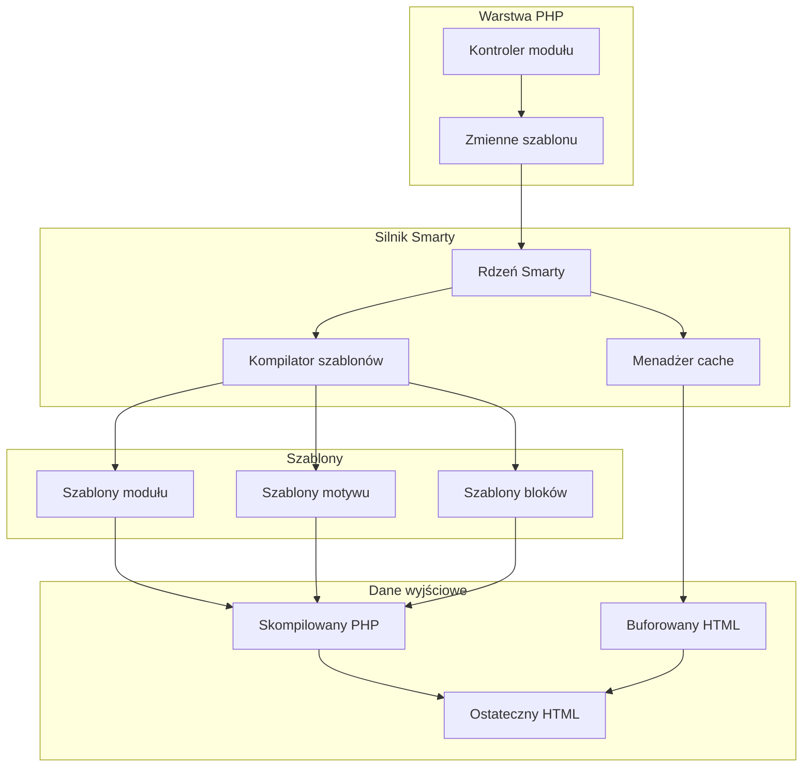
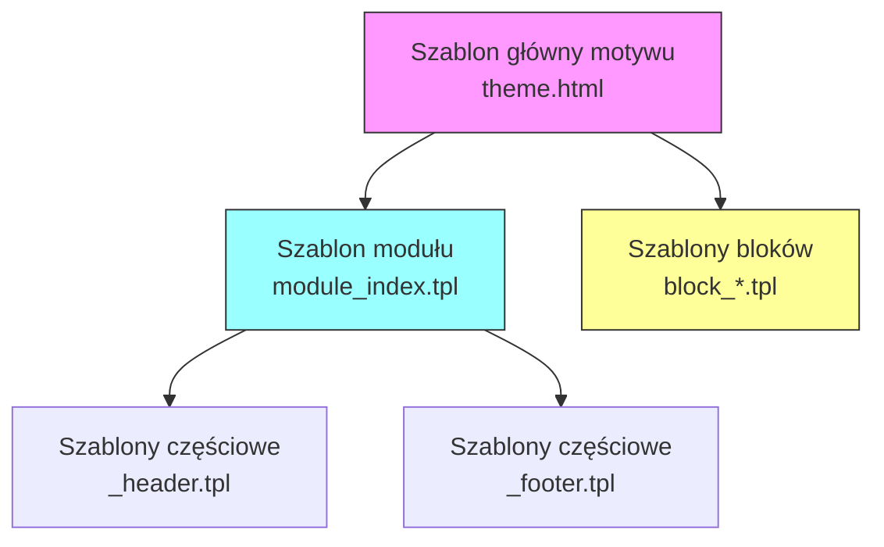
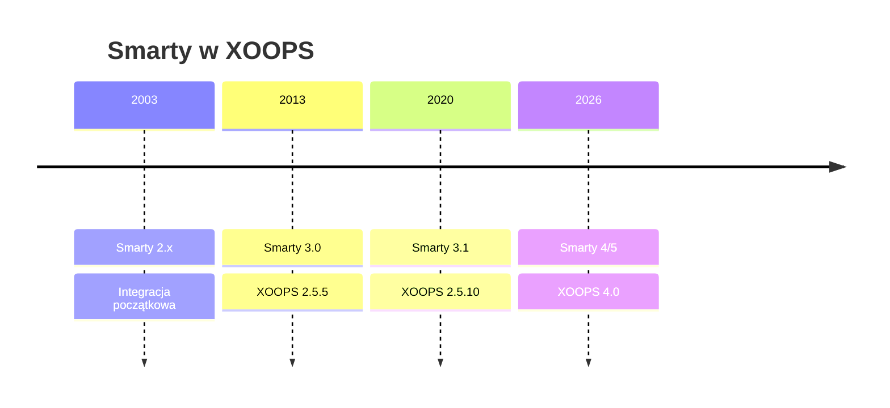

# ADR-003: Silnik szablonów (Smarty)

> Rekord decyzji architektonicznej dla przyjęcia silnika szablonów Smarty przez XOOPS.

---

## Status

**Accepted** - Kluczowa decyzja od XOOPS 2.0

**Ewoluująca** - Migracja do Smarty 4/5 zaplanowana na XOOPS 4.0

---

## Kontekst

XOOPS potrzebował rozwiązania do tworzenia szablonów, które by:

1. Oddzielało prezentację od logiki biznesowej
2. Umożliwiało projektantom tematów pracę bez wiedzy PHP
3. Wspierało dziedziczenie szablonów i includes
4. Zapewniało buforowanie dla wydajności
5. Umożliwiało dostosowywanie szablonów przez użytkowników
6. Wspierało internacjonalizację

---

## Diagram decyzji



---

## Decyzja

Będziemy używać **Smarty** jako silnika szablonów, ponieważ:

### 1. Separacja zagadnień

```php
// PHP (Kontroler) - Logika biznesowa
$items = $itemHandler->getPublishedItems();
$xoopsTpl->assign('items', $items);

// Smarty (Widok) - Prezentacja
// templates/items.tpl
```

```smarty
{* Szablon Smarty - Bez logiki PHP *}
<{foreach item=item from=$items}>
    <article>
        <h2><{$item.title}></h2>
        <p><{$item.summary}></p>
    </article>
<{/foreach}>
```

### 2. Ograniczniki XOOPS

XOOPS używa `<{` i `}>` zamiast standardowych `{` `}`:

```smarty
{* Standardowa Smarty *}
{$variable}

{* XOOPS Smarty - Unika konfliktów JavaScript *}
<{$variable}>
```

### 3. Hierarchia szablonów



### 4. Przechowywanie szablonów

- **Baza danych**: Dostosowane szablony przechowywane dla możliwości przywrócenia
- **System plików**: Oryginalne szablony w katalogach modułów
- **Cache**: Skompilowane szablony dla wydajności

---

## Konfiguracja Smarty

```php
// Inicjalizacja Smarty XOOPS
$xoopsTpl = new XoopsTpl();

// Niestandardowe ograniczniki
$xoopsTpl->left_delim = '<{';
$xoopsTpl->right_delim = '}>';

// Buforowanie
$xoopsTpl->caching = XOOPS_TEMPLATE_CACHE;
$xoopsTpl->cache_lifetime = 3600;

// Bezpieczeństwo
$xoopsTpl->security_policy = new Smarty_Security($xoopsTpl);
$xoopsTpl->security_policy->php_functions = [];
$xoopsTpl->security_policy->php_modifiers = ['escape', 'count'];
```

---

## Używane funkcje szablonów

### Zmienne

```smarty
{* Prosta zmienna *}
<{$title}>

{* Właściwość obiektu *}
<{$item.title}>

{* Z modyfikatorem *}
<{$content|truncate:200:'...'}>

{* Dane wyjściowe escaped *}
<{$userInput|escape:'html'}>
```

### Struktury kontrolne

```smarty
{* Warunkowe *}
<{if $isAdmin}>
    <a href="admin.php">Admin</a>
<{elseif $isUser}>
    <a href="profile.php">Profil</a>
<{else}>
    <a href="login.php">Zaloguj</a>
<{/if}>

{* Pętla *}
<{foreach item=item from=$items name=itemloop}>
    <{$smarty.foreach.itemloop.index}>: <{$item.title}>
<{/foreach}>
```

### Includes

```smarty
{* Dołącz inny szablon *}
<{include file="db:mymodule_header.tpl"}>

{* Dołącz ze zmiennymi *}
<{include file="db:mymodule_item.tpl" item=$currentItem}>

{* Dołącz z motywu *}
<{include file="file:$theme_path/partials/sidebar.tpl"}>
```

---

## Konsekwencje

### Pozytywne

1. **Przyjazny dla projektantów**: Składnia podobna do HTML
2. **Buforowanie**: Wbudowane buforowanie szablonów
3. **Bezpieczeństwo**: Izolacja kodu PHP
4. **Elastyczność**: Modyfikatory, funkcje, wtyczki
5. **Dostosowywanie**: Użytkownicy mogą modyfikować szablony
6. **Społeczność**: Duża ekosfera Smarty

### Negatywne

1. **Krzywa nauki**: Składnia specyficzna dla Smarty
2. **Narzut**: Wymagany etap kompilacji
3. **Debugowanie**: Błędy szablonów mogą być niejasne
4. **Problemy wersji**: Zmiany przełomowe między wersjami

### Łagodzenie

- **Nauka**: Kompleksowa dokumentacja
- **Wydajność**: Agresywne buforowanie
- **Debugowanie**: Konsola debugowania, jasne komunikaty o błędach
- **Wersje**: Warstwa kompatybilności w XOOPS

---

## Historia wersji



---

## Migracja: Smarty 3 do 4/5

### Zmiany przełomowe

```smarty
{* Smarty 3 - Przestarzałe *}
<{php}>echo date('Y');<{/php}>

{* Smarty 4+ - Użyj modyfikatorów lub przypisz z PHP *}
<{$current_year}>

{* Smarty 3 - {section} przestarzałe *}
<{section name=i loop=$items}>
    <{$items[i].title}>
<{/section}>

{* Smarty 4+ - Użyj {foreach} *}
<{foreach $items as $item}>
    <{$item.title}>
<{/foreach}>
```

### Warstwa kompatybilności

XOOPS zapewnia warstwę kompatybilności dla płynnych przejść:

```php
// XoopsTpl rozszerza Smarty z metodami kompatybilności
class XoopsTpl extends Smarty
{
    public function assign($tpl_var, $value = null)
    {
        // Obsługuje zarówno składnię Smarty 3 i 4
        return parent::assign($tpl_var, $value);
    }
}
```

---

## Rozważane alternatywy

### 1. Twig
**Zalety**: Nowoczesna, ekosfera Symfony
**Wady**: Inna składnia, wysiłek migracji
**Decyzja**: Możliwa przyszła opcja dla XOOPS 3.x

### 2. Blade (Laravel)
**Zalety**: Czysty składni, popularne
**Wady**: Specyficzne dla Laravel
**Decyzja**: Nie nadaje się do samodzielnego użytku

### 3. Natywne szablony PHP
**Zalety**: Brak krzywej nauki, szybkie
**Wady**: Zagrożenia bezpieczeństwa, brak separacji
**Decyzja**: Odrzucone dla utrzymywalności

---

## Powiązane decyzje

- ADR-001: Architektura modularna
- ADR-002: Abstrakcja bazy danych

---

## Odwołania

- Dokumentacja Smarty: https://www.smarty.net/docs/en/
- Przewodnik systemu szablonów XOOPS
- Wzorzec MVC w aplikacjach internetowych

---

#xoops #architektura #adr #smarty #szablony #decyzja-projektowa
