# ADR-004: Architektura systemu bezpieczeństwa

> Kompleksowa architektura bezpieczeństwa dla XOOPS CMS chroniącej przed nowoczesnymi zagrożeniami.

---

## Status

**Accepted** - Warstwa bezpieczeństwa rdzenia od XOOPS 2.5

---

## Kontekst

### Oświadczenie problemu

XOOPS potrzebuje solidnego systemu bezpieczeństwa, który:

1. **Chroni przed typowymi lukami w zabezpieczeniach internetowych** (OWASP Top 10)
2. **Zapewnia dokładną kontrolę uprawnień** na wszystkich modułach
3. **Umożliwia bezpieczne uwierzytelnianie użytkowników** z nowoczesnymi standardami
4. **Zapobiega naruszeniom danych** i nieautoryzowanemu dostępowi
5. **Obsługuje wielopoziomową kontrolę dostępu** (admin, moderator, użytkownik, gość)
6. **Integruje się ze wszystkimi modułami** bezproblemowo

### Bieżące zagrożenia

Nowoczesne ataki internetowe obejmują:

- **Wstrzyknięcie SQL** - Złośliwy SQL w danych wejściowych użytkownika
- **XSS (Cross-Site Scripting)** - Wstrzyknięty JavaScript na stronach
- **CSRF (Cross-Site Request Forgery)** - Nieautoryzowane przesyłanie formularzy
- **Obejście uwierzytelniania** - Słabe obsługiwanie sesji/hasła
- **Obejście autoryzacji** - Eskalacja uprawnień
- **Ujawnienie danych** - Poufne dane w adresach URL, dziennikach lub cache

### Wymagania bezpieczeństwa XOOPS

1. Uwierzytelnianie użytkownika i zarządzanie sesją
2. Kontrola dostępu oparta na rolach (RBAC)
3. System uprawnień dla modułów i obiektów
4. Walidacja danych wejściowych i escaping danych wyjściowych
5. Ochrona przed typowymi atakami
6. Rejestrowanie zdarzeń bezpieczeństwa
7. Bezpieczne obsługiwanie haseł
8. Ochrona tokenu CSRF

---

## Decyzja

### Architektura bezpieczeństwa rdzenia

```mermaid
graph TB
    subgraph "Warstwa uwierzytelniania"
        A["Uwierzytelnianie użytkownika<br/>(Logowanie/Sesje)"]
        B["Zarządzanie sesją<br/>(Tokeny/Ciasteczka)"]
        C["Bezpieczeństwo hasła<br/>(Hashing/Sól)"]
    end

    subgraph "Warstwa autoryzacji"
        D["Zarządzanie rolami<br/>(Admin/Użytkownik/Gość)"]
        E["System uprawnień<br/>(Poziom modułu)"]
        F["Uprawnienia obiektu<br/>(Poziom elementu)"]
    end

    subgraph "Warstwa ochrony"
        G["Walidacja wejścia<br/>(Typ/Format)"]
        H["Escaping wyjścia<br/>(HTML/JavaScript)"]
        I["Ochrona CSRF<br/>(Weryfikacja tokenu)"]
    end

    subgraph "Warstwa monitorowania"
        J["Rejestrowanie audytu<br/>(Zdarzenia bezpieczeństwa)"]
        K["Ograniczenie szybkości<br/>(Brute Force)"]
        L["Detekcja włamań<br/>(Podejrzana aktywność)"]
    end

    A --> B
    A --> C
    D --> E
    E --> F
    G --> I
    H --> I
    J --> K
    K --> L
```



---

## Komponenty bezpieczeństwa

### 1. System uwierzytelniania

**Proces logowania użytkownika:**

```php
<?php
// 1. Waliduj poświadczenia
$user = $userHandler->findByLogin($username);
if (!$user || !password_verify($password, $user->getVar('pass'))) {
    throw new AuthenticationException('Nieprawidłowe poświadczenia');
}

// 2. Sprawdź czy konto jest aktywne
if (!$user->getVar('uactive')) {
    throw new AuthenticationException('Konto nieaktywne');
}

// 3. Utwórz bezpieczną sesję
session_regenerate_id(true);
$_SESSION['uid'] = $user->getVar('uid');
$_SESSION['token'] = bin2hex(random_bytes(32));
$_SESSION['created'] = time();

// 4. Zaloguj logowanie
$this->auditLog('USER_LOGIN', $user->getVar('uid'));
```

**Bezpieczeństwo hasła:**

```php
<?php
// Użyj password_hash (nie MD5 ani SHA1)
$hashed = password_hash($password, PASSWORD_BCRYPT, [
    'cost' => 12, // Wysoki koszt = powolny brute force
]);

// Weryfikuj hasło
if (!password_verify($inputPassword, $hashed)) {
    throw new Exception('Nieprawidłowe hasło');
}

// Ponownie zahashuj jeśli algorytm lub koszt się zmienił
if (password_needs_rehash($hashed, PASSWORD_BCRYPT, ['cost' => 12])) {
    $newHash = password_hash($password, PASSWORD_BCRYPT, ['cost' => 12]);
    $user->setVar('pass', $newHash);
    $userHandler->insert($user);
}
```

### 2. Zarządzanie sesją

**Bezpieczne obsługiwanie sesji:**

```php
<?php
// Konfiguracja sesji
ini_set('session.cookie_httponly', true);  // Brak dostępu JS
ini_set('session.cookie_secure', true);     // Tylko HTTPS
ini_set('session.cookie_samesite', 'Strict'); // Ochrona CSRF
ini_set('session.gc_maxlifetime', 3600);   // 1 godzina timeout
ini_set('session.sid_length', 64);         // 64-znakowy ID sesji

// Waliduj sesję
function validateSession() {
    // Sprawdź timeout
    if (time() - $_SESSION['created'] > 3600) {
        session_destroy();
        throw new SessionExpiredException();
    }

    // Waliduj user agent (zapobiegaj przejęciu sesji)
    if ($_SESSION['user_agent'] !== $_SERVER['HTTP_USER_AGENT']) {
        throw new SessionInvalidException();
    }

    // Waliduj IP (opcjonalne, może być zbyt surowe)
    if (!in_array($_SERVER['REMOTE_ADDR'], $_SESSION['ips'])) {
        $_SESSION['ips'][] = $_SERVER['REMOTE_ADDR'];
    }
}
```

### 3. Autoryzacja (RBAC)

**Kontrola dostępu oparta na rolach:**

```php
<?php
class XoopsUser {
    public function hasPermission(string $permissionName): bool
    {
        // Pobierz grupy użytkowników
        $groups = $this->getGroups();

        // Sprawdź czy jakakolwiek grupa ma uprawnienie
        foreach ($groups as $groupId) {
            if ($this->checkGroupPermission($groupId, $permissionName)) {
                return true;
            }
        }

        return false;
    }

    /**
     * Grupy użytkowników i ich uprawnienia
     * Admin: Pełny dostęp
     * Moderator: Zarządzanie treścią
     * User: Utwórz własną treść
     * Guest: Dostęp tylko do odczytu
     */
    private function checkGroupPermission(int $groupId, string $permission): bool
    {
        $permissions = [
            1 => ['admin_access'],                 // Grupa Admin
            2 => ['moderate_content', 'edit_own'], // Grupa Moderator
            3 => ['create_content', 'edit_own'],   // Grupa User
            4 => [],                               // Grupa Guest (brak uprawnień)
        ];

        return in_array($permission, $permissions[$groupId] ?? []);
    }
}
```

### 4. Walidacja wejścia

**Zapobiegaj wstrzyknięciom SQL i błędom typów:**

```php
<?php
// Zawsze używaj prepared statements
$sql = 'SELECT * FROM users WHERE id = ?';
$result = $db->query($sql, [$userId]); // ✅ Bezpieczne

// Walidacja wejścia
function validateUserInput(array $data): array
{
    return [
        'email' => filter_var($data['email'] ?? '', FILTER_VALIDATE_EMAIL),
        'age' => filter_var($data['age'] ?? 0, FILTER_VALIDATE_INT),
        'website' => filter_var($data['website'] ?? '', FILTER_VALIDATE_URL),
        'title' => substr(trim($data['title'] ?? ''), 0, 255),
    ];
}

// Klasa bezpiecznego wejścia XOOPS
$safe = \Xmf\Request::getHtmlRequest('var_name', '');
$int = \Xmf\Request::getInt('page', 1);
```

### 5. Escaping danych wyjściowych

**Zapobiegaj atakom XSS:**

```php
<?php
// W szablonach PHP
echo htmlspecialchars($userInput, ENT_QUOTES, 'UTF-8');

// W szablonach Smarty (automatyczne escaping)
<{$user_input}>  {* Escaped domyślnie *}
<{$html|escape:false}>  {* Tylko gdy potrzeba *}

// Kontekst JavaScript
<script>
var message = "<{$userMessage|escape:'javascript'}>";
</script>

// Kontekst URL
<a href="<{$url|escape:'url'}>">Link</a>
```

### 6. Ochrona CSRF

**Zapobieganie Cross-Site Request Forgery:**

```php
<?php
// Generuj token CSRF
session_start();
if (empty($_SESSION['csrf_token'])) {
    $_SESSION['csrf_token'] = bin2hex(random_bytes(32));
}

// W formularzach
<form method="POST">
    <input type="hidden" name="csrf_token" value="<{$csrf_token}>">
    <button type="submit">Prześlij</button>
</form>

// Waliduj token
if ($_SERVER['REQUEST_METHOD'] === 'POST') {
    if (hash_equals($_SESSION['csrf_token'], $_POST['csrf_token'] ?? '')) {
        // Przetwórz formularz
    } else {
        throw new InvalidTokenException('Token CSRF nieprawidłowy');
    }
}
```

---

## Konsekwencje

### Pozytywne efekty

1. **Kompleksowa ochrona** - Obejmuje główne klasy luk w zabezpieczeniach
2. **Bezpieczeństwo warstwowe** - Wiele warstw obrony
3. **Elastyczny RBAC** - Dokładna kontrola uprawnień
4. **Ścieżka audytu** - Śledź zdarzenia bezpieczeństwa
5. **Standard branżowy** - Wyrównane z rekomendacjami OWASP
6. **Integracja modułów** - Łatwe dla modułów korzystania z interfejsów API bezpieczeństwa

### Negatywne efekty

1. **Złożoność** - Potrzeba więcej kodu i konfiguracji
2. **Wydajność** - Hashing i walidacja dodają narzut
3. **Doświadczenie użytkownika** - Bezpieczeństwo czasami nieporęczne
4. **Konserwacja** - Wymaga bieżących aktualizacji bezpieczeństwa
5. **Wymagane szkolenie** - Programiści muszą postępować zgodnie z praktykami

### Zagrożenia i łagodzenie

| Zagrożenie | Ważność | Łagodzenie |
|------|----------|-----------|
| Programista ignoruje bezpieczeństwo | Wysokie | Przegląd kodu, szkolenie bezpieczeństwa |
| Odkryto nowe luki | Średnie | Regularne audyty bezpieczeństwa, aktualizacje |
| Wpływ na wydajność | Niskie | Optymalizuj gorące ścieżki, buforowanie |
| Zbyt złożone uprawnienia | Średnie | Jasna dokumentacja, przykłady |

---

## Najlepsze praktyki bezpieczeństwa

### Dla programistów modułów

```php
<?php
// ✅ RÓB: Użyj prepared statements
$result = $db->prepare('SELECT * FROM table WHERE id = ?')->execute([$id]);

// ❌ NIE RÓB: Łącz zapytania
$result = $db->query("SELECT * FROM table WHERE id = $id");

// ✅ RÓB: Escape wyjście
echo htmlspecialchars($user_input, ENT_QUOTES, 'UTF-8');

// ❌ NIE RÓB: Wypisuj surowe dane użytkownika
echo $user_input;

// ✅ RÓB: Sprawdzaj uprawnienia
if (!$user->hasPermission('edit_content')) {
    throw new PermissionException();
}

// ❌ NIE RÓB: Ufaj rolom użytkownika bezpośrednio
if ($_POST['is_admin']) {
    // Uczyń użytkownika adminem - LUKA BEZPIECZEŃSTWA!
}

// ✅ RÓB: Waliduj typy wejścia
$page = (int)$_GET['page'];

// ❌ NIE RÓB: Używaj niezaufanych wartości bezpośrednio
$sql .= " LIMIT " . $_GET['limit'];
```

---

## Rozważane alternatywy

### OAuth/OpenID Connect

**Dlaczego nie wybrano początkowo:** Za złożone dla środowiska hostingu współdzielonego, ale dobre dla przyszłej integracji z zewnętrznymi systemami auth.

### Uwierzytelnianie dwuskładnikowe (2FA)

**Status:** Akceptowana jako rozszerzenie, nie jako wymóg rdzenia, patrz ADR-006

### Ciasteczka sesji tylko HTTP

**Status:** Wdrożone - uniemożliwia dostęp JavaScript do danych sesji

---

## Powiązane decyzje

- ADR-001: Architektura modularna - Moduły implementują bezpieczeństwo
- ADR-005: System uprawnień modułu
- ADR-006: Uwierzytelnianie dwuskładnikowe (przyszłość)

---

## Odwołania

### Standardy bezpieczeństwa

- [OWASP Top 10](https://owasp.org/www-project-top-ten/)
- [NIST Cybersecurity Framework](https://www.nist.gov/cyberframework)
- [CWE Top 25](https://cwe.mitre.org/top25/)

### Bezpieczeństwo PHP

- [PHP Security Manual](https://www.php.net/manual/en/security.php)
- [password_hash() Documentation](https://www.php.net/manual/en/function.password-hash.php)
- [Session Security](https://www.php.net/manual/en/session.security.php)

### Narzędzia

- [OWASP ZAP](https://www.zaproxy.org/) - Testowanie bezpieczeństwa
- [Snyk](https://snyk.io/) - Skanowanie luk
- [SonarQube](https://www.sonarqube.org/) - Jakość kodu

---

## Lista kontrolna wdrażania

- [ ] System uwierzytelniania użytkownika
- [ ] Zarządzanie sesją
- [ ] Hashing hasła (bcrypt)
- [ ] Kontrola dostępu oparta na rolach
- [ ] Uprawnienia modułu
- [ ] Framework walidacji wejścia
- [ ] Escaping wyjścia (PHP + Smarty)
- [ ] Ochrona tokenu CSRF
- [ ] Rejestrowanie audytu bezpieczeństwa
- [ ] Ograniczenie szybkości
- [ ] Nagłówki bezpieczeństwa

---

## Historia wersji

| Wersja | Data | Zmiany |
|---------|------|---------|
| 1.0.0 | 2024-01-28 | Dokument początkowy |

---

#xoops #adr #bezpieczeństwo #architektura #uwierzytelnianie #autoryzacja #rbac
