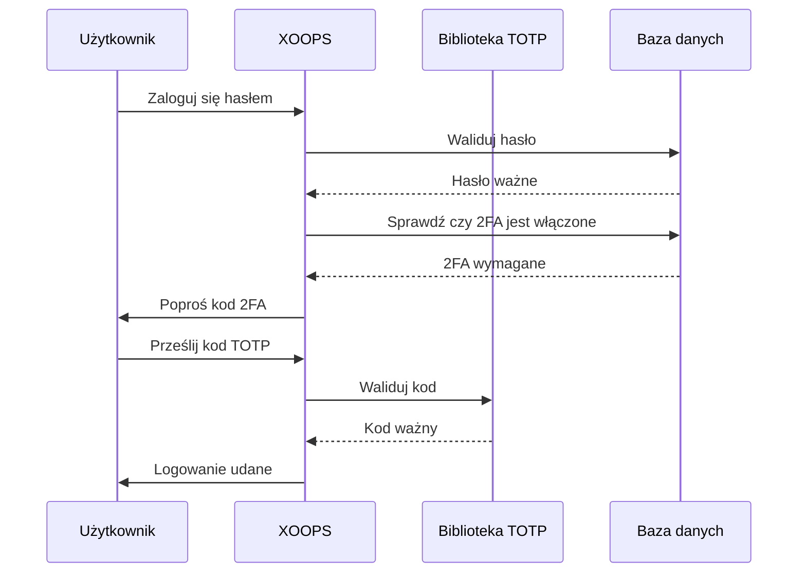

## Status

Proposed

## Kontekst

XOOPS potrzebuje zwiększonego bezpieczeństwa dla uwierzytelniania użytkownika. Uwierzytelnianie dwuskładnikowe (2FA) zapewnia dodatkową warstwę bezpieczeństwa poza hasłami, chroniąc konta nawet jeśli hasła są skompromitowane.

Kluczowe rozważania:
- Wsteczna kompatybilność z istniejącym uwierzytelnianiem
- Obsługa wielu metod 2FA
- Doświadczenie użytkownika podczas konfiguracji i logowania
- Mechanizmy odzyskiwania w przypadku utraty urządzeń
- Integracja z istniejącym systemem uprawnień

## Decyzja

Będziemy wdrażać TOTP (Time-based One-Time Password) jako podstawową metodę 2FA z obsługą kodów zapasowych.

### Podejście wdrażania



### Database Schema

```sql
CREATE TABLE `{PREFIX}_users_2fa` (
    `user_id` INT(11) NOT NULL,
    `secret` VARCHAR(32) NOT NULL,
    `enabled` TINYINT(1) DEFAULT 0,
    `backup_codes` TEXT,
    `last_used` INT(11),
    `created` INT(11) NOT NULL,
    PRIMARY KEY (`user_id`),
    FOREIGN KEY (`user_id`) REFERENCES `{PREFIX}_users`(`uid`)
);
```

### Service Interface

```php
interface TwoFactorAuthInterface
{
    public function enable(int $userId): TwoFactorSetup;
    public function disable(int $userId): void;
    public function verify(int $userId, string $code): bool;
    public function generateBackupCodes(int $userId): array;
    public function isEnabled(int $userId): bool;
}
```

### Middleware Integration

```php
class TwoFactorMiddleware implements MiddlewareInterface
{
    public function process(
        ServerRequestInterface $request,
        RequestHandlerInterface $handler
    ): ResponseInterface {
        $session = $request->getAttribute('session');

        if ($session->has('pending_2fa_user_id')) {
            // User needs to complete 2FA
            if ($this->isVerificationRequest($request)) {
                return $handler->handle($request);
            }
            return new RedirectResponse('/2fa/verify');
        }

        return $handler->handle($request);
    }
}
```

## Konsekwencje

### Pozytywne

- Znacznie lepsze bezpieczeństwo konta
- Kompatybilność TOTP zgodna ze standardem branżowym (Google Authenticator, Authy itp.)
- Kody zapasowe zapobiegają blokowaniu konta
- Opcjonalnie na użytkownika - nie wymusza przyjęcia
- Middleware PSR-15 pozwala na czystą integrację

### Negatywne

- Dodatkowy krok logowania wpływa na doświadczenie użytkownika
- Użytkownicy muszą zarządzać aplikacjami uwierzytelniającymi
- Utracone urządzenia wymagają procesu odzyskiwania
- Dodatkowa pamięć bazy danych i zapytania
- Wymaga zależności biblioteki kryptograficznej

### Ścieżka migracji

1. Dodaj tabelę bazy danych dla danych 2FA
2. Wdrożyć usługę TOTP z zależnością biblioteki
3. Dodaj middleware do łańcucha uwierzytelniania
4. Utwórz interfejs konfiguracji i weryfikacji
5. Opcja administracyjna wymagająca 2FA dla określonych grup

## Rozważane alternatywy

### OTP oparte na SMS

Odrzucone ze względu na:
- Podatności na wymianę SIM
- Koszt bramy SMS
- Złożoność weryfikacji numeru telefonu
- Obawy dotyczące prywatności

### Klucze zabezpieczeń sprzętowego (WebAuthn)

Odłożone na przyszły ADR:
- Bardziej złożone wdrażanie
- Historycznie ograniczona obsługa przeglądarki
- Wyższy koszt dla użytkownika
- Mogą być dodane wraz z TOTP później

### OTP oparte na poczcie elektronicznej

Odrzucone ze względu na:
- Kompromis konta e-mail pokonuje cel
- Opóźnienia w dostarczaniu wpływają na UX
- Problemy z filtrem antyspamowym

## Odwołania

- [RFC 6238 - TOTP](https://tools.ietf.org/html/rfc6238)
- [Format klucza Google Authenticator](https://github.com/google/google-authenticator/wiki/Key-Uri-Format)
- ../../02-Core-Concepts/Security/Security-Best-Practices - Wytyczne bezpieczeństwa
- ../../02-Core-Concepts/Users-Permissions/Authentication - Dokumentacja systemu auth
