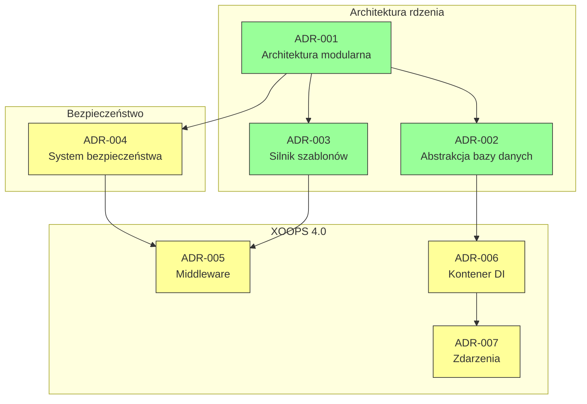
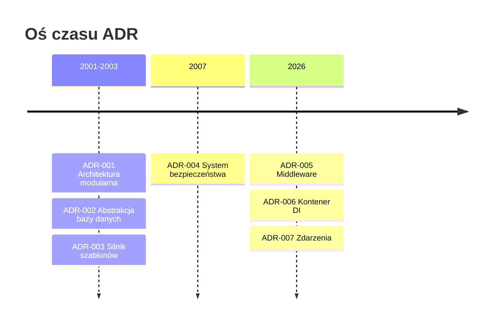

# 📋 Indeks rekordów decyzji architektonicznych

> Kompleksowy indeks decyzji architektonicznych, które ukształtowały XOOPS CMS.

---

## Czym są ADR?

Rekordy decyzji architektonicznych (ADR) dokumentują znaczące decyzje architektoniczne podjęte podczas tworzenia XOOPS. Przechwytują kontekst, decyzję i konsekwencje każdego wyboru, zapewniając cenny kontekst historyczny dla opiekunów i współtwórców.

---

## Legenda statusu ADR

| Status | Znaczenie |
|--------|---------|
| **Proposed** | W dyskusji, nie jest jeszcze zaakceptowana |
| **Accepted** | Decyzja została przyjęta |
| **Deprecated** | Nie jest już rekomendowana |
| **Superseded** | Zastąpiona przez inny ADR |

---

## Aktualne ADR

### Decyzje fundamentalne

| ADR | Tytuł | Status | Wpływ |
|-----|-------|--------|--------|
| ADR-001 | Architektura modularna | Accepted | Rdzeń |
| ADR-002 | Obiektowy dostęp do bazy danych | Accepted | Rdzeń |
| ADR-003 | Silnik szablonów Smarty | Accepted | Rdzeń |

### Planowane ADR (XOOPS 4.0)

| ADR | Tytuł | Status | Wpływ |
|-----|-------|--------|--------|
| ADR-004 | Projekt systemu bezpieczeństwa | Proposed | Bezpieczeństwo |
| ADR-005 | PSR-15 Middleware | Proposed | Architektura |
| ADR-006 | Kontener wstrzykiwania zależności | Proposed | Architektura |
| ADR-007 | Przeprojektowanie systemu zdarzeń | Proposed | Architektura |

---

## Relacje ADR



---

## Oś czasu



---

## Tworzenie nowych ADR

Podczas proponowania nowej decyzji architektonicznej:

1. Skopiuj szablon ADR
2. Wypełnij wszystkie sekcje
3. Prześlij jako pull request
4. Omów w GitHub Issues
5. Zaktualizuj status po podjęciu decyzji

### Struktura szablonu ADR

```markdown
# ADR-XXX: Tytuł

## Status
Proposed | Accepted | Deprecated | Superseded

## Context
What is the issue motivating this decision?

## Decision
What is the change that we're proposing?

## Consequences
What becomes easier or harder as a result?

## Alternatives Considered
What other options were evaluated?
```

---

## 🔗 Dokumentacja pokrewna

- Koncepcje rdzenia
- Wytyczne dotyczące wkładu
- Mapa drogi XOOPS 4.0

---

#xoops #adr #architektura #indeks #decyzje
