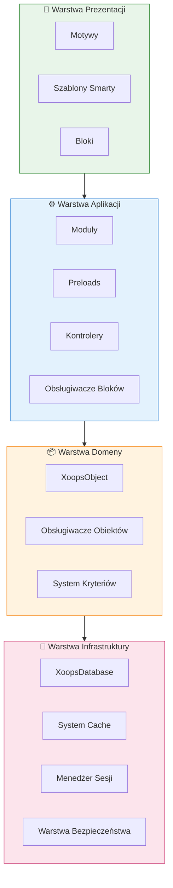
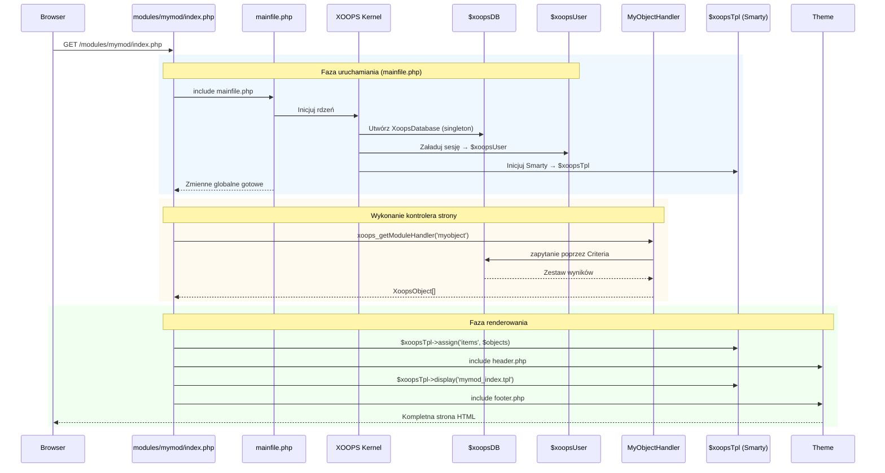

:::note[O tym dokumencie]
Ta strona opisuje **koncepcyjną architekturę** XOOPS, która ma zastosowanie zarówno do obecnych (2.5.x), jak i przyszłych (4.0.x) wersji. Niektóre diagramy pokazują wizję warstwowego projektu.

**Dla szczegółów dotyczących wersji:**
- **XOOPS 2.5.x Dziś:** Używa `mainfile.php`, zmiennych globalnych (`$xoopsDB`, `$xoopsUser`), wstępnego ładowania i wzorca obsługi
- **XOOPS 4.0 Cel:** Middleware PSR-15, kontener DI, router - zobacz [Plan развoju](../../07-XOOPS-4.0/XOOPS-4.0-Roadmap.md)
:::

Ten dokument zawiera kompleksowy przegląd architektury systemu XOOPS, wyjaśniając, jak poszczególne komponenty współpracują ze sobą, aby stworzyć elastyczny i rozszerzalny system zarządzania zawartością.

## Przegląd

XOOPS stosuje modularną architekturę, która dzieli problemy na odrębne warstwy. System zbudowany jest wokół kilku rdzeniowych zasad:

- **Modularność**: Funkcjonalność organizowana jest w niezależne, instalowalne moduły
- **Rozszerzalność**: System może być rozszerzany bez modyfikacji kodu rdzeniowego
- **Abstrakcja**: Warstwy bazy danych i prezentacji są abstrakcyjne od logiki biznesowej
- **Bezpieczeństwo**: Wbudowane mechanizmy bezpieczeństwa chronią przed powszechnymi lukami

## Warstwy systemu



### 1. Warstwa Prezentacji

Warstwa prezentacji obsługuje renderowanie interfejsu użytkownika przy użyciu silnika szablonów Smarty.

**Kluczowe komponenty:**
- **Motywy**: Stylizacja wizualna i układ
- **Szablony Smarty**: Dynamiczne renderowanie zawartości
- **Bloki**: Wielokrotnego użytku widżety zawartości

### 2. Warstwa Aplikacji

Warstwa aplikacji zawiera logikę biznesową, kontrolery i funkcjonalność modułu.

**Kluczowe komponenty:**
- **Moduły**: Samodzielne pakiety funkcjonalności
- **Obsługiwacze**: Klasy manipulacji danymi
- **Preloads**: Nasłuchiwacze zdarzeń i haki

### 3. Warstwa Domeny

Warstwa domeny zawiera rdzeniowe obiekty biznesowe i reguły.

**Kluczowe komponenty:**
- **XoopsObject**: Klasa bazowa dla wszystkich obiektów domeny
- **Obsługiwacze**: Operacje CRUD dla obiektów domeny

### 4. Warstwa Infrastruktury

Warstwa infrastruktury zapewnia usługi rdzeniowe, takie jak dostęp do bazy danych i cachowanie.

## Cykl życia żądania

Zrozumienie cyklu życia żądania jest kluczowe dla efektywnego tworzenia aplikacji XOOPS.

### Przepływ kontrolera strony XOOPS 2.5.x

Obecny XOOPS 2.5.x używa wzorca **Page Controller**, gdzie każdy plik PHP obsługuje własne żądanie. Zmienne globalne (`$xoopsDB`, `$xoopsUser`, `$xoopsTpl`, itp.) są inicjowane podczas uruchamiania i dostępne przez cały czas wykonywania.



### Kluczowe zmienne globalne w 2.5.x

| Zmienna globalna | Typ | Inicjalizowana | Cel |
|--------|------|-------------|---------|
| `$xoopsDB` | `XoopsDatabase` | Uruchamianie | Połączenie bazy danych (singleton) |
| `$xoopsUser` | `XoopsUser\|null` | Ładowanie sesji | Aktualnie zalogowany użytkownik |
| `$xoopsTpl` | `XoopsTpl` | Inicjalizacja szablonu | Silnik szablonów Smarty |
| `$xoopsModule` | `XoopsModule` | Ładowanie modułu | Bieżący kontekst modułu |
| `$xoopsConfig` | `array` | Ładowanie konfiguracji | Konfiguracja systemu |

:::note[Porównanie XOOPS 4.0]
W XOOPS 4.0 wzorzec Page Controller zostaje zastąpiony przez **Potok middleware PSR-15** i dyspozycję opartą na routerze. Zmienne globalne zastępuje wstrzykiwanie zależności. Zobacz [Hybrid Mode Contract](../../07-XOOPS-4.0/Specifications/Hybrid-Mode-Contract.md) dla gwarancji kompatybilności podczas migracji.
:::

### 1. Faza uruchamiania

```php
// mainfile.php jest punktem wejścia
include_once XOOPS_ROOT_PATH . '/mainfile.php';

// Inicjalizacja rdzenia
$xoops = Xoops::getInstance();
$xoops->boot();
```

**Kroki:**
1. Załaduj konfigurację (`mainfile.php`)
2. Inicjuj autoloader
3. Skonfiguruj obsługę błędów
4. Nawiąż połączenie z bazą danych
5. Załaduj sesję użytkownika
6. Inicjuj silnik szablonów Smarty

### 2. Faza routingu

```php
// Routowanie żądania do odpowiedniego modułu
$module = $GLOBALS['xoopsModule'];
$controller = $module->getController();
$controller->dispatch($request);
```

**Kroki:**
1. Przeanalizuj adres URL żądania
2. Zidentyfikuj moduł docelowy
3. Załaduj konfigurację modułu
4. Sprawdź uprawnienia
5. Kieruj do odpowiedniego obsługiwacza

### 3. Faza wykonania

```php
// Wykonanie kontrolera
$data = $handler->getObjects($criteria);
$xoopsTpl->assign('items', $data);
```

**Kroki:**
1. Wykonaj logikę kontrolera
2. Wchodzić w interakcję z warstwą danych
3. Przetwórz reguły biznesowe
4. Przygotuj dane widoku

### 4. Faza renderowania

```php
// Renderowanie szablonu
include XOOPS_ROOT_PATH . '/header.php';
$xoopsTpl->display('db:module_template.tpl');
include XOOPS_ROOT_PATH . '/footer.php';
```

**Kroki:**
1. Zastosuj układ motywu
2. Renderuj szablon modułu
3. Przetwórz bloki
4. Wypisz odpowiedź

## Komponenty rdzeniowe

### XoopsObject

Klasa bazowa dla wszystkich obiektów danych w XOOPS.

```php
<?php
class MyModuleItem extends XoopsObject
{
    public function __construct()
    {
        $this->initVar('id', XOBJ_DTYPE_INT, null, false);
        $this->initVar('title', XOBJ_DTYPE_TXTBOX, '', true, 255);
        $this->initVar('content', XOBJ_DTYPE_TXTAREA, '', false);
        $this->initVar('created', XOBJ_DTYPE_INT, time(), false);
    }
}
```

**Kluczowe metody:**
- `initVar()` - Zdefiniuj właściwości obiektu
- `getVar()` - Pobierz wartości właściwości
- `setVar()` - Ustaw wartości właściwości
- `assignVars()` - Zbiorcze przypisanie z tablicy

### XoopsPersistableObjectHandler

Obsługuje operacje CRUD dla instancji XoopsObject.

```php
<?php
class MyModuleItemHandler extends XoopsPersistableObjectHandler
{
    public function __construct(\XoopsDatabase $db)
    {
        parent::__construct($db, 'mymodule_items', 'MyModuleItem', 'id', 'title');
    }

    public function getActiveItems($limit = 10)
    {
        $criteria = new CriteriaCompo();
        $criteria->add(new Criteria('status', 1));
        $criteria->setSort('created');
        $criteria->setOrder('DESC');
        $criteria->setLimit($limit);

        return $this->getObjects($criteria);
    }
}
```

**Kluczowe metody:**
- `create()` - Utwórz nową instancję obiektu
- `get()` - Pobierz obiekt po ID
- `insert()` - Zapisz obiekt do bazy danych
- `delete()` - Usuń obiekt z bazy danych
- `getObjects()` - Pobierz wiele obiektów
- `getCount()` - Policz pasujące obiekty

### Struktura modułu

Każdy moduł XOOPS podąża za standardową strukturą katalogów:

```
modules/mymodule/
├── class/                  # Klasy PHP
│   ├── MyModuleItem.php
│   └── MyModuleItemHandler.php
├── include/                # Pliki include
│   ├── common.php
│   └── functions.php
├── templates/              # Szablony Smarty
│   ├── mymodule_index.tpl
│   └── mymodule_item.tpl
├── admin/                  # Obszar administracyjny
│   ├── index.php
│   └── menu.php
├── language/               # Tłumaczenia
│   └── english/
│       ├── main.php
│       └── modinfo.php
├── sql/                    # Schemat bazy danych
│   └── mysql.sql
├── xoops_version.php       # Informacje o module
├── index.php               # Wejście modułu
└── header.php              # Nagłówek modułu
```

## Kontener wstrzykiwania zależności

Nowoczesne tworzenie aplikacji XOOPS może wykorzystywać wstrzykiwanie zależności dla lepszej testowości.

### Podstawowa implementacja kontenera

```php
<?php
class XoopsDependencyContainer
{
    private array $services = [];

    public function register(string $name, callable $factory): void
    {
        $this->services[$name] = $factory;
    }

    public function resolve(string $name): mixed
    {
        if (!isset($this->services[$name])) {
            throw new \InvalidArgumentException("Service not found: $name");
        }

        $factory = $this->services[$name];

        if (is_callable($factory)) {
            return $factory($this);
        }

        return $factory;
    }

    public function has(string $name): bool
    {
        return isset($this->services[$name]);
    }
}
```

### Kontener kompatybilny z PSR-11

```php
<?php
namespace Xmf\Di;

use Psr\Container\ContainerInterface;

class BasicContainer implements ContainerInterface
{
    protected array $definitions = [];

    public function set(string $id, mixed $value): void
    {
        $this->definitions[$id] = $value;
    }

    public function get(string $id): mixed
    {
        if (!$this->has($id)) {
            throw new \InvalidArgumentException("Service not found: $id");
        }

        $entry = $this->definitions[$id];

        if (is_callable($entry)) {
            return $entry($this);
        }

        return $entry;
    }

    public function has(string $id): bool
    {
        return isset($this->definitions[$id]);
    }
}
```

### Przykład użycia

```php
<?php
// Rejestracja usługi
$container = new XoopsDependencyContainer();

$container->register('database', function () {
    return XoopsDatabaseFactory::getDatabaseConnection();
});

$container->register('userHandler', function ($c) {
    return new XoopsUserHandler($c->resolve('database'));
});

// Rozwiązanie usługi
$userHandler = $container->resolve('userHandler');
$user = $userHandler->get($userId);
```

## Punkty rozszerzenia

XOOPS zapewnia kilka mechanizmów rozszerzenia:

### 1. Preloads

Preloads pozwalają modułom haczować się do zdarzeń rdzeniowych.

```php
<?php
// modules/mymodule/preloads/core.php
class MymoduleCorePreload extends XoopsPreloadItem
{
    public static function eventCoreHeaderEnd($args)
    {
        // Wykonaj gdy przetwarzanie nagłówka się kończy
    }

    public static function eventCoreFooterStart($args)
    {
        // Wykonaj gdy renderowanie stopki się zaczyna
    }
}
```

### 2. Wtyczki

Wtyczki rozszerzają określoną funkcjonalność w modułach.

```php
<?php
// modules/mymodule/plugins/notify.php
class MymoduleNotifyPlugin
{
    public function onItemCreate($item)
    {
        // Wyślij powiadomienie gdy element jest tworzony
    }
}
```

### 3. Filtry

Filtry modyfikują dane, gdy przechodzą przez system.

```php
<?php
// Przykład filtru zawartości
$myts = MyTextSanitizer::getInstance();
$content = $myts->displayTarea($rawContent, 1, 1, 1);
```

## Najlepsze praktyki

### Organizacja kodu

1. **Używaj przestrzeni nazw** dla nowego kodu:
   ```php
   namespace XoopsModules\MyModule;

   class Item extends \XoopsObject
   {
       // Implementacja
   }
   ```

2. **Postępuj zgodnie z autoładowaniem PSR-4**:
   ```json
   {
       "autoload": {
           "psr-4": {
               "XoopsModules\\MyModule\\": "class/"
           }
       }
   }
   ```

3. **Rozdziel problemy**:
   - Logika domeny w `class/`
   - Prezentacja w `templates/`
   - Kontrolery w głównym katalogu modułu

### Wydajność

1. **Używaj cachowania** dla kosztownych operacji
2. **Leniwe ładowanie** zasobów, gdy to możliwe
3. **Minimalizuj zapytania do bazy danych** przy użyciu batching kryteriów
4. **Optymalizuj szablony** unikając skomplikowanej logiki

### Bezpieczeństwo

1. **Waliduj wszystkie wejścia** przy użyciu `Xmf\Request`
2. **Zescapuj wyjścia** w szablonach
3. **Używaj przygotowanych instrukcji** dla zapytań do bazy danych
4. **Sprawdzaj uprawnienia** przed operacjami wrażliwymi

## Powiązana dokumentacja

- [Design-Patterns](Design-Patterns.md) - Wzorce projektowe używane w XOOPS
- [Database Layer](../Database/Database-Layer.md) - Szczegóły abstrakcji bazy danych
- [Smarty Basics](../Templates/Smarty-Basics.md) - Dokumentacja systemu szablonów
- [Security Best Practices](../Security/Security-Best-Practices.md) - Wytyczne bezpieczeństwa

---

#xoops #architektura #rdzeń #projekt #system-design
