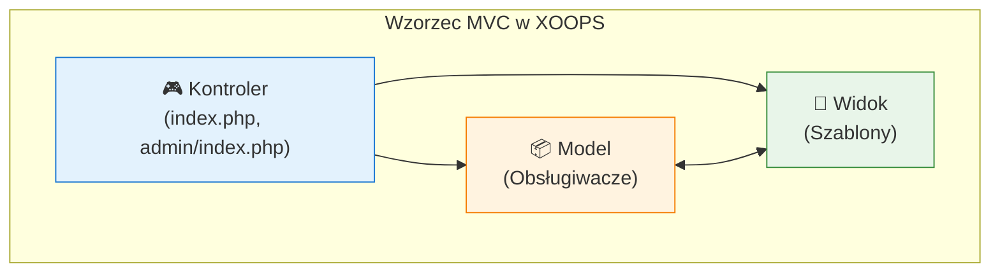

<span class="version-badge version-25x">2.5.x ✅</span> <span class="version-badge version-40x">4.0.x ✅</span>

Wzorce projektowe to wielokrotnego użytku rozwiązania dla powszechnych problemów projektowania oprogramowania. XOOPS stosuje kilka dobrze ugruntowanych wzorców, które pomagają utrzymać jakość kodu, poprawiać testowość i zwiększać elastyczność systemu.

:::note[Szybki wybór wzorca]
Nie masz pewności, który wzorzec użyć? Wejdź do:
- [Choosing a Data Access Pattern](../../03-Module-Development/Choosing-Data-Access-Pattern.md) — obsługiwacze vs repozytorium vs usługa vs CQRS
- [Choosing an Event System](../Choosing-Event-System.md) — preloads vs zdarzenia PSR-14
:::

## Przegląd

Zrozumienie i prawidłowe wdrażanie wzorców projektowych jest kluczowe do tworzenia łatwych w utrzymaniu modułów XOOPS. Ten przewodnik obejmuje najczęściej używane wzorce w tworzeniu XOOPS.

| Wzorzec | Cel | Typowe przypadki użycia |
|---------|---------|------------------|
| MVC | Rozdzielenie problemów | Struktura modułu |
| Singleton | Gwarancja pojedynczej instancji | Połączenia z bazą danych |
| Factory | Abstrakcja tworzenia obiektów | Obsługiwacze, baza danych |
| Observer | Powiadomienia o zdarzeniach | Preloads, powiadomienia |
| Decorator | Dynamiczne rozszerzenie zachowania | Elementy formularza, filtry |
| Strategy | Wymienność algorytmu | Autentykacja, walidacja |
| Adapter | Kompatybilność interfejsu | Integracja starego kodu |
| Repository | Abstrakcja dostępu do danych | Trwałość danych |

## Model-View-Controller (MVC)

Wzorzec MVC oddziela aplikację na trzy połączone komponenty, czyniąc bazę kodu bardziej zorganizowaną i testową.

### Architektura



### Model (warstwa danych)

```php
<?php
namespace XoopsModules\MyModule;

class Article extends \XoopsObject
{
    public function __construct()
    {
        $this->initVar('article_id', XOBJ_DTYPE_INT, null, false);
        $this->initVar('title', XOBJ_DTYPE_TXTBOX, '', true, 255);
        $this->initVar('content', XOBJ_DTYPE_TXTAREA, '', true);
        $this->initVar('author_id', XOBJ_DTYPE_INT, 0, true);
        $this->initVar('status', XOBJ_DTYPE_INT, 1, false);
        $this->initVar('created', XOBJ_DTYPE_INT, time(), false);
        $this->initVar('modified', XOBJ_DTYPE_INT, time(), false);
    }

    public function isPublished(): bool
    {
        return $this->getVar('status') === 1;
    }

    public function getFormattedDate(): string
    {
        return formatTimestamp($this->getVar('created'));
    }
}

class ArticleHandler extends \XoopsPersistableObjectHandler
{
    public function __construct(\XoopsDatabase $db)
    {
        parent::__construct($db, 'mymodule_articles', Article::class, 'article_id', 'title');
    }

    public function getPublishedArticles(int $limit = 10): array
    {
        $criteria = new \CriteriaCompo();
        $criteria->add(new \Criteria('status', 1));
        $criteria->setSort('created');
        $criteria->setOrder('DESC');
        $criteria->setLimit($limit);

        return $this->getObjects($criteria);
    }
}
```

### Widok (warstwa prezentacji)

```smarty
{* templates/article_list.tpl *}
<div class="article-list">
    <h2>{$smarty.const._MD_MYMODULE_ARTICLES}</h2>

    {foreach from=$articles item=article}
        <article class="article-item">
            <h3>
                <a href="{$xoops_url}/modules/mymodule/article.php?id={$article.article_id}">
                    {$article.title|escape}
                </a>
            </h3>
            <p class="meta">
                {$smarty.const._MD_MYMODULE_POSTED}: {$article.formatted_date}
            </p>
            <div class="content">
                {$article.content|truncate:200}
            </div>
        </article>
    {/foreach}
</div>
```

### Kontroler (warstwa logiki)

```php
<?php
// index.php
require_once dirname(__DIR__, 2) . '/mainfile.php';

use XoopsModules\MyModule\Helper;

$helper = Helper::getInstance();
$articleHandler = $helper->getHandler('Article');

// Pobierz akcję z żądania
$op = \Xmf\Request::getString('op', 'list');

switch ($op) {
    case 'view':
        $articleId = \Xmf\Request::getInt('id', 0);
        $article = $articleHandler->get($articleId);

        if (!$article) {
            redirect_header(XOOPS_URL, 3, _MD_MYMODULE_NOT_FOUND);
        }

        $GLOBALS['xoopsOption']['template_main'] = 'mymodule_article_view.tpl';
        require_once XOOPS_ROOT_PATH . '/header.php';

        $xoopsTpl->assign('article', $article->toArray());
        break;

    case 'list':
    default:
        $articles = $articleHandler->getPublishedArticles(10);

        $GLOBALS['xoopsOption']['template_main'] = 'mymodule_article_list.tpl';
        require_once XOOPS_ROOT_PATH . '/header.php';

        $xoopsTpl->assign('articles', array_map(fn($a) => $a->toArray(), $articles));
        break;
}

require_once XOOPS_ROOT_PATH . '/footer.php';
```

## Wzorzec Singleton

Wzorzec Singleton zapewnia, że klasa ma tylko jedną instancję i zapewnia globalny dostęp do niej.

### Kiedy używać

- Połączenia z bazą danych
- Menedżerowie konfiguracji
- Instancje logowania
- Menedżerowie cache

### Implementacja

```php
<?php
namespace XoopsModules\MyModule;

class ConfigurationManager
{
    private static ?self $instance = null;
    private array $config = [];

    private function __construct()
    {
        // Załaduj konfigurację
        $this->loadConfiguration();
    }

    // Zapobiegaj klonowaniu
    private function __clone() {}

    // Zapobiegaj deserializacji
    public function __wakeup()
    {
        throw new \Exception("Cannot unserialize singleton");
    }

    public static function getInstance(): self
    {
        if (self::$instance === null) {
            self::$instance = new self();
        }

        return self::$instance;
    }

    private function loadConfiguration(): void
    {
        $helper = Helper::getInstance();
        $this->config = [
            'items_per_page' => $helper->getConfig('items_per_page', 10),
            'allow_comments' => $helper->getConfig('allow_comments', true),
            'date_format' => $helper->getConfig('date_format', 'Y-m-d'),
        ];
    }

    public function get(string $key, mixed $default = null): mixed
    {
        return $this->config[$key] ?? $default;
    }
}

// Użycie
$config = ConfigurationManager::getInstance();
$itemsPerPage = $config->get('items_per_page');
```

### Przykłady XOOPS Core

```php
<?php
// XoopsDatabaseFactory używa wzorca Singleton
$db = XoopsDatabaseFactory::getDatabaseConnection();

// XMF Module Helper używa Singleton
$helper = \Xmf\Module\Helper::getHelper('mymodule');

// Instancja Xoops główna
$xoops = \Xoops::getInstance();
```

## Wzorzec Factory

Wzorzec Factory tworzy obiekty bez określania ich dokładnej klasy, pozwalając na elastyczne tworzenie obiektów.

### Kiedy używać

- Dynamiczne tworzenie obsługiwaczy
- Połączenia z bazą danych dla różnych baz danych
- Dostawcy autentykacji
- Tworzenie elementów formularza

### Implementacja

```php
<?php
namespace XoopsModules\MyModule;

interface ContentInterface
{
    public function render(): string;
}

class ArticleContent implements ContentInterface
{
    private array $data;

    public function __construct(array $data)
    {
        $this->data = $data;
    }

    public function render(): string
    {
        return "<article><h2>{$this->data['title']}</h2><p>{$this->data['body']}</p></article>";
    }
}

class NewsContent implements ContentInterface
{
    private array $data;

    public function __construct(array $data)
    {
        $this->data = $data;
    }

    public function render(): string
    {
        return "<div class='news'><h3>{$this->data['headline']}</h3><p>{$this->data['summary']}</p></div>";
    }
}

class ContentFactory
{
    public static function create(string $type, array $data): ContentInterface
    {
        return match ($type) {
            'article' => new ArticleContent($data),
            'news' => new NewsContent($data),
            default => throw new \InvalidArgumentException("Unknown content type: $type"),
        };
    }
}

// Użycie
$article = ContentFactory::create('article', ['title' => 'Hello', 'body' => 'World']);
echo $article->render();
```

### Fabryka bazy danych XOOPS

```php
<?php
class XoopsDatabaseFactory
{
    public static function getDatabaseConnection()
    {
        static $instance;

        if (!isset($instance)) {
            $dbType = XOOPS_DB_TYPE ?? 'mysql';
            $className = 'XoopsDatabase' . ucfirst($dbType);

            if (!class_exists($className)) {
                $file = XOOPS_ROOT_PATH . '/class/database/' . strtolower($dbType) . '.php';
                if (file_exists($file)) {
                    require_once $file;
                }
            }

            $instance = new $className();

            if (!$instance->connect()) {
                trigger_error('Unable to connect to database', E_USER_ERROR);
            }
        }

        return $instance;
    }
}
```

## Wzorzec Observer

Wzorzec Observer pozwala obiektom być powiadamianym o zmianach stanu podmiotu, umożliwiając zachowanie oparte na zdarzeniach.

### Kiedy używać

- Obsługa zdarzeń
- Systemy powiadomień
- Architektury wtyczek
- Rejestrowanie i audyt

### Implementacja

```php
<?php
namespace XoopsModules\MyModule;

interface ObserverInterface
{
    public function update(string $event, array $data): void;
}

class EventDispatcher
{
    private array $observers = [];

    public function attach(string $event, ObserverInterface $observer): void
    {
        if (!isset($this->observers[$event])) {
            $this->observers[$event] = [];
        }

        $this->observers[$event][] = $observer;
    }

    public function detach(string $event, ObserverInterface $observer): void
    {
        if (isset($this->observers[$event])) {
            $key = array_search($observer, $this->observers[$event], true);
            if ($key !== false) {
                unset($this->observers[$event][$key]);
            }
        }
    }

    public function notify(string $event, array $data = []): void
    {
        if (isset($this->observers[$event])) {
            foreach ($this->observers[$event] as $observer) {
                $observer->update($event, $data);
            }
        }
    }
}

class EmailNotifier implements ObserverInterface
{
    public function update(string $event, array $data): void
    {
        if ($event === 'article.published') {
            // Wyślij powiadomienie e-mail
            $this->sendEmail($data['article']);
        }
    }

    private function sendEmail($article): void
    {
        $xoopsMailer = xoops_getMailer();
        $xoopsMailer->setSubject('New Article Published: ' . $article->getVar('title'));
        $xoopsMailer->setBody('A new article has been published.');
        $xoopsMailer->send();
    }
}

// Użycie
$dispatcher = new EventDispatcher();
$dispatcher->attach('article.published', new EmailNotifier());

// Gdy artykuł jest opublikowany
$dispatcher->notify('article.published', ['article' => $article]);
```

### Preloads XOOPS (implementacja Observer)

```php
<?php
// modules/mymodule/preloads/core.php
class MymoduleCorePreload extends XoopsPreloadItem
{
    public static function eventCoreIncludeCommonEnd($args)
    {
        // Reaguj na zakończenie core common include
        $GLOBALS['xoopsLogger']->addExtra('MyModule', 'Initialized');
    }

    public static function eventCoreHeaderEnd($args)
    {
        // Dodaj własne nagłówki
        $GLOBALS['xoTheme']->addStylesheet('modules/mymodule/assets/css/custom.css');
    }

    public static function eventCoreFooterStart($args)
    {
        // Wykonaj przed renderowaniem stopki
    }
}
```

## Wzorzec Decorator

Wzorzec Decorator dodaje zachowanie do obiektów dynamicznie bez wpływu na inne obiekty tej samej klasy.

### Kiedy używać

- Dostosowywanie elementów formularza
- Formatowanie wyjścia
- Sprawdzanie uprawnień
- Warstwy cachowania

### Implementacja

```php
<?php
namespace XoopsModules\MyModule;

interface FormElementInterface
{
    public function render(): string;
}

class TextInput implements FormElementInterface
{
    private string $name;
    private string $value;

    public function __construct(string $name, string $value = '')
    {
        $this->name = $name;
        $this->value = $value;
    }

    public function render(): string
    {
        return sprintf(
            '<input type="text" name="%s" value="%s">',
            htmlspecialchars($this->name),
            htmlspecialchars($this->value)
        );
    }
}

abstract class FormElementDecorator implements FormElementInterface
{
    protected FormElementInterface $element;

    public function __construct(FormElementInterface $element)
    {
        $this->element = $element;
    }

    public function render(): string
    {
        return $this->element->render();
    }
}

class RequiredDecorator extends FormElementDecorator
{
    public function render(): string
    {
        return $this->element->render() . '<span class="required">*</span>';
    }
}

class LabelDecorator extends FormElementDecorator
{
    private string $label;

    public function __construct(FormElementInterface $element, string $label)
    {
        parent::__construct($element);
        $this->label = $label;
    }

    public function render(): string
    {
        return sprintf(
            '<label>%s</label>%s',
            htmlspecialchars($this->label),
            $this->element->render()
        );
    }
}

class HelpTextDecorator extends FormElementDecorator
{
    private string $helpText;

    public function __construct(FormElementInterface $element, string $helpText)
    {
        parent::__construct($element);
        $this->helpText = $helpText;
    }

    public function render(): string
    {
        return $this->element->render() . sprintf(
            '<small class="help-text">%s</small>',
            htmlspecialchars($this->helpText)
        );
    }
}

// Użycie - dekoratory mogą być ułożone
$input = new TextInput('username');
$input = new RequiredDecorator($input);
$input = new LabelDecorator($input, 'Username');
$input = new HelpTextDecorator($input, 'Enter your username');

echo $input->render();
// Wyjście: <label>Username</label><input type="text" name="username" value=""><span class="required">*</span><small class="help-text">Enter your username</small>
```

## Wzorzec Strategy

Wzorzec Strategy definiuje rodzinę algorytmów, hermetyzuje każdy z nich i czyni je wymiennymi.

### Kiedy używać

- Wiele metod autentykacji
- Różne algorytmy sortowania
- Różne formaty eksportu
- Elastyczne reguły walidacji

### Implementacja

```php
<?php
namespace XoopsModules\MyModule;

interface AuthStrategyInterface
{
    public function authenticate(string $username, string $password): bool;
}

class DatabaseAuthStrategy implements AuthStrategyInterface
{
    public function authenticate(string $username, string $password): bool
    {
        $memberHandler = xoops_getHandler('member');
        $user = $memberHandler->loginUser($username, $password);

        return $user !== false;
    }
}

class LdapAuthStrategy implements AuthStrategyInterface
{
    private string $ldapHost;
    private int $ldapPort;

    public function __construct(string $host, int $port = 389)
    {
        $this->ldapHost = $host;
        $this->ldapPort = $port;
    }

    public function authenticate(string $username, string $password): bool
    {
        $ldap = ldap_connect($this->ldapHost, $this->ldapPort);

        if (!$ldap) {
            return false;
        }

        $bind = @ldap_bind($ldap, "uid=$username,ou=users,dc=example,dc=com", $password);

        ldap_close($ldap);

        return $bind;
    }
}

class AuthService
{
    private AuthStrategyInterface $strategy;

    public function __construct(AuthStrategyInterface $strategy)
    {
        $this->strategy = $strategy;
    }

    public function setStrategy(AuthStrategyInterface $strategy): void
    {
        $this->strategy = $strategy;
    }

    public function login(string $username, string $password): bool
    {
        return $this->strategy->authenticate($username, $password);
    }
}

// Użycie
$authService = new AuthService(new DatabaseAuthStrategy());

// Możesz zmienić strategie w czasie wykonywania
if ($useLdap) {
    $authService->setStrategy(new LdapAuthStrategy('ldap.example.com'));
}

$authenticated = $authService->login($username, $password);
```

## Wzorzec Repository

Wzorzec Repository zapewnia warstwę abstrakcji między logiką dostępu do danych a logiką biznesową.

### Kiedy używać

- Złożone wymagania dostępu do danych
- Wiele źródeł danych
- Warstwy danych testowalne
- Domain-Driven Design

### Implementacja

```php
<?php
namespace XoopsModules\MyModule\Repository;

use XoopsModules\MyModule\Entity\Article;

interface ArticleRepositoryInterface
{
    public function find(int $id): ?Article;
    public function findBySlug(string $slug): ?Article;
    public function findPublished(int $limit = 10, int $offset = 0): array;
    public function save(Article $article): bool;
    public function delete(Article $article): bool;
}

class ArticleRepository implements ArticleRepositoryInterface
{
    private \XoopsPersistableObjectHandler $handler;

    public function __construct(\XoopsPersistableObjectHandler $handler)
    {
        $this->handler = $handler;
    }

    public function find(int $id): ?Article
    {
        $obj = $this->handler->get($id);
        return $obj ?: null;
    }

    public function findBySlug(string $slug): ?Article
    {
        $criteria = new \Criteria('slug', $slug);
        $objects = $this->handler->getObjects($criteria);

        return !empty($objects) ? $objects[0] : null;
    }

    public function findPublished(int $limit = 10, int $offset = 0): array
    {
        $criteria = new \CriteriaCompo();
        $criteria->add(new \Criteria('status', 'published'));
        $criteria->setSort('published_at');
        $criteria->setOrder('DESC');
        $criteria->setLimit($limit);
        $criteria->setStart($offset);

        return $this->handler->getObjects($criteria);
    }

    public function save(Article $article): bool
    {
        return $this->handler->insert($article);
    }

    public function delete(Article $article): bool
    {
        return $this->handler->delete($article);
    }
}
```

## Wstrzykiwanie zależności

Wstrzykiwanie zależności (DI) pozwala obiektom być konstruowanym z ich zależnościami zamiast tworzyć je wewnętrznie.

### Korzyści

- Ulepszona testowość
- Luźne powiązanie
- Elastyczna konfiguracja
- Lepsza organizacja kodu

### Implementacja

```php
<?php
namespace XoopsModules\MyModule;

class ArticleService
{
    private Repository\ArticleRepositoryInterface $repository;
    private CacheInterface $cache;
    private LoggerInterface $logger;

    public function __construct(
        Repository\ArticleRepositoryInterface $repository,
        CacheInterface $cache,
        LoggerInterface $logger
    ) {
        $this->repository = $repository;
        $this->cache = $cache;
        $this->logger = $logger;
    }

    public function getArticle(int $id): ?Entity\Article
    {
        $cacheKey = "article_{$id}";

        // Spróbuj cache najpierw
        if ($this->cache->has($cacheKey)) {
            $this->logger->debug("Article {$id} loaded from cache");
            return $this->cache->get($cacheKey);
        }

        // Załaduj z repozytorium
        $article = $this->repository->find($id);

        if ($article) {
            $this->cache->set($cacheKey, $article, 3600);
            $this->logger->debug("Article {$id} loaded from database");
        }

        return $article;
    }
}

// Konfiguracja kontenera usług
$container = new DependencyContainer();

$container->register('db', fn() => XoopsDatabaseFactory::getDatabaseConnection());

$container->register('articleHandler', fn($c) =>
    new ArticleHandler($c->resolve('db'))
);

$container->register('articleRepository', fn($c) =>
    new Repository\ArticleRepository($c->resolve('articleHandler'))
);

$container->register('cache', fn() => new FileCache(XOOPS_VAR_PATH . '/caches'));

$container->register('logger', fn() => new XoopsLogger());

$container->register('articleService', fn($c) =>
    new ArticleService(
        $c->resolve('articleRepository'),
        $c->resolve('cache'),
        $c->resolve('logger')
    )
);

// Użycie
$articleService = $container->resolve('articleService');
$article = $articleService->getArticle(1);
```

## Najlepsze praktyki

### Wytyczne wyboru wzorca

1. **Wybieraj wzorce na podstawie rzeczywistych potrzeb**, a nie przewidywanych
2. **Trzymaj implementacje proste** - nie Over-engineer
3. **Dokumentuj użycie wzorca** dla zrozumienia zespołu
4. **Łącz wzorce** gdy to odpowiednie (np. Factory + Singleton)
5. **Bierz pod uwagę testowość** przy wyborze wzorców

### Powszechne anty-wzorce do unikania

| Anty-wzorzec | Problem | Rozwiązanie |
|--------------|---------|----------|
| God Object | Klasa robi zbyt wiele | Single Responsibility |
| Spaghetti Code | Brak jasnej struktury | Użyj wzorca MVC |
| Copy-Paste | Duplikacja kodu | Wyodrębnij wspólny kod |
| Magic Numbers | Niejasne stałe | Użyj nazwanych stałych |
| Tight Coupling | Trudne do testowania/utrzymania | Użyj wstrzykiwania zależności |

### Testowanie wzorców

```php
<?php
// Testowanie jednostkowe z wstrzykiwaniem zależności
class ArticleServiceTest extends \PHPUnit\Framework\TestCase
{
    private $repository;
    private $cache;
    private $logger;
    private $service;

    protected function setUp(): void
    {
        $this->repository = $this->createMock(ArticleRepositoryInterface::class);
        $this->cache = $this->createMock(CacheInterface::class);
        $this->logger = $this->createMock(LoggerInterface::class);

        $this->service = new ArticleService(
            $this->repository,
            $this->cache,
            $this->logger
        );
    }

    public function testGetArticleFromCache(): void
    {
        $article = new Article();
        $article->setVar('article_id', 1);

        $this->cache->expects($this->once())
            ->method('has')
            ->with('article_1')
            ->willReturn(true);

        $this->cache->expects($this->once())
            ->method('get')
            ->with('article_1')
            ->willReturn($article);

        $result = $this->service->getArticle(1);

        $this->assertSame($article, $result);
    }
}
```

## Powiązana dokumentacja

- [XOOPS-Architecture](XOOPS-Architecture.md) - Ogólna architektura systemu
- [Database Layer](../Database/Database-Layer.md) - Wzorce trwałości danych
- [Security Best Practices](../Security/Security-Best-Practices.md) - Bezpieczna implementacja wzorca

---

#xoops #wzorce-projektowe #architektura #mvc #singleton #factory #observer
