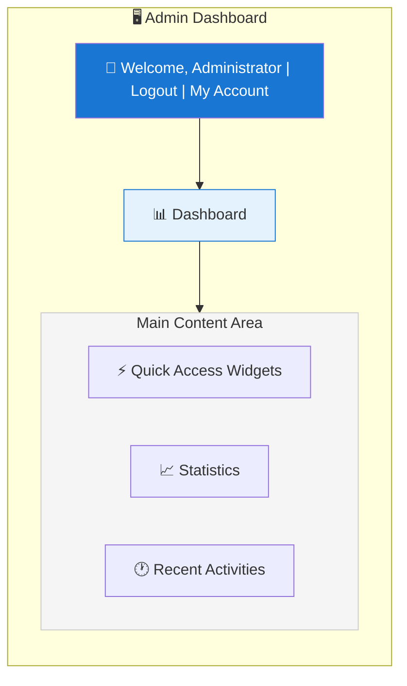
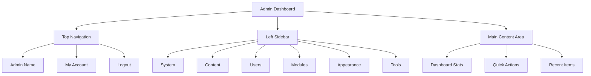

# Przegląd panelu administracyjnego XOOPS

Kompletny przewodnik po nawigowaniu i korzystaniu z pulpitu administracyjnego XOOPS.

## Dostęp do panelu administracyjnego

### Logowanie administratora

Otwórz przeglądarkę i przejdź do:

```
http://your-domain.com/xoops/admin/
```

Lub jeśli XOOPS znajduje się w głównym katalogu:

```
http://your-domain.com/admin/
```

Wprowadź swoje poświadczenia administratora:

```
Username: [Your admin username]
Password: [Your admin password]
```

### Po zalogowaniu

Zobaczysz główny pulpit administracyjny:



## Układ panelu administracyjnego



## Komponenty pulpitu

### Górny pasek

Górny pasek zawiera niezbędne formanty:

| Element | Cel |
|---|---|
| **Logo administracyjne** | Kliknij, aby powrócić do pulpitu |
| **Wiadomość powitalna** | Wyświetla zalogowanego administratora |
| **Moje konto** | Edytuj profil i hasło administratora |
| **Pomoc** | Dostęp do dokumentacji |
| **Wyloguj** | Wyloguj się z panelu administracyjnego |

### Lewy pasek nawigacji bocznej

Menu główne zorganizowane według funkcji:

```
├── System
│   ├── Dashboard
│   ├── Preferences
│   ├── Admin Users
│   ├── Groups
│   ├── Permissions
│   ├── Modules
│   └── Tools
├── Content
│   ├── Pages
│   ├── Categories
│   ├── Comments
│   └── Media Manager
├── Users
│   ├── Users
│   ├── User Requests
│   ├── Online Users
│   └── User Groups
├── Modules
│   ├── Modules
│   ├── Module Settings
│   └── Module Updates
├── Appearance
│   ├── Themes
│   ├── Templates
│   ├── Blocks
│   └── Images
└── Tools
    ├── Maintenance
    ├── Email
    ├── Statistics
    ├── Logs
    └── Backups
```

### Główny obszar zawartości

Wyświetla informacje i formanty dla wybranej sekcji:

- Formularze do konfiguracji
- Tabele danych z listami
- Wykresy i statystyki
- Przyciski szybkich akcji
- Tekst pomocniczy i podpowiedzi

### Widżety pulpitu

Szybki dostęp do kluczowych informacji:

- **Informacje o systemie:** wersja PHP, wersja MySQL, wersja XOOPS
- **Szybkie statystyki:** liczba użytkowników, całkowita liczba postów, zainstalowane moduły
- **Ostatnia aktywność:** ostatnie logowania, zmiany zawartości, błędy
- **Stan serwera:** procesor, pamięć, użycie dysku
- **Powiadomienia:** alerty systemowe, oczekujące aktualizacje

## Główne funkcje administracyjne

### Zarządzanie systemem

**Lokalizacja:** System > [Różne opcje]

#### Preferencje

Konfiguruj podstawowe ustawienia systemu:

```
System > Preferences > [Settings Category]
```

Kategorie:
- Ustawienia ogólne (nazwa witryny, strefa czasowa)
- Ustawienia użytkownika (rejestracja, profile)
- Ustawienia poczty e-mail (konfiguracja SMTP)
- Ustawienia pamięci podręcznej (opcje buforowania)
- Ustawienia adresów URL (przyjazne adresy URL)
- Metatypy (ustawienia SEO)

Patrz Konfiguracja podstawowa i Ustawienia systemu.

#### Administratorzy

Zarządzaj kontami administratorów:

```
System > Admin Users
```

Funkcje:
- Dodaj nowych administratorów
- Edytuj profile administratorów
- Zmień hasła administratorów
- Usuń konta administratorów
- Ustaw uprawnienia administratora

### Zarządzanie zawartością

**Lokalizacja:** Content > [Różne opcje]

#### Strony/Artykuły

Zarządzaj zawartością witryny:

```
Content > Pages (or your module)
```

Funkcje:
- Utwórz nowe strony
- Edytuj istniejącą zawartość
- Usuń strony
- Publikuj/wycofaj z publikacji
- Ustaw kategorie
- Zarządzaj wersjami

#### Kategorie

Organizuj zawartość:

```
Content > Categories
```

Funkcje:
- Utwórz hierarchię kategorii
- Edytuj kategorie
- Usuń kategorie
- Przypisz do stron

#### Komentarze

Moderuj komentarze użytkowników:

```
Content > Comments
```

Funkcje:
- Wyświetl wszystkie komentarze
- Zatwierdź komentarze
- Edytuj komentarze
- Usuń spam
- Zablokuj komentujących

### Zarządzanie użytkownikami

**Lokalizacja:** Users > [Różne opcje]

#### Użytkownicy

Zarządzaj kontami użytkowników:

```
Users > Users
```

Funkcje:
- Wyświetl wszystkich użytkowników
- Utwórz nowych użytkowników
- Edytuj profile użytkowników
- Usuń konta
- Zresetuj hasła
- Zmień status użytkownika
- Przypisz do grup

#### Użytkownicy online

Monitoruj aktywnych użytkowników:

```
Users > Online Users
```

Wyświetla:
- Aktualnie zalogowani użytkownicy
- Czas ostatniej aktywności
- Adres IP
- Lokalizacja użytkownika (jeśli skonfigurowana)

#### Grupy użytkowników

Zarządzaj rolami i uprawnieniami użytkowników:

```
Users > Groups
```

Funkcje:
- Utwórz grupy niestandardowe
- Ustaw uprawnienia grupy
- Przypisz użytkowników do grup
- Usuń grupy

### Zarządzanie modułami

**Lokalizacja:** Modules > [Różne opcje]

#### Moduły

Instaluj i konfiguruj moduły:

```
Modules > Modules
```

Funkcje:
- Wyświetl zainstalowane moduły
- Włącz/wyłącz moduły
- Zaktualizuj moduły
- Skonfiguruj ustawienia modułu
- Instaluj nowe moduły
- Wyświetl szczegóły modułu

#### Sprawdzaj aktualizacje

```
Modules > Modules > Check for Updates
```

Wyświetla:
- Dostępne aktualizacje modułów
- Dziennik zmian
- Opcje pobierania i instalacji

### Zarządzanie wyglądem

**Lokalizacja:** Appearance > [Różne opcje]

#### Motywy

Zarządzaj motywami witryny:

```
Appearance > Themes
```

Funkcje:
- Wyświetl zainstalowane motywy
- Ustaw motyw domyślny
- Przesyłaj nowe motywy
- Usuń motywy
- Podgląd motywu
- Konfiguracja motywu

#### Bloki

Zarządzaj blokami zawartości:

```
Appearance > Blocks
```

Funkcje:
- Utwórz niestandardowe bloki
- Edytuj zawartość bloku
- Ułóż bloki na stronie
- Ustaw widoczność bloku
- Usuń bloki
- Skonfiguruj buforowanie bloku

#### Szablony

Zarządzaj szablonami (zaawansowane):

```
Appearance > Templates
```

Dla zaawansowanych użytkowników i deweloperów.

### Narzędzia systemowe

**Lokalizacja:** System > Tools

#### Tryb konserwacji

Uniemożliwić dostęp użytkowników podczas konserwacji:

```
System > Maintenance Mode
```

Konfiguruj:
- Włączanie/wyłączanie konserwacji
- Niestandardowa wiadomość konserwacji
- Dozwolone adresy IP (do testowania)

#### Zarządzanie bazą danych

```
System > Database
```

Funkcje:
- Sprawdzaj spójność bazy danych
- Uruchamiaj aktualizacje bazy danych
- Napraw tabele
- Optymalizuj bazę danych
- Eksportuj strukturę bazy danych

#### Dzienniki aktywności

```
System > Logs
```

Monitoruj:
- Aktywność użytkownika
- Działania administracyjne
- Zdarzenia systemowe
- Dzienniki błędów

## Szybkie akcje

Typowe zadania dostępne z pulpitu:

```
Quick Links:
├── Create New Page
├── Add New User
├── Create Content Block
├── Upload Image
├── Send Mass Email
├── Update All Modules
└── Clear Cache
```

## Skróty klawiszowe panelu administracyjnego

Szybka nawigacja:

| Skrót | Działanie |
|---|---|
| `Ctrl+H` | Idź do pomocy |
| `Ctrl+D` | Idź do pulpitu |
| `Ctrl+Q` | Szybkie wyszukiwanie |
| `Ctrl+L` | Wyloguj |

## Zarządzanie kontem użytkownika

### Moje konto

Uzyskaj dostęp do swojego profilu administratora:

1. Kliknij "Moje konto" w prawym górnym rogu
2. Edytuj informacje profilowe:
   - Adres e-mail
   - Imię i nazwisko
   - Informacje o użytkowniku
   - Awatar

### Zmiana hasła

Zmień swoje hasło administratora:

1. Przejdź do **Moje konto**
2. Kliknij "Zmień hasło"
3. Wpisz bieżące hasło
4. Wpisz nowe hasło (dwukrotnie)
5. Kliknij "Zapisz"

**Porady dotyczące bezpieczeństwa:**
- Używaj silnych haseł (16+ znaków)
- Uwzględnij wielkie litery, małe litery, cyfry, symbole
- Zmień hasło co 90 dni
- Nigdy nie udostępniaj poświadczeń administratora

### Wyloguj

Wyloguj się z panelu administracyjnego:

1. Kliknij "Wyloguj" w prawym górnym rogu
2. Zostaniesz przekierowany na stronę logowania

## Statystyki panelu administracyjnego

### Statystyki pulpitu

Szybki przegląd metryk witryny:

| Metryka | Wartość |
|--------|-------|
| Użytkownicy online | 12 |
| Ogółem użytkowników | 256 |
| Łącznie postów | 1,234 |
| Łącznie komentarzy | 5,678 |
| Łącznie modułów | 8 |

### Stan systemu

Informacje o serwerze i wydajności:

| Komponent | Wersja/Wartość |
|-----------|---------------|
| Wersja XOOPS | 2.5.11 |
| Wersja PHP | 8.2.x |
| Wersja MySQL | 8.0.x |
| Obciążenie serwera | 0.45, 0.42 |
| Czas pracy | 45 dni |

### Ostatnia aktywność

Oś czasu ostatnich zdarzeń:

```
12:45 - Admin login
12:30 - New user registered
12:15 - Page published
12:00 - Comment posted
11:45 - Module updated
```

## System powiadomień

### Alerty administracyjne

Odbieraj powiadomienia dla:

- Nowych rejestracji użytkowników
- Komentarzy oczekujących na moderację
- Nieudanych prób logowania
- Błędów systemowych
- Dostępnych aktualizacji modułów
- Problemów z bazą danych
- Ostrzeżeń o miejscu na dysku

Skonfiguruj alerty:

**System > Preferences > Email Settings**

```
Notify Admin on Registration: Yes
Notify Admin on Comments: Yes
Notify Admin on Errors: Yes
Alert Email: admin@your-domain.com
```

## Typowe zadania administracyjne

### Utwórz nową stronę

1. Przejdź do **Content > Pages** (lub odpowiedniego modułu)
2. Kliknij "Dodaj nową stronę"
3. Wypełnij:
   - Tytuł
   - Zawartość
   - Opis
   - Kategoria
   - Metadane
4. Kliknij "Publikuj"

### Zarządzaj użytkownikami

1. Przejdź do **Users > Users**
2. Wyświetl listę użytkowników z:
   - Nazwa użytkownika
   - Email
   - Data rejestracji
   - Ostatnie logowanie
   - Status

3. Kliknij nazwę użytkownika, aby:
   - Edytować profil
   - Zmienić hasło
   - Edytować grupy
   - Zablokować/odblokować użytkownika

### Konfiguruj moduł

1. Przejdź do **Modules > Modules**
2. Znajdź moduł na liście
3. Kliknij nazwę modułu
4. Kliknij "Preferencje" lub "Ustawienia"
5. Skonfiguruj opcje modułu
6. Zapisz zmiany

### Utwórz nowy blok

1. Przejdź do **Appearance > Blocks**
2. Kliknij "Dodaj nowy blok"
3. Wpisz:
   - Tytuł bloku
   - Zawartość bloku (HTML dozwolony)
   - Pozycja na stronie
   - Widoczność (wszystkie strony lub określone)
   - Moduł (jeśli dotyczy)
4. Kliknij "Wyślij"

## Pomoc panelu administracyjnego

### Wbudowana dokumentacja

Dostęp do pomocy z panelu administracyjnego:

1. Kliknij przycisk "Pomoc" w górnym pasku
2. Kontekstowa pomoc dla bieżącej strony
3. Linki do dokumentacji
4. Często zadawane pytania

### Zasoby zewnętrzne

- Oficjalna strona XOOPS: https://xoops.org/
- Forum społeczności: https://xoops.org/modules/newbb/
- Repozytorium modułów: https://xoops.org/modules/repository/
- Błędy/Problemy: https://github.com/XOOPS/XoopsCore/issues

## Dostosowywanie panelu administracyjnego

### Motyw administracyjny

Wybierz motyw interfejsu administracyjnego:

**System > Preferences > General Settings**

```
Admin Theme: [Select theme]
```

Dostępne motywy:
- Domyślny (jasny)
- Tryb ciemny
- Motywy niestandardowe

### Dostosowywanie pulpitu

Wybierz, które widżety się wyświetlają:

**Dashboard > Customize**

Wybierz:
- Informacje o systemie
- Statystyki
- Ostatnia aktywność
- Szybkie linki
- Niestandardowe widżety

## Uprawnienia panelu administracyjnego

Różne poziomy administracyjne mają różne uprawnienia:

| Rola | Możliwości |
|---|---|
| **Webmaster** | Pełny dostęp do wszystkich funkcji administracyjnych |
| **Admin** | Ograniczone funkcje administracyjne |
| **Moderator** | Tylko moderacja zawartości |
| **Editor** | Tworzenie i edycja zawartości |

Zarządzaj uprawnieniami:

**System > Permissions**

## Najlepsze praktyki bezpieczeństwa dla panelu administracyjnego

1. **Silne hasło:** Użyj hasła o długości 16+ znaków
2. **Regularne zmiany:** Zmień hasło co 90 dni
3. **Monitoruj dostęp:** Regularnie sprawdzaj dzienniki "Administratorów"
4. **Ogranicz dostęp:** Zmień nazwę folderu administracyjnego dla dodatkowego bezpieczeństwa
5. **Używaj HTTPS:** Zawsze uzyskuj dostęp do administracji przez HTTPS
6. **Whitelist IP:** Ogranicz dostęp administracyjny do określonych adresów IP
7. **Regularne wylogowanie:** Wyloguj się po zakończeniu
8. **Bezpieczeństwo przeglądarki:** Regularnie czyść pamięć podręczną przeglądarki

Patrz Konfiguracja bezpieczeństwa.

## Rozwiązywanie problemów z panelem administracyjnym

### Nie mogę uzyskać dostępu do panelu administracyjnego

**Rozwiązanie:**
1. Zweryfikuj poświadczenia logowania
2. Wyczyść pamięć podręczną i pliki cookie przeglądarki
3. Spróbuj innej przeglądarki
4. Sprawdź, czy ścieżka folderu administracyjnego jest poprawna
5. Zweryfikuj uprawnienia do pliku w folderze administracyjnym
6. Sprawdź połączenie z bazą danych w mainfile.php

### Pusta strona administracyjna

**Rozwiązanie:**
```bash
# Check PHP errors
tail -f /var/log/apache2/error.log

# Enable debug mode temporarily
sed -i "s/define('XOOPS_DEBUG', 0)/define('XOOPS_DEBUG', 1)/" /var/www/html/xoops/mainfile.php

# Check file permissions
ls -la /var/www/html/xoops/admin/
```

### Powolny panel administracyjny

**Rozwiązanie:**
1. Wyczyść pamięć podręczną: **System > Tools > Clear Cache**
2. Optymalizuj bazę danych: **System > Database > Optimize**
3. Sprawdzaj zasoby serwera: `htop`
4. Przejrzyj wolne zapytania w MySQL

### Moduł nie pojawia się

**Rozwiązanie:**
1. Zweryfikuj zainstalowany moduł: **Modules > Modules**
2. Sprawdź, czy moduł jest włączony
3. Zweryfikuj przypisane uprawnienia
4. Sprawdź, czy pliki modułu istnieją
5. Przejrzyj dzienniki błędów

## Następne kroki

Po zaznajomieniu się z panelem administracyjnym:

1. Utwórz swoją pierwszą stronę
2. Skonfiguruj grupy użytkowników
3. Instaluj dodatkowe moduły
4. Skonfiguruj ustawienia podstawowe
5. Wdróż bezpieczeństwo

---

**Tags:** #admin-panel #dashboard #navigation #getting-started

**Artykuły pokrewne:**
- ../Configuration/Basic-Configuration
- ../Configuration/System-Settings
- Creating-Your-First-Page
- Managing-Users
- Installing-Modules
