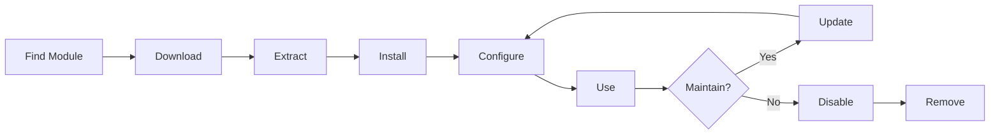

# Instalowanie i zarządzanie modułami XOOPS

Dowiedz się, jak rozszerzyć funkcjonalność XOOPS poprzez instalowanie i konfigurowanie modułów.

## Zrozumienie modułów XOOPS

### Czym są moduły?

Moduły to rozszerzenia, które dodają funkcjonalność do XOOPS:

| Typ | Cel | Przykłady |
|---|---|---|
| **Zawartość** | Zarządzaj określonymi typami zawartości | Wiadomości, Blog, Zgłoszenia |
| **Społeczność** | Interakcja użytkownika | Forum, Komentarze, Recenzje |
| **eCommerce** | Sprzedaż produktów | Sklep, Koszyk, Płatności |
| **Media** | Obsługuj pliki/obrazy | Galeria, Pobieranie, Wideo |
| **Narzędzie** | Narzędzia i pomocnicy | Email, Kopia zapasowa, Analityka |

### Moduły podstawowe a fakultatywne

| Moduł | Typ | Dołączony | Removable |
|---|---|---|---|
| **System** | Podstawowy | Tak | Nie |
| **Użytkownik** | Podstawowy | Tak | Nie |
| **Profil** | Rekomendowany | Tak | Tak |
| **PM (Wiadomość prywatna)** | Rekomendowany | Tak | Tak |
| **WF-Channel** | Fakultatywny | Często | Tak |
| **Wiadomości** | Fakultatywny | Nie | Tak |
| **Forum** | Fakultatywny | Nie | Tak |

## Cykl życia modułu



## Wyszukiwanie modułów

### Repozytorium modułów XOOPS

Oficjalne repozytorium modułów XOOPS:

**Odwiedź:** https://xoops.org/modules/repository/

```
Directory > Modules > [Browse Categories]
```

Przeglądaj według kategorii:
- Zarządzanie zawartością
- Społeczność
- Handel elektroniczny
- Multimedia
- Rozwój
- Administracja witryny

### Ocena modułów

Przed instalacją sprawdź:

| Kryteria | Na co zwrócić uwagę |
|---|---|
| **Zgodność** | Działa z twoją wersją XOOPS |
| **Ocena** | Dobre opinie i oceny użytkowników |
| **Aktualizacje** | Niedawno utrzymywane |
| **Pobieranie** | Popularne i szeroko używane |
| **Wymagania** | Kompatybilne z twoim serwerem |
| **Licencja** | GPL lub podobna licencja open source |
| **Wsparcie** | Aktywny deweloper i społeczność |

### Przeczytaj informacje o module

Każda lista modułów zawiera:

```
Module Name: [Name]
Version: [X.X.X]
Requires: XOOPS [Version]
Author: [Name]
Last Update: [Date]
Downloads: [Number]
Rating: [Stars]
Description: [Brief description]
Compatibility: PHP [Version], MySQL [Version]
```

## Instalowanie modułów

### Metoda 1: Instalacja za pośrednictwem panelu administracyjnego

**Krok 1: Dostęp do sekcji modułów**

1. Zaloguj się do panelu administracyjnego
2. Przejdź do **Modules > Modules**
3. Kliknij **"Instaluj nowy moduł"** lub **"Przeglądaj moduły"**

**Krok 2: Przesłanie modułu**

Opcja A - Bezpośrednie przesłanie:
1. Kliknij **"Wybierz plik"**
2. Wybierz plik modułu .zip z komputera
3. Kliknij **"Przesłaj"**

Opcja B - Przesłanie adresu URL:
1. Wklej adres URL modułu
2. Kliknij **"Pobierz i zainstaluj"**

**Krok 3: Przejrzyj informacje o module**

```
Module Name: [Name shown]
Version: [Version]
Author: [Author info]
Description: [Full description]
Requirements: [PHP/MySQL versions]
```

Przejrzyj i kliknij **"Wykonaj instalację"**

**Krok 4: Wybierz typ instalacji**

```
☐ Fresh Install (New installation)
☐ Update (Upgrade existing)
☐ Delete Then Install (Replace existing)
```

Wybierz odpowiednią opcję.

**Krok 5: Potwierdź instalację**

Przejrzyj ostateczne potwierdzenie:
```
Module will be installed to: /modules/modulename/
Database: xoops_db
Proceed? [Yes] [No]
```

Kliknij **"Tak"** aby potwierdzić.

**Krok 6: Instalacja ukończona**

```
Installation successful!

Module: [Module Name]
Version: [Version]
Tables created: [Number]
Files installed: [Number]

[Go to Module Settings]  [Return to Modules]
```

### Metoda 2: Instalacja ręczna (zaawansowana)

Do instalacji ręcznej lub rozwiązywania problemów:

**Krok 1: Pobierz moduł**

1. Pobierz moduł .zip z repozytorium
2. Rozpakuj do `/var/www/html/xoops/modules/modulename/`

```bash
# Extract module
unzip module_name.zip
cp -r module_name /var/www/html/xoops/modules/

# Set permissions
chmod -R 755 /var/www/html/xoops/modules/module_name
```

**Krok 2: Uruchom skrypt instalacji**

```
Visit: http://your-domain.com/xoops/modules/module_name/admin/index.php?op=install
```

Lub za pośrednictwem panelu administracyjnego (System > Modules > Update DB).

**Krok 3: Zweryfikuj instalację**

1. Przejdź do **Modules > Modules** w administracji
2. Szukaj modułu na liście
3. Zweryfikuj, że pokazuje się jako "Aktywny"

## Konfiguracja modułu

### Dostęp do ustawień modułu

1. Przejdź do **Modules > Modules**
2. Znajdź swój moduł
3. Kliknij na nazwę modułu
4. Kliknij **"Preferencje"** lub **"Ustawienia"**

### Wspólne ustawienia modułu

Większość modułów oferuje:

```
Module Status: [Enabled/Disabled]
Display in Menu: [Yes/No]
Module Weight: [1-999] (display order)
Visible To Groups: [Checkboxes for user groups]
```

### Opcje specyficzne dla modułu

Każdy moduł ma unikatowe ustawienia. Przykłady:

**Moduł wiadomości:**
```
Items Per Page: 10
Show Author: Yes
Allow Comments: Yes
Moderation Required: Yes
```

**Moduł Forum:**
```
Topics Per Page: 20
Posts Per Page: 15
Maximum Attachment Size: 5MB
Enable Signatures: Yes
```

**Moduł galerii:**
```
Images Per Page: 12
Thumbnail Size: 150x150
Maximum Upload: 10MB
Watermark: Yes/No
```

Przejrzyj dokumentację modułu, aby uzyskać określone opcje.

### Zapisz konfigurację

Po dostosowaniu ustawień:

1. Kliknij **"Wyślij"** lub **"Zapisz"**
2. Zobaczysz potwierdzenie:
   ```
   Settings saved successfully!
   ```

## Zarządzanie blokami modułu

Wiele modułów tworzy "bloki" - obszary zawartości podobne do widżetów.

### Wyświetl bloki modułu

1. Przejdź do **Appearance > Blocks**
2. Poszukaj bloków z twojego modułu
3. Większość modułów pokazuje "[Nazwa modułu] - [Opis bloku]"

### Konfiguruj bloki

1. Kliknij na nazwę bloku
2. Dostosuj:
   - Tytuł bloku
   - Widoczność (wszystkie strony lub określone)
   - Pozycja na stronie (lewa, środkowa, prawa)
   - Grupy użytkowników, które mogą widzieć
3. Kliknij **"Wyślij"**

### Wyświetl blok na stronie głównej

1. Przejdź do **Appearance > Blocks**
2. Znajdź blok, który chcesz
3. Kliknij **"Edytuj"**
4. Ustaw:
   - **Widoczne dla:** Wybierz grupy
   - **Pozycja:** Wybierz kolumnę (lewa/środkowa/prawa)
   - **Strony:** Strona główna lub wszystkie strony
5. Kliknij **"Wyślij"**

## Instalowanie konkretnych przykładów modułów

### Instalowanie modułu Wiadomości

**Idealne do:** Postów na blogu, ogłoszeń

1. Pobierz moduł Wiadomości z repozytorium
2. Przesyłaj za pośrednictwem **Modules > Modules > Install**
3. Skonfiguruj w **Modules > News > Preferences**:
   - Histories na stronie: 10
   - Pozwól na komentarze: Tak
   - Zatwierdź przed publikowaniem: Tak
4. Utwórz bloki dla najnowszych wiadomości
5. Zacznij publikować artykuły!

### Instalowanie modułu Forum

**Idealne do:** Dyskusji społeczności

1. Pobierz moduł Forum
2. Instaluj za pośrednictwem panelu administracyjnego
3. Utwórz kategorie forum w module
4. Skonfiguruj ustawienia:
   - Tematy/strona: 20
   - Posty/strona: 15
   - Włącz moderację: Tak
5. Przypisz uprawnienia grup użytkowników
6. Utwórz bloki dla najnowszych tematów

### Instalowanie modułu Galeria

**Idealne do:** Prezentacji obrazów

1. Pobierz moduł Galeria
2. Zainstaluj i skonfiguruj
3. Utwórz albumy fotografii
4. Przesyłaj obrazy
5. Ustaw uprawnienia do przeglądania/przesyłania
6. Wyświetl galerię na witrynie

## Aktualizowanie modułów

### Sprawdzaj aktualizacje

```
Admin Panel > Modules > Modules > Check for Updates
```

To pokazuje:
- Dostępne aktualizacje modułów
- Bieżącą vs. nową wersję
- Dziennik zmian/uwagi do wydania

### Zaktualizuj moduł

1. Przejdź do **Modules > Modules**
2. Kliknij moduł z dostępną aktualizacją
3. Kliknij przycisk **"Zaktualizuj"**
4. Wybierz **"Zaktualizuj"** z typu instalacji
5. Postępuj zgodnie z kreatorem instalacji
6. Moduł zaktualizowany!

### Ważne notatki aktualizacyjne

Przed aktualizacją:

- [ ] Kopia zapasowa bazy danych
- [ ] Kopia zapasowa plików modułu
- [ ] Przejrzyj dziennik zmian
- [ ] Przetestuj na serwerze staging najpierw
- [ ] Zanotuj wszelkie niestandardowe modyfikacje

Po aktualizacji:
- [ ] Zweryfikuj funkcjonalność
- [ ] Sprawdzaj ustawienia modułu
- [ ] Przejrzyj ostrzeżenia/błędy
- [ ] Wyczyść pamięć podręczną

## Uprawnienia modułu

### Przypisz dostęp grupy użytkowników

Kontroluj, które grupy użytkowników mogą uzyskać dostęp do modułów:

**Lokalizacja:** System > Permissions

Dla każdego modułu skonfiguruj:

```
Module: [Module Name]

Admin Access: [Select groups]
User Access: [Select groups]
Read Permission: [Groups allowed to view]
Write Permission: [Groups allowed to post]
Delete Permission: [Administrators only]
```

### Typowe poziomy uprawnień

```
Public Content (News, Pages):
├── Admin Access: Webmaster
├── User Access: All logged-in users
└── Read Permission: Everyone

Community Features (Forum, Comments):
├── Admin Access: Webmaster, Moderators
├── User Access: All logged-in users
└── Write Permission: All logged-in users

Admin Tools:
├── Admin Access: Webmaster only
└── User Access: Disabled
```

## Wyłączanie i usuwanie modułów

### Wyłącz moduł (Zachowaj pliki)

Zachowaj moduł, ale ukryj go z witryny:

1. Przejdź do **Modules > Modules**
2. Znajdź moduł
3. Kliknij na nazwę modułu
4. Kliknij **"Wyłącz"** lub ustaw status na Nieaktywny
5. Moduł ukryty, ale dane zachowane

Ponownie włącz w dowolnym momencie:
1. Kliknij moduł
2. Kliknij **"Włącz"**

### Usuń moduł całkowicie

Usuń moduł i jego dane:

1. Przejdź do **Modules > Modules**
2. Znajdź moduł
3. Kliknij **"Odinstaluj"** lub **"Usuń"**
4. Potwierdź: "Usuń moduł i wszystkie dane?"
5. Kliknij **"Tak"** aby potwierdzić

**Ostrzeżenie:** Odinstalowanie usuwa wszystkie dane modułu!

### Ponownie zainstaluj po odinstalowaniu

Jeśli odinstalujesz moduł:
- Pliki modułu usunięte
- Tabele bazy danych usunięte
- Wszystkie dane utracone
- Musi być ponownie zainstalowany do użytku
- Można przywrócić z kopii zapasowej

## Rozwiązywanie problemów z instalacją modułu

### Moduł nie pojawia się po instalacji

**Objaw:** Moduł wymieniony, ale nie widoczny na stronie

**Rozwiązanie:**
```
1. Sprawdzić, czy moduł to "Aktywny" (Modules > Modules)
2. Włącz bloki modułu (Appearance > Blocks)
3. Zweryfikuj uprawnienia użytkownika (System > Permissions)
4. Wyczyść pamięć podręczną (System > Tools > Clear Cache)
5. Sprawdzaj .htaccess nie blokuje modułu
```

### Błąd instalacji: "Tabela już istnieje"

**Objaw:** Błąd podczas instalacji modułu

**Rozwiązanie:**
```
1. Moduł został częściowo zainstalowany wcześniej
2. Spróbuj opcji "Usuń, a następnie zainstaluj"
3. Lub odinstaluj najpierw, a następnie zainstaluj świeżo
4. Sprawdzaj bazę danych dla istniejących tabel:
   mysql> SHOW TABLES LIKE 'xoops_module%';
```

### Moduł brakuje zależności

**Objaw:** Moduł nie będzie instalować - wymaga innego modułu

**Rozwiązanie:**
```
1. Zanotuj wymagane moduły z komunikatu o błędzie
2. Zainstaluj wymagane moduły najpierw
3. Następnie zainstaluj moduł
4. Instaluj w odpowiedniej kolejności
```

### Pusta strona podczas uzyskiwania dostępu do modułu

**Objaw:** Moduł ładuje się, ale nie pokazuje nic

**Rozwiązanie:**
```
1. Włącz tryb debugowania w mainfile.php:
   define('XOOPS_DEBUG', 1);

2. Sprawdzaj dziennik błędów PHP:
   tail -f /var/log/php_errors.log

3. Zweryfikuj uprawnienia do pliku:
   chmod -R 755 /var/www/html/xoops/modules/modulename

4. Sprawdzaj połączenie z bazą danych w konfiguracji modułu

5. Wyłącz moduł i zainstaluj ponownie
```

### Moduł przerywa witrynę

**Objaw:** Instalowanie modułu przerywa witrynę

**Rozwiązanie:**
```
1. Natychmiast wyłącz problematyczny moduł:
   Admin > Modules > [Module] > Disable

2. Wyczyść pamięć podręczną:
   rm -rf /var/www/html/xoops/cache/*
   rm -rf /var/www/html/xoops/templates_c/*

3. Przywróć z kopii zapasowej jeśli trzeba

4. Sprawdzaj dzienniki błędów dla przyczyny głównej

5. Skontaktuj się z deweloperem modułu
```

## Uwagi dotyczące bezpieczeństwa modułu

### Instaluj tylko ze zaufanych źródeł

```
✓ Official XOOPS Repository
✓ GitHub official XOOPS modules
✓ Trusted module developers
✗ Unknown websites
✗ Unverified sources
```

### Sprawdzaj uprawnienia modułu

Po instalacji:

1. Przejrzyj kod modułu pod kątem podejrzanej aktywności
2. Sprawdzaj tabele bazy danych pod kątem anomalii
3. Monitoruj zmiany pliku
4. Utrzymuj moduły zaktualizowane
5. Usuń nieużywane moduły

### Najlepsza praktyka uprawnień

```
Module directory: 755 (readable, not writable by web server)
Module files: 644 (readable only)
Module data: Protected by database
```

## Zasoby programistyczne modułu

### Naucz się programowania modułów

- Oficjalna dokumentacja: https://xoops.org/
- Repozytorium GitHub: https://github.com/XOOPS/
- Forum społeczności: https://xoops.org/modules/newbb/
- Przewodnik dla deweloperów: Dostępny w folderze dokumentów

## Najlepsze praktyki dla modułów

1. **Instaluj po jednym naraz:** Monitoruj konflikty
2. **Testuj po instalacji:** Zweryfikuj funkcjonalność
3. **Dokumentuj konfigurację niestandardową:** Zanotuj swoje ustawienia
4. **Utrzymuj zaktualizowany:** Instaluj aktualizacje modułów niezwłocznie
5. **Usuń nieużywane:** Usuń moduły, które nie są potrzebne
6. **Kopia zapasowa przed:** Zawsze zrób kopię zapasową przed instalacją
7. **Przeczytaj dokumentację:** Sprawdź instrukcje modułu
8. **Dołącz do społeczności:** Poproś o pomoc jeśli trzeba

## Lista kontrolna instalacji modułu

Dla każdej instalacji modułu:

- [ ] Badania i przeczytaj opinie
- [ ] Zweryfikuj kompatybilność wersji XOOPS
- [ ] Kopia zapasowa bazy danych i plików
- [ ] Pobierz najnowszą wersję
- [ ] Instaluj za pośrednictwem panelu administracyjnego
- [ ] Skonfiguruj ustawienia
- [ ] Utwórz/pozycjonuj bloki
- [ ] Ustaw uprawnienia użytkownika
- [ ] Funkcjonalność testowa
- [ ] Dokumentuj konfigurację
- [ ] Zaplanuj aktualizacje

## Następne kroki

Po instalacji modułów:

1. Utwórz zawartość dla modułów
2. Skonfiguruj grupy użytkowników
3. Poznaj funkcje administracyjne
4. Optymalizuj wydajność
5. Zainstaluj dodatkowe moduły w razie potrzeby

---

**Tags:** #modules #installation #extension #management

**Artykuły pokrewne:**
- Admin-Panel-Overview
- Managing-Users
- Creating-Your-First-Page
- ../Configuration/System-Settings
