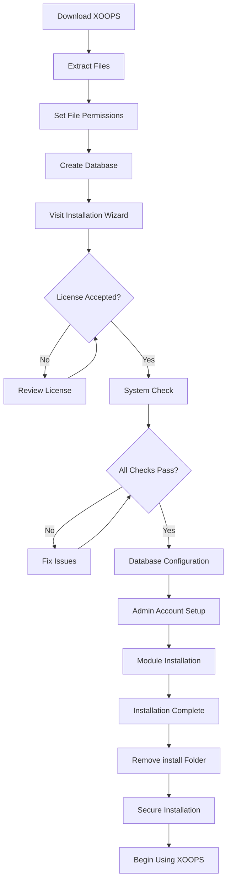

# Kompletny przewodnik instalacji XOOPS

Ten przewodnik zawiera obszerny przewodnik instalacji XOOPS od podstaw przy użyciu kreatora instalacji.

## Wymagania wstępne

Przed rozpoczęciem instalacji upewnij się, że masz:

- Dostęp do serwera WWW za pośrednictwem FTP lub SSH
- Dostęp administratora do serwera bazy danych
- Zarejestrowaną nazwę domeny
- Zweryfikowane wymagania serwera
- Dostępne narzędzia do tworzenia kopii zapasowych

## Proces instalacji



## Instalacja krok po kroku

### Krok 1: Pobieranie XOOPS

Pobierz najnowszą wersję z [https://xoops.org/](https://xoops.org/):

```bash
# Using wget
wget https://xoops.org/download/xoops-2.5.8.zip

# Using curl
curl -O https://xoops.org/download/xoops-2.5.8.zip
```

### Krok 2: Rozpakowanie plików

Rozpakuj archiwum XOOPS do katalogu głównego serwera WWW:

```bash
# Przejdź do katalogu głównego serwera WWW
cd /var/www/html

# Rozpakuj XOOPS
unzip xoops-2.5.8.zip

# Zmień nazwę folderu (opcjonalnie, ale zalecane)
mv xoops-2.5.8 xoops
cd xoops
```

### Krok 3: Ustawienie uprawnień do plików

Ustaw odpowiednie uprawnienia dla katalogów XOOPS:

```bash
# Uczyń katalogi zapisywalne (755 dla katalogów, 644 dla plików)
find . -type d -exec chmod 755 {} \;
find . -type f -exec chmod 644 {} \;

# Uczyń określone katalogi zapisywalne dla serwera WWW
chmod 777 uploads/
chmod 777 templates_c/
chmod 777 var/
chmod 777 cache/

# Zabezpiecz mainfile.php po instalacji
chmod 644 mainfile.php
```

### Krok 4: Tworzenie bazy danych

Utwórz nową bazę danych dla XOOPS przy użyciu MySQL:

```sql
-- Utwórz bazę danych
CREATE DATABASE xoops_db CHARACTER SET utf8mb4 COLLATE utf8mb4_unicode_ci;

-- Utwórz użytkownika
CREATE USER 'xoops_user'@'localhost' IDENTIFIED BY 'secure_password_here';

-- Przydziel uprawnienia
GRANT ALL PRIVILEGES ON xoops_db.* TO 'xoops_user'@'localhost';
FLUSH PRIVILEGES;
```

Lub przy użyciu phpMyAdmin:

1. Zaloguj się do phpMyAdmin
2. Kliknij kartę "Bazy danych"
3. Wpisz nazwę bazy danych: `xoops_db`
4. Wybierz kolację "utf8mb4_unicode_ci"
5. Kliknij "Utwórz"
6. Utwórz użytkownika o tej samej nazwie co baza danych
7. Przydziel wszystkie uprawnienia

### Krok 5: Uruchomienie kreatora instalacji

Otwórz przeglądarkę i przejdź do:

```
http://your-domain.com/xoops/install/
```

#### Faza sprawdzenia systemu

Kreator sprawdza konfigurację serwera:

- Wersja PHP >= 5.6.0
- MySQL/MariaDB dostępne
- Wymagane rozszerzenia PHP (GD, PDO, itp.)
- Uprawnienia katalogów
- Łączność z bazą danych

**Jeśli sprawdzenia się nie powiedzie:**

Zapoznaj się z sekcją #Typowe-problemy-instalacji dla rozwiązań.

#### Konfiguracja bazy danych

Wpisz dane logowania do bazy danych:

```
Host bazy danych: localhost
Nazwa bazy danych: xoops_db
Użytkownik bazy danych: xoops_user
Hasło bazy danych: [twoje_bezpieczne_hasło]
Prefiks tabeli: xoops_
```

**Ważne uwagi:**
- Jeśli host bazy danych różni się od localhost (np. serwer zdalny), wpisz prawidłową nazwę hosta
- Prefiks tabeli jest przydatny w przypadku uruchamiania wielu instancji XOOPS w jednej bazie danych
- Użyj silnego hasła zawierającego mieszane znaki, cyfry i symbole

#### Konfiguracja konta administratora

Utwórz konto administratora:

```
Nazwa użytkownika administratora: admin (lub wybierz inną)
Email administratora: admin@twoja-domena.com
Hasło administratora: [silne_unikalne_hasło]
Potwierdzenie hasła: [powtórz_hasło]
```

**Najlepsze praktyki:**
- Użyj unikatowej nazwy użytkownika, nie "admin"
- Użyj hasła z 16+ znakami
- Przechowuj poświadczenia w bezpiecznym menedżerze haseł
- Nigdy nie udostępniaj poświadczeń administratora

#### Instalacja modułu

Wybierz moduły domyślne do zainstalowania:

- **Moduł System** (wymagany) - Główna funkcjonalność XOOPS
- **Moduł Użytkownika** (wymagany) - Zarządzanie użytkownikami
- **Moduł Profil** (zalecany) - Profile użytkowników
- **Moduł PM (Wiadomość prywatna)** (zalecany) - Wewnętrzna wiadomość
- **Moduł WF-Channel** (opcjonalny) - Zarządzanie zawartością

Wybierz wszystkie zalecane moduły dla pełnej instalacji.

### Krok 6: Ukończenie instalacji

Po wszystkich krokach zobaczysz ekran potwierdzenia:

```
Instalacja ukończona!

Twoja instalacja XOOPS jest gotowa do użytku.
Panel administracyjny: http://twoja-domena.com/xoops/admin/
Panel użytkownika: http://twoja-domena.com/xoops/
```

### Krok 7: Zabezpieczenie instalacji

#### Usuwanie folderu instalacji

```bash
# Usuń katalog instalacji (KRYTYCZNE dla bezpieczeństwa)
rm -rf /var/www/html/xoops/install/

# Lub zmień jego nazwę
mv /var/www/html/xoops/install/ /var/www/html/xoops/install.bak
```

**OSTRZEŻENIE:** Nigdy nie pozostawiaj folderu instalacji dostępnego na produkcji!

#### Zabezpieczenie mainfile.php

```bash
# Uczyń mainfile.php tylko do odczytu
chmod 644 /var/www/html/xoops/mainfile.php

# Ustaw właściciela
chown www-data:www-data /var/www/html/xoops/mainfile.php
```

#### Ustawienie właściwych uprawnień plików

```bash
# Zalecane uprawnienia dla produkcji
find . -type f -name "*.php" -exec chmod 644 {} \;
find . -type d -exec chmod 755 {} \;

# Katalogi zapisywalne dla serwera WWW
chmod 777 uploads/ var/ cache/ templates_c/
```

#### Włączenie HTTPS/SSL

Skonfiguruj SSL na serwer WWW (nginx lub Apache).

**Dla Apache:**
```apache
<VirtualHost *:443>
    ServerName twoja-domena.com
    DocumentRoot /var/www/html/xoops

    SSLEngine on
    SSLCertificateFile /etc/ssl/certs/your-cert.crt
    SSLCertificateKeyFile /etc/ssl/private/your-key.key

    # Wymuś przekierowanie HTTPS
    <IfModule mod_rewrite.c>
        RewriteEngine On
        RewriteCond %{HTTPS} off
        RewriteRule ^(.*)$ https://%{HTTP_HOST}%{REQUEST_URI} [L,R=301]
    </IfModule>
</VirtualHost>
```

## Konfiguracja po instalacji

### 1. Dostęp do panelu administracyjnego

Przejdź do:
```
http://twoja-domena.com/xoops/admin/
```

Zaloguj się przy użyciu poświadczeń administratora.

### 2. Konfiguracja ustawień podstawowych

Skonfiguruj następujące:

- Nazwa i opis witryny
- Email administratora
- Strefa czasowa i format daty
- Optymalizacja dla wyszukiwarek

### 3. Testowanie instalacji

- [ ] Odwiedź stronę główną
- [ ] Sprawdź czy moduły się ładują
- [ ] Potwierdź czy rejestracja użytkowników działa
- [ ] Testuj funkcje panelu administracyjnego
- [ ] Potwierdź czy SSL/HTTPS działa

### 4. Zaplanuj kopie zapasowe

Skonfiguruj automatyczne kopie zapasowe:

```bash
# Utwórz skrypt kopii zapasowej (backup.sh)
#!/bin/bash
DATE=$(date +%Y%m%d_%H%M%S)
BACKUP_DIR="/backups/xoops"
XOOPS_DIR="/var/www/html/xoops"

# Kopia zapasowa bazy danych
mysqldump -u xoops_user -p[password] xoops_db > $BACKUP_DIR/db_$DATE.sql

# Kopia zapasowa plików
tar -czf $BACKUP_DIR/files_$DATE.tar.gz $XOOPS_DIR

echo "Kopia zapasowa ukończona: $DATE"
```

Zaplanuj za pomocą cron:
```bash
# Codzienna kopia zapasowa o 2 AM
0 2 * * * /usr/local/bin/backup.sh
```

## Typowe problemy instalacji

### Problem: Błędy odmowy dostępu

**Symptom:** "Odmowa dostępu" podczas przesyłania lub tworzenia plików

**Rozwiązanie:**
```bash
# Sprawdź użytkownika serwera WWW
ps aux | grep apache  # Dla Apache
ps aux | grep nginx   # Dla Nginx

# Napraw uprawnienia (zamień www-data na użytkownika serwera WWW)
chown -R www-data:www-data /var/www/html/xoops
chmod -R 755 /var/www/html/xoops
chmod 777 uploads/ var/ cache/ templates_c/
```

### Problem: Połączenie z bazą danych nie powiodło się

**Symptom:** "Nie można połączyć się z serwerem bazy danych"

**Rozwiązanie:**
1. Zweryfikuj dane logowania do bazy danych w kreatorze instalacji
2. Sprawdź czy MySQL/MariaDB jest uruchomiony:
   ```bash
   service mysql status  # lub mariadb
   ```
3. Zweryfikuj że baza danych istnieje:
   ```sql
   SHOW DATABASES;
   ```
4. Przetestuj połączenie z linii poleceń:
   ```bash
   mysql -h localhost -u xoops_user -p xoops_db
   ```

### Problem: Biały pusty ekran

**Symptom:** Odwiedzenie XOOPS pokazuje pustą stronę

**Rozwiązanie:**
1. Sprawdź dzienniki błędów PHP:
   ```bash
   tail -f /var/log/apache2/error.log
   ```
2. Włącz tryb debugowania w mainfile.php:
   ```php
   define('XOOPS_DEBUG', 1);
   ```
3. Sprawdź uprawnienia do pliku mainfile.php i plików konfiguracyjnych
4. Zweryfikuj że rozszerzenie PHP-MySQL jest zainstalowane

### Problem: Nie można pisać do katalogu przesyłania

**Symptom:** Funkcja przesyłania się nie powiedzie, "Nie można pisać do uploads/"

**Rozwiązanie:**
```bash
# Sprawdź bieżące uprawnienia
ls -la uploads/

# Napraw uprawnienia
chmod 777 uploads/
chown www-data:www-data uploads/

# Dla określonych plików
chmod 644 uploads/*
```

### Problem: Brakuje rozszerzeń PHP

**Symptom:** Sprawdzenie systemu się nie powiedzie z powodu brakujących rozszerzeń (GD, MySQL, itp.)

**Rozwiązanie (Ubuntu/Debian):**
```bash
# Zainstaluj bibliotekę PHP GD
apt-get install php-gd

# Zainstaluj obsługę PHP MySQL
apt-get install php-mysql

# Zrestartuj serwer WWW
systemctl restart apache2  # lub nginx
```

**Rozwiązanie (CentOS/RHEL):**
```bash
# Zainstaluj bibliotekę PHP GD
yum install php-gd

# Zainstaluj obsługę PHP MySQL
yum install php-mysql

# Zrestartuj serwer WWW
systemctl restart httpd
```

### Problem: Wolny proces instalacji

**Symptom:** Kreator instalacji się przekroczy lub działa bardzo wolno

**Rozwiązanie:**
1. Zwiększ timeout PHP w php.ini:
   ```ini
   max_execution_time = 300  # 5 minut
   ```
2. Zwiększ max_allowed_packet MySQL:
   ```sql
   SET GLOBAL max_allowed_packet = 256M;
   ```
3. Sprawdź zasoby serwera:
   ```bash
   free -h  # Sprawdzenie RAM
   df -h    # Sprawdzenie miejsca na dysku
   ```

### Problem: Panel administracyjny niedostępny

**Symptom:** Nie można uzyskać dostępu do panelu administracyjnego po instalacji

**Rozwiązanie:**
1. Zweryfikuj że użytkownik administratora istnieje w bazie danych:
   ```sql
   SELECT * FROM xoops_users WHERE uid = 1;
   ```
2. Wyczyść pamięć podręczną przeglądarki i ciasteczka
3. Sprawdź czy folder sesji można zapisywać:
   ```bash
   chmod 777 var/
   ```
4. Zweryfikuj że reguły htaccess nie blokują dostępu do panelu administracyjnego

## Lista kontrolna weryfikacji

Po instalacji zweryfikuj:

- [x] Strona główna XOOPS ładuje się prawidłowo
- [x] Panel administracyjny jest dostępny na /xoops/admin/
- [x] SSL/HTTPS działa
- [x] Folder instalacji jest usunięty lub niedostępny
- [x] Uprawnienia do plików są bezpieczne (644 dla plików, 755 dla katalogów)
- [x] Kopie zapasowe bazy danych są zaplanowane
- [x] Moduły ładują się bez błędów
- [x] System rejestracji użytkowników działa
- [x] Funkcjonalność przesyłania plików działa
- [x] Powiadomienia e-mail wysyłają się prawidłowo

## Następne kroki

Po ukończeniu instalacji:

1. Przeczytaj przewodnik konfiguracji podstawowej
2. Zabezpiecz instalację
3. Poznaj panel administracyjny
4. Zainstaluj dodatkowe moduły
5. Skonfiguruj grupy użytkowników i uprawnienia

---

**Tagi:** #instalacja #konfiguracja #rozpoczęcie #rozwiązywanie-problemów

**Powiązane artykuły:**
- Server-Requirements
- Upgrading-XOOPS
- ../Configuration/Security-Configuration
