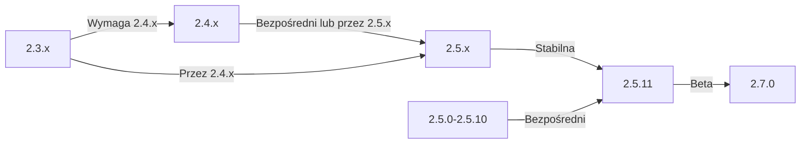

Ten przewodnik obejmuje aktualizację XOOPS ze starszych wersji na najnowsze wydanie, zachowując dane i dostosowania.

> **Informacje o wersji**
> - **Stabilna:** XOOPS 2.5.11
> - **Beta:** XOOPS 2.7.0 (testowanie)
> - **Przyszłość:** XOOPS 4.0 (w rozwoju - patrz mapa drogowa)

## Lista kontrolna przed aktualizacją

Przed rozpoczęciem aktualizacji zweryfikuj:

- [ ] Bieżąca wersja XOOPS udokumentowana
- [ ] Zidentyfikowana docelowa wersja XOOPS
- [ ] Ukończona pełna kopia zapasowa systemu
- [ ] Weryfikowana kopia zapasowa bazy danych
- [ ] Zapisana lista zainstalowanych modułów
- [ ] Udokumentowane niestandardowe modyfikacje
- [ ] Dostępne środowisko testowe
- [ ] Sprawdzona ścieżka aktualizacji (niektóre wersje pomijają wersje pośrednie)
- [ ] Zweryfikowane zasoby serwera (wystarczająca ilość miejsca na dysku, pamięci)
- [ ] Włączony tryb konserwacji

## Przewodnik ścieżki aktualizacji

Różne ścieżki aktualizacji w zależności od bieżącej wersji:



**Ważne:** Nigdy nie pomijaj głównych wersji. Jeśli uaktualnisz z 2.3.x, najpierw uaktualnij do 2.4.x, a następnie do 2.5.x.

## Krok 1: Ukończenia pełnej kopii zapasowej systemu

### Kopia zapasowa bazy danych

Użyj mysqldump do tworzenia kopii zapasowej bazy danych:

```bash
# Pełna kopia zapasowa bazy danych
mysqldump -u xoops_user -p xoops_db > /backups/xoops_db_backup_$(date +%Y%m%d_%H%M%S).sql

# Skompresowana kopia zapasowa
mysqldump -u xoops_user -p xoops_db | gzip > /backups/xoops_db_backup_$(date +%Y%m%d_%H%M%S).sql.gz
```

Lub przy użyciu phpMyAdmin:

1. Wybierz bazę danych XOOPS
2. Kliknij kartę "Export"
3. Wybierz format "SQL"
4. Wybierz "Zapisz jako plik"
5. Kliknij "Go"

Weryfikuj plik kopii zapasowej:

```bash
# Sprawdź rozmiar kopii zapasowej
ls -lh /backups/xoops_db_backup*.sql

# Weryfikuj integralność kopii zapasowej (nieskompresowany)
head -20 /backups/xoops_db_backup_*.sql

# Weryfikuj skompresowaną kopię zapasową
zcat /backups/xoops_db_backup_*.sql.gz | head -20
```

### Kopia zapasowa systemu plików

Kopia zapasowa wszystkich plików XOOPS:

```bash
# Skompresowana kopia zapasowa pliku
tar -czf /backups/xoops_files_$(date +%Y%m%d_%H%M%S).tar.gz /var/www/html/xoops

# Nieskompresowany (szybszy, wymaga więcej miejsca na dysku)
tar -cf /backups/xoops_files_$(date +%Y%m%d_%H%M%S).tar /var/www/html/xoops

# Pokaż postęp kopii zapasowej
tar -czf /backups/xoops_files_$(date +%Y%m%d_%H%M%S).tar.gz --verbose /var/www/html/xoops | tail
```

Przechowuj kopie zapasowe bezpiecznie:

```bash
# Bezpieczne przechowywanie kopii zapasowej
chmod 600 /backups/xoops_*
ls -lah /backups/

# Opcjonalnie: Skopiuj na zdalne przechowywanie
scp /backups/xoops_* user@backup-server:/secure/backups/
```

### Testowanie przywracania kopii zapasowej

**KRYTYCZNE:** Zawsze testuj czy kopia zapasowa działa:

```bash
# Weryfikuj zawartość archiwum tar
tar -tzf /backups/xoops_files_*.tar.gz | head -20

# Rozpakuj do lokalizacji testowej
mkdir /tmp/restore_test
cd /tmp/restore_test
tar -xzf /backups/xoops_files_*.tar.gz

# Weryfikuj że kluczowe pliki istnieją
ls -la xoops/mainfile.php
ls -la xoops/install/
```

## Krok 2: Włączenie trybu konserwacji

Uniemożliwić użytkownikom dostęp do witryny podczas aktualizacji:

### Opcja 1: Panel administracyjny XOOPS

1. Zaloguj się do panelu administracyjnego
2. Przejdź do System > Konserwacja
3. Włącz "Tryb konserwacji witryny"
4. Ustaw wiadomość konserwacji
5. Zapisz

### Opcja 2: Ręczny tryb konserwacji

Utwórz plik konserwacji w katalogu głównym serwera WWW:

```html
<!-- /var/www/html/maintenance.html -->
<!DOCTYPE html>
<html>
<head>
    <title>W konserwacji</title>
    <style>
        body { font-family: Arial; text-align: center; padding: 50px; }
        h1 { color: #333; }
        p { color: #666; margin: 20px 0; }
    </style>
</head>
<body>
    <h1>Witryna w konserwacji</h1>
    <p>Aktualnie uaktualniamy naszą witrynę.</p>
    <p>Przewidywany czas: około 30 minut.</p>
    <p>Dziękujemy za cierpliwość!</p>
</body>
</html>
```

Skonfiguruj Apache do wyświetlenia strony konserwacji:

```apache
# W .htaccess lub konfiguracji vhost
ErrorDocument 503 /maintenance.html

# Przekieruj cały ruch na stronę konserwacji
<IfModule mod_rewrite.c>
    RewriteEngine On
    RewriteCond %{REMOTE_ADDR} !^192\.168\.1\.100$  # Twój IP
    RewriteRule ^(.*)$ - [R=503,L]
</IfModule>
```

## Krok 3: Pobieranie nowej wersji

Pobierz XOOPS z oficjalnej witryny:

```bash
# Pobierz najnowszą wersję
cd /tmp
wget https://xoops.org/download/xoops-2.5.8.zip

# Weryfikuj suma kontrolna (jeśli podana)
sha256sum xoops-2.5.8.zip
# Porównaj z oficjalnym hashem SHA256

# Rozpakuj do tymczasowej lokalizacji
unzip xoops-2.5.8.zip
cd xoops-2.5.8
```

## Krok 4: Przygotowanie pliku przed aktualizacją

### Zidentyfikuj niestandardowe modyfikacje

Sprawdź czy są dostosowane pliki jądra:

```bash
# Szukaj zmodyfikowanych plików (pliki z nowszą mtime)
find /var/www/html/xoops -type f -newer /var/www/html/xoops/install.php

# Sprawdzaj niestandardowe motywy
ls /var/www/html/xoops/themes/
# Zanotuj niestandardowe motywy

# Sprawdzaj niestandardowe moduły
ls /var/www/html/xoops/modules/
# Zanotuj niestandardowe moduły utworzone przez ciebie
```

### Udokumentuj bieżący stan

Utwórz raport aktualizacji:

```bash
cat > /tmp/upgrade_report.txt << EOF
=== Raport aktualizacji XOOPS ===
Data: $(date)
Bieżąca wersja: 2.5.6
Docelowa wersja: 2.5.8

=== Zainstalowane moduły ===
$(ls /var/www/html/xoops/modules/)

=== Niestandardowe modyfikacje ===
[Udokumentuj niestandardowe modyfikacje motywu lub modułu]

=== Motywy ===
$(ls /var/www/html/xoops/themes/)

=== Stan wtyczki ===
[Wylist niestandardowe modyfikacje kodu]

EOF
```

## Krok 5: Połączenie nowych plików z bieżącą instalacją

### Strategia: Zachowaj niestandardowe pliki

Zastąp pliki jądra XOOPS, ale zachowaj:
- `mainfile.php` (twoja konfiguracja bazy danych)
- Niestandardowe motywy w `themes/`
- Niestandardowe moduły w `modules/`
- Przesłane przez użytkownika w `uploads/`
- Dane witryny w `var/`

### Ręczny proces połączenia

```bash
# Ustaw zmienne
XOOPS_OLD="/var/www/html/xoops"
XOOPS_NEW="/tmp/xoops-2.5.8"
BACKUP="/backups/pre-upgrade"

# Utwórz kopię zapasową przed aktualizacją
mkdir -p $BACKUP
cp -r $XOOPS_OLD/* $BACKUP/

# Skopiuj nowe pliki (ale zachowaj wrażliwe pliki)
# Skopiuj wszystko oprócz chronionych katalogów
rsync -av --exclude='mainfile.php' \
    --exclude='modules/custom*' \
    --exclude='themes/custom*' \
    --exclude='uploads' \
    --exclude='var' \
    --exclude='cache' \
    --exclude='templates_c' \
    $XOOPS_NEW/ $XOOPS_OLD/

# Weryfikuj że kluczowe pliki są zachowane
ls -la $XOOPS_OLD/mainfile.php
```

### Używanie upgrade.php (jeśli dostępny)

Niektóre wersje XOOPS zawierają zautomatyzowany skrypt aktualizacji:

```bash
# Skopiuj nowe pliki z instalatorem
cp -r /tmp/xoops-2.5.8/* /var/www/html/xoops/

# Uruchom kreatora aktualizacji
# Odwiedź: http://twoja-domena.com/xoops/upgrade/
```

### Uprawnienia do pliku po połączeniu

Przywróć właściwe uprawnienia:

```bash
# Ustaw właściciela
chown -R www-data:www-data /var/www/html/xoops

# Ustaw uprawnienia katalogów
find /var/www/html/xoops -type d -exec chmod 755 {} \;

# Ustaw uprawnienia pliku
find /var/www/html/xoops -type f -exec chmod 644 {} \;

# Uczyń katalogi zapisywalne
chmod 777 /var/www/html/xoops/cache
chmod 777 /var/www/html/xoops/templates_c
chmod 777 /var/www/html/xoops/uploads
chmod 777 /var/www/html/xoops/var

# Zabezpiecz mainfile.php
chmod 644 /var/www/html/xoops/mainfile.php
```

## Krok 6: Migracja bazy danych

### Przejrzyj zmiany w bazie danych

Sprawdzaj informacje o wydaniu XOOPS dotyczące zmian struktury bazy danych:

```bash
# Wyodrębni i przejrzyj pliki migracji SQL
find /tmp/xoops-2.5.8 -name "*.sql" -type f
# Udokumentuj wszystkie znalezione pliki .sql
```

### Uruchom aktualizacje bazy danych

### Opcja 1: Automatyczna aktualizacja (jeśli dostępna)

Używaj panelu administracyjnego:

1. Zaloguj się do administracji
2. Przejdź do **System > Baza danych**
3. Kliknij "Sprawdzaj aktualizacje"
4. Przejrzyj oczekujące zmiany
5. Kliknij "Zastosuj aktualizacje"

### Opcja 2: Ręczne aktualizacje bazy danych

Wykonaj migracyjne pliki SQL:

```bash
# Połącz się z bazą danych
mysql -u xoops_user -p xoops_db

# Wyświetl oczekujące zmiany (różni się w zależności od wersji)
SELECT * FROM xoops_config WHERE conf_name LIKE '%version%';

# Uruchom skrypty migracji ręcznie jeśli będzie to potrzebne
SOURCE /tmp/xoops-2.5.8/migrate_2.5.6_to_2.5.8.sql;
```

### Weryfikacja bazy danych

Weryfikuj integralność bazy danych po aktualizacji:

```sql
-- Sprawdź spójność bazy danych
REPAIR TABLE xoops_users;
OPTIMIZE TABLE xoops_users;

-- Weryfikuj że kluczowe tabele istnieją
SHOW TABLES LIKE 'xoops_%';

-- Sprawdzaj liczę wierszy (powinna się zwiększyć lub pozostać ta sama)
SELECT COUNT(*) FROM xoops_users;
SELECT COUNT(*) FROM xoops_posts;
```

## Krok 7: Weryfikacja aktualizacji

### Sprawdzenie strony głównej

Odwiedź stronę główną XOOPS:

```
http://twoja-domena.com/xoops/
```

Oczekiwane: Strona ładuje się bez błędów, wyświetla się prawidłowo

### Sprawdzenie panelu administracyjnego

Uzyskaj dostęp do administracji:

```
http://twoja-domena.com/xoops/admin/
```

Weryfikuj:
- [ ] Panel administracyjny ładuje się
- [ ] Nawigacja działa
- [ ] Pulpit wyświetla się prawidłowo
- [ ] Brak błędów bazy danych w dziennikach

### Weryfikacja modułu

Sprawdzaj zainstalowane moduły:

1. Przejdź do **Moduły > Moduły** w administracji
2. Weryfikuj czy wszystkie moduły są nadal zainstalowane
3. Sprawdzaj czy są jakieś komunikaty o błędach
4. Włącz moduły, które były wyłączone

### Sprawdzenie pliku dziennika

Przejrzyj dzienniki systemu w poszukiwaniu błędów:

```bash
# Sprawdzaj dziennik błędów serwera WWW
tail -50 /var/log/apache2/error.log

# Sprawdzaj dziennik błędów PHP
tail -50 /var/log/php_errors.log

# Sprawdzaj dziennik systemowy XOOPS (jeśli dostępny)
# W panelu administracyjnym: System > Dzienniki
```

### Testuj funkcje jądra

- [ ] Logowanie/wylogowanie użytkownika działa
- [ ] Rejestracja użytkownika działa
- [ ] Funkcje przesyłania plików
- [ ] Wysyłane powiadomienia e-mail
- [ ] Funkcjonalność wyszukiwania działa
- [ ] Funkcje administracyjne operacyjne
- [ ] Funkcjonalność modułu nienaruszony

## Krok 8: Oczyszczanie po aktualizacji

### Usuń tymczasowe pliki

```bash
# Usuń katalog ekstrakcji
rm -rf /tmp/xoops-2.5.8

# Wyczyść pamięć podręczną szablonów (bezpieczne do usunięcia)
rm -rf /var/www/html/xoops/templates_c/*

# Wyczyść pamięć podręczną witryny
rm -rf /var/www/html/xoops/cache/*
```

### Usuń tryb konserwacji

Ponownie włącz normalny dostęp do witryny:

```apache
# Usuń przekierowanie trybu konserwacji z .htaccess
# Lub usuń plik maintenance.html
rm /var/www/html/maintenance.html
```

### Aktualizuj dokumentację

Zaktualizuj notatki aktualizacji:

```bash
# Udokumentuj pomyślną aktualizację
cat >> /tmp/upgrade_report.txt << EOF

=== Wyniki aktualizacji ===
Status: SUKCES
Data aktualizacji: $(date)
Nowa wersja: 2.5.8
Czas trwania: [czas w minutach]

Testy po aktualizacji:
- [x] Strona główna ładuje się
- [x] Panel administracyjny dostępny
- [x] Moduły funkcjonalne
- [x] Rejestracja użytkownika działa
- [x] Baza danych zoptymalizowana

EOF
```

## Rozwiązywanie problemów aktualizacji

### Problem: Biały pusty ekran po aktualizacji

**Symptom:** Strona główna nic nie pokazuje

**Rozwiązanie:**
```bash
# Sprawdzaj błędy PHP
tail -f /var/log/apache2/error.log

# Tymczasowo włącz tryb debugowania
echo "define('XOOPS_DEBUG', 1);" >> /var/www/html/xoops/mainfile.php

# Sprawdzaj uprawnienia do pliku
ls -la /var/www/html/xoops/mainfile.php

# Przywróć z kopii zapasowej jeśli będzie to potrzebne
cp /backups/xoops_files_*.tar.gz /tmp/
cd /tmp && tar -xzf xoops_files_*.tar.gz
```

### Problem: Błąd połączenia z bazą danych

**Symptom:** Wiadomość "Nie można połączyć się z serwerem bazy danych"

**Rozwiązanie:**
```bash
# Weryfikuj poświadczenia bazy danych w mainfile.php
grep -i "database\|host\|user" /var/www/html/xoops/mainfile.php

# Testuj połączenie
mysql -h localhost -u xoops_user -p xoops_db -e "SELECT 1"

# Sprawdzaj status MySQL
systemctl status mysql

# Weryfikuj że baza danych nadal istnieje
mysql -u xoops_user -p -e "SHOW DATABASES" | grep xoops
```

### Problem: Panel administracyjny niedostępny

**Symptom:** Nie można uzyskać dostępu do /xoops/admin/

**Rozwiązanie:**
```bash
# Sprawdzaj reguły .htaccess
cat /var/www/html/xoops/.htaccess

# Weryfikuj że pliki administracyjne istnieją
ls -la /var/www/html/xoops/admin/

# Sprawdzaj czy mod_rewrite jest włączony
apache2ctl -M | grep rewrite

# Zrestartuj serwer WWW
systemctl restart apache2
```

### Problem: Moduły się nie ładują

**Symptom:** Moduły pokazują błędy lub są dezaktywowane

**Rozwiązanie:**
```bash
# Weryfikuj że pliki modułu istnieją
ls /var/www/html/xoops/modules/

# Sprawdzaj uprawnienia modułu
ls -la /var/www/html/xoops/modules/*/

# Sprawdzaj konfigurację modułu w bazie danych
mysql -u xoops_user -p xoops_db -e "SELECT * FROM xoops_modules WHERE module_status = 0"

# Ponownie aktywuj moduły w panelu administracyjnym
# System > Moduły > Kliknij moduł > Aktualizuj status
```

### Problem: Błędy odmowy dostępu

**Symptom:** "Odmowa dostępu" podczas przesyłania lub zapisywania

**Rozwiązanie:**
```bash
# Sprawdzaj właściciela pliku
ls -la /var/www/html/xoops/ | head -20

# Napraw właściciela
chown -R www-data:www-data /var/www/html/xoops

# Napraw uprawnienia katalogu
find /var/www/html/xoops -type d -exec chmod 755 {} \;

# Uczyń pamięć podręczną/przesłania zapisywalne
chmod 777 /var/www/html/xoops/cache
chmod 777 /var/www/html/xoops/templates_c
chmod 777 /var/www/html/xoops/uploads
chmod 777 /var/www/html/xoops/var
```

### Problem: Powolne ładowanie strony

**Symptom:** Strony ładują się bardzo powoli po aktualizacji

**Rozwiązanie:**
```bash
# Wyczyść wszystkie pamięci podręczne
rm -rf /var/www/html/xoops/cache/*
rm -rf /var/www/html/xoops/templates_c/*

# Zoptymalizuj bazę danych
mysql -u xoops_user -p xoops_db << EOF
OPTIMIZE TABLE xoops_users;
OPTIMIZE TABLE xoops_posts;
OPTIMIZE TABLE xoops_config;
ANALYZE TABLE xoops_users;
EOF

# Sprawdzaj dziennik błędów PHP w poszukiwaniu ostrzeżeń
grep -i "deprecated\|warning" /var/log/php_errors.log | tail -20

# Tymczasowo zwiększ pamięć PHP/czas wykonywania
# Edytuj php.ini:
memory_limit = 256M
max_execution_time = 300
```

## Procedura przywracania

Jeśli aktualizacja się krytycznie nie powiedzie, przywróć z kopii zapasowej:

### Przywróć bazę danych

```bash
# Przywróć z kopii zapasowej
mysql -u xoops_user -p xoops_db < /backups/xoops_db_backup_YYYYMMDD_HHMMSS.sql

# Lub ze skompresowanej kopii zapasowej
gunzip < /backups/xoops_db_backup_YYYYMMDD_HHMMSS.sql.gz | mysql -u xoops_user -p xoops_db

# Weryfikuj przywracanie
mysql -u xoops_user -p xoops_db -e "SELECT COUNT(*) FROM xoops_users"
```

### Przywróć system plików

```bash
# Zatrzymaj serwer WWW
systemctl stop apache2

# Usuń bieżącą instalację
rm -rf /var/www/html/xoops/*

# Rozpakuj kopię zapasową
cd /var/www/html
tar -xzf /backups/xoops_files_YYYYMMDD_HHMMSS.tar.gz

# Napraw uprawnienia
chown -R www-data:www-data xoops/
find xoops -type d -exec chmod 755 {} \;
find xoops -type f -exec chmod 644 {} \;
chmod 777 xoops/cache xoops/templates_c xoops/uploads xoops/var

# Uruchom serwer WWW
systemctl start apache2

# Weryfikuj przywracanie
# Odwiedź http://twoja-domena.com/xoops/
```

## Lista kontrolna weryfikacji aktualizacji

Po ukończeniu aktualizacji zweryfikuj:

- [ ] Wersja XOOPS zaktualizowana (sprawdzaj administracja > Informacje systemowe)
- [ ] Strona główna ładuje się bez błędów
- [ ] Wszystkie moduły funkcjonalne
- [ ] Logowanie użytkownika działa
- [ ] Panel administracyjny dostępny
- [ ] Przesłania plików działają
- [ ] Powiadomienia e-mail funkcjonalne
- [ ] Integralność bazy danych weryfikowana
- [ ] Uprawnienia do pliku prawidłowe
- [ ] Tryb konserwacji usunięty
- [ ] Kopie zapasowe zabezpieczone i przetestowane
- [ ] Wydajność akceptowalna
- [ ] SSL/HTTPS działa
- [ ] Brak komunikatów o błędach w dziennikach

## Następne kroki

Po pomyślnej aktualizacji:

1. Zaktualizuj wszelkie niestandardowe moduły do najnowszych wersji
2. Przejrzyj informacje o wydaniu dla przestarzałych funkcji
3. Rozważ optymalizację wydajności
4. Zaktualizuj ustawienia bezpieczeństwa
5. Dokładnie testuj wszystkie funkcje
6. Zachowaj pliki kopii zapasowych bezpiecznie

---

**Tagi:** #aktualizacja #konserwacja #kopia-zapasowa #migracja-bazy-danych

**Powiązane artykuły:**
- ../../06-Publisher-Module/User-Guide/Installation
- Server-Requirements
- ../Configuration/Basic-Configuration
- ../Configuration/Security-Configuration
