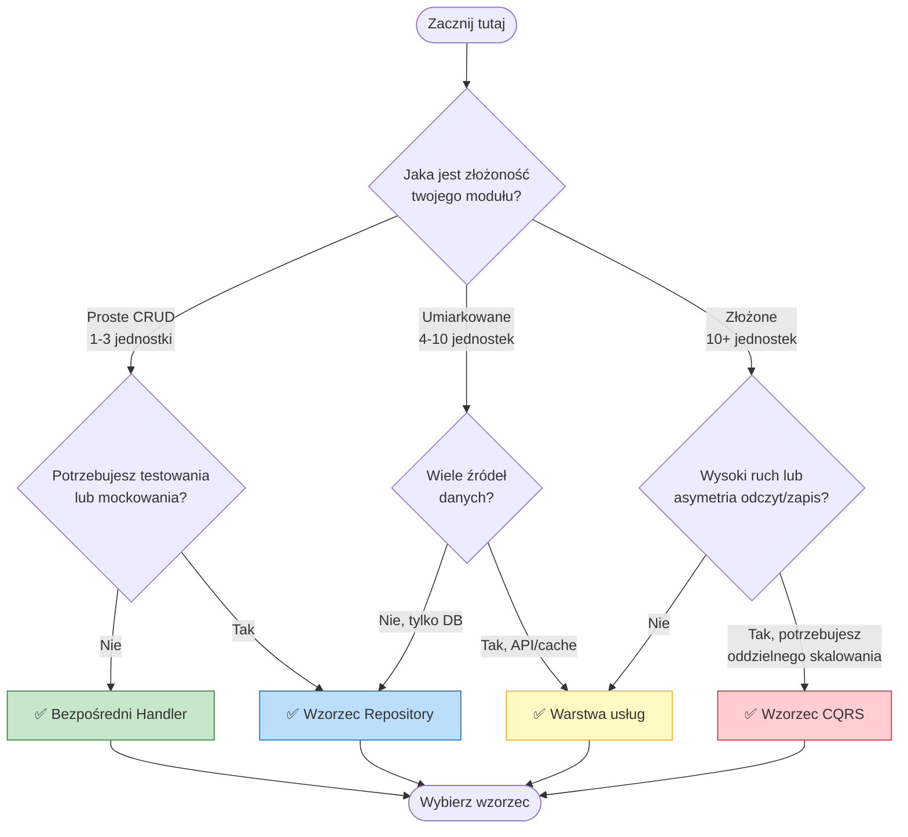
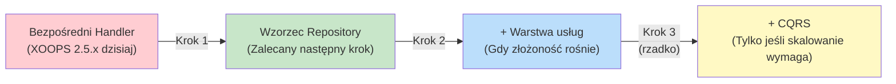

<span class="version-badge version-25x">2.5.x ✅</span> <span class="version-badge version-40x">4.0.x ✅</span>

> **Jaki wzorzec powinienem używać?** To drzewo decyzyjne pomaga wybrać między bezpośrednimi handlerami, wzorcem Repository, warstwą usług i CQRS.

---

## Szybkie drzewo decyzyjne



---

## Porównanie wzorców

| Kryteria | Bezpośredni Handler | Repository | Warstwa usług | CQRS |
|----------|---------------|------------|---------------|------|
| **Złożoność** | ⭐ | ⭐⭐ | ⭐⭐⭐ | ⭐⭐⭐⭐⭐ |
| **Testowość** | ❌ Trudne | ✅ Dobre | ✅ Świetne | ✅ Świetne |
| **Elastyczność** | ❌ Niska | ✅ Średnia | ✅ Wysoka | ✅ Bardzo wysoka |
| **XOOPS 2.5.x** | ✅ Natywne | ✅ Działa | ✅ Działa | ⚠️ Złożone |
| **XOOPS 4.0** | ⚠️ Przestarzałe | ✅ Zalecane | ✅ Zalecane | ✅ Do skalowania |
| **Rozmiar zespołu** | 1 dev | 1-3 devs | 2-5 devs | 5+ devs |
| **Konserwacja** | ❌ Wyższa | ✅ Umiarkowana | ✅ Niższa | ⚠️ Wymaga doświadczenia |

---

## Kiedy używać każdego wzorca

### ✅ Bezpośredni Handler (`XoopsPersistableObjectHandler`)

**Najlepszy dla:** Prostych modułów, szybkich prototypów, nauki XOOPS

```php
// Prosty i bezpośredni - dobry dla małych modułów
$handler = xoops_getModuleHandler('article', 'news');
$articles = $handler->getObjects(new Criteria('status', 1));
```

**Wybierz to gdy:**
- Budujesz prosty moduł z 1-3 tabelami bazy danych
- Tworzysz szybki prototyp
- Jesteś jedynym deweloperem i nie potrzebujesz testów
- Moduł nie będzie się znacznie rozwijać

**Ograniczenia:**
- Trudne do testowania jednostkowego (zależność globalna)
- Ścisłe sprzężenie do warstwy bazy danych XOOPS
- Logika biznesowa ma tendencję do wyciekania do kontrolerów

---

### ✅ Wzorzec Repository

**Najlepszy dla:** Większości modułów, zespołów chcących testowości

```php
// Abstrakcja pozwala na mockowanie do testów
interface ArticleRepositoryInterface {
    public function findPublished(): array;
    public function save(Article $article): void;
}

class XoopsArticleRepository implements ArticleRepositoryInterface {
    private $handler;

    public function __construct() {
        $this->handler = xoops_getModuleHandler('article', 'news');
    }

    public function findPublished(): array {
        return $this->handler->getObjects(new Criteria('status', 1));
    }
}
```

**Wybierz to gdy:**
- Chcesz pisać testy jednostkowe
- Możesz zmienić źródła danych później (DB → API)
- Pracujesz z 2+ deweloperami
- Budujesz moduły do dystrybucji

**Ścieżka ulepszenia:** To jest zalecany wzorzec dla przygotowania XOOPS 4.0.

---

### ✅ Warstwa usług

**Najlepszy dla:** Modułów ze złożoną logiką biznesową

```php
// Usługa koordynuje wiele repozytoriów i zawiera reguły biznesowe
class ArticlePublicationService {
    public function __construct(
        private ArticleRepositoryInterface $articles,
        private NotificationServiceInterface $notifications,
        private CacheInterface $cache
    ) {}

    public function publish(int $articleId): void {
        $article = $this->articles->find($articleId);
        $article->setStatus('published');
        $article->setPublishedAt(new DateTime());

        $this->articles->save($article);
        $this->notifications->notifySubscribers($article);
        $this->cache->invalidate("article:{$articleId}");
    }
}
```

**Wybierz to gdy:**
- Operacje obejmują wiele źródeł danych
- Reguły biznesowe są złożone
- Potrzebujesz zarządzania transakcjami
- Wiele części aplikacji robi to samo

**Ścieżka ulepszenia:** Połącz z Repository dla solidnej architektury.

---

### ⚠️ CQRS (Command Query Responsibility Segregation)

**Najlepszy dla:** Modułów dużej skali z asymetrią odczyt/zapis

```php
// Polecenia modyfikują stan
class PublishArticleCommand {
    public function __construct(
        public readonly int $articleId,
        public readonly int $publisherId
    ) {}
}

// Zapytania czytają stan (mogą używać denormalizowanych modeli odczytu)
class GetPublishedArticlesQuery {
    public function __construct(
        public readonly int $limit = 10
    ) {}
}
```

**Wybierz to gdy:**
- Odczyty znacznie przewyższają zapisy (100:1 lub więcej)
- Potrzebujesz innego skalowania dla odczytów vs zapisów
- Złożone wymagania raportowania/analityki
- Event sourcing byłby korzystny dla Twojej domeny

**Ostrzeżenie:** CQRS dodaje znaczną złożoność. Większość modułów XOOPS tego nie potrzebuje.

---

## Zalecana ścieżka ulepszenia



### Krok 1: Zawiń handlery w repozytorium (2-4 godziny)

1. Utwórz interfejs dla twoich potrzeb dostępu do danych
2. Zaimplementuj go korzystając z istniejącego handlera
3. Wstrzyknij repozytorium zamiast wywoływać `xoops_getModuleHandler()` bezpośrednio

### Krok 2: Dodaj warstwę usług gdy potrzeba (1-2 dni)

1. Gdy logika biznesowa pojawia się w kontrolerach, wyciągnij do usługi
2. Usługa używa repozytoriów, nie handlerów bezpośrednio
3. Kontrolery stają się cienkie (trasa → usługa → odpowiedź)

### Krok 3: Rozważ CQRS tylko jeśli (rzadko)

1. Masz miliony odczytów dziennie
2. Modele odczytu i zapisu są znacznie różne
3. Potrzebujesz event sourcingu do dziennika audytu
4. Masz zespół doświadczony w CQRS

---

## Karta szybkiego odniesienia

| Pytanie | Odpowiedź |
|----------|--------|
| **"Potrzebuję tylko zapisać/załadować dane"** | Bezpośredni Handler |
| **"Chcę pisać testy"** | Wzorzec Repository |
| **"Mam złożone reguły biznesowe"** | Warstwa usług |
| **"Potrzebuję skalować odczyty oddzielnie"** | CQRS |
| **"Przygotowuję się na XOOPS 4.0"** | Repository + Warstwa usług |

---

## Powiązana dokumentacja

- [Przewodnik wzorca Repository](Patterns/Repository-Pattern.md)
- [Przewodnik wzorca Service Layer](Patterns/Service-Layer-Pattern.md)
- [Przewodnik wzorca CQRS](../07-XOOPS-4.0/Implementation-Guides/CQRS-Pattern-Guide.md) *(zaawansowany)*
- [Umowa trybu hybrydowego](../07-XOOPS-4.0/Specifications/Hybrid-Mode-Contract.md)

---

#patterns #data-access #decision-tree #best-practices #xoops
