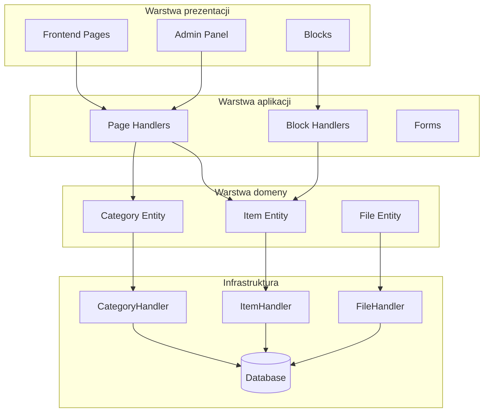
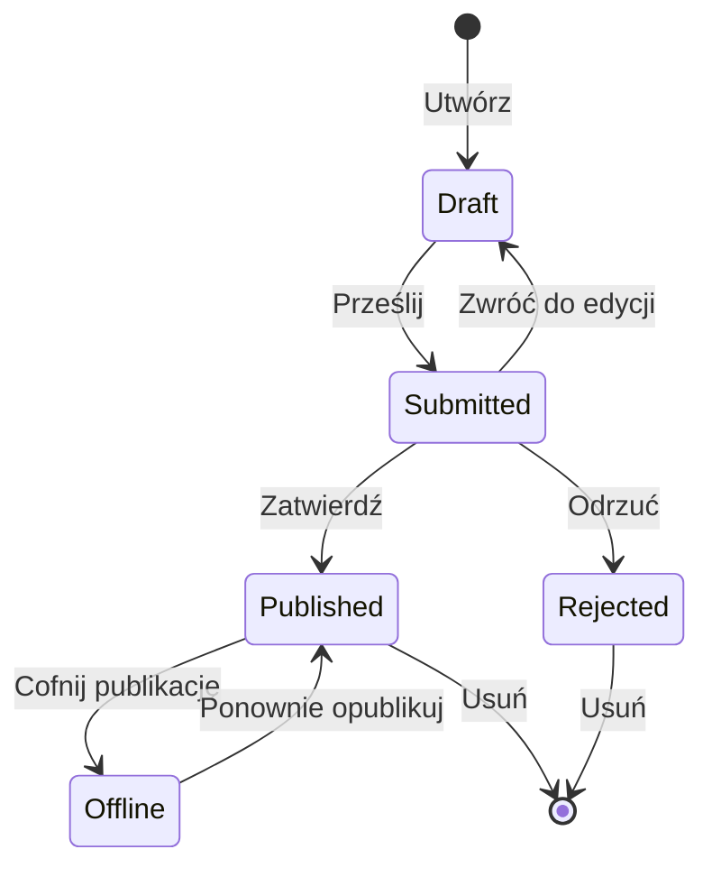

## Przegląd

Dokument ten zawiera analizę techniczną architektury modułu Publisher, wzorców i szczegółów implementacji. Użyj jako odniesienia do zrozumienia jak moduł XOOPS o jakości produkcyjnej jest strukturyzowany.

## Przegląd architektury



## Struktura katalogu

```
publisher/
├── admin/
│   ├── index.php           # Panel administracyjny
│   ├── item.php            # Zarządzanie artykułami
│   ├── category.php        # Zarządzanie kategoriami
│   ├── permission.php      # Uprawnienia
│   ├── file.php            # Menedżer plików
│   └── menu.php            # Menu administracyjne
├── assets/
│   ├── css/
│   ├── js/
│   └── images/
├── class/
│   ├── Category.php        # Jednostka kategorii
│   ├── CategoryHandler.php # Dostęp do danych kategorii
│   ├── Item.php            # Jednostka artykułu
│   ├── ItemHandler.php     # Dostęp do danych artykułu
│   ├── File.php            # Załącznik pliku
│   ├── FileHandler.php     # Dostęp do danych pliku
│   ├── Form/               # Klasy formularza
│   ├── Common/             # Narzędzia
│   └── Helper.php          # Pomocnik modułu
├── include/
│   ├── common.php          # Inicjalizacja
│   ├── functions.php       # Funkcje narzędziowe
│   ├── oninstall.php       # Haki instalacji
│   ├── onupdate.php        # Haki aktualizacji
│   └── search.php          # Integracja wyszukiwania
├── language/
├── templates/
├── sql/
└── xoops_version.php
```

## Analiza jednostki

### Jednostka artykułu

```php
class Item extends \XoopsObject
{
    // Pola
    public function initVar(): void
    {
        $this->initVar('itemid', XOBJ_DTYPE_INT, null, false);
        $this->initVar('categoryid', XOBJ_DTYPE_INT, 0, false);
        $this->initVar('title', XOBJ_DTYPE_TXTBOX, '', true);
        $this->initVar('subtitle', XOBJ_DTYPE_TXTBOX, '');
        $this->initVar('summary', XOBJ_DTYPE_TXTAREA, '');
        $this->initVar('body', XOBJ_DTYPE_TXTAREA, '', true);
        $this->initVar('uid', XOBJ_DTYPE_INT, 0);
        $this->initVar('status', XOBJ_DTYPE_INT, 0);
        $this->initVar('datesub', XOBJ_DTYPE_INT, time());
        // ... więcej pól
    }

    // Metody biznesowe
    public function isPublished(): bool
    {
        return $this->getVar('status') == _PUBLISHER_STATUS_PUBLISHED;
    }

    public function canEdit(int $userId): bool
    {
        return $this->getVar('uid') == $userId
            || $this->isAdmin($userId);
    }
}
```

### Wzorzec obsługi

```php
class ItemHandler extends \XoopsPersistableObjectHandler
{
    public function __construct(\XoopsDatabase $db)
    {
        parent::__construct(
            $db,
            'publisher_items',
            Item::class,
            'itemid',
            'title'
        );
    }

    public function getPublishedItems(int $limit = 10): array
    {
        $criteria = new \CriteriaCompo();
        $criteria->add(new \Criteria('status', _PUBLISHER_STATUS_PUBLISHED));
        $criteria->setSort('datesub');
        $criteria->setOrder('DESC');
        $criteria->setLimit($limit);

        return $this->getObjects($criteria);
    }
}
```

## System uprawnień

### Typy uprawnień

| Uprawnienie | Opis |
|------------|-------------|
| `publisher_view` | Przeglądaj kategorię/artykuły |
| `publisher_submit` | Przesyłaj nowe artykuły |
| `publisher_approve` | Auto-zatwierdzaj przesyłania |
| `publisher_moderate` | Przejrzyj artykuły oczekujące |
| `publisher_global` | Globalne uprawnienia modułu |

### Sprawdzenie uprawnień

```php
class PermissionHandler
{
    public function isGranted(string $permission, int $categoryId): bool
    {
        $userId = $GLOBALS['xoopsUser']?->uid() ?? 0;
        $groups = $this->getUserGroups($userId);

        return $this->grouppermHandler->checkRight(
            $permission,
            $categoryId,
            $groups,
            $this->helper->getModule()->mid()
        );
    }
}
```

## Stany przepływu



## Struktura szablonu

### Szablony frontend

| Szablon | Cel |
|----------|---------|
| `publisher_index.tpl` | Strona główna modułu |
| `publisher_item.tpl` | Pojedynczy artykuł |
| `publisher_category.tpl` | Listowanie kategorii |
| `publisher_submit.tpl` | Formularz przesyłania |
| `publisher_search.tpl` | Wyniki wyszukiwania |

### Szablony bloków

| Szablon | Cel |
|----------|---------|
| `publisher_block_latest.tpl` | Ostatnie artykuły |
| `publisher_block_spotlight.tpl` | Artykuł wyróżniony |
| `publisher_block_category.tpl` | Menu kategorii |

## Kluczowe używane wzorce

1. **Wzorzec obsługi** - Hermetyzacja dostępu do danych
2. **Obiekt wartości** - Stałe statusu
3. **Metoda szablonu** - Generowanie formularza
4. **Strategia** - Różne tryby wyświetlania
5. **Obserwator** - Powiadomienia o zdarzeniach

## Lekcje dla rozwoju modułu

1. Używaj XoopsPersistableObjectHandler do CRUD
2. Implementuj szczegółowe uprawnienia
3. Oddziel prezentację od logiki
4. Używaj Criteria dla zapytań
5. Wspieraj wiele statusów zawartości
6. Integruj z systemem powiadomień XOOPS

## Powiązana dokumentacja

- Tworzenie artykułów - Zarządzanie artykułami
- Zarządzanie kategoriami - System kategorii
- Konfiguracja uprawnień - Konfiguracja uprawnień
- Przewodnik programisty/Haki i zdarzenia - Punkty rozszerzenia

#publisher #architecture #analysis #development #xoops
