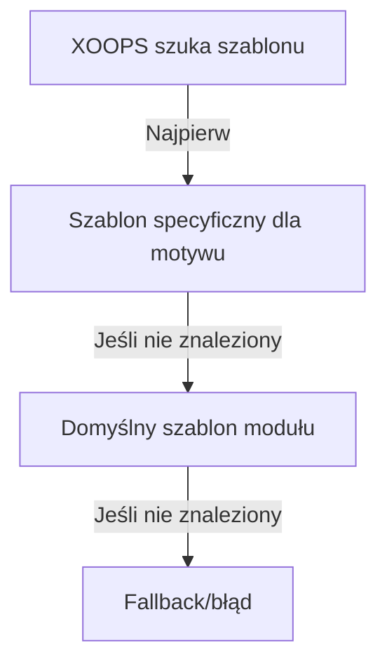

# Własne Szablony w Publisher

> Przewodnik do tworzenia i dostosowywania szablonów Publisher przy użyciu Smarty, CSS i przesłonięć HTML.

---

## Przegląd Systemu Szablonów

### Czym Są Szablony?

Szablony kontrolują sposób wyświetlania treści w Publisher:

```
Szablony renderują:
  ├── Wyświetlanie artykułów
  ├── Listy kategorii
  ├── Strony archiwum
  ├── Listy artykułów
  ├── Sekcje komentarzy
  ├── Wyniki wyszukiwania
  ├── Bloki
  └── Strony administracyjne
```

### Typy Szablonów

```
Szablony Bazowe:
  ├── publisher_index.tpl (strona główna modułu)
  ├── publisher_item.tpl (pojedynczy artykuł)
  ├── publisher_category.tpl (strona kategorii)
  └── publisher_archive.tpl (widok archiwum)

Szablony Bloków:
  ├── publisher_block_latest.tpl
  ├── publisher_block_categories.tpl
  ├── publisher_block_archives.tpl
  └── publisher_block_top.tpl

Szablony Administracyjne:
  ├── admin_articles.tpl
  ├── admin_categories.tpl
  └── admin_*
```

---

## Katalogi Szablonów

### Struktura Plików Szablonów

```
Instalacja XOOPS:
├── modules/publisher/
│   └── templates/
│       ├── Publisher/ (szablony bazowe)
│       │   ├── publisher_index.tpl
│       │   ├── publisher_item.tpl
│       │   ├── publisher_category.tpl
│       │   ├── blocks/
│       │   │   ├── publisher_block_latest.tpl
│       │   │   └── publisher_block_categories.tpl
│       │   └── css/
│       │       └── publisher.css
│       └── Themes/ (specyficzne dla motywu)
│           ├── Classic/
│           ├── Modern/
│           └── Dark/

themes/yourtheme/
└── modules/
    └── publisher/
        ├── templates/
        │   └── publisher_custom.tpl
        ├── css/
        │   └── custom.css
        └── images/
            └── icons/
```

### Hierarchia Szablonów



---

## Tworzenie Własnych Szablonów

### Kopiuj Szablon do Motywu

**Metoda 1: Przez Menedżer Plików**

```
1. Przejdź do /themes/yourtheme/modules/publisher/
2. Utwórz katalog, jeśli nie istnieje:
   - templates/
   - css/
   - js/ (opcjonalnie)
3. Skopiuj plik szablonu modułu:
   modules/publisher/templates/Publisher/publisher_item.tpl
   → themes/yourtheme/modules/publisher/templates/publisher_item.tpl
4. Edytuj kopię motywu (nie kopię modułu!)
```

**Metoda 2: Przez FTP/SSH**

```bash
# Utwórz katalog przesłonięcia motywu
mkdir -p /path/to/xoops/themes/yourtheme/modules/publisher/templates

# Skopiuj pliki szablonów
cp /path/to/xoops/modules/publisher/templates/Publisher/*.tpl \
   /path/to/xoops/themes/yourtheme/modules/publisher/templates/

# Sprawdź czy pliki zostały skopiowane
ls /path/to/xoops/themes/yourtheme/modules/publisher/templates/
```

### Edytuj Własny Szablon

Otwórz kopię motywu w edytorze tekstu:

```
Plik: /themes/yourtheme/modules/publisher/templates/publisher_item.tpl

Edytuj:
  1. Zachowaj zmienne Smarty
  2. Modyfikuj strukturę HTML
  3. Dodaj niestandardowe klasy CSS
  4. Dostosuj logikę wyświetlania
```

---

## Podstawy Szablonów Smarty

### Zmienne Smarty

Publisher dostarcza zmienne do szablonów:

#### Zmienne Artykułu

```smarty
{* Zmienne Pojedynczego Artykułu *}
<h1>{$item->title()}</h1>
<p>{$item->description()}</p>
<p>{$item->body()}</p>
<p>Autor: {$item->uname()} dnia {$item->date('l, F j, Y')}</p>
<p>Kategoria: {$item->category}</p>
<p>Wyświetlenia: {$item->views()}</p>
```

#### Zmienne Kategorii

```smarty
{* Zmienne Kategorii *}
<h2>{$category->name()}</h2>
<p>{$category->description()}</p>
image()}" alt="{$category->name()}">
<p>Artykuły: {$category->itemCount()}</p>
```

#### Zmienne Bloku

```smarty
{* Blok Ostatnich Artykułów *}
{foreach from=$items item=item}
  <div class="article">
    <h3>{$item->title()}</h3>
    <p>{$item->summary()}</p>
  </div>
{/foreach}
```

### Typowa Składnia Smarty

```smarty
{* Zmienna *}
{$variable}
{$array.key}
{$object->method()}

{* Warunkowy *}
{if $condition}
  <p>Zawartość wyświetlana, jeśli prawda</p>
{else}
  <p>Zawartość wyświetlana, jeśli fałsz</p>
{/if}

{* Pętla *}
{foreach from=$array item=item}
  <li>{$item}</li>
{/foreach}

{* Funkcje *}
{$variable|truncate:100:"..."}
{$date|date_format:"%Y-%m-%d"}
{$text|htmlspecialchars}

{* Komentarze *}
{* To jest komentarz Smarty, nie wyświetlany *}
```

---

## Przykłady Szablonów

### Szablon Pojedynczego Artykułu

**Plik: publisher_item.tpl**

```smarty
<!-- Szczegółowy Widok Artykułu -->
<div class="publisher-item">

  <!-- Sekcja Nagłówka -->
  <div class="article-header">
    <h1>{$item->title()}</h1>

    {if $item->subtitle()}
      <h2 class="article-subtitle">{$item->subtitle()}</h2>
    {/if}

    <div class="article-meta">
      <span class="author">
        Autor: <a href="{$item->authorUrl()}">{$item->uname()}</a>
      </span>
      <span class="date">
        {$item->date('l, F j, Y')}
      </span>
      <span class="category">
        <a href="{$item->categoryUrl()}">
          {$item->category}
        </a>
      </span>
      <span class="views">
        {$item->views()} wyświetleń
      </span>
    </div>
  </div>

  <!-- Obraz Wyróżniony -->
  {if $item->image()}
    <div class="article-featured-image">
      image()}"
           alt="{$item->title()}"
           class="img-fluid">
    </div>
  {/if}

  <!-- Treść Artykułu -->
  <div class="article-content">
    {$item->body()}
  </div>

  <!-- Tagi -->
  {if $item->tags()}
    <div class="article-tags">
      <strong>Tagi:</strong>
      {foreach from=$item->tags() item=tag}
        <span class="tag">
          <a href="{$tag->url()}">{$tag->name()}</a>
        </span>
      {/foreach}
    </div>
  {/if}

  <!-- Sekcja Stopki -->
  <div class="article-footer">
    <div class="article-actions">
      {if $canEdit}
        <a href="{$editUrl}" class="btn btn-primary">Edytuj</a>
      {/if}
      {if $canDelete}
        <a href="{$deleteUrl}" class="btn btn-danger">Usuń</a>
      {/if}
    </div>

    {if $allowRatings}
      <div class="article-rating">
        <!-- Komponent oceny -->
      </div>
    {/if}
  </div>

</div>

<!-- Sekcja Komentarzy -->
{if $allowComments}
  <div class="article-comments">
    <h3>Komentarze</h3>
    {include file="publisher_comments.tpl"}
  </div>
{/if}
```

### Szablon Listy Kategorii

**Plik: publisher_category.tpl**

```smarty
<!-- Strona Kategorii -->
<div class="publisher-category">

  <!-- Nagłówek Kategorii -->
  <div class="category-header">
    <h1>{$category->name()}</h1>

    {if $category->image()}
      image()}"
           alt="{$category->name()}"
           class="category-image">
    {/if}

    {if $category->description()}
      <p class="category-description">
        {$category->description()}
      </p>
    {/if}
  </div>

  <!-- Podkategorie -->
  {if $subcategories}
    <div class="subcategories">
      <h3>Podkategorie</h3>
      <ul>
        {foreach from=$subcategories item=sub}
          <li>
            <a href="{$sub->url()}">{$sub->name()}</a>
            ({$sub->itemCount()} artykułów)
          </li>
        {/foreach}
      </ul>
    </div>
  {/if}

  <!-- Lista Artykułów -->
  <div class="articles-list">
    <h2>Artykuły</h2>

    {if count($items) > 0}
      {foreach from=$items item=item}
        <article class="article-preview">
          {if $item->image()}
            <div class="article-image">
              <a href="{$item->url()}">
                image()}" alt="{$item->title()}">
              </a>
            </div>
          {/if}

          <div class="article-content">
            <h3>
              <a href="{$item->url()}">{$item->title()}</a>
            </h3>

            <div class="article-meta">
              <span class="date">{$item->date('M d, Y')}</span>
              <span class="author">autor: {$item->uname()}</span>
            </div>

            <p class="article-excerpt">
              {$item->description()|truncate:200:"..."}
            </p>

            <a href="{$item->url()}" class="read-more">
              Czytaj Więcej →
            </a>
          </div>
        </article>
      {/foreach}

      <!-- Stronicowanie -->
      {if $pagination}
        <nav class="pagination">
          {$pagination}
        </nav>
      {/if}
    {else}
      <p class="no-articles">
        W tej kategorii nie ma jeszcze artykułów.
      </p>
    {/if}
  </div>

</div>
```

### Szablon Bloku Ostatnich Artykułów

**Plik: publisher_block_latest.tpl**

```smarty
<!-- Blok Ostatnich Artykułów -->
<div class="publisher-block-latest">
  <h3>{$block_title|default:"Ostatnie Artykuły"}</h3>

  {if count($items) > 0}
    <ul class="article-list">
      {foreach from=$items item=item name=articles}
        <li class="article-item">
          <a href="{$item->url()}" title="{$item->title()}">
            {$item->title()}
          </a>
          <span class="date">
            {$item->date('M d, Y')}
          </span>

          {if $show_summary && $item->description()}
            <p class="summary">
              {$item->description()|truncate:80:"..."}
            </p>
          {/if}
        </li>
      {/foreach}
    </ul>
  {else}
    <p>Brak dostępnych artykułów.</p>
  {/if}
</div>
```

---

## Stylowanie za Pomocą CSS

### Niestandardowe Pliki CSS

Utwórz niestandardowy CSS w motywie:

```
/themes/yourtheme/modules/publisher/css/custom.css
```

### Struktura Szablonu Bazowego

Zrozum strukturę HTML:

```html
<!-- Moduł Publisher -->
<div class="publisher-module">

  <!-- Widok Elementu -->
  <div class="publisher-item">
    <div class="article-header">...</div>
    <div class="article-featured-image">...</div>
    <div class="article-content">...</div>
    <div class="article-footer">...</div>
  </div>

  <!-- Widok Kategorii -->
  <div class="publisher-category">
    <div class="category-header">...</div>
    <div class="articles-list">...</div>
  </div>

  <!-- Blok -->
  <div class="publisher-block-latest">
    <ul class="article-list">...</ul>
  </div>

</div>
```

### Przykłady CSS

```css
/* Kontener Artykułu */
.publisher-item {
  background: #fff;
  border: 1px solid #ddd;
  border-radius: 4px;
  padding: 20px;
  margin-bottom: 20px;
}

/* Nagłówek Artykułu */
.article-header {
  border-bottom: 2px solid #f0f0f0;
  padding-bottom: 15px;
  margin-bottom: 20px;
}

.article-header h1 {
  font-size: 2.5em;
  margin: 0 0 10px 0;
  color: #333;
}

.article-subtitle {
  font-size: 1.3em;
  color: #666;
  font-style: italic;
  margin: 0;
}

/* Informacje Meta Artykułu */
.article-meta {
  font-size: 0.9em;
  color: #999;
}

.article-meta span {
  margin-right: 20px;
}

.article-meta a {
  color: #0066cc;
  text-decoration: none;
}

.article-meta a:hover {
  text-decoration: underline;
}

/* Obraz Wyróżniony Artykułu */
.article-featured-image {
  margin: 20px 0;
  text-align: center;
}

.article-featured-image img {
  max-width: 100%;
  height: auto;
  border-radius: 4px;
}

/* Zawartość Artykułu */
.article-content {
  font-size: 1.1em;
  line-height: 1.8;
  color: #333;
}

.article-content h2 {
  font-size: 1.8em;
  margin: 30px 0 15px 0;
  color: #222;
}

.article-content h3 {
  font-size: 1.4em;
  margin: 20px 0 10px 0;
  color: #444;
}

.article-content p {
  margin-bottom: 15px;
}

.article-content ul,
.article-content ol {
  margin: 15px 0 15px 30px;
}

.article-content li {
  margin-bottom: 8px;
}

/* Tagi Artykułu */
.article-tags {
  margin-top: 20px;
  padding-top: 20px;
  border-top: 1px solid #f0f0f0;
}

.tag {
  display: inline-block;
  background: #f0f0f0;
  padding: 5px 10px;
  margin: 5px 5px 5px 0;
  border-radius: 3px;
  font-size: 0.9em;
}

.tag a {
  color: #0066cc;
  text-decoration: none;
}

.tag a:hover {
  text-decoration: underline;
}

/* Lista Artykułów Kategorii */
.publisher-category .articles-list {
  margin-top: 30px;
}

.article-preview {
  display: flex;
  margin-bottom: 30px;
  padding-bottom: 30px;
  border-bottom: 1px solid #f0f0f0;
}

.article-preview:last-child {
  border-bottom: none;
}

.article-image {
  flex: 0 0 200px;
  margin-right: 20px;
}

.article-image img {
  width: 100%;
  height: 150px;
  object-fit: cover;
  border-radius: 4px;
}

.article-content {
  flex: 1;
}

/* Responsywny */
@media (max-width: 768px) {
  .article-preview {
    flex-direction: column;
  }

  .article-image {
    flex: 1;
    margin: 0 0 15px 0;
  }

  .article-header h1 {
    font-size: 1.8em;
  }
}
```

---

## Dokumentacja Zmiennych Szablonu

### Obiekt Item (Artykuł)

```smarty
{* Właściwości Artykułu *}
{$item->id()}              {* ID Artykułu *}
{$item->title()}           {* Tytuł artykułu *}
{$item->description()}     {* Krótki opis *}
{$item->body()}            {* Pełna treść *}
{$item->subtitle()}        {* Podtytuł *}
{$item->uname()}           {* Nazwa użytkownika autora *}
{$item->authorId()}        {* ID użytkownika autora *}
{$item->date()}            {* Data publikacji *}
{$item->modified()}        {* Ostatnio zmodyfikowany *}
{$item->image()}           {* URL obrazu wyróżnionego *}
{$item->views()}           {* Liczba wyświetleń *}
{$item->categoryId()}      {* ID Kategorii *}
{$item->category()}        {* Nazwa kategorii *}
{$item->categoryUrl()}     {* URL kategorii *}
{$item->url()}             {* URL artykułu *}
{$item->status()}          {* Status artykułu *}
{$item->rating()}          {* Średnia ocena *}
{$item->comments()}        {* Liczba komentarzy *}
{$item->tags()}            {* Tablica tagów artykułu *}

{* Sformatowane Metody *}
{$item->date('Y-m-d')}               {* Sformatowana data *}
{$item->description()|truncate:100}  {* Skrócona *}
```

### Obiekt Kategorii

```smarty
{* Właściwości Kategorii *}
{$category->id()}          {* ID Kategorii *}
{$category->name()}        {* Nazwa kategorii *}
{$category->description()} {* Opis *}
{$category->image()}       {* URL Obrazu *}
{$category->parentId()}    {* ID Kategorii Nadrzędnej *}
{$category->itemCount()}   {* Liczba artykułów *}
{$category->url()}         {* URL kategorii *}
{$category->status()}      {* Status *}
```

### Zmienne Bloku

```smarty
{$items}           {* Tablica elementów *}
{$categories}      {* Tablica kategorii *}
{$pagination}      {* HTML Stronicowania *}
{$total}           {* Liczba całkowita *}
{$limit}           {* Elementy na stronę *}
{$page}            {* Bieżąca strona *}
```

---

## Warunki Szablonu

### Typowe Sprawdzenia Warunkowe

```smarty
{* Sprawdź czy zmienna istnieje i nie jest pusta *}
{if $variable}
  <p>{$variable}</p>
{/if}

{* Sprawdź czy tablica ma elementy *}
{if count($items) > 0}
  {foreach from=$items item=item}
    <li>{$item->title()}</li>
  {/foreach}
{else}
  <p>Brak dostępnych elementów.</p>
{/if}

{* Sprawdź uprawnienia użytkownika *}
{if $canEdit}
  <a href="edit.php?id={$item->id()}">Edytuj</a>
{/if}

{if $isAdmin}
  <a href="delete.php?id={$item->id()}">Usuń</a>
{/if}

{* Sprawdź ustawienia modułu *}
{if $allowComments}
  {include file="publisher_comments.tpl"}
{/if}

{* Sprawdź status *}
{if $item->status() == 1}
  <span class="published">Opublikowany</span>
{elseif $item->status() == 0}
  <span class="draft">Szkic</span>
{/if}
```

---

## Zaawansowane Techniki Szablonów

### Dołącz Inne Szablony

```smarty
{* Dołącz inny szablon *}
{include file="publisher_comments.tpl"}

{* Dołącz ze zmiennymi *}
{include file="publisher_article_preview.tpl" item=$item}

{* Dołącz jeśli istnieje *}
{include file="custom_header.tpl"|default:"header.tpl"}
```

### Przypisz Zmienne w Szablonie

```smarty
{* Przypisz zmienną do późniejszego użycia *}
{assign var="articleTitle" value=$item->title()}

{* Użyj przypisanej zmiennej *}
<h1>{$articleTitle}</h1>

{* Przypisz złożone wartości *}
{assign var="count" value=$items|count}
{if $count > 0}
  <p>Znaleziono {$count} artykułów</p>
{/if}
```

### Filtry Szablonów

```smarty
{* Filtry tekstu *}
{$text|htmlspecialchars}        {* Ucieknij HTML *}
{$text|strip_tags}              {* Usuń tagi HTML *}
{$text|truncate:100:"..."}     {* Skróć tekst *}
{$text|upper}                   {* WIELKIE LITERY *}
{$text|lower}                   {* małe litery *}

{* Filtry daty *}
{$date|date_format:"%Y-%m-%d"}  {* Sformatuj datę *}
{$date|date_format:"%l, %F %j, %Y"} {* Pełny format *}

{* Filtry liczb *}
{$number|string_format:"%.2f"}  {* Sformatuj liczbę *}
{$number|number_format}         {* Dodaj separatory *}

{* Filtry tablic *}
{$array|implode:", "}           {* Połącz tablicę *}
{$array|count}                  {* Policz elementy *}
```

---

## Debugowanie Szablonów

### Wyświetl Zmienne Smarty

Do debugowania (usuń w produkcji):

```smarty
{* Pokaż wartość zmiennej *}
<pre>{$variable|print_r}</pre>

{* Pokaż wszystkie dostępne zmienne *}
<pre>{$smarty.all|print_r}</pre>

{* Sprawdź czy zmienna istnieje *}
{if isset($variable)}
  Zmienna istnieje
{/if}

{* Wyświetl informacje debugowania *}
{if $debug}
  Element: {$item->id()}<br>
  Tytuł: {$item->title()}<br>
  Kategoria: {$item->categoryId()}<br>
{/if}
```

### Włącz Tryb Debugowania

W `/modules/publisher/xoops_version.php` lub ustawieniach administracyjnych:

```php
// Włącz debugowanie
define('PUBLISHER_DEBUG', true);
```

---

## Migracja Szablonów

### Ze Starej Wersji Publisher

Jeśli uaktualnisz ze starszej wersji:

1. Porównaj stare i nowe pliki szablonów
2. Scal niestandardowe zmiany
3. Użyj nowych nazw zmiennych
4. Dokładnie przetestuj
5. Zrób kopię zapasową starych szablonów

### Ścieżka Uaktualnienia

```
Stary szablon         Nowy szablon            Akcja
publisher_item.tpl → publisher_item.tpl   Scal dostosowania
publisher_cat.tpl  → publisher_category.tpl Zmień nazwę, scal
block_latest.tpl   → publisher_block_latest.tpl Zmień nazwę, sprawdź
```

---

## Najlepsze Praktyki

### Wytyczne Szablonów

```
✓ Przechowuj logikę biznesową w PHP, logikę wyświetlania w szablonach
✓ Używaj znaczących nazw klas CSS
✓ Komentuj złożone sekcje
✓ Testuj projekt responsywny
✓ Waliduj dane wyjściowe HTML
✓ Uciekaj dane użytkownika
✓ Używaj semantycznego HTML
✓ Utrzymuj szablony DRY (Nie Powtarzaj Się)
```

### Wskazówki Wydajności

```
✓ Minimalizuj zapytania do bazy danych w szablonach
✓ Buforuj skompilowane szablony
✓ Leniwie ładuj obrazy
✓ Zmniejsz CSS/JavaScript
✓ Używaj CDN do zasobów
✓ Optymalizuj obrazy
✗ Unikaj złożonej logiki Smarty
```

---

## Powiązana Dokumentacja

- Dokumentacja API
- Haki i Zdarzenia
- Konfiguracja
- Tworzenie Artykułów

---

## Zasoby

- [Dokumentacja Smarty](https://www.smarty.net/documentation)
- [Publisher GitHub](https://github.com/XoopsModules25x/publisher)
- [Przewodnik Szablonów XOOPS](../../02-Core-Concepts/Templates/Smarty-Basics.md)

---

#publisher #templates #smarty #customization #themeing #xoops
