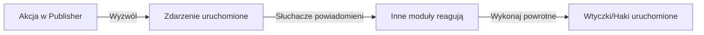

# Haki i Zdarzenia Publisher

> Kompletny przewodnik do rozszerzania funkcjonalności Publisher przy użyciu zdarzeń, haków i wtyczek.

---

## Przegląd Systemu Zdarzeń

### Czym Są Zdarzenia?

Zdarzenia pozwalają innym modułom na zareagowanie na działania Publisher:

```
Akcja Publisher → Wyzwól Zdarzenie → Inne moduły słuchają/reagują

Przykłady:
  - Artykuł utworzony → Wyślij wiadomość e-mail z powiadomieniem
  - Artykuł opublikowany → Zaktualizuj media społecznościowe
  - Komentarz opublikowany → Powiadom autora
  - Kategoria utworzona → Zaktualizuj indeks wyszukiwania
```

### Przepływ Zdarzenia



---

## Dostępne Zdarzenia

### Zdarzenia Elementu (Artykułu)

#### publisher.item.created

Wywoływane gdy nowy artykuł jest tworzony.

```php
// Punkt wyzwalania w Publisher
xoops_events()->trigger('publisher.item.created', array(
    'item' => $item,
    'itemid' => $item->getVar('itemid'),
    'title' => $item->getVar('title'),
    'uid' => $item->getVar('uid')
));
```

**Przykład Słuchacza:**

```php
// Nasłuchuj utworzenia artykułu
xoops_events()->attach('publisher.item.created', 'onArticleCreated');

function onArticleCreated($item) {
    $itemId = $item['itemid'];
    $title = $item['title'];
    $uid = $item['uid'];

    // Wyślij powiadomienie e-mail
    sendEmailNotification($uid, "Nowy artykuł: $title");

    // Zarejestruj aktywność
    logActivity('Artykuł utworzony', $itemId);

    // Zaktualizuj indeks wyszukiwania
    updateSearchIndex($itemId);
}
```

#### publisher.item.updated

Wywoływane gdy artykuł jest aktualizowany.

```php
xoops_events()->trigger('publisher.item.updated', array(
    'item' => $item,
    'itemid' => $itemId,
    'changes' => $changes
));
```

#### publisher.item.deleted

Wywoływane gdy artykuł jest usuwany.

```php
xoops_events()->trigger('publisher.item.deleted', array(
    'itemid' => $itemId,
    'title' => $title,
    'categoryid' => $categoryId
));
```

#### publisher.item.published

Wywoływane gdy status artykułu zmienia się na opublikowany.

```php
xoops_events()->trigger('publisher.item.published', array(
    'item' => $item,
    'itemid' => $itemId
));
```

#### publisher.item.approved

Wywoływane gdy oczekujący artykuł jest zatwierdzony.

```php
xoops_events()->trigger('publisher.item.approved', array(
    'item' => $item,
    'itemid' => $itemId,
    'uid' => $uid
));
```

#### publisher.item.rejected

Wywoływane gdy artykuł jest odrzucony.

```php
xoops_events()->trigger('publisher.item.rejected', array(
    'item' => $item,
    'itemid' => $itemId,
    'reason' => $reason
));
```

### Zdarzenia Kategorii

#### publisher.category.created

Wywoływane gdy kategoria jest tworzona.

```php
xoops_events()->trigger('publisher.category.created', array(
    'category' => $category,
    'categoryid' => $categoryId,
    'name' => $name
));
```

#### publisher.category.updated

Wywoływane gdy kategoria jest aktualizowana.

```php
xoops_events()->trigger('publisher.category.updated', array(
    'category' => $category,
    'categoryid' => $categoryId
));
```

#### publisher.category.deleted

Wywoływane gdy kategoria jest usuwana.

```php
xoops_events()->trigger('publisher.category.deleted', array(
    'categoryid' => $categoryId,
    'name' => $name,
    'itemCount' => $itemCount
));
```

### Zdarzenia Komentarza

#### publisher.comment.created

Wywoływane gdy komentarz jest opublikowany.

```php
xoops_events()->trigger('publisher.comment.created', array(
    'comment' => $comment,
    'commentid' => $commentId,
    'itemid' => $itemId
));
```

#### publisher.comment.approved

Wywoływane gdy komentarz jest zatwierdzony.

```php
xoops_events()->trigger('publisher.comment.approved', array(
    'comment' => $comment,
    'commentid' => $commentId
));
```

#### publisher.comment.deleted

Wywoływane gdy komentarz jest usuwany.

```php
xoops_events()->trigger('publisher.comment.deleted', array(
    'commentid' => $commentId,
    'itemid' => $itemId
));
```

---

## Nasłuchiwanie Zdarzeń

### Zarejestruj Słuchacza Zdarzenia

W swoim module lub wtyczce:

```php
<?php
// Zarejestruj słuchacza w xoops_version.php lub w pliku inicjalizacji
xoops_events()->attach(
    'publisher.item.created',
    array('MyModuleListener', 'onPublisherItemCreated')
);

// Lub użyj nazwy funkcji
xoops_events()->attach(
    'publisher.item.created',
    'my_module_on_item_created'
);
?>
```

### Metoda Klasy Słuchacza

```php
<?php
class MyModuleListener {
    public static function onPublisherItemCreated($data) {
        $itemId = $data['itemid'];
        $title = $data['title'];

        // Wykonaj akcję
        self::notifySubscribers($itemId, $title);
    }

    protected static function notifySubscribers($itemId, $title) {
        // Implementacja
    }
}
?>
```

### Funkcja Słuchacza

```php
<?php
function my_module_on_item_created($data) {
    $itemId = $data['itemid'];
    $title = $data['title'];
    $uid = $data['uid'];

    // Wyślij powiadomienie
    notifyUser($uid, "Artykuł utworzony: $title");
}
?>
```

---

## Przykłady Zdarzeń

### Przykład 1: Wyślij E-mail Podczas Tworzenia Artykułu

```php
<?php
// Nasłuchuj utworzenia artykułu
xoops_events()->attach(
    'publisher.item.created',
    'send_article_notification_email'
);

function send_article_notification_email($data) {
    $itemId = $data['itemid'];
    $title = $data['title'];
    $uid = $data['uid'];

    // Pobierz obiekt użytkownika
    $userHandler = xoops_getHandler('user');
    $user = $userHandler->get($uid);

    if (!$user) {
        return;
    }

    // Pobierz adresy e-mail administratora
    $config = xoops_getModuleConfig();
    $adminEmails = $config['admin_emails'];

    // Przygotuj e-mail
    $subject = "Nowy Artykuł: $title";
    $message = "Nowy artykuł został utworzony:\n\n";
    $message .= "Tytuł: $title\n";
    $message .= "Autor: " . $user->getVar('uname') . "\n";
    $message .= "Data: " . date('Y-m-d H:i:s') . "\n";
    $message .= "ID: $itemId\n\n";
    $message .= "Link: " . XOOPS_URL . "/modules/publisher/?op=showitem&itemid=$itemId\n";

    // Wyślij do administratorów
    foreach (explode(',', $adminEmails) as $email) {
        xoops_mail($email, $subject, $message);
    }
}
?>
```

### Przykład 2: Zaktualizuj Indeks Wyszukiwania

```php
<?php
// Nasłuchuj zdarzenia opublikowania artykułu
xoops_events()->attach(
    'publisher.item.published',
    'update_search_index'
);

function update_search_index($data) {
    $itemId = $data['itemid'];
    $item = $data['item'];

    // Zaktualizuj indeks wyszukiwania
    $searchHandler = xoops_getModuleHandler('Search');
    $searchHandler->indexArticle($itemId, array(
        'title' => $item->getVar('title'),
        'content' => $item->getVar('body'),
        'author' => $item->getVar('uname'),
        'date' => $item->getVar('datesub')
    ));
}
?>
```

### Przykład 3: Automatyczne Opublikowanie w Media Społecznościowych

```php
<?php
// Nasłuchuj publikacji artykułu
xoops_events()->attach(
    'publisher.item.published',
    'post_to_social_media'
);

function post_to_social_media($data) {
    $item = $data['item'];
    $itemId = $data['itemid'];

    // Pobierz konfigurację
    $config = xoops_getModuleConfig();

    if ($config['post_to_twitter']) {
        postToTwitter(
            $item->getVar('title'),
            XOOPS_URL . '/modules/publisher/?op=showitem&itemid=' . $itemId
        );
    }

    if ($config['post_to_facebook']) {
        postToFacebook(
            $item->getVar('title'),
            $item->getVar('description')
        );
    }
}

function postToTwitter($text, $url) {
    // Integracja API Twitter
    // Użyj biblioteki OAuth Twitter
}

function postToFacebook($title, $description) {
    // Integracja API Facebook
}
?>
```

### Przykład 4: Synchronizacja z Systemem Zewnętrznym

```php
<?php
// Nasłuchuj utworzenia i aktualizacji artykułu
xoops_events()->attach(
    'publisher.item.created',
    'sync_external_system'
);

xoops_events()->attach(
    'publisher.item.updated',
    'sync_external_system'
);

function sync_external_system($data) {
    $item = $data['item'];
    $itemId = $data['itemid'];

    // Pobierz konfigurację API zewnętrznego
    $config = xoops_getModuleConfig();
    $apiUrl = $config['external_api_url'];
    $apiKey = $config['external_api_key'];

    // Przygotuj ładunek
    $payload = json_encode(array(
        'id' => $itemId,
        'title' => $item->getVar('title'),
        'content' => $item->getVar('body'),
        'date' => date('c', $item->getVar('datesub'))
    ));

    // Wyślij do systemu zewnętrznego
    $ch = curl_init($apiUrl);
    curl_setopt($ch, CURLOPT_POST, true);
    curl_setopt($ch, CURLOPT_POSTFIELDS, $payload);
    curl_setopt($ch, CURLOPT_HTTPHEADER, array(
        'Content-Type: application/json',
        'Authorization: Bearer ' . $apiKey
    ));
    curl_exec($ch);
    curl_close($ch);
}
?>
```

---

## System Haków

### Haki Publisher

Haki pozwalają na modyfikacje zachowania Publisher:

#### publisher.view.article.start

Wywoływane przed wyświetleniem artykułu.

```php
xoops_events()->attach(
    'publisher.view.article.start',
    'modify_article_before_display'
);

function modify_article_before_display(&$item) {
    // Modyfikuj element przed wyświetleniem
    $title = $item->getVar('title');
    $item->setVar('title', '[WYRÓŻNIONE] ' . $title);
}
```

#### publisher.view.article.end

Wywoływane po wyświetleniu artykułu.

```php
xoops_events()->attach(
    'publisher.view.article.end',
    'append_to_article'
);

function append_to_article(&$article) {
    // Dodaj zawartość po artykule
    $article .= '<div class="related-articles">';
    $article .= '<!-- Zawartość powiązanych artykułów -->';
    $article .= '</div>';
}
```

#### publisher.permission.check

Wywoływane podczas sprawdzania uprawnień.

```php
xoops_events()->attach(
    'publisher.permission.check',
    'custom_permission_logic'
);

function custom_permission_logic(&$allowed, $permission, $itemId) {
    // Niestandardowa logika uprawnień
    if (custom_rule_applies($itemId)) {
        $allowed = true;
    }
}
```

---

## System Wtyczek

### Utwórz Wtyczkę

Wtyczki rozszerzają funkcjonalność Publisher:

**Struktura Plików:**

```
modules/publisher/plugins/
├── myplugin/
│   ├── plugin.php (plik główny)
│   ├── language/
│   │   └── english.php
│   ├── templates/
│   └── css/
```

**plugin.php:**

```php
<?php
// Informacje o wtyczce
define('MYPLUGIN_NAME', 'Moja Wtyczka Publisher');
define('MYPLUGIN_VERSION', '1.0.0');
define('MYPLUGIN_DESCRIPTION', 'Rozszerza Publisher o niestandardowe funkcje');

// Zarejestruj haki/zdarzenia
xoops_events()->attach(
    'publisher.item.created',
    'myplugin_on_item_created'
);

xoops_events()->attach(
    'publisher.view.article.end',
    'myplugin_append_content'
);

// Funkcje wtyczki
function myplugin_on_item_created($data) {
    // Obsłuż utworzenie elementu
}

function myplugin_append_content(&$content) {
    // Dodaj zawartość do artykułu
    $content .= '<div class="myplugin-content">Niestandardowa zawartość</div>';
}

// API Wtyczki
class MyPublisherPlugin {
    public static function getArticles($limit = 10) {
        $itemHandler = xoops_getModuleHandler('Item', 'publisher');
        return $itemHandler->getRecent($limit);
    }

    public static function getCategoryTree() {
        $catHandler = xoops_getModuleHandler('Category', 'publisher');
        return $catHandler->getRoots();
    }
}
?>
```

### Załaduj Wtyczkę

W inicjalizacji Publisher:

```php
<?php
// Załaduj wtyczkę
$pluginPath = XOOPS_ROOT_PATH . '/modules/publisher/plugins/myplugin/plugin.php';
if (file_exists($pluginPath)) {
    include_once $pluginPath;
}
?>
```

---

## Filtry

### Filtry Zawartości

Filtry modyfikują dane przed/po przetworzeniu:

```php
<?php
// Filtruj tytuł artykułu
$title = apply_filters('publisher_item_title', $title, $itemId);

// Filtruj treść artykułu
$body = apply_filters('publisher_item_body', $body, $itemId);

// Filtruj wyświetlanie artykułu
$display = apply_filters('publisher_item_display', $display, $item);
?>
```

### Zarejestruj Filtr

```php
<?php
// Dodaj filtr
add_filter('publisher_item_title', 'my_title_filter');

function my_title_filter($title, $itemId) {
    // Modyfikuj tytuł
    return strtoupper($title);
}

// Dodaj filtr z priorytetem
add_filter(
    'publisher_item_body',
    'my_body_filter',
    10,  // priorytet (niżej = wcześniej)
    2    // liczba argumentów
);

function my_body_filter($body, $itemId) {
    // Dodaj znaki wodne do treści
    return $body . '<p class="watermark">© ' . date('Y') . '</p>';
}
?>
```

---

## Haki Akcji

### Niestandardowe Akcje

Wykonaj kod w określonych punktach:

```php
<?php
// Wykonaj akcję
do_action('publisher_article_saved', $itemId, $item);

// Wykonaj akcję z argumentami
do_action('publisher_comment_approved', $commentId, $comment);

// Nasłuchuj akcję
add_action('publisher_article_saved', 'my_action_handler');

function my_action_handler($itemId, $item) {
    // Wykonaj kod
    log_article_save($itemId);
    update_statistics();
}
?>
```

---

## Rozszerzanie za Pomocą Wtyczek

### Przykład Wtyczki: Powiązane Artykuły

```php
<?php
// Plik: modules/publisher/plugins/related-articles/plugin.php

class RelatedArticlesPlugin {
    public static function init() {
        xoops_events()->attach(
            'publisher.view.article.end',
            array(__CLASS__, 'displayRelated')
        );
    }

    public static function displayRelated(&$content) {
        // Pobierz powiązane artykuły
        $related = self::getRelatedArticles();

        if (count($related) > 0) {
            $html = '<div class="related-articles">';
            $html .= '<h3>Powiązane Artykuły</h3>';
            $html .= '<ul>';

            foreach ($related as $article) {
                $html .= '<li>';
                $html .= '<a href="' . $article->url() . '">';
                $html .= $article->title();
                $html .= '</a>';
                $html .= '</li>';
            }

            $html .= '</ul>';
            $html .= '</div>';

            $content .= $html;
        }
    }

    protected static function getRelatedArticles() {
        // Pobierz bieżący artykuł
        global $itemId;

        $itemHandler = xoops_getModuleHandler('Item', 'publisher');
        $item = $itemHandler->get($itemId);

        if (!$item) {
            return array();
        }

        // Pobierz artykuły w tej samej kategorii
        $related = $itemHandler->getByCategory(
            $item->getVar('categoryid'),
            $limit = 5
        );

        // Usuń bieżący artykuł
        $related = array_filter($related, function($article) {
            global $itemId;
            return $article->getVar('itemid') != $itemId;
        });

        return array_slice($related, 0, 3);
    }
}

// Zainicjuj wtyczkę
RelatedArticlesPlugin::init();
?>
```

---

## Najlepsze Praktyki

### Wytyczne dla Słuchaczy Zdarzeń

```php
✓ Utrzymaj słuchaczy wydajnymi
  - Nie wykonuj ciężkiego przetwarzania w zdarzeniach
  - Buforuj wyniki, gdy to możliwe

✓ Obsłuż błędy elegancko
  - Użyj try/catch
  - Rejestruj błędy
  - Nie przeryaj głównego przepływu

✓ Używaj znaczących nazw
  - my_module_on_publisher_item_created
  - Zamiast: process_event_1

✓ Dokumentuj swoje zdarzenia
  - Komentuj jaki jest punkt wyzwalania
  - Lista oczekiwanych danych
  - Pokaż przykłady użycia

✓ Prawidłowo wyładuj słuchaczy
  - Wyczyść podczas odinstalowywania modułu
  - Usuń haki, gdy nie są już potrzebne
```

### Wskazówki Wydajności

```
✗ Unikaj zapytań do bazy danych w słuchaczach
✗ Nie blokuj wykonywania wolnymi operacjami
✗ Unikaj niepotrzebnej modyfikacji danych

✓ Umieść długotrwałe zadania w kolejce
✓ Buforuj zewnętrzne wywołania API
✓ Używaj leniowego ładowania dla zależności
✓ Pamiętaj operacje na bazie danych
```

---

## Debugowanie Zdarzeń

### Włącz Tryb Debugowania

```php
<?php
// W inicjalizacji modułu
if (defined('XOOPS_DEBUG')) {
    xoops_events()->attach(
        'publisher.item.created',
        'publisher_debug_event'
    );
}

function publisher_debug_event($data) {
    error_log('Zdarzenie Publisher: ' . print_r($data, true));
}
?>
```

### Rejestruj Zdarzenia

```php
<?php
// Rejestruj dane zdarzeń
xoops_events()->attach(
    'publisher.item.created',
    'log_publisher_events'
);

function log_publisher_events($data) {
    $log = XOOPS_ROOT_PATH . '/var/log/publisher.log';
    $entry = date('Y-m-d H:i:s') . ' - ';
    $entry .= 'Zdarzenie: publisher.item.created' . "\n";
    $entry .= 'Dane: ' . json_encode($data) . "\n\n";
    file_put_contents($log, $entry, FILE_APPEND);
}
?>
```

---

## Powiązana Dokumentacja

- Dokumentacja API
- Własne Szablony
- Tworzenie Artykułów

---

## Zasoby

- [Publisher GitHub](https://github.com/XoopsModules25x/publisher)
- [System Zdarzeń XOOPS](../../03-Module-Development/Module-Development.md)
- [Tworzenie Wtyczek](../../03-Module-Development/Module-Development.md)

---

#publisher #hooks #events #plugins #extensions #customization #xoops
