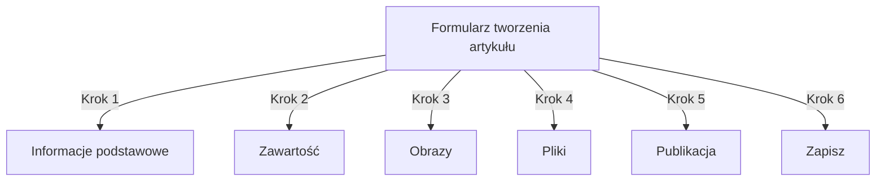
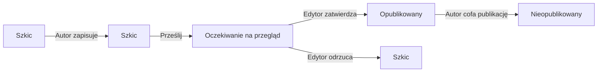
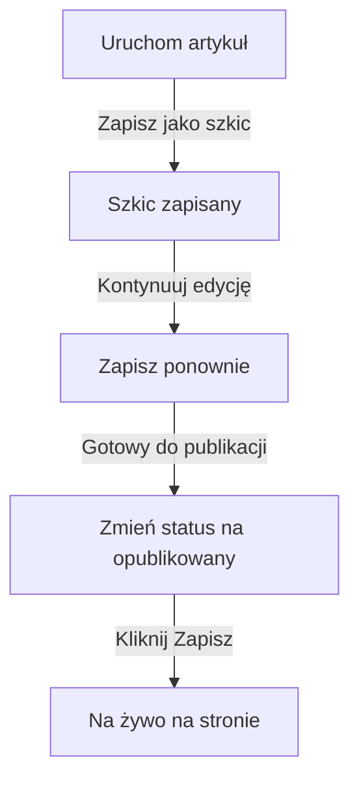

# Tworzenie artykułów w Publisher

> Przewodnik krok po kroku dotyczący tworzenia, edycji, formatowania i publikowania artykułów w module Publisher.

---

## Dostęp do zarządzania artykułami

### Nawigacja panelu administracyjnego

```
Panel admin
└── Moduły
    └── Publisher
        └── Artykuły
            ├── Utwórz nowy
            ├── Edytuj
            ├── Usuń
            └── Opublikuj
```

### Najszybsza ścieżka

1. Zaloguj się jako **Administrator**
2. Kliknij **Moduły** na pasku administracyjnym
3. Znajdź **Publisher**
4. Kliknij link **Admin**
5. Kliknij **Artykuły** w lewym menu
6. Kliknij przycisk **Dodaj artykuł**

---

## Formularz tworzenia artykułu

### Informacje podstawowe

Tworząc nowy artykuł, wypełnij następujące sekcje:



---

## Krok 1: Informacje podstawowe

### Pola wymagane

#### Tytuł artykułu

```
Pole: Tytuł
Typ: Pole tekstowe (wymagane)
Maks. długość: 255 znaków
Przykład: "Top 5 porad dla lepszej fotografii"
```

**Wytyczne:**
- Opisowy i konkretny
- Zawiera słowa kluczowe dla SEO
- Unikaj WIELKICH LITER
- Zachowaj poniżej 60 znaków dla najlepszego wyświetlania

#### Wybierz kategorię

```
Pole: Kategoria
Typ: Rozwijalna lista (wymagane)
Opcje: Lista utworzonych kategorii
Przykład: Fotografia > Tutoriale
```

**Wskazówki:**
- Kategorie główne i podkategorie dostępne
- Wybierz najbardziej odpowiednią kategorię
- Tylko jedna kategoria na artykuł
- Może być zmieniona później

#### Podtytuł artykułu (Opcjonalnie)

```
Pole: Podtytuł
Typ: Pole tekstowe (opcjonalnie)
Maks. długość: 255 znaków
Przykład: "Poznaj podstawy fotografii w 5 łatwych krokach"
```

**Użyj do:**
- Streszczającego nagłówka
- Tekstu teaser
- Rozszerzonego tytułu

### Opis artykułu

#### Krótki opis

```
Pole: Krótki opis
Typ: Obszar tekstu (opcjonalnie)
Maks. długość: 500 znaków
```

**Cel:**
- Tekst podglądu artykułu
- Wyświetla się w listowaniu kategorii
- Używany w wynikach wyszukiwania
- Meta opis dla SEO

**Przykład:**
```
"Poznaj niezbędne techniki fotograficzne, które zmienią Twoje zdjęcia
z zwykłych na wyjątkowe. Ten kompleksowy przewodnik obejmuje kompozycję,
oświetlenie i ustawienia ekspozycji."
```

#### Pełna zawartość

```
Pole: Treść artykułu
Typ: Edytor WYSIWYG (wymagane)
Maks. długość: Bez ograniczeń
Format: HTML
```

Główny obszar zawartości artykułu z edytorem tekstu sformatowanego.

---

## Krok 2: Formatowanie zawartości

### Korzystanie z edytora WYSIWYG

#### Formatowanie tekstu

```
Pogrubienie:        Ctrl+B lub kliknij przycisk [B]
Kursywa:            Ctrl+I lub kliknij przycisk [I]
Podkreślenie:       Ctrl+U lub kliknij przycisk [U]
Przekreślenie:      Alt+Shift+D lub kliknij przycisk [S]
Indeks dolny:       Ctrl+, (przecinek)
Indeks górny:       Ctrl+. (kropka)
```

#### Struktura nagłówków

Utwórz prawidłową hierarchię dokumentu:

```html
<h1>Tytuł artykułu</h1>      <!-- Użyj raz na górze -->
<h2>Sekcja główna</h2>        <!-- Dla głównych sekcji -->
<h3>Podsekcja</h3>            <!-- Dla podtematów -->
<h4>Pod-podsekcja</h4>        <!-- Dla szczegółów -->
```

**W edytorze:**
- Kliknij rozwijane menu **Format**
- Wybierz poziom nagłówka (H1-H6)
- Wpisz swój nagłówek

#### Listy

**Lista bez numeracji (Punkty):**

```markdown
• Punkt jeden
• Punkt dwa
• Punkt trzy
```

Kroki w edytorze:
1. Kliknij przycisk [≡] Lista punktowana
2. Wpisz każdy punkt
3. Naciśnij Enter dla następnego elementu
4. Naciśnij Backspace dwa razy, aby zakończyć listę

**Lista numerowana:**

```markdown
1. Pierwszy krok
2. Drugi krok
3. Trzeci krok
```

Kroki w edytorze:
1. Kliknij przycisk [1.] Lista numerowana
2. Wpisz każdy element
3. Naciśnij Enter dla następnego
4. Naciśnij Backspace dwa razy, aby zakończyć

**Listy zagnieżdżone:**

```markdown
1. Główny punkt
   a. Punkt podrzędny
   b. Punkt podrzędny
2. Następny punkt
```

Kroki:
1. Utwórz pierwszą listę
2. Naciśnij Tab, aby wcjęć
3. Utwórz zagnieżdżone elementy
4. Naciśnij Shift+Tab, aby zmniejszyć wcięcie

#### Linki

**Dodaj hiperlink:**

1. Zaznacz tekst do linkowania
2. Kliknij przycisk **[🔗] Link**
3. Wpisz URL: `https://example.com`
4. Opcjonalnie: Dodaj tytuł/cel
5. Kliknij **Wstaw link**

**Usuń link:**

1. Kliknij w tekście z linkiem
2. Kliknij przycisk **[🔗] Usuń link**

#### Kod i cytaty

**Cytat blokowy:**

```
"To jest ważny cytat od eksperta"
- Atrybuacja
```

Kroki:
1. Wpisz tekst cytatu
2. Kliknij przycisk **[❝] Cytat blokowy**
3. Tekst jest wcięty i stylizowany

**Blok kodu:**

```python
def hello_world():
    print("Hello, World!")
```

Kroki:
1. Kliknij **Format → Kod**
2. Wklej kod
3. Wybierz język (opcjonalnie)
4. Kod wyświetla się z podświetleniem składni

---

## Krok 3: Dodawanie obrazów

### Obraz wyróżniony (Obraz hero)

```
Pole: Obraz wyróżniony / Obraz główny
Typ: Przesyłanie obrazu
Format: JPG, PNG, GIF, WebP
Maks. rozmiar: 5 MB
Rekomendowana: 600x400 px
```

**Aby przesłać:**

1. Kliknij przycisk **Przeslij obraz**
2. Wybierz obraz z komputera
3. Przytnij/zmień rozmiar w razie potrzeby
4. Kliknij **Użyj tego obrazu**

**Położenie obrazu:**
- Wyświetla się na górze artykułu
- Używany w listowaniu kategorii
- Pokazany w archiwum
- Używany do udostępniania w mediach społecznych

### Obrazy wbudowane

Wstawić obrazy w tekście artykułu:

1. Umieść kursor w edytorze, gdzie obraz powinien się pojawić
2. Kliknij przycisk **[🖼️] Obraz** na pasku narzędzi
3. Wybierz opcję przesyłania:
   - Przeslij nowy obraz
   - Wybierz z galerii
   - Wpisz adres URL obrazu
4. Skonfiguruj:
   ```
   Rozmiar obrazu:
   - Szerokość: 300-600 px
   - Wysokość: Auto (zachowuje proporcje)
   - Wyrównanie: Lewo/Środek/Prawo
   ```
5. Kliknij **Wstaw obraz**

**Zawiń tekst wokół obrazu:**

W edytorze po wstawieniu:

```html
<!-- Obraz pływa w lewo, tekst się otacza -->

```

### Galeria obrazów

Utwórz galerię wielobildową:

1. Kliknij przycisk **Galeria** (jeśli dostępna)
2. Przeslij wiele obrazów:
   - Pojedyncze kliknięcie: Dodaj jeden
   - Drag & drop: Dodaj wiele
3. Ułóż kolejność poprzez przeciąganie
4. Ustaw podpisy dla każdego obrazu
5. Kliknij **Utwórz galerię**

---

## Krok 4: Dołączanie plików

### Dodaj załączniki

```
Pole: Załączniki pliku
Typ: Przesyłanie pliku (dozwolone wiele)
Obsługiwane: PDF, DOC, XLS, ZIP, itp.
Maks. na plik: 10 MB
Maks. na artykuł: 5 plików
```

**Aby dołączyć:**

1. Kliknij przycisk **Dodaj plik**
2. Wybierz plik z komputera
3. Opcjonalnie: Dodaj opis pliku
4. Kliknij **Dołącz plik**
5. Powtórz dla wielu plików

**Przykłady plików:**
- Przewodniki PDF
- Arkusze kalkulacyjne Excel
- Dokumenty Word
- Archiwa ZIP
- Kod źródłowy

### Zarządzaj dołączonymi plikami

**Edytuj plik:**

1. Kliknij nazwę pliku
2. Edytuj opis
3. Kliknij **Zapisz**

**Usuń plik:**

1. Znajdź plik na liście
2. Kliknij ikonę **[×] Usuń**
3. Potwierdź usunięcie

---

## Krok 5: Publikacja i status

### Status artykułu

```
Pole: Status
Typ: Lista rozwijana
Opcje:
  - Szkic: Nie opublikowany, widać tylko dla autora
  - Oczekujący: Czekanie na zatwierdzenie
  - Opublikowany: Na żywo na stronie
  - Zarchiwizowany: Stara zawartość
  - Nieopublikowany: Był opublikowany, teraz ukryty
```

**Przepływ statusu:**



### Opcje publikacji

#### Opublikuj natychmiast

```
Status: Opublikowany
Data początkowa: Dzisiaj (auto-wypełniona)
Data końcowa: (pozostaw puste, aby nie wygasło)
```

#### Zaplanuj na później

```
Status: Zaplanowany
Data początkowa: Przyszła data/czas
Przykład: 15 lutego 2024 roku o 9:00 AM
```

Artykuł zostanie automatycznie opublikowany w określonym czasie.

#### Ustaw wygaśnięcie

```
Włącz wygaśnięcie: Tak
Data wygaśnięcia: Przyszła data
Działanie: Archiwizuj/Ukryj/Usuń
Przykład: 1 kwietnia 2024 (artykuł auto-archiwizuje się)
```

### Opcje widoczności

```yaml
Pokaż artykuł:
  - Wyświetl na stronie głównej: Tak/Nie
  - Pokaż w kategorii: Tak/Nie
  - Dołącz w wyszukiwanie: Tak/Nie
  - Dołącz w ostatnie artykuły: Tak/Nie

Artykuł wyróżniony:
  - Zaznacz jako wyróżniony: Tak/Nie
  - Pozycja sekcji wyróżnionej: (liczba)
```

---

## Krok 6: SEO i metadane

### Ustawienia SEO

```
Pole: Ustawienia SEO (Rozwiń sekcję)
```

#### Meta opis

```
Pole: Meta opis
Typ: Tekst (rekomendowana 160 znaków)
Używany przez: Wyszukiwarki, media społeczne

Przykład:
"Poznaj podstawy fotografii w 5 łatwych krokach.
Odkryj techniki kompozycji, oświetlenia i ekspozycji."
```

#### Słowa kluczowe meta

```
Pole: Słowa kluczowe meta
Typ: Lista oddzielona przecinkami
Maks.: 5-10 słów kluczowych

Przykład: Fotografia, Tutorial, Kompozycja, Oświetlenie, Ekspozycja
```

#### Slug adresu URL

```
Pole: Slug adresu URL (auto-generowany z tytułu)
Typ: Tekst
Format: małe litery, łączniki, bez spacji

Auto: "top-5-porad-dla-lepszej-fotografii"
Edytuj: Zmień przed opublikowaniem
```

#### Tagi Open Graph

Auto-generowane z informacji artykułu:
- Tytuł
- Opis
- Obraz wyróżniony
- URL artykułu
- Data publikacji

Używane przez Facebook, LinkedIn, WhatsApp itp.

---

## Krok 7: Komentarze i interakcja

### Ustawienia komentarzy

```yaml
Zezwól na komentarze:
  - Włącz: Tak/Nie
  - Domyślnie: Dziedzicz z preferencji
  - Nadpisz: Określone dla tego artykułu

Moderuj komentarze:
  - Wymagaj zatwierdzenia: Tak/Nie
  - Domyślnie: Dziedzicz z preferencji
```

### Ustawienia ocen

```yaml
Zezwól na oceny:
  - Włącz: Tak/Nie
  - Skala: 5 gwiazdek (domyślnie)
  - Pokaż średnią: Tak/Nie
  - Pokaż liczbę: Tak/Nie
```

---

## Krok 8: Opcje zaawansowane

### Autor i podpis

```
Pole: Autor
Typ: Lista rozwijana
Domyślnie: Obecny użytkownik
Opcje: Wszyscy użytkownicy z uprawnieniami autora

Wyświetlanie:
  - Pokaż nazwę autora: Tak/Nie
  - Pokaż biografię autora: Tak/Nie
  - Pokaż awatar autora: Tak/Nie
```

### Blokada edycji

```
Pole: Blokada edycji
Cel: Zapobiegaj przypadkowym zmianom

Zablokuj artykuł:
  - Zablokowany: Tak/Nie
  - Powód blokady: "Wersja finalna"
  - Data odblokowania: (opcjonalnie)
```

### Historia zmian

Auto-zapisane wersje artykułu:

```
Wyświetl wersje:
  - Kliknij "Historia zmian"
  - Pokazuje wszystkie zapisane wersje
  - Porównaj wersje
  - Przywróć poprzednią wersję
```

---

## Zapisywanie i publikacja

### Przepływ zapisu



### Zapisz artykuł

**Auto-zapis:**
- Wyzwolony co 60 sekund
- Automatycznie zapisuje się jako szkic
- Pokazuje "Ostatnio zapisany: 2 minuty temu"

**Ręczny zapis:**
- Kliknij **Zapisz i kontynuuj**, aby dalej edytować
- Kliknij **Zapisz i wyświetl**, aby zobaczyć opublikowaną wersję
- Kliknij **Zapisz**, aby zapisać i zamknąć

### Opublikuj artykuł

1. Ustaw **Status**: Opublikowany
2. Ustaw **Data początkowa**: Teraz (lub przyszła data)
3. Kliknij **Zapisz** lub **Opublikuj**
4. Pojawia się wiadomość potwierdzenia
5. Artykuł jest na żywo (lub zaplanowany)

---

## Edycja istniejących artykułów

### Dostęp do edytora artykułu

1. Przejdź do **Admin → Publisher → Artykuły**
2. Znajdź artykuł na liście
3. Kliknij ikonę/przycisk **Edytuj**
4. Dokonaj zmian
5. Kliknij **Zapisz**

### Edycja zbiorcza

Edytuj wiele artykułów jednocześnie:

```
1. Przejdź do listy artykułów
2. Zaznacz artykuły (pola wyboru)
3. Wybierz "Edycja zbiorcza" z listy rozwijanej
4. Zmień wybrane pole
5. Kliknij "Aktualizuj wszystkie"

Dostępne dla:
  - Status
  - Kategoria
  - Wyróżniony (Tak/Nie)
  - Autor
```

### Podgląd artykułu

Przed opublikowaniem:

1. Kliknij przycisk **Podgląd**
2. Wyświetl jak będą widzieć czytelnicy
3. Sprawdź formatowanie
4. Testuj linki
5. Wróć do edytora, aby dostosować

---

## Zarządzanie artykułami

### Wyświetl wszystkie artykuły

**Widok listy artykułów:**

```
Admin → Publisher → Artykuły

Kolumny:
  - Tytuł
  - Kategoria
  - Autor
  - Status
  - Data utworzenia
  - Data modyfikacji
  - Działania (Edytuj, Usuń, Podgląd)

Sortowanie:
  - Po tytule (A-Z)
  - Po dacie (najnowsze/najstarsze)
  - Po statusie (Opublikowany/Szkic)
  - Po kategorii
```

### Filtruj artykuły

```
Opcje filtrowania:
  - Po kategorii
  - Po statusie
  - Po autorze
  - Po zakresie dat
  - Wyszukaj po tytule

Przykład: Pokaż wszystkie artykuły "Szkic" autorstwa "John" w kategorii "Wiadomości"
```

### Usuń artykuł

**Miękkie usunięcie (Rekomendowane):**

1. Zmień **Status**: Nieopublikowany
2. Kliknij **Zapisz**
3. Artykuł ukryty, ale nie usunięty
4. Może być przywrócony później

**Twarde usunięcie:**

1. Zaznacz artykuł na liście
2. Kliknij przycisk **Usuń**
3. Potwierdź usunięcie
4. Artykuł trwale usunięty

---

## Najlepsze praktyki zawartości

### Pisanie wysokiej jakości artykułów

```
Struktura:
  ✓ Atrakcyjny tytuł
  ✓ Jasny podtytuł/opis
  ✓ Interesujący pierwszy akapit
  ✓ Logiczne sekcje z nagłówkami
  ✓ Obrazy pomocnicze
  ✓ Zakończenie/podsumowanie
  ✓ Wezwanie do działania

Długość:
  - Posty na blogu: 500-2000 słów
  - Wiadomości: 300-800 słów
  - Przewodniki: 2000-5000 słów
  - Minimum: 300 słów
```

### Optymalizacja SEO

```
Optymalizacja tytułu:
  ✓ Dołącz główne słowo kluczowe
  ✓ Zachowaj poniżej 60 znaków
  ✓ Umieść słowo kluczowe blisko początku
  ✓ Bądź opisowy i konkretny

Optymalizacja zawartości:
  ✓ Używaj nagłówków (H1, H2, H3)
  ✓ Dołącz słowo kluczowe w nagłówku
  ✓ Użyj pogrubienia dla ważnych terminów
  ✓ Dodaj opisowe linki
  ✓ Dołącz obrazy z tekstem alt

Meta opis:
  ✓ Dołącz główne słowo kluczowe
  ✓ 155-160 znaków
  ✓ Zorientowany na działanie
  ✓ Unikalny na artykuł
```

### Wskazówki formatowania

```
Czyttelność:
  ✓ Krótkie akapity (2-4 zdania)
  ✓ Punkty dla list
  ✓ Podtytułów co 300 słów
  ✓ Hojne białe spacje
  ✓ Przerwy w liniach między sekcjami

Atrakcyjność wizualna:
  ✓ Obraz wyróżniony na górze
  ✓ Obrazy wbudowane w zawartość
  ✓ Tekst alt na wszystkich obrazach
  ✓ Bloki kodu dla zawartości technicznej
  ✓ Cytaty blokowe dla nacisku
```

---

## Skróty klawiszowe

### Skróty edytora

```
Pogrubienie:        Ctrl+B
Kursywa:            Ctrl+I
Podkreślenie:       Ctrl+U
Link:               Ctrl+K
Zapisz szkic:       Ctrl+S
```

### Skróty tekstu

```
-- →  (myślnik na myślnik em)
... → … (trzy kropki na wielokropek)
(c) → © (prawo autorskie)
(r) → ® (zarejestrowane)
(tm) → ™ (znak towarowy)
```

---

## Typowe zadania

### Skopiuj artykuł

1. Otwórz artykuł
2. Kliknij przycisk **Duplikuj** lub **Klonuj**
3. Artykuł skopiowany jako szkic
4. Edytuj tytuł i zawartość
5. Opublikuj

### Zaplanuj artykuł

1. Utwórz artykuł
2. Ustaw **Data początkowa**: Przyszła data/czas
3. Ustaw **Status**: Opublikowany
4. Kliknij **Zapisz**
5. Artykuł publikuje się automatycznie

### Publikacja zbiorcza

1. Utwórz artykuły jako szkice
2. Ustaw daty publikacji
3. Artykuły publikują się automatycznie w zaplanowanych godzinach
4. Monitoruj z widoku "Zaplanowane"

### Przenieś między kategoriami

1. Edytuj artykuł
2. Zmień rozwijane menu **Kategoria**
3. Kliknij **Zapisz**
4. Artykuł pojawia się w nowej kategorii

---

## Rozwiązywanie problemów

### Problem: Nie mogę zapisać artykułu

**Rozwiązanie:**
```
1. Sprawdź formularz dla wymaganych pól
2. Sprawdź czy kategoria jest zaznaczona
3. Sprawdź limit pamięci PHP
4. Spróbuj najpierw zapisać jako szkic
5. Wyczyść cache przeglądarki
```

### Problem: Obrazy się nie wyświetlają

**Rozwiązanie:**
```
1. Sprawdź czy przesyłanie obrazu się powiodło
2. Sprawdź format pliku obrazu (JPG, PNG)
3. Sprawdź ścieżkę obrazu w bazie danych
4. Sprawdź uprawnienia katalogu przesyłania
5. Spróbuj ponownie przeslać obraz
```

### Problem: Pasek narzędzi edytora się nie wyświetla

**Rozwiązanie:**
```
1. Wyczyść cache przeglądarki
2. Spróbuj innej przeglądarki
3. Wyłącz rozszerzenia przeglądarki
4. Sprawdź konsolę JavaScript dla błędów
5. Sprawdź czy wtyczka edytora jest zainstalowana
```

### Problem: Artykuł się nie opublikuje

**Rozwiązanie:**
```
1. Sprawdź czy Status = "Opublikowany"
2. Sprawdź czy Data początkowa jest dzisiaj lub wcześniej
3. Sprawdź czy uprawnienia zezwalają na publikację
4. Sprawdź czy kategoria jest opublikowana
5. Wyczyść cache modułu
```

---

## Powiązane przewodniki

- Przewodnik konfiguracji
- Zarządzanie kategoriami
- Konfiguracja uprawnień
- Dostosowywanie szablonów

---

## Następne kroki

- Utwórz swój pierwszy artykuł
- Skonfiguruj kategorie
- Skonfiguruj uprawnienia
- Przejrzyj dostosowywanie szablonów

---

#publisher #articles #content #creation #formatting #editing #xoops
