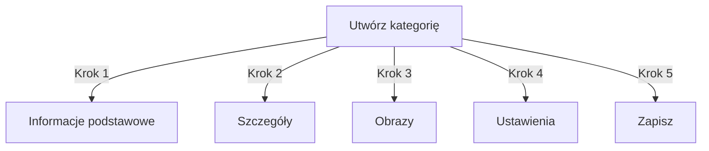

# Zarządzanie kategoriami w Publisher

> Kompletny przewodnik tworzenia, organizowania hierarchii i zarządzania kategoriami w module Publisher.

---

## Podstawy kategorii

### Co to są kategorie?

Kategorie organizują artykuły w logiczne grupy:

```
Przykładowa struktura:

  Wiadomości (Kategoria główna)
    ├── Technologia
    ├── Sport
    └── Rozrywka

  Tutoriale (Kategoria główna)
    ├── Fotografia
    │   ├── Podstawy
    │   └── Zaawansowane
    └── Pisanie
        └── Blogi
```

### Korzyści dobrej struktury kategorii

```
✓ Lepsza nawigacja użytkownika
✓ Zorganizowana zawartość
✓ Ulepszone SEO
✓ Łatwiejsze zarządzanie zawartością
✓ Lepszy przepływ pracy redakcyjnej
```

---

## Dostęp do zarządzania kategoriami

### Nawigacja panelu administratora

```
Panel admin
└── Moduły
    └── Publisher
        └── Kategorie
            ├── Utwórz nową
            ├── Edytuj
            ├── Usuń
            ├── Uprawnienia
            └── Organizuj
```

### Szybki dostęp

1. Zaloguj się jako **Administrator**
2. Przejdź do **Admin → Moduły**
3. Kliknij **Publisher → Admin**
4. Kliknij **Kategorie** w lewym menu

---

## Tworzenie kategorii

### Formularz tworzenia kategorii



### Krok 1: Informacje podstawowe

#### Nazwa kategorii

```
Pole: Nazwa kategorii
Typ: Pole tekstowe (wymagane)
Maks. długość: 100 znaków
Unikatowość: Powinna być unikatowa
Przykład: "Fotografia"
```

**Wytyczne:**
- Opisowe i jednorodne liczby pojedynczej lub mnogiej
- Prawidłowo pisane wielką literą
- Unikaj znaków specjalnych
- Zachowaj rozsądnie krótkie

#### Opis kategorii

```
Pole: Opis
Typ: Obszar tekstu (opcjonalnie)
Maks. długość: 500 znaków
Używane w: Stron listy kategorii, bloków kategorii
```

**Cel:**
- Wyjaśnia zawartość kategorii
- Pojawia się ponad artykułami kategorii
- Pomaga użytkownikom zrozumieć zakres
- Używany dla SEO meta opisu

**Przykład:**
```
"Porady fotograficzne, tutoriale i inspiracja dla
wszystkich poziomów umiejętności. Od podstaw kompozycji
po zaawansowane techniki oświetlenia, opanuj swoje rzemiosło."
```

### Krok 2: Kategoria nadrzędna

#### Utwórz hierarchię

```
Pole: Kategoria nadrzędna
Typ: Lista rozwijana
Opcje: Brak (główna), lub istniejące kategorie
```

**Przykłady hierarchii:**

```
Struktura płaska:
  Wiadomości
  Tutoriale
  Recenzje

Struktura zagnieżdżona:
  Wiadomości
    Technologia
    Biznes
    Sport
  Tutoriale
    Fotografia
      Podstawy
      Zaawansowane
    Pisanie
```

**Utwórz podkategorię:**

1. Kliknij rozwijane menu **Kategoria nadrzędna**
2. Wybierz nadrzędną (np. "Wiadomości")
3. Wypełnij nazwę kategorii
4. Zapisz
5. Nowa kategoria pojawia się jako dziecko

### Krok 3: Obraz kategorii

#### Prześlij obraz kategorii

```
Pole: Obraz kategorii
Typ: Przesyłanie obrazu (opcjonalnie)
Format: JPG, PNG, GIF, WebP
Maks. rozmiar: 5 MB
Rekomendowana: 300x200 px (lub rozmiar motywu)
```

**Aby przesłać:**

1. Kliknij przycisk **Przeslij obraz**
2. Wybierz obraz z komputera
3. Przytnij/zmień rozmiar w razie potrzeby
4. Kliknij **Użyj tego obrazu**

**Gdzie jest używany:**
- Strona listy kategorii
- Nagłówek bloku kategorii
- Ścieżka nawigacji (niektóre motywy)
- Udostępnianie w mediach społecznych

### Krok 4: Ustawienia kategorii

#### Ustawienia wyświetlania

```yaml
Status:
  - Włączono: Tak/Nie
  - Ukryto: Tak/Nie (ukryte w menu, nadal dostępne)

Opcje wyświetlania:
  - Pokaż opis: Tak/Nie
  - Pokaż obraz: Tak/Nie
  - Pokaż liczbę artykułów: Tak/Nie
  - Pokaż podkategorie: Tak/Nie

Układ:
  - Elementy na stronie: 10-50
  - Porządek wyświetlania: Data/Tytuł/Autor
  - Kierunek wyświetlania: Rosnąco/Malejąco
```

#### Uprawnienia kategorii

```yaml
Kto może przeglądać:
  - Anonimowy: Tak/Nie
  - Zalogowany: Tak/Nie
  - Określone grupy: Skonfiguruj na grupę

Kto może przesyłać:
  - Zalogowany: Tak/Nie
  - Określone grupy: Skonfiguruj na grupę
  - Autor musi posiadać: uprawnienie "przesyłaj artykuły"
```

### Krok 5: Ustawienia SEO

#### Tagi meta

```
Pole: Meta opis
Typ: Tekst (160 znaków)
Cel: Opis wyszukiwarki

Pole: Słowa kluczowe meta
Typ: Lista oddzielona przecinkami
Przykład: fotografia, tutoriale, porady, techniki
```

#### Konfiguracja adresu URL

```
Pole: Slug adresu URL
Typ: Tekst
Auto-generowany z nazwy kategorii
Przykład: "fotografia" z "Fotografia"
Może być dostosowany przed zapisaniem
```

### Zapisz kategorię

1. Wypełnij wszystkie wymagane pola:
   - Nazwa kategorii ✓
   - Opis (rekomendowany)
2. Opcjonalnie: Prześlij obraz, ustaw SEO
3. Kliknij **Zapisz kategorię**
4. Pojawia się wiadomość potwierdzenia
5. Kategoria jest teraz dostępna

---

## Hierarchia kategorii

### Utwórz strukturę zagnieżdżoną

```
Przykład krok po kroku: Utwórz podkategorię Wiadomości → Technologia

1. Przejdź do administracji kategorii
2. Kliknij "Dodaj kategorię"
3. Nazwa: "Wiadomości"
4. Nadrzędna: (pozostaw puste - to jest główna)
5. Zapisz
6. Kliknij "Dodaj kategorię" ponownie
7. Nazwa: "Technologia"
8. Nadrzędna: "Wiadomości" (wybierz z listy rozwijanej)
9. Zapisz
```

### Wyświetl drzewo hierarchii

```
Widok kategorii pokazuje strukturę drzewa:

📁 Wiadomości
  📄 Technologia
  📄 Sport
  📄 Rozrywka
📁 Tutoriale
  📄 Fotografia
    📄 Podstawy
    📄 Zaawansowane
  📄 Pisanie
```

Kliknij strzałki rozwinięcia, aby pokazać/ukryć podkategorie.

### Reorganizuj kategorie

#### Przenieś kategorię

1. Przejdź do listy kategorii
2. Kliknij **Edytuj** na kategorii
3. Zmień **Kategorię nadrzędną**
4. Kliknij **Zapisz**
5. Kategoria przeniesiona na nową pozycję

#### Zmień kolejność kategorii

Jeśli dostępne, użyj drag-and-drop:

1. Przejdź do listy kategorii
2. Kliknij i przeciągnij kategorię
3. Upuść na nowej pozycji
4. Kolejność zapisuje się automatycznie

#### Usuń kategorię

**Opcja 1: Miękkie usunięcie (Ukryj)**

1. Edytuj kategorię
2. Ustaw **Status**: Wyłączona
3. Kliknij **Zapisz**
4. Kategoria ukryta, ale nie usunięta

**Opcja 2: Twarde usunięcie**

1. Przejdź do listy kategorii
2. Kliknij **Usuń** na kategorii
3. Wybierz działanie dla artykułów:
   ```
   ☐ Przenieś artykuły do kategorii nadrzędnej
   ☐ Przenieś artykuły do głównego (Wiadomości)
   ☐ Usuń wszystkie artykuły w kategorii
   ```
4. Potwierdź usunięcie

---

## Operacje kategorii

### Edytuj kategorię

1. Przejdź do **Admin → Publisher → Kategorie**
2. Kliknij **Edytuj** na kategorii
3. Zmodyfikuj pola:
   - Nazwa
   - Opis
   - Kategoria nadrzędna
   - Obraz
   - Ustawienia
4. Kliknij **Zapisz**

### Edytuj uprawnienia kategorii

1. Przejdź do kategorii
2. Kliknij **Uprawnienia** na kategorii (lub kliknij kategorię, a następnie Uprawnienia)
3. Skonfiguruj grupy:

```
Dla każdej grupy:
  ☐ Wyświetl artykuły w tej kategorii
  ☐ Przesyłaj artykuły do tej kategorii
  ☐ Edytuj własne artykuły
  ☐ Edytuj wszystkie artykuły
  ☐ Zatwierdź/Moderuj artykuły
  ☐ Zarządzaj kategorią
```

4. Kliknij **Zapisz uprawnienia**

### Ustaw obraz kategorii

**Prześlij nowy obraz:**

1. Edytuj kategorię
2. Kliknij **Zmień obraz**
3. Przeslij lub wybierz obraz
4. Przytnij/zmień rozmiar
5. Kliknij **Użyj obrazu**
6. Kliknij **Zapisz kategorię**

**Usuń obraz:**

1. Edytuj kategorię
2. Kliknij **Usuń obraz** (jeśli dostępne)
3. Kliknij **Zapisz kategorię**

---

## Uprawnienia kategorii

### Matryca uprawnień

```
                 Anonimowy  Zalogowany  Edytor  Admin
Przeglądaj kategorię     ✓         ✓         ✓       ✓
Przesyłaj artykuł        ✗         ✓         ✓       ✓
Edytuj własny artykuł    ✗         ✓         ✓       ✓
Edytuj wszystkie         ✗         ✗         ✓       ✓
Moderuj artykuły         ✗         ✗         ✓       ✓
Zarządzaj kategorią      ✗         ✗         ✗       ✓
```

### Ustaw uprawnienia na poziomie kategorii

#### Kontrola dostępu na kategorię

1. Przejdź do listy **Kategorie**
2. Wybierz kategorię
3. Kliknij **Uprawnienia**
4. Dla każdej grupy, wybierz uprawnienia:

```
Przykład: Kategoria Wiadomości
  Anonimowy: Tylko przeglądanie
  Zalogowany: Przesyłaj artykuły
  Edytorzy: Zatwierdzaj artykuły
  Administratorzy: Pełna kontrola
```

5. Kliknij **Zapisz**

#### Uprawnienia na poziomie pola

Kontroluj które pola formularza użytkownicy mogą widzieć/edytować:

```
Przykład: Ogranicz widoczność pola dla zalogowanych użytkowników

Zalogowani użytkownicy mogą widzieć/edytować:
  ✓ Tytuł
  ✓ Opis
  ✓ Zawartość
  ✗ Autor (auto-ustawiony na bieżącego użytkownika)
  ✗ Data zaplanowana (tylko edytorzy)
  ✗ Wyróżniony (tylko administratorzy)
```

**Skonfiguruj w:**
- Uprawnienia kategorii
- Szukaj sekcji "Widoczność pola"

---

## Najlepsze praktyki dla kategorii

### Struktura kategorii

```
✓ Zachowaj hierarchię na głębokości 2-3 poziomów
✗ Nie twórz zbyt wielu kategorii najwyższego poziomu
✗ Nie twórz kategorie z jednym artykułem

✓ Używaj konsystentnego nazewnictwa (liczba mnoga lub pojedyncza)
✗ Nie używaj niejasnych nazw ("Rzeczy", "Inne")

✓ Twórz kategorie dla artykułów, które istnieją
✗ Nie twórz puste kategorie z wyprzedzeniem
```

### Wytyczne nazewnictwa

```
Dobre nazwy:
  "Fotografia"
  "Tworzenie stron"
  "Porady podróżnicze"
  "Wiadomości biznesowe"

Unikaj:
  "Artykuły" (zbyt niejasne)
  "Zawartość" (nadmiarowe)
  "Wiadomości&Aktualizacje" (niespójne)
  "FOTOGRAFIA RZECZY" (formatowanie)
```

### Wskazówki organizacyjne

```
Po temacie:
  Wiadomości
    Technologia
    Sport
    Rozrywka

Po typie:
  Tutoriale
    Wideo
    Tekst
    Interaktywne

Po publiczności:
  Dla początkujących
  Dla ekspertów
  Studium przypadku

Geograficzne:
  Ameryka Północna
    Stany Zjednoczone
    Kanada
  Europa
```

---

## Bloki kategorii

### Blok kategorii Publisher

Wyświetl listy kategorii na swojej stronie:

1. Przejdź do **Admin → Bloki**
2. Znajdź **Publisher - Kategorie**
3. Kliknij **Edytuj**
4. Skonfiguruj:

```
Tytuł bloku: "Kategorie wiadomości"
Pokaż podkategorie: Tak/Nie
Pokaż liczbę artykułów: Tak/Nie
Wysokość: (piksele lub auto)
```

5. Kliknij **Zapisz**

### Blok artykułów kategorii

Pokaż najnowsze artykuły z określonej kategorii:

1. Przejdź do **Admin → Bloki**
2. Znajdź **Publisher - Artykuły kategorii**
3. Kliknij **Edytuj**
4. Wybierz:

```
Kategoria: Wiadomości (lub określona kategoria)
Liczba artykułów: 5
Pokaż obrazy: Tak/Nie
Pokaż opis: Tak/Nie
```

5. Kliknij **Zapisz**

---

## Analityka kategorii

### Wyświetl statystyki kategorii

Z administracji kategorii:

```
Każda kategoria pokazuje:
  - Całkowite artykuły: 45
  - Opublikowane: 42
  - Szkice: 2
  - Oczekujące zatwierdzenia: 1
  - Całkowite widoki: 5,234
  - Ostatni artykuł: 2 godziny temu
```

### Wyświetl ruch kategorii

Jeśli analityka włączona:

1. Kliknij nazwę kategorii
2. Kliknij kartę **Statystyki**
3. Wyświetl:
   - Widoki strony
   - Popularne artykuły
   - Trendy ruchu
   - Używane terminy wyszukiwania

---

## Szablony kategorii

### Dostosuj wyświetlanie kategorii

Jeśli używasz szablonów niestandardowych, każda kategoria może nadpisać:

```
publisher_category.tpl
  ├── Nagłówek kategorii
  ├── Opis kategorii
  ├── Obraz kategorii
  ├── Listowanie artykułów
  └── Paginacja
```

**Aby dostosować:**

1. Skopiuj plik szablonu
2. Zmodyfikuj HTML/CSS
3. Przypisz do kategorii w administracji
4. Kategoria używa szablonu niestandardowego

---

## Typowe zadania

### Utwórz hierarchię wiadomości

```
Admin → Publisher → Kategorie
1. Utwórz "Wiadomości" (główna)
2. Utwórz "Technologia" (główna: Wiadomości)
3. Utwórz "Sport" (główna: Wiadomości)
4. Utwórz "Rozrywka" (główna: Wiadomości)
```

### Przenieś artykuły między kategoriami

1. Przejdź do administracji **Artykułów**
2. Zaznacz artykuły (pola wyboru)
3. Wybierz **"Zmień kategorię"** z listy rozwijanej działań zbiorczych
4. Wybierz nową kategorię
5. Kliknij **Aktualizuj wszystkie**

### Ukryj kategorię bez usuwania

1. Edytuj kategorię
2. Ustaw **Status**: Wyłączone/Ukryte
3. Zapisz
4. Kategoria nie pokazana w menu (nadal dostępna przez adres URL)

### Utwórz kategorię dla szkiców

```
Najlepsza praktyka:

Utwórz kategorię "Oczekujące przeglądu"
  ├── Cel: Artykuły oczekujące zatwierdzenia
  ├── Uprawnienia: Ukryte od publiczności
  ├── Tylko administratorzy/edytorzy mogą widzieć
  ├── Przenieś artykuły tutaj aż do zatwierdzenia
  └── Przenieś do "Wiadomości" po opublikowaniu
```

---

## Eksport/Import kategorii

### Eksportuj kategorie

Jeśli dostępne:

1. Przejdź do administracji **Kategorii**
2. Kliknij **Eksportuj**
3. Wybierz format: CSV/JSON/XML
4. Pobierz plik
5. Kopia zapasowa zapisana

### Importuj kategorie

Jeśli dostępne:

1. Przygotuj plik z kategoriami
2. Przejdź do administracji **Kategorii**
3. Kliknij **Importuj**
4. Prześlij plik
5. Wybierz strategię aktualizacji:
   - Utwórz tylko nowe
   - Aktualizuj istniejące
   - Zastąp wszystkie
6. Kliknij **Importuj**

---

## Rozwiązywanie problemów z kategoriami

### Problem: Podkategorie się nie wyświetlają

**Rozwiązanie:**
```
1. Sprawdź czy status kategorii nadrzędnej to "Włączony"
2. Sprawdź uprawnienia zezwalają na przeglądanie
3. Sprawdź czy podkategorie mają status "Włączony"
4. Wyczyść cache: Admin → Narzędzia → Wyczyść cache
5. Sprawdź czy motyw wyświetla podkategorie
```

### Problem: Nie mogę usunąć kategorii

**Rozwiązanie:**
```
1. Kategoria musi być pusta z artykułów
2. Przenieś lub usuń artykuły najpierw:
   Admin → Artykuły
   Zaznacz artykuły w kategorii
   Zmień kategorię na inną
3. Następnie usuń pustą kategorię
4. Lub wybierz opcję "przenieś artykuły" przy usuwaniu
```

### Problem: Obraz kategorii się nie wyświetla

**Rozwiązanie:**
```
1. Sprawdź czy obraz przesłano pomyślnie
2. Sprawdź format pliku obrazu (JPG, PNG)
3. Sprawdź uprawnienia katalogu przesyłania
4. Sprawdź czy motyw wyświetla obrazy kategorii
5. Spróbuj ponownie przesłać obraz
6. Wyczyść cache przeglądarki
```

### Problem: Uprawnienia nie działają

**Rozwiązanie:**
```
1. Sprawdź uprawnienia grupy w kategorii
2. Sprawdź globalne uprawnienia Publisher
3. Sprawdź czy użytkownik należy do skonfigurowanej grupy
4. Wyczyść cache sesji
5. Wyloguj się i zaloguj ponownie
6. Sprawdź czy moduł uprawnień jest zainstalowany
```

---

## Lista kontrolna najlepszych praktyk kategorii

Przed wdrażaniem kategorii:

- [ ] Hierarchia ma głębokość 2-3 poziomów
- [ ] Każda kategoria ma 5+ artykułów
- [ ] Nazwy kategorii są konsystentne
- [ ] Uprawnienia są odpowiednie
- [ ] Obrazy kategorii są zoptymalizowane
- [ ] Opisy są kompletne
- [ ] Metadane SEO wypełnione
- [ ] Adresy URL są przyjazne
- [ ] Kategorie testowane na front-end
- [ ] Dokumentacja zaktualizowana

---

## Powiązane przewodniki

- Tworzenie artykułów
- Zarządzanie uprawnieniami
- Konfiguracja modułu
- Przewodnik instalacji

---

## Następne kroki

- Utwórz artykuły w kategoriach
- Skonfiguruj uprawnienia
- Dostosuj szablonami niestandardowymi

---

#publisher #categories #organization #hierarchy #management #xoops
