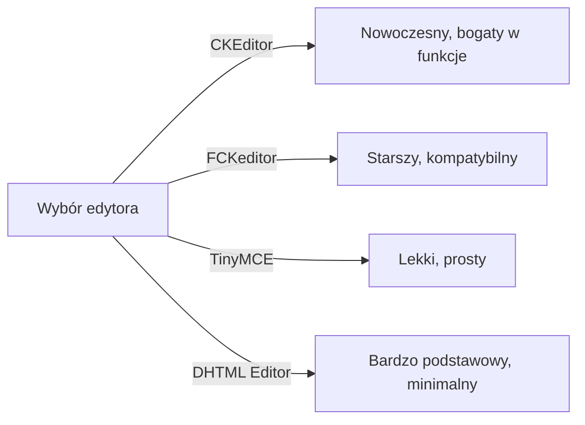
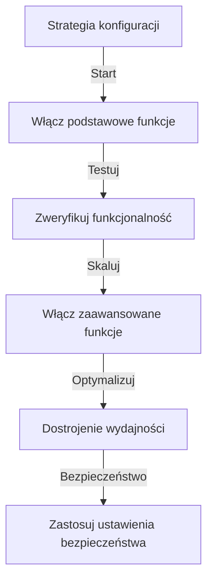

# Podstawowa konfiguracja Publisher

> Skonfiguruj ustawienia modułu Publisher, preferencje i ogólne opcje dla twojej instalacji XOOPS.

---

## Dostęp do konfiguracji

### Nawigacja panelu administratora

```
Panel Admin XOOPS
└── Moduły
    └── Publisher
        ├── Preferencje
        ├── Ustawienia
        └── Konfiguracja
```

1. Zaloguj się jako **Administrator**
2. Przejdź do **Panelu Admin → Moduły**
3. Znajdź moduł **Publisher**
4. Kliknij link **Preferencje** lub **Admin**

---

## Ustawienia ogólne

### Dostęp do konfiguracji

```
Panel Admin → Moduły → Publisher
```

Kliknij **ikonę koła zębatego** lub **Ustawienia** dla tych opcji:

#### Opcje wyświetlania

| Ustawienie | Opcje | Domyślnie | Opis |
|---------|---------|---------|-------------|
| **Elementy na stronie** | 5-50 | 10 | Artykuły wyświetlane na listach |
| **Pokaż ścieżkę nawigacji** | Tak/Nie | Tak | Wyświetlanie ścieżki nawigacji |
| **Używaj stronicowania** | Tak/Nie | Tak | Stronicuj długie listy |
| **Pokaż datę** | Tak/Nie | Tak | Wyświetl datę artykułu |
| **Pokaż kategorię** | Tak/Nie | Tak | Pokaż kategorię artykułu |
| **Pokaż autora** | Tak/Nie | Tak | Pokaż autora artykułu |
| **Pokaż widoki** | Tak/Nie | Tak | Pokaż liczbę wyświetleń artykułu |

**Przykładowa konfiguracja:**

```yaml
Elementy na stronie: 15
Pokaż ścieżkę nawigacji: Tak
Używaj stronicowania: Tak
Pokaż datę: Tak
Pokaż kategorię: Tak
Pokaż autora: Tak
Pokaż widoki: Tak
```

#### Opcje autora

| Ustawienie | Domyślnie | Opis |
|---------|---------|-------------|
| **Pokaż nazwę autora** | Tak | Wyświetl pełną nazwę lub nazwę użytkownika |
| **Używaj nazwy użytkownika** | Nie | Pokaż nazwę użytkownika zamiast imienia |
| **Pokaż email autora** | Nie | Wyświetl email kontaktowy autora |
| **Pokaż awatar autora** | Tak | Wyświetl awatar użytkownika |

---

## Konfiguracja edytora

### Wybierz edytor WYSIWYG

Publisher obsługuje wiele edytorów:

#### Dostępne edytory



### CKEditor (Rekomendowany)

**Najlepszy do:** Większości użytkowników, nowoczesnych przeglądarek, pełnych funkcji

1. Przejdź do **Preferencje**
2. Ustaw **Edytor**: CKEditor
3. Skonfiguruj opcje:

```
Edytor: CKEditor 4.x
Pasek narzędzi: Pełny
Wysokość: 400px
Szerokość: 100%
Usuń wtyczki: []
Dodaj wtyczki: [mathjax, codesnippet]
```

### FCKeditor

**Najlepszy do:** Kompatybilności, starszych systemów

```
Edytor: FCKeditor
Pasek narzędzi: Domyślny
Konfiguracja niestandardowa: (opcjonalnie)
```

### TinyMCE

**Najlepszy do:** Minimalnego rozmiaru, podstawowej edycji

```
Edytor: TinyMCE
Wtyczki: [paste, table, link, image]
Pasek narzędzi: minimalny
```

---

## Ustawienia pliku i przesyłania

### Skonfiguruj katalogi przesyłania

```
Admin → Publisher → Preferencje → Ustawienia przesyłania
```

#### Ustawienia typu pliku

```yaml
Dozwolone typy plików:
  Obrazy:
    - jpg
    - jpeg
    - gif
    - png
    - webp
  Dokumenty:
    - pdf
    - doc
    - docx
    - xls
    - xlsx
    - ppt
    - pptx
  Archiwa:
    - zip
    - rar
    - 7z
  Media:
    - mp3
    - mp4
    - webm
    - mov
```

#### Limity rozmiaru pliku

| Typ pliku | Maks. rozmiar | Uwagi |
|-----------|----------|-------|
| **Obrazy** | 5 MB | Na plik obrazu |
| **Dokumenty** | 10 MB | Pliki PDF i Office |
| **Media** | 50 MB | Pliki wideo/audio |
| **Wszystkie pliki** | 100 MB | Razem na przesyłanie |

**Konfiguracja:**

```
Maks. rozmiar przesyłania obrazu: 5 MB
Maks. rozmiar przesyłania dokumentu: 10 MB
Maks. rozmiar przesyłania mediów: 50 MB
Całkowity rozmiar przesyłania: 100 MB
Maks. pliki na artykuł: 5
```

### Zmiana rozmiaru obrazu

Publisher automatycznie zmienia rozmiar obrazów dla spójności:

```yaml
Rozmiar miniatury:
  Szerokość: 150
  Wysokość: 150
  Tryb: Przytnij/Zmień rozmiar

Rozmiar obrazu kategorii:
  Szerokość: 300
  Wysokość: 200
  Tryb: Zmień rozmiar

Artykuł wyróżniony obraz:
  Szerokość: 600
  Wysokość: 400
  Tryb: Zmień rozmiar
```

---

## Ustawienia komentarza i interakcji

### Konfiguracja komentarzy

```
Preferencje → Sekcja komentarzy
```

#### Opcje komentarza

```yaml
Zezwól na komentarze:
  - Włączono: Tak/Nie
  - Domyślnie: Tak
  - Nadpisanie na artykuł: Tak

Moderacja komentarzy:
  - Moderuj komentarze: Tak/Nie
  - Moderuj tylko komentarze gości: Tak/Nie
  - Filtr spamu: Włączony
  - Maks. komentarze na dzień: (unlimited)

Wyświetlanie komentarzy:
  - Format wyświetlania: Wątek/Płaski
  - Komentarze na stronie: 10
  - Format daty: Pełna data/Chwilę temu
  - Pokaż liczbę komentarzy: Tak/Nie
```

### Konfiguracja ocen

```yaml
Zezwól na oceny:
  - Włączono: Tak/Nie
  - Domyślnie: Tak
  - Nadpisanie na artykuł: Tak

Opcje oceny:
  - Skala ocen: 5 gwiazdek (domyślnie)
  - Zezwól użytkownikowi ocenić siebie: Nie
  - Pokaż średnią ocenę: Tak
  - Pokaż liczbę ocen: Tak
```

---

## Ustawienia SEO i adresu URL

### Optymalizacja wyszukiwarek

```
Preferencje → Ustawienia SEO
```

#### Konfiguracja adresu URL

```yaml
Adresy URL SEO:
  - Włączono: Nie (ustaw na Tak dla adresów URL SEO)
  - Przepisywanie adresu URL: Brak/Apache mod_rewrite/IIS rewrite

Format adresu URL:
  - Kategoria: /category/news
  - Artykuł: /article/welcome-to-site
  - Archiwum: /archive/2024/01

Meta opis:
  - Automatyczne generowanie: Tak
  - Maks. długość: 160 znaków

Słowa kluczowe meta:
  - Automatyczne generowanie: Tak
  - Z: Tagi artykułu, tytuł
```

### Włącz adresy URL SEO (Zaawansowana)

**Warunki wstępne:**
- Apache z włączonym `mod_rewrite`
- Włączona obsługa `.htaccess`

**Kroki konfiguracji:**

1. Przejdź do **Preferencje → Ustawienia SEO**
2. Ustaw **Adresy URL SEO**: Tak
3. Ustaw **Przepisywanie adresu URL**: Apache mod_rewrite
4. Sprawdź czy plik `.htaccess` istnieje w folderze Publisher

**Konfiguracja .htaccess:**

```apache
<IfModule mod_rewrite.c>
    RewriteEngine On
    RewriteBase /modules/publisher/

    # Przepisywanie kategorii
    RewriteRule ^category/([0-9]+)-(.*)\.html$ index.php?op=showcategory&categoryid=$1 [L,QSA]

    # Przepisywanie artykułów
    RewriteRule ^article/([0-9]+)-(.*)\.html$ index.php?op=showitem&itemid=$1 [L,QSA]

    # Przepisywanie archiwum
    RewriteRule ^archive/([0-9]+)/([0-9]+)/$ index.php?op=archive&year=$1&month=$2 [L,QSA]
</IfModule>
```

---

## Cache i wydajność

### Konfiguracja buforowania

```
Preferencje → Ustawienia cache
```

```yaml
Włącz cache:
  - Włączono: Tak
  - Typ cache: Plik (lub Memcache)

Czas życia cache:
  - Listy kategorii: 3600 sekund (1 godzina)
  - Listy artykułów: 1800 sekund (30 minut)
  - Pojedynczy artykuł: 7200 sekund (2 godziny)
  - Blok ostatnich artykułów: 900 sekund (15 minut)

Czyszczenie cache:
  - Ręczne czyszczenie: Dostępne w administracji
  - Automatyczne czyszczenie przy zapisaniu artykułu: Tak
  - Czyszczenie przy zmianie kategorii: Tak
```

### Czyszczenie cache

**Ręczne czyszczenie cache:**

1. Przejdź do **Admin → Publisher → Narzędzia**
2. Kliknij **Wyczyść cache**
3. Wybierz typy cache do wyczyszczenia:
   - [ ] Cache kategorii
   - [ ] Cache artykułów
   - [ ] Cache bloku
   - [ ] Wszystkie cache
4. Kliknij **Wyczyść wybrane**

**Wiersz poleceń:**

```bash
# Wyczyść całe cache Publisher
php /path/to/xoops/admin/cache_manage.php publisher

# Lub bezpośrednio usuń pliki cache
rm -rf /path/to/xoops/var/cache/publisher/*
```

---

## Powiadomienia i przepływ pracy

### Powiadomienia e-mail

```
Preferencje → Powiadomienia
```

```yaml
Powiadom admin o nowym artykule:
  - Włączono: Tak
  - Odbiorca: Email administratora
  - Dołącz podsumowanie: Tak

Powiadom moderatorów:
  - Włączono: Tak
  - Przy nowym przesłaniu: Tak
  - Dla oczekujących artykułów: Tak

Powiadom autora:
  - Przy zatwierdzeniu: Tak
  - Przy odrzuceniu: Tak
  - Przy komentarzu: Nie (opcjonalnie)
```

### Przepływ pracy przesyłania

```yaml
Wymagaj zatwierdzenia:
  - Włączono: Tak
  - Zatwierdzenie edytora: Tak
  - Zatwierdzenie administratora: Nie

Zapisanie szkicu:
  - Interwał automatycznego zapisu: 60 sekund
  - Zapisz wersje lokalne: Tak
  - Historia zmian: Ostatnie 5 wersji
```

---

## Ustawienia zawartości

### Domyślne wartości publikacji

```
Preferencje → Ustawienia zawartości
```

```yaml
Domyślny status artykułu:
  - Szkic/Opublikowany: Szkic
  - Wyróżniony domyślnie: Nie
  - Czas automatycznej publikacji: Brak

Domyślna widoczność:
  - Publiczny/Prywatny: Publiczny
  - Pokaż na stronie głównej: Tak
  - Pokaż w kategoriach: Tak

Zaplanowana publikacja:
  - Włączono: Tak
  - Zezwól dla artykułu: Tak

Wygaśnięcie zawartości:
  - Włączono: Nie
  - Auto-archiwizuj stare: Nie
  - Archiwizuj po dniach: (unlimited)
```

### Opcje zawartości WYSIWYG

```yaml
Zezwól na HTML:
  - W artykułach: Tak
  - W komentarzach: Nie

Zezwól na osadzane media:
  - Wideo (iframe): Tak
  - Obrazy: Tak
  - Wtyczki: Nie

Filtrowanie zawartości:
  - Usuń tagi: Nie
  - Filtr XSS: Tak (rekomendowana)
```

---

## Ustawienia wyszukiwarki

### Skonfiguruj integrację wyszukiwania

```
Preferencje → Ustawienia wyszukiwania
```

```yaml
Włącz indeksowanie artykułów:
  - Dołącz w wyszukiwaniu witryny: Tak
  - Typ indeksu: Pełny tekst/Tylko tytuł

Opcje wyszukiwania:
  - Szukaj w tytułach: Tak
  - Szukaj w zawartości: Tak
  - Szukaj w komentarzach: Tak

Tagi meta:
  - Automatyczne generowanie: Tak
  - Tagi OG (media społeczne): Tak
  - Karty Twitter: Tak
```

---

## Ustawienia zaawansowane

### Tryb debugowania (Tylko dla rozwoju)

```
Preferencje → Zaawansowane
```

```yaml
Tryb debugowania:
  - Włączono: Nie (tylko dla rozwoju!)

Funkcje programistyczne:
  - Pokaż zapytania SQL: Nie
  - Loguj błędy: Tak
  - Email błędu: admin@example.com
```

### Optymalizacja bazy danych

```
Admin → Narzędzia → Optymalizuj bazę danych
```

```bash
# Ręczna optymalizacja
mysql> OPTIMIZE TABLE publisher_items;
mysql> OPTIMIZE TABLE publisher_categories;
mysql> OPTIMIZE TABLE publisher_comments;
```

---

## Dostosowywanie modułu

### Szablony motywu

```
Preferencje → Wyświetlanie → Szablony
```

Wybierz zestaw szablonów:
- Domyślny
- Klasyczny
- Nowoczesny
- Ciemny
- Niestandardowy

Każdy szablon kontroluje:
- Układ artykułu
- Listowanie kategorii
- Wyświetlanie archiwum
- Wyświetlanie komentarzy

---

## Wskazówki dotyczące konfiguracji

### Najlepsze praktyki



1. **Zacznij prosto** - Najpierw włącz główne funkcje
2. **Testuj każdą zmianę** - Sprawdź przed przejściem dalej
3. **Włącz cache** - Poprawia wydajność
4. **Najpierw kopia zapasowa** - Wyeksportuj ustawienia przed dużymi zmianami
5. **Monitoruj dzienniki** - Regularnie sprawdzaj dzienniki błędów

### Optymalizacja wydajności

```yaml
Dla lepszej wydajności:
  - Włącz cache: Tak
  - Czas życia cache: 3600 sekund
  - Ogranicz elementy na stronie: 10-15
  - Kompresuj obrazy: Tak
  - Minifikuj CSS/JS: Tak (jeśli dostępne)
```

### Wzmacnianie bezpieczeństwa

```yaml
Dla lepszego bezpieczeństwa:
  - Moderuj komentarze: Tak
  - Wyłącz HTML w komentarzach: Tak
  - Filtrowanie XSS: Tak
  - Lista dozwolonych typów plików: Ścisła
  - Maks. rozmiar przesyłania: Rozsądny limit
```

---

## Eksport/Import ustawień

### Kopia zapasowa konfiguracji

```
Admin → Narzędzia → Eksportuj ustawienia
```

**Aby utworzyć kopię zapasową bieżącej konfiguracji:**

1. Kliknij **Eksportuj konfigurację**
2. Zapisz pobrany plik `.cfg`
3. Przechowuj w bezpiecznym miejscu

**Aby przywrócić:**

1. Kliknij **Importuj konfigurację**
2. Wybierz plik `.cfg`
3. Kliknij **Przywróć**

---

## Powiązane przewodniki konfiguracji

- Zarządzanie kategoriami
- Tworzenie artykułów
- Konfiguracja uprawnień
- Przewodnik instalacji

---

## Rozwiązywanie problemów z konfiguracją

### Ustawienia nie są zapisywane

**Rozwiązanie:**
1. Sprawdź uprawnienia katalogu na `/var/config/`
2. Sprawdź dostęp do zapisu PHP
3. Sprawdź dziennik błędów PHP
4. Wyczyść cache przeglądarki i spróbuj ponownie

### Edytor nie pojawia się

**Rozwiązanie:**
1. Sprawdź czy wtyczka edytora jest zainstalowana
2. Sprawdź konfigurację edytora XOOPS
3. Spróbuj innej opcji edytora
4. Sprawdź konsolę przeglądarki dla błędów JavaScript

### Problemy z wydajnością

**Rozwiązanie:**
1. Włącz cache
2. Zmniejsz elementy na stronie
3. Kompresuj obrazy
4. Sprawdź optymalizację bazy danych
5. Przejrzyj dziennik wolnych zapytań

---

## Następne kroki

- Skonfiguruj uprawnienia grupy
- Utwórz swój pierwszy artykuł
- Skonfiguruj kategorie
- Przejrzyj szablony niestandardowe

---

#publisher #configuration #preferences #settings #xoops
