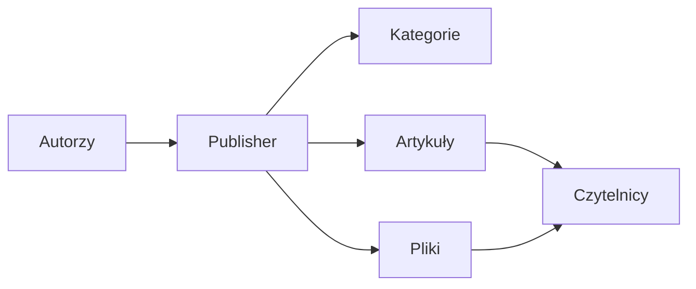
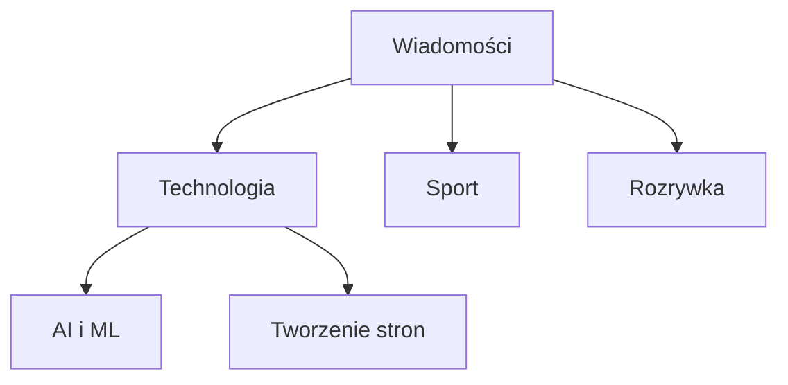
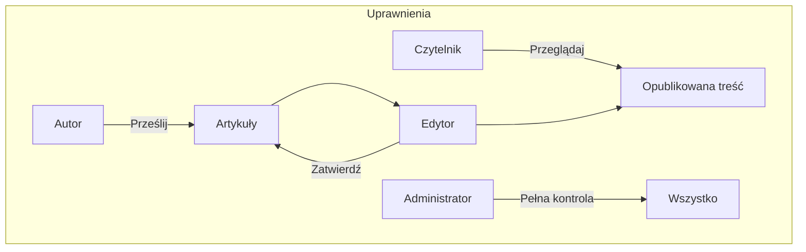
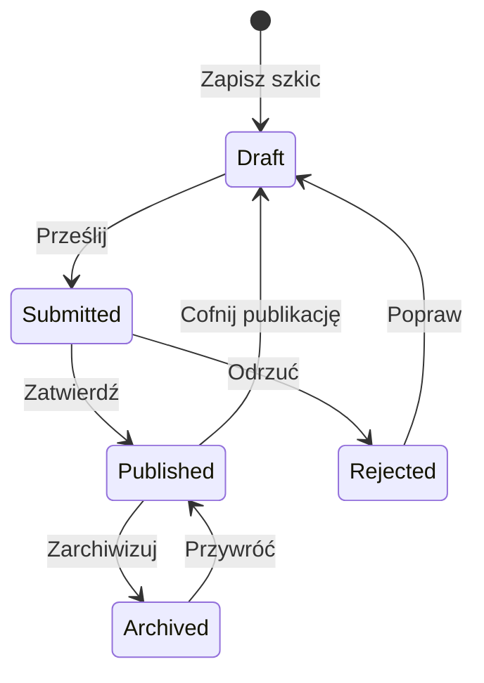

# Pierwsze kroki z Publisher

> Przewodnik krok po kroku dotyczący konfiguracji i używania modułu Publisher do tworzenia wiadomości i blogów.

---

## Co to jest Publisher?

Publisher to czołowy moduł zarządzania treścią dla XOOPS, zaprojektowany do:

- **Serwisów wiadomości** - Publikuj artykuły z kategoriami
- **Blogów** - Blogi osobiste lub wieloautorskie
- **Dokumentacji** - Zorganizowane bazy wiedzy
- **Portali treści** - Treść multimedialna



---

## Szybka konfiguracja

### Krok 1: Zainstaluj Publisher

1. Pobierz z [GitHub](https://github.com/XoopsModules25x/publisher)
2. Prześlij do `modules/publisher/`
3. Przejdź do Admin → Moduły → Zainstaluj

### Krok 2: Utwórz kategorie



1. Admin → Publisher → Kategorie
2. Kliknij "Dodaj kategorię"
3. Wypełnij:
   - **Nazwa**: Nazwa kategorii
   - **Opis**: Co zawiera ta kategoria
   - **Obraz**: Opcjonalny obraz kategorii
4. Ustaw uprawnienia (kto może przesyłać/przeglądać)
5. Zapisz

### Krok 3: Skonfiguruj ustawienia

1. Admin → Publisher → Preferencje
2. Kluczowe ustawienia do skonfigurowania:

| Ustawienie | Rekomendacja | Opis |
|---------|-------------|-------------|
| Elementy na stronie | 10-20 | Artykuły na stronie głównej |
| Edytor | TinyMCE/CKEditor | Edytor tekstu sformatowanego |
| Zezwól na oceny | Tak | Opinie czytelników |
| Zezwól na komentarze | Tak | Dyskusje |
| Automatyczne zatwierdzenie | Nie | Kontrola redakcyjna |

### Krok 4: Utwórz swój pierwszy artykuł

1. Menu główne → Publisher → Prześlij artykuł
2. Wypełnij formularz:
   - **Tytuł**: Nagłówek artykułu
   - **Kategoria**: Do której kategorii należy
   - **Streszczenie**: Krótki opis
   - **Treść**: Pełna zawartość artykułu
3. Dodaj opcjonalne elementy:
   - Obraz wyróżniony
   - Załączniki
   - Ustawienia SEO
4. Prześlij do przeglądu lub opublikuj

---

## Role użytkownika



### Czytelnik
- Przeglądaj opublikowane artykuły
- Oceniaj i komentuj
- Wyszukuj treść

### Autor
- Prześlij nowe artykuły
- Edytuj własne artykuły
- Dołączaj pliki

### Edytor
- Zatwierdź/odrzuć zgłoszenia
- Edytuj dowolny artykuł
- Zarządzaj kategoriami

### Administrator
- Pełna kontrola modułu
- Konfiguruj ustawienia
- Zarządzaj uprawnieniami

---

## Pisanie artykułów

### Edytor artykułów

```
┌─────────────────────────────────────────────────────┐
│ Tytuł: [Tytuł artykułu                            ] │
├─────────────────────────────────────────────────────┤
│ Kategoria: [Wybierz kategorię      ▼]              │
├─────────────────────────────────────────────────────┤
│ Streszczenie:                                       │
│ ┌─────────────────────────────────────────────────┐ │
│ │ Krótki opis wyświetlany na listach...          │ │
│ └─────────────────────────────────────────────────┘ │
├─────────────────────────────────────────────────────┤
│ Treść:                                              │
│ ┌─────────────────────────────────────────────────┐ │
│ │ [B] [I] [U] [Link] [Obraz] [Kod]               │ │
│ ├─────────────────────────────────────────────────┤ │
│ │                                                  │ │
│ │ Pełna zawartość artykułu tutaj...              │ │
│ │                                                  │ │
│ └─────────────────────────────────────────────────┘ │
├─────────────────────────────────────────────────────┤
│ [Prześlij] [Podgląd] [Zapisz szkic]                │
└─────────────────────────────────────────────────────┘
```

### Najlepsze praktyki

1. **Atrakcyjne tytuły** - Jasne, interesujące nagłówki
2. **Dobre streszczenia** - Zachęć czytelników do kliknięcia
3. **Ustrukturyzowana treść** - Używaj nagłówków, list, obrazów
4. **Prawidłowa kategoryzacja** - Pomóż czytelnikom znaleźć treść
5. **Optymalizacja SEO** - Słowa kluczowe w tytule i treści

---

## Zarządzanie treścią

### Przepływ statusu artykułu



### Opisy statusów

| Status | Opis |
|--------|-------------|
| Szkic | Praca w toku |
| Przesłano | Oczekuje na przegląd |
| Opublikowany | Na żywo na stronie |
| Wygasły | Po dacie wygaśnięcia |
| Odrzucony | Wymagane poprawy |
| Zarchiwizowany | Usunięty z list |

---

## Nawigacja

### Dostęp do Publisher

- **Menu główne** → Publisher
- **Bezpośredni adres URL**: `twojastrona.com/modules/publisher/`

### Kluczowe strony

| Strona | Adres URL | Cel |
|------|-----|---------|
| Strona główna | `/modules/publisher/` | Listy artykułów |
| Kategoria | `/modules/publisher/category.php?id=X` | Artykuły kategorii |
| Artykuł | `/modules/publisher/item.php?itemid=X` | Jeden artykuł |
| Prześlij | `/modules/publisher/submit.php` | Nowy artykuł |
| Wyszukiwanie | `/modules/publisher/search.php` | Znajdź artykuły |

---

## Bloki

Publisher zapewnia kilka bloków dla twojej strony:

### Ostatnie artykuły
Wyświetla ostatnio opublikowane artykuły

### Menu kategorii
Nawigacja po kategoriach

### Popularne artykuły
Najczęściej oglądana treść

### Losowy artykuł
Wyświetl losową treść

### Artykuły wyróżnione
Artykuły polecane

---

## Powiązana dokumentacja

- Tworzenie i edycja artykułów
- Zarządzanie kategoriami
- Rozszerzanie Publisher

---

#xoops #publisher #user-guide #getting-started #cms
