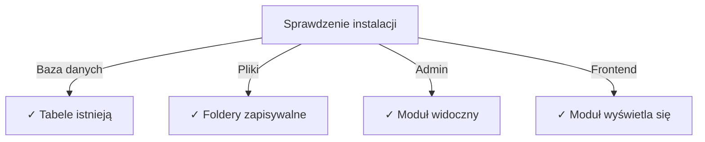

# Przewodnik instalacji Publisher

> Kompletne instrukcje instalacji i konfiguracji modułu Publisher dla XOOPS CMS.

---

## Wymagania systemowe

### Wymagania minimalne

| Wymaganie | Wersja | Uwagi |
|-------------|---------|-------|
| XOOPS | 2.5.10+ | Platforma CMS |
| PHP | 7.1+ | Rekomendowany PHP 8.x |
| MySQL | 5.7+ | Serwer bazy danych |
| Serwer WWW | Apache/Nginx | Obsługa przepisywania |

### Rozszerzenia PHP

```
- PDO (PHP Data Objects)
- pdo_mysql or mysqli
- mb_string (wielobajtowe ciągi znaków)
- curl (dla zawartości zewnętrznej)
- json
- gd (przetwarzanie obrazów)
```

### Przestrzeń dyskowa

- **Pliki modułu**: ~5 MB
- **Katalog cache**: 50+ MB rekomendowana
- **Katalog przesyłania**: Według potrzeb zawartości

---

## Lista kontrolna przed instalacją

Przed instalacją Publisher sprawdź:

- [ ] XOOPS jest zainstalowany i działa
- [ ] Konto administratora ma uprawnienia do zarządzania modułami
- [ ] Utworzona kopia zapasowa bazy danych
- [ ] Uprawnienia pliku pozwalają na zapis do katalogu `/modules/`
- [ ] Limit pamięci PHP to co najmniej 128 MB
- [ ] Limity rozmiaru przesyłania plików są odpowiednie (min 10 MB)

---

## Kroki instalacji

### Krok 1: Pobierz Publisher

#### Opcja A: Z GitHub (Rekomendowana)

```bash
# Przejdź do katalogu modułów
cd /path/to/xoops/htdocs/modules/

# Sklonuj repozytorium
git clone https://github.com/XoopsModules25x/publisher.git

# Sprawdź pobieranie
ls -la publisher/
```

#### Opcja B: Ręczne pobieranie

1. Odwiedź [GitHub Publisher Releases](https://github.com/XoopsModules25x/publisher/releases)
2. Pobierz najnowszy plik `.zip`
3. Wypakowaj do `modules/publisher/`

### Krok 2: Ustaw uprawnienia pliku

```bash
# Ustaw prawidłową własność
chown -R www-data:www-data /path/to/xoops/htdocs/modules/publisher

# Ustaw uprawnienia katalogu (755)
find publisher -type d -exec chmod 755 {} \;

# Ustaw uprawnienia pliku (644)
find publisher -type f -exec chmod 644 {} \;

# Ustaw wykonalność skryptów
chmod 755 publisher/admin/index.php
chmod 755 publisher/index.php
```

### Krok 3: Zainstaluj za pośrednictwem XOOPS Admin

1. Zaloguj się do **panelu XOOPS Admin** jako administrator
2. Przejdź do **System → Moduły**
3. Kliknij **Zainstaluj moduł**
4. Znajdź **Publisher** na liście
5. Kliknij przycisk **Zainstaluj**
6. Czekaj na zakończenie instalacji (pokazuje utworzone tabele bazy danych)

```
Postęp instalacji:
✓ Tabele utworzone
✓ Konfiguracja zainicjalizowana
✓ Uprawnienia ustawione
✓ Cache wyczyszczony
Instalacja ukończona!
```

---

## Konfiguracja początkowa

### Krok 1: Dostęp do Admin Publisher

1. Przejdź do **Panel Admin → Moduły**
2. Znajdź moduł **Publisher**
3. Kliknij link **Admin**
4. Jesteś teraz w administracji Publisher

### Krok 2: Skonfiguruj preferencje modułu

1. Kliknij **Preferencje** w lewym menu
2. Skonfiguruj ustawienia podstawowe:

```
Ustawienia ogólne:
- Edytor: Wybierz edytor WYSIWYG
- Elementy na stronie: 10
- Pokaż ścieżkę nawigacji: Tak
- Zezwól na komentarze: Tak
- Zezwól na oceny: Tak

Ustawienia SEO:
- Adresy URL SEO: Nie (włącz później jeśli potrzeba)
- Przepisywanie adresu URL: Brak

Ustawienia przesyłania:
- Maksymalny rozmiar przesyłania: 5 MB
- Dozwolone typy plików: jpg, png, gif, pdf, doc, docx
```

3. Kliknij **Zapisz ustawienia**

### Krok 3: Utwórz pierwszą kategorię

1. Kliknij **Kategorie** w lewym menu
2. Kliknij **Dodaj kategorię**
3. Wypełnij formularz:

```
Nazwa kategorii: Wiadomości
Opis: Najnowsze wiadomości i aktualizacje
Obraz: (opcjonalnie) Prześlij obraz kategorii
Kategoria nadrzędna: (pozostaw puste dla najwyższego poziomu)
Status: Włączony
```

4. Kliknij **Zapisz kategorię**

### Krok 4: Sprawdź instalację

Sprawdź te wskaźniki:



#### Sprawdzenie bazy danych

```bash
mysql -u xoops_user -p xoops_database
mysql> SHOW TABLES LIKE 'publisher%';

# Powinno wyświetlić tabele:
# - publisher_categories
# - publisher_items
# - publisher_comments
# - publisher_files
```

#### Sprawdzenie front-end

1. Odwiedź stronę główną XOOPS
2. Wyszukaj blok **Publisher** lub **Wiadomości**
3. Powinien wyświetlić ostatnie artykuły

---

## Konfiguracja po instalacji

### Wybór edytora

Publisher obsługuje wiele edytorów WYSIWYG:

| Edytor | Zalety | Wady |
|--------|------|------|
| FCKeditor | Bogata w funkcje | Stary, większy |
| CKEditor | Nowoczesny standard | Złożoność konfiguracji |
| TinyMCE | Lekki | Ograniczone funkcje |
| DHTML Editor | Podstawowy | Bardzo podstawowy |

**Aby zmienić edytor:**

1. Przejdź do **Preferencje**
2. Przewiń do ustawienia **Edytor**
3. Wybierz z listy rozwijanej
4. Zapisz i testuj

### Konfiguracja katalogu przesyłania

```bash
# Utwórz katalogi przesyłania
mkdir -p /path/to/xoops/uploads/publisher/
mkdir -p /path/to/xoops/uploads/publisher/categories/
mkdir -p /path/to/xoops/uploads/publisher/images/
mkdir -p /path/to/xoops/uploads/publisher/files/

# Ustaw uprawnienia
chmod 755 /path/to/xoops/uploads/publisher/
chmod 755 /path/to/xoops/uploads/publisher/*
```

### Skonfiguruj rozmiary obrazów

W Preferencjach ustaw rozmiary miniatur:

```
Rozmiar obrazu kategorii: 300 x 200 px
Rozmiar obrazu artykułu: 600 x 400 px
Rozmiar miniatury: 150 x 100 px
```

---

## Kroki po instalacji

### 1. Ustaw uprawnienia grupy

1. Przejdź do **Uprawnień** w menu administracyjnym
2. Skonfiguruj dostęp dla grup:
   - Anonimowy: Tylko przeglądanie
   - Zalogowani użytkownicy: Przesyłaj artykuły
   - Edytorzy: Zatwierdź/edytuj artykuły
   - Administratorzy: Pełny dostęp

### 2. Skonfiguruj widoczność modułu

1. Przejdź do **Bloków** w administracji XOOPS
2. Znajdź bloki Publisher:
   - Publisher - Ostatnie artykuły
   - Publisher - Kategorie
   - Publisher - Archiwa
3. Skonfiguruj widoczność bloku na stronie

### 3. Importuj testową zawartość (Opcjonalnie)

Dla testowania importuj przykładowe artykuły:

1. Przejdź do **Publisher Admin → Import**
2. Wybierz **Przykładową zawartość**
3. Kliknij **Import**

### 4. Włącz adresy URL SEO (Opcjonalnie)

Dla adresów URL przyjaznych dla wyszukiwarek:

1. Przejdź do **Preferencje**
2. Ustaw **Adresy URL SEO**: Tak
3. Włącz przepisywanie **.htaccess**
4. Sprawdź, czy plik `.htaccess` istnieje w folderze Publisher

```apache
# Przykład .htaccess
<IfModule mod_rewrite.c>
    RewriteEngine On
    RewriteBase /modules/publisher/
    RewriteRule ^category/([0-9]+)-(.*)\.html$ index.php?op=showcategory&categoryid=$1 [L]
    RewriteRule ^article/([0-9]+)-(.*)\.html$ index.php?op=showitem&itemid=$1 [L]
</IfModule>
```

---

## Rozwiązywanie problemów instalacji

### Problem: Moduł nie pojawia się w administracji

**Rozwiązanie:**
```bash
# Sprawdź uprawnienia pliku
ls -la /path/to/xoops/modules/publisher/

# Sprawdź czy istnieje xoops_version.php
ls /path/to/xoops/modules/publisher/xoops_version.php

# Sprawdź składnię PHP
php -l /path/to/xoops/modules/publisher/xoops_version.php
```

### Problem: Tabele bazy danych nie zostały utworzone

**Rozwiązanie:**
1. Sprawdź czy użytkownik MySQL ma uprawnienie CREATE TABLE
2. Sprawdź dziennik błędów bazy danych:
   ```bash
   mysql> SHOW WARNINGS;
   ```
3. Importuj SQL ręcznie:
   ```bash
   mysql -u user -p database < modules/publisher/sql/mysql.sql
   ```

### Problem: Przesyłanie pliku nie powiedzie się

**Rozwiązanie:**
```bash
# Sprawdź czy katalog istnieje i jest zapisywalny
stat /path/to/xoops/uploads/publisher/

# Napraw uprawnienia
chmod 777 /path/to/xoops/uploads/publisher/

# Sprawdź ustawienia PHP
php -i | grep upload_max_filesize
```

### Problem: Błędy "Strona nie znaleziona"

**Rozwiązanie:**
1. Sprawdź czy plik `.htaccess` istnieje
2. Sprawdź czy Apache `mod_rewrite` jest włączony:
   ```bash
   a2enmod rewrite
   systemctl restart apache2
   ```
3. Sprawdź `AllowOverride All` w konfiguracji Apache

---

## Aktualizacja z poprzednich wersji

### Z Publisher 1.x do 2.x

1. **Utwórz kopię zapasową bieżącej instalacji:**
   ```bash
   cp -r modules/publisher/ modules/publisher-backup/
   mysqldump -u user -p database > publisher-backup.sql
   ```

2. **Pobierz Publisher 2.x**

3. **Zastąp pliki:**
   ```bash
   rm -rf modules/publisher/
   unzip publisher-2.0.zip -d modules/
   ```

4. **Uruchom aktualizację:**
   - Przejdź do **Admin → Publisher → Aktualizuj**
   - Kliknij **Aktualizuj bazę danych**
   - Czekaj na zakończenie

5. **Sprawdź:**
   - Sprawdź czy wszystkie artykuły wyświetlają się poprawnie
   - Sprawdź czy uprawnienia są nienaruszone
   - Testuj przesyłanie plików

---

## Uwagi dotyczące bezpieczeństwa

### Uprawnienia pliku

```
- Pliki główne: 644 (czytelne dla serwera WWW)
- Katalogi: 755 (przeglądalne przez serwer WWW)
- Katalogi przesyłania: 755 lub 777
- Pliki konfiguracyjne: 600 (nieczytelne dla sieci)
```

### Wyłącz bezpośredni dostęp do poufnych plików

Utwórz `.htaccess` w katalogach przesyłania:

```apache
<FilesMatch "\.(php|phtml|php3|php4|php5|phtml)$">
    Deny from all
</FilesMatch>
```

### Bezpieczeństwo bazy danych

```bash
# Użyj silnego hasła
ALTER USER 'publisher_user'@'localhost' IDENTIFIED BY 'strong_password_here';

# Przydziel minimalne uprawnienia
GRANT SELECT, INSERT, UPDATE, DELETE ON publisher_db.* TO 'publisher_user'@'localhost';
FLUSH PRIVILEGES;
```

---

## Lista kontrolna weryfikacji

Po instalacji sprawdź:

- [ ] Moduł pojawia się na liście modułów administratora
- [ ] Możesz uzyskać dostęp do sekcji administratora Publisher
- [ ] Możesz tworzyć kategorie
- [ ] Możesz tworzyć artykuły
- [ ] Artykuły wyświetlają się na front-end
- [ ] Przesyłanie plików działa
- [ ] Obrazy wyświetlają się poprawnie
- [ ] Uprawnienia są stosowane poprawnie
- [ ] Tabele bazy danych utworzone
- [ ] Katalog cache jest zapisywalny

---

## Następne kroki

Po pomyślnej instalacji:

1. Przeczytaj przewodnik podstawowej konfiguracji
2. Utwórz swój pierwszy artykuł
3. Skonfiguruj uprawnienia grupy
4. Przejrzyj zarządzanie kategoriami

---

## Wsparcie i zasoby

- **Problemy GitHub**: [Problemy Publisher](https://github.com/XoopsModules25x/publisher/issues)
- **Forum XOOPS**: [Wsparcie społeczności](https://www.xoops.org/modules/newbb/)
- **Wiki GitHub**: [Pomoc w instalacji](https://github.com/XoopsModules25x/publisher/wiki)

---

#publisher #installation #setup #xoops #module #configuration
