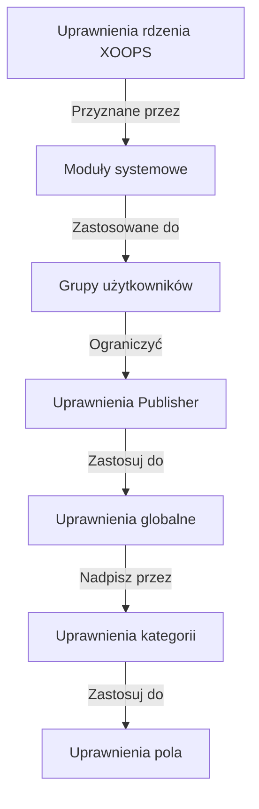

# Konfiguracja uprawnień Publisher

> Kompletny przewodnik konfiguracji uprawnień grupowych, kontroli dostępu i zarządzania dostępem użytkowników w Publisher.

---

## Podstawy uprawnień

### Co to są uprawnienia?

Uprawnienia kontrolują co mogą robić różne grupy użytkowników w Publisher:

```
Kto może:
  - Przeglądać artykuły
  - Przesyłać artykuły
  - Edytować artykuły
  - Zatwierdzać artykuły
  - Zarządzać kategoriami
  - Konfigurować ustawienia
```

### Poziomy uprawnień

```
Anonimowy
  └── Przeglądaj tylko opublikowane artykuły

Zalogowani użytkownicy
  ├── Przeglądaj artykuły
  ├── Przesyłaj artykuły (oczekujące zatwierdzenia)
  └── Edytuj własne artykuły

Edytorzy/Moderatorzy
  ├── Wszystkie uprawnienia zalogowanych
  ├── Zatwierdź artykuły
  ├── Edytuj wszystkie artykuły
  └── Zarządzaj niektórymi kategoriami

Administratorzy
  └── Pełny dostęp do wszystkiego
```

---

## Dostęp do zarządzania uprawnieniami

### Przejdź do uprawnień

```
Panel admin
└── Moduły
    └── Publisher
        ├── Uprawnienia
        ├── Uprawnienia kategorii
        └── Zarządzanie grupą
```

### Szybki dostęp

1. Zaloguj się jako **Administrator**
2. Przejdź do **Admin → Moduły**
3. Kliknij **Publisher → Admin**
4. Kliknij **Uprawnienia** w lewym menu

---

## Uprawnienia globalne

### Uprawnienia na poziomie modułu

Kontroluj dostęp do modułu Publisher i funkcji:

```
Widok konfiguracji uprawnień:
┌─────────────────────────────────────┐
│ Uprawnienie           │ Anon │ Zal │ Editor │ Admin │
├────────────────────────┼──────┼─────┼────────┼───────┤
│ Przeglądaj artykuły    │  ✓   │  ✓  │   ✓    │  ✓   │
│ Przesyłaj artykuły     │  ✗   │  ✓  │   ✓    │  ✓   │
│ Edytuj własne          │  ✗   │  ✓  │   ✓    │  ✓   │
│ Edytuj wszystkie       │  ✗   │  ✗  │   ✓    │  ✓   │
│ Zatwierdź artykuły     │  ✗   │  ✗  │   ✓    │  ✓   │
│ Zarządzaj kategoriami  │  ✗   │  ✗  │   ✗    │  ✓   │
│ Dostęp do administracji│  ✗   │  ✗  │   ✓    │  ✓   │
└─────────────────────────────────────┘
```

### Opisy uprawnień

| Uprawnienie | Użytkownicy | Efekt |
|------------|--------|---------|
| **Przeglądaj artykuły** | Wszystkie grupy | Mogą widzieć opublikowane artykuły na front-end |
| **Przesyłaj artykuły** | Zalogowani+ | Mogą tworzyć nowe artykuły (oczekujące zatwierdzenia) |
| **Edytuj własne artykuły** | Zalogowani+ | Mogą edytować/usuwać własne artykuły |
| **Edytuj wszystkie artykuły** | Edytorzy+ | Mogą edytować artykuły każdego użytkownika |
| **Usuń własne artykuły** | Zalogowani+ | Mogą usunąć własne nieopublikowane artykuły |
| **Usuń wszystkie artykuły** | Edytorzy+ | Mogą usunąć dowolny artykuł |
| **Zatwierdź artykuły** | Edytorzy+ | Mogą publikować artykuły oczekujące |
| **Zarządzaj kategoriami** | Administratorzy | Twórz, edytuj, usuwaj kategorie |
| **Dostęp administracyjny** | Edytorzy+ | Dostęp do interfejsu administracyjnego |

---

## Konfiguracja uprawnień globalnych

### Krok 1: Dostęp do ustawień uprawnień

1. Przejdź do **Admin → Moduły**
2. Znajdź **Publisher**
3. Kliknij **Uprawnienia** (lub link Admin, a następnie Uprawnienia)
4. Zobaczysz macierz uprawnień

### Krok 2: Ustaw uprawnienia grupy

Dla każdej grupy, skonfiguruj co mogą robić:

#### Użytkownicy anonimowi

```yaml
Uprawnienia grupy anonimowej:
  Przeglądaj artykuły: ✓ TAK
  Przesyłaj artykuły: ✗ NIE
  Edytuj artykuły: ✗ NIE
  Usuń artykuły: ✗ NIE
  Zatwierdź artykuły: ✗ NIE
  Zarządzaj kategoriami: ✗ NIE
  Dostęp administracyjny: ✗ NIE

Wynik: Użytkownicy anonimowi mogą tylko przeglądać opublikowaną zawartość
```

#### Zalogowani użytkownicy

```yaml
Uprawnienia grupy zalogowanych:
  Przeglądaj artykuły: ✓ TAK
  Przesyłaj artykuły: ✓ TAK (wymaga zatwierdzenia)
  Edytuj własne artykuły: ✓ TAK
  Edytuj wszystkie artykuły: ✗ NIE
  Usuń własne artykuły: ✓ TAK (tylko szkice)
  Usuń wszystkie artykuły: ✗ NIE
  Zatwierdź artykuły: ✗ NIE
  Zarządzaj kategoriami: ✗ NIE
  Dostęp administracyjny: ✗ NIE

Wynik: Zalogowani użytkownicy mogą wnosić zawartość po zatwierdzeniu
```

#### Grupa edytorów

```yaml
Uprawnienia grupy edytorów:
  Przeglądaj artykuły: ✓ TAK
  Przesyłaj artykuły: ✓ TAK
  Edytuj własne artykuły: ✓ TAK
  Edytuj wszystkie artykuły: ✓ TAK
  Usuń własne artykuły: ✓ TAK
  Usuń wszystkie artykuły: ✓ TAK
  Zatwierdź artykuły: ✓ TAK
  Zarządzaj kategoriami: ✓ OGRANICZONY
  Dostęp administracyjny: ✓ TAK
  Skonfiguruj ustawienia: ✗ NIE

Wynik: Edytorzy zarządzają zawartością, ale nie ustawieniami
```

#### Administratorzy

```yaml
Uprawnienia grupy administracyjnej:
  ✓ PEŁNY DOSTĘP do wszystkich funkcji

  - Wszystkie uprawnienia edytora
  - Zarządzaj wszystkimi kategoriami
  - Skonfiguruj wszystkie ustawienia
  - Zarządzaj uprawnieniami
  - Instaluj/odinstaluj
```

### Krok 3: Zapisz uprawnienia

1. Skonfiguruj uprawnienia każdej grupy
2. Zaznacz pola dla dozwolonych działań
3. Odznacz pola dla zakazanych działań
4. Kliknij **Zapisz uprawnienia**
5. Pojawia się wiadomość potwierdzenia

---

## Uprawnienia na poziomie kategorii

### Ustaw dostęp do kategorii

Kontroluj kto może przeglądać/przesyłać do określonych kategorii:

```
Admin → Publisher → Kategorie
→ Wybierz kategorię → Uprawnienia
```

### Matryca uprawnień kategorii

```
                 Anonimowy  Zalogowany  Editor  Admin
Przeglądaj kategorię   ✓         ✓         ✓       ✓
Przesyłaj do kategorii ✗         ✓         ✓       ✓
Edytuj własne          ✗         ✓         ✓       ✓
Edytuj wszystkie       ✗         ✗         ✓       ✓
Zatwierdź w kategorii  ✗         ✗         ✓       ✓
Zarządzaj kategorią    ✗         ✗         ✗       ✓
```

### Skonfiguruj uprawnienia kategorii

1. Przejdź do administracji **Kategorie**
2. Znajdź kategorię
3. Kliknij przycisk **Uprawnienia**
4. Dla każdej grupy, wybierz:
   - [ ] Przeglądaj tę kategorię
   - [ ] Przesyłaj artykuły
   - [ ] Edytuj własne artykuły
   - [ ] Edytuj wszystkie artykuły
   - [ ] Zatwierdź artykuły
   - [ ] Zarządzaj kategorią
5. Kliknij **Zapisz**

### Przykłady uprawnień kategorii

#### Publiczna kategoria wiadomości

```
Anonimowy: Tylko przeglądanie
Zalogowany: Przeglądaj + Przesyłaj (oczekuje zatwierdzenia)
Edytorzy: Zatwierdź + Edytuj
Administratorzy: Pełna kontrola
```

#### Wewnętrzna kategoria aktualizacji

```
Anonimowy: Brak dostępu
Zalogowany: Tylko przeglądanie
Edytorzy: Przesyłaj + Zatwierdź
Administratorzy: Pełna kontrola
```

#### Kategoria gościnnego bloga

```
Anonimowy: Tylko przeglądanie
Zalogowany: Przesyłaj (oczekuje zatwierdzenia)
Edytorzy: Zatwierdź
Administratorzy: Pełna kontrola
```

---

## Uprawnienia na poziomie pola

### Kontroluj widoczność pola formularza

Ogranicz które pola formularza użytkownicy mogą widzieć/edytować:

```
Admin → Publisher → Uprawnienia → Pola
```

### Opcje pola

```yaml
Widoczne pola dla zalogowanych użytkowników:
  ✓ Tytuł
  ✓ Opis
  ✓ Zawartość (treść)
  ✓ Obraz wyróżniony
  ✓ Kategoria
  ✓ Tagi
  ✗ Autor (auto-ustawiony)
  ✗ Data publikacji (tylko edytorzy)
  ✗ Data zaplanowana (tylko edytorzy)
  ✗ Flaga wyróżniona (tylko edytorzy)
  ✗ Uprawnienia (tylko administratorzy)
```

### Przykłady

#### Ograniczone przesyłanie dla zalogowanych

Zalogowani użytkownicy widzą mniej opcji:

```
Dostępne pola:
  - Tytuł ✓
  - Opis ✓
  - Zawartość ✓
  - Obraz wyróżniony ✓
  - Kategoria ✓

Ukryte pola:
  - Autor (auto-bieżący użytkownik)
  - Data publikacji (edytorzy decydują)
  - Data zaplanowana (tylko administratorzy)
  - Status wyróżniony (edytorzy wybierają)
```

#### Pełny formularz dla edytorów

Edytorzy widzą wszystkie opcje:

```
Dostępne pola:
  - Wszystkie pola podstawowe
  - Wszystkie metadane
  - Wybór autora ✓
  - Data/czas publikacji ✓
  - Data zaplanowana ✓
  - Status wyróżniony ✓
  - Data wygaśnięcia ✓
  - Uprawnienia ✓
```

---

## Konfiguracja grupy użytkownika

### Utwórz grupę niestandardową

1. Przejdź do **Admin → Użytkownicy → Grupy**
2. Kliknij **Utwórz grupę**
3. Wpisz szczegóły grupy:

```
Nazwa grupy: "Community Bloggerzy"
Opis grupy: "Użytkownicy, którzy wnosząblogu zawartość"
Typ: Zwykła grupa
```

4. Kliknij **Zapisz grupę**
5. Wróć do uprawnień Publisher
6. Ustaw uprawnienia dla nowej grupy

### Przykłady grup

```
Sugerowane grupy dla Publisher:

Grupa: Współautorzy
  - Zwykli członkowie, którzy przesyłają artykuły
  - Mogą edytować własne artykuły
  - Nie mogą zatwierdzać artykułów

Grupa: Recenzenci
  - Mogą widzieć przesłane artykuły
  - Mogą zatwierdzać/odrzucać artykuły
  - Nie mogą usuwać artykułów innych osób

Grupa: Edytorzy
  - Mogą edytować dowolny artykuł
  - Mogą zatwierdzać artykuły
  - Mogą moderować komentarze
  - Mogą zarządzać niektórymi kategoriami

Grupa: Wydawcy
  - Mogą edytować dowolny artykuł
  - Mogą publikować bezpośrednio (bez zatwierdzenia)
  - Mogą zarządzać wszystkimi kategoriami
  - Mogą konfigurować ustawienia
```

---

## Hierarchie uprawnień

### Przepływ uprawnień



### Dziedziczenie uprawnień

```
Podstawa: Globalne uprawnienia modułu
  ↓
Kategoria: Nadpisania dla określonych kategorii
  ↓
Pole: Dalsze ograniczenia dostępnych pól
  ↓
Użytkownik: Ma uprawnienie jeśli WSZYSTKIE poziomy zezwalają
```

**Przykład:**

```
Użytkownik chce edytować artykuł:
1. Grupa użytkownika musi mieć uprawnienie "edytuj artykuły" (globalne)
2. Kategoria musi zezwalać na edycję (poziom kategorii)
3. Ograniczenia pola muszą zezwalać (jeśli dotyczy)
4. Użytkownik musi być autorem LUB edytorem (dla własnych vs wszystkich)

Jeśli KAŻDY poziom zabrania → Uprawnienie zakazane
```

---

## Uprawnienia przepływu zatwierdzania

### Skonfiguruj zatwierdzenie przesyłania

Kontroluj czy artykuły wymagają zatwierdzenia:

```
Admin → Publisher → Preferencje → Przepływ pracy
```

#### Opcje zatwierdzenia

```yaml
Przepływ przesyłania:
  Wymagaj zatwierdzenia: Tak

  Dla zalogowanych użytkowników:
    - Nowe artykuły: Szkic (oczekujące zatwierdzenia)
    - Edytorzy muszą zatwierdzić
    - Użytkownik może edytować podczas oczekiwania
    - Po zatwierdzeniu: Użytkownik może edytować

  Dla edytorów:
    - Nowe artykuły: Publikuj bezpośrednio (opcjonalnie)
    - Pomiń kolejkę zatwierdzenia
    - Lub zawsze wymagaj zatwierdzenia
```

#### Skonfiguruj na grupę

1. Przejdź do Preferencji
2. Znajdź "Przepływ przesyłania"
3. Dla każdej grupy, ustaw:

```
Grupa: Zalogowani użytkownicy
  Wymagaj zatwierdzenia: ✓ TAK
  Status domyślny: Szkic
  Może modyfikować podczas oczekiwania: ✓ TAK

Grupa: Edytorzy
  Wymagaj zatwierdzenia: ✗ NIE
  Status domyślny: Opublikowany
  Może modyfikować opublikowane: ✓ TAK
```

4. Kliknij **Zapisz**

---

## Moderowanie artykułów

### Zatwierdź artykuły oczekujące

Dla użytkowników z uprawnieniem "zatwierdź artykuły":

1. Przejdź do **Admin → Publisher → Artykuły**
2. Filtruj po **Status**: Oczekujący
3. Kliknij artykuł do przeglądu
4. Sprawdź jakość zawartości
5. Ustaw **Status**: Opublikowany
6. Opcjonalnie: Dodaj notatki redakcyjne
7. Kliknij **Zapisz**

### Odrzuć artykuły

Jeśli artykuł nie spełnia standardów:

1. Otwórz artykuł
2. Ustaw **Status**: Szkic
3. Dodaj powód odrzucenia (w komentarzu lub e-mailu)
4. Kliknij **Zapisz**
5. Wyślij wiadomość autorowi wyjaśniającą odrzucenie

### Moderowanie komentarzy

Jeśli moderujesz komentarze:

1. Przejdź do **Admin → Publisher → Komentarze**
2. Filtruj po **Status**: Oczekujący
3. Przejrzyj komentarz
4. Opcje:
   - Zatwierdź: Kliknij **Zatwierdź**
   - Odrzuć: Kliknij **Usuń**
   - Edytuj: Kliknij **Edytuj**, napraw, zapisz
5. Kliknij **Zapisz**

---

## Zarządzaj dostępem użytkownika

### Wyświetl grupy użytkowników

Zobaczże którzy użytkownicy należą do grup:

```
Admin → Użytkownicy → Grupy użytkowników

Dla każdego użytkownika:
  - Grupa podstawowa (jedna)
  - Grupy drugorzędne (wiele)

Uprawnienia stosują się ze wszystkich grup (unia)
```

### Dodaj użytkownika do grupy

1. Przejdź do **Admin → Użytkownicy**
2. Znajdź użytkownika
3. Kliknij **Edytuj**
4. W **Grupach**, zaznacz grupy do dodania
5. Kliknij **Zapisz**

### Zmień uprawnienia użytkownika

Dla poszczególnych użytkowników (jeśli obsługiwane):

1. Przejdź do administracji użytkownika
2. Znajdź użytkownika
3. Kliknij **Edytuj**
4. Szukaj nadpisania uprawnień poszczególnych
5. Skonfiguruj w razie potrzeby
6. Kliknij **Zapisz**

---

## Typowe scenariusze uprawnień

### Scenariusz 1: Otwarty blog

Pozwól każdemu przesyłać:

```
Anonimowy: Przeglądaj
Zalogowany: Przesyłaj, edytuj własne, usuń własne
Edytorzy: Zatwierdź, edytuj wszystkie, usuń wszystkie
Administratorzy: Pełna kontrola

Wynik: Otwarty blog społeczności
```

### Scenariusz 2: Moderowana witryna wiadomości

Ścisły proces zatwierdzania:

```
Anonimowy: Tylko przeglądanie
Zalogowany: Nie może przesyłać
Edytorzy: Przesyłaj, zatwierdź innych
Administratorzy: Pełna kontrola

Wynik: Tylko zatwierdzone profesjonałów publikują
```

### Scenariusz 3: Blog pracowników

Pracownicy mogą wnosić zawartość:

```
Utwórz grupę: "Pracownicy"
Anonimowy: Przeglądaj
Zalogowany: Tylko przeglądaj (non-pracownicy)
Pracownicy: Przesyłaj, edytuj własne, publikuj bezpośrednio
Administratorzy: Pełna kontrola

Wynik: Blog napisany przez pracowników
```

### Scenariusz 4: Wiele kategorii z różnymi edytorami

Różni edytorzy dla różnych kategorii:

```
Kategoria wiadomości:
  Grupa edytorów A: Pełna kontrola

Kategoria recenzji:
  Grupa edytorów B: Pełna kontrola

Kategoria tutoriali:
  Grupa edytorów C: Pełna kontrola

Wynik: Zdecentralizowana kontrola redakcyjna
```

---

## Testowanie uprawnień

### Zweryfikuj uprawnienia działają

1. Utwórz użytkownika testowego w każdej grupie
2. Zaloguj się jako każdy użytkownik testowy
3. Spróbuj:
   - Przeglądać artykuły
   - Przesyłać artykuł (powinien tworzyć szkic jeśli dozwolone)
   - Edytować artykuł (własne i innych)
   - Usunąć artykuł
   - Dostęp do panelu administracyjnego
   - Dostęp do kategorii

4. Zweryfikuj rezultaty pasują do oczekiwanych uprawnień

### Typowe przypadki testowe

```
Przypadek testowy 1: Użytkownik anonimowy
  [ ] Może przeglądać opublikowane artykuły: ✓
  [ ] Nie może przesyłać artykułów: ✓
  [ ] Nie może uzyskać dostępu do administracji: ✓

Przypadek testowy 2: Zalogowany użytkownik
  [ ] Może przesyłać artykuły: ✓
  [ ] Artykuły trafiają do Szkicu: ✓
  [ ] Może edytować własny artykuł: ✓
  [ ] Nie może edytować innych: ✓
  [ ] Nie może uzyskać dostępu do administracji: ✓

Przypadek testowy 3: Edytor
  [ ] Może zatwierdzać artykuły: ✓
  [ ] Może edytować dowolny artykuł: ✓
  [ ] Może uzyskać dostęp do administracji: ✓
  [ ] Nie może usunąć wszystkie: ✓ (lub ✓ jeśli dozwolone)

Przypadek testowy 4: Administrator
  [ ] Może zrobić wszystko: ✓
```

---

## Rozwiązywanie problemów z uprawnieniami

### Problem: Użytkownik nie może przesyłać artykułów

**Sprawdź:**
```
1. Grupa użytkownika ma uprawnienie "przesyłaj artykuły"
   Admin → Publisher → Uprawnienia

2. Użytkownik należy do dozwolonej grupy
   Admin → Użytkownicy → Edytuj użytkownika → Grupy

3. Kategoria zezwala na przesyłanie z grupy użytkownika
   Admin → Publisher → Kategorie → Uprawnienia

4. Użytkownik jest zalogowany (nie anonimowy)
```

**Rozwiązanie:**
```bash
1. Zweryfikuj zalogowana grupa użytkownika ma uprawnienie przesyłania
2. Dodaj użytkownika do odpowiedniej grupy
3. Sprawdź uprawnienia kategorii
4. Wyczyść cache sesji użytkownika
```

### Problem: Edytor nie może zatwierdzać artykułów

**Sprawdź:**
```
1. Grupa edytorów ma uprawnienie "zatwierdź artykuły"
2. Artykuły istnieją ze statusem "Oczekujący"
3. Edytor jest w odpowiedniej grupie
4. Kategoria zezwala na zatwierdzenie z grupy edytora
```

**Rozwiązanie:**
```bash
1. Przejdź do uprawnień, sprawdź "zatwierdź artykuły" jest zaznaczony dla grupy edytora
2. Utwórz testowy artykuł, ustaw na Szkic
3. Spróbuj zatwierdzić jako edytor
4. Sprawdź komunikaty błędu w dzienniku systemowym
```

### Problem: Mogę widzieć artykuły, ale nie mogę uzyskać dostępu do kategorii

**Sprawdź:**
```
1. Kategoria nie jest wyłączona/ukryta
2. Uprawnienia kategorii zezwalają na przeglądanie
3. Grupa użytkownika jest dozwolona do przeglądania kategorii
4. Kategoria jest opublikowana
```

**Rozwiązanie:**
```bash
1. Przejdź do kategorii, sprawdź status kategorii to "Włączony"
2. Sprawdź uprawnienia kategorii są ustawione
3. Dodaj grupę użytkownika do uprawnień przeglądania kategorii
```

### Problem: Uprawnienia zmienione, ale nie działają

**Rozwiązanie:**
```bash
1. Wyczyść cache: Admin → Narzędzia → Wyczyść cache
2. Wyczyść sesję: Wyloguj się i zaloguj ponownie
3. Sprawdź dziennik systemowy dla błędów
4. Sprawdź uprawnienia faktycznie zostały zapisane
5. Spróbuj innej przeglądarki/okna incognito
```

---

## Kopia zapasowa i eksport uprawnień

### Eksportuj uprawnienia

Niektóre systemy zezwalają na eksportowanie:

1. Przejdź do **Admin → Publisher → Narzędzia**
2. Kliknij **Eksportuj uprawnienia**
3. Zapisz plik `.xml` lub `.json`
4. Przechowuj jako kopię zapasową

### Importuj uprawnienia

Przywróć z kopii zapasowej:

1. Przejdź do **Admin → Publisher → Narzędzia**
2. Kliknij **Importuj uprawnienia**
3. Wybierz plik kopii zapasowej
4. Przejrzyj zmiany
5. Kliknij **Importuj**

---

## Najlepsze praktyki

### Lista kontrolna konfiguracji uprawnień

- [ ] Zdecyduj o grupach użytkowników
- [ ] Przypisz jasne nazwy grupom
- [ ] Ustaw uprawnienia bazowe dla każdej grupy
- [ ] Testuj każdy poziom uprawnień
- [ ] Dokumentuj strukturę uprawnień
- [ ] Utwórz przepływ zatwierdzania
- [ ] Trenuj edytorów moderacji
- [ ] Monitoruj użytkowanie uprawnień
- [ ] Przejrzyj uprawnienia kwartalnie
- [ ] Utwórz kopię zapasową ustawień uprawnień

### Najlepsze praktyki bezpieczeństwa

```
✓ Zasada najmniejszego przywileju
  - Przyznaj minimalne niezbędne uprawnienia

✓ Dostęp oparty na rolach
  - Używaj grup dla ról (edytor, moderator, itd)

✓ Uprawnienia audytu
  - Przejrzyj kto ma jaki dostęp

✓ Oddzielne obowiązki
  - Przesyłający, zatwierdzający, wydawca to różne osoby

✓ Regularny przegląd
  - Sprawdzaj uprawnienia kwartalnie
  - Usuń dostęp gdy użytkownicy odchodzą
  - Aktualizuj dla nowych wymagań
```

---

## Powiązane przewodniki

- Tworzenie artykułów
- Zarządzanie kategoriami
- Podstawowa konfiguracja
- Instalacja

---

## Następne kroki

- Ustaw uprawnienia dla twojego przepływu
- Twórz artykuły z prawidłowymi uprawnieniami
- Skonfiguruj kategorie z uprawnieniami
- Trenuj użytkowników tworzenia artykułów

---

#publisher #permissions #groups #access-control #security #moderation #xoops
