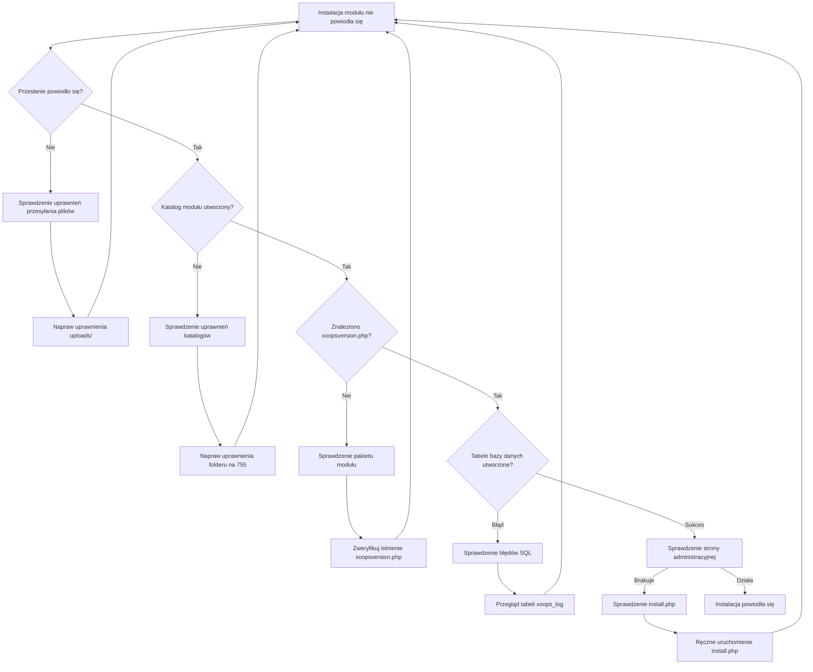
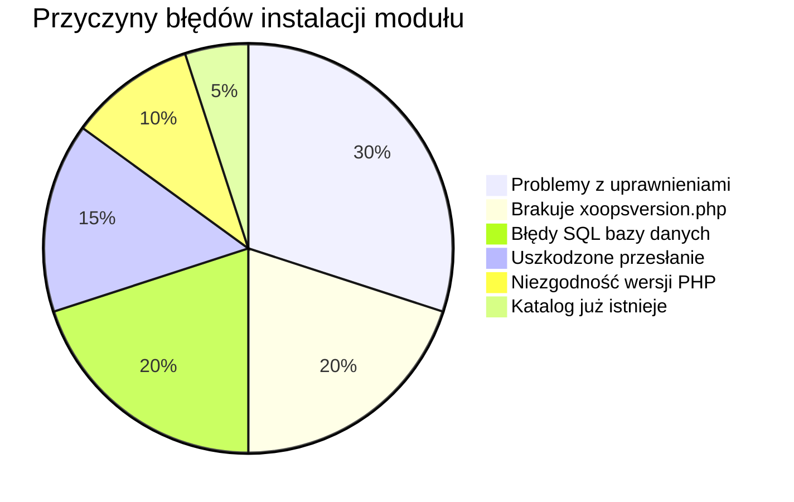

> Typowe problemy i rozwiązania do rozwiązywania problemów z instalacją modułów w XOOPS.

---

## Schemat diagnostyki



---

## Typowe przyczyny i rozwiązania



---

## 1. Odmowa dostępu przy przesyłaniu pliku

**Objawy:**
- Przesłanie nie powiodło się z "Permission denied"
- Folder modułu nie został utworzony
- Nie można zapisać w katalogu modułów

**Komunikaty błędów:**
```
Warning: move_uploaded_file(): Unable to move file
Permission denied (13)
```

**Rozwiązania:**

```bash
# Sprawdzenie bieżących uprawnień
ls -ld /path/to/xoops/modules
ls -ld /path/to/xoops/uploads

# Napraw uprawnienia katalogu modułów
chmod 755 /path/to/xoops/modules

# Napraw tymczasowy katalog przesyłania
chmod 777 /path/to/xoops/uploads
chmod 777 /tmp  # jeśli potrzeba

# Napraw właścicielstwo (jeśli uruchamiane jako inny użytkownik)
chown -R www-data:www-data /path/to/xoops/modules
chown -R www-data:www-data /path/to/xoops/uploads
```

---

## 2. Brakuje xoopsversion.php

**Objawy:**
- Moduł pojawia się na liście ale nie zostaje aktywowany
- Instalacja zaczyna się, a następnie zatrzymuje
- Nie utworzono strony administracyjnej

**Błąd w xoops_log:**
```
Module xoopsversion.php not found
```

**Rozwiązania:**

Zweryfikuj strukturę pakietu modułu:

```bash
# Rozpakuj i sprawdź zawartość modułu
unzip module.zip
ls -la mymodule/

# Musi zawierać:
# - xoopsversion.php
# - language/
# - sql/
# - admin/ (opcjonalnie ale zalecane)
```

**Prawidłowa struktura xoopsversion.php:**

```php
<?php
$modversion['name'] = 'My Module';
$modversion['version'] = '1.0.0';
$modversion['description'] = 'Module description';
$modversion['author'] = 'Author Name';
$modversion['author_mail'] = 'author@example.com';
$modversion['author_website_url'] = 'https://example.com';
$modversion['credits'] = 'Credits';
$modversion['license'] = 'GPL 2.0 or later';
$modversion['official'] = 0;
$modversion['image'] = 'images/icon.png';
$modversion['dirname'] = basename(__DIR__);
$modversion['modpath'] = __DIR__;

// Core module info
$modversion['hasMain'] = 1;
$modversion['hasAdmin'] = 1;
$modversion['hasSearch'] = 0;
$modversion['hasNotification'] = 0;

// Database tables
$modversion['sqlfile']['mysql'] = 'sql/mysql.sql';
$modversion['tables'] = ['table_name'];
```

---

## 3. Błędy wykonania SQL bazy danych

**Objawy:**
- Przesłanie powiodło się ale tabele bazy danych nie zostały utworzone
- Strona administracyjna nie ładuje się
- Błędy "Table doesn't exist"

**Komunikaty błędów:**
```
SQL Error: Table 'xoops_module_table' already exists
Syntax error in SQL statement
```

**Rozwiązania:**

### Sprawdzenie składni pliku SQL

```bash
# Wyświetl plik SQL
cat modules/mymodule/sql/mysql.sql

# Sprawdź problemy ze składnią
# Zweryfikuj:
# - Wszystkie instrukcje CREATE TABLE kończą się znakami ;
# - Prawidłowe backticki dla identyfikatorów
# - Prawidłowe typy pól (INT, VARCHAR, TEXT, itp.)
```

**Prawidłowy format SQL:**

```sql
CREATE TABLE `xoops_module_table` (
  `id` INT(11) NOT NULL AUTO_INCREMENT,
  `name` VARCHAR(255) NOT NULL,
  `description` TEXT,
  `created` INT(11) NOT NULL,
  `updated` INT(11) NOT NULL,
  PRIMARY KEY (`id`)
) ENGINE=InnoDB DEFAULT CHARSET=utf8mb4;
```

### Ręczne wykonanie SQL

```php
<?php
// Utwórz plik: modules/mymodule/test_sql.php
require_once '../../mainfile.php';

$sql_file = __DIR__ . '/sql/mysql.sql';
$sql_content = file_get_contents($sql_file);

// Podziel instrukcje
$statements = array_filter(array_map('trim', explode(';', $sql_content)));

foreach ($statements as $statement) {
    if (empty($statement)) continue;

    try {
        $GLOBALS['xoopsDB']->query($statement);
        echo "✓ Executed: " . substr($statement, 0, 50) . "...<br>";
    } catch (Exception $e) {
        echo "✗ Error: " . $e->getMessage() . "<br>";
        echo "Statement: " . substr($statement, 0, 100) . "...<br>";
    }
}
?>
```

---

## 4. Uszkodzone przesłanie modułu

**Objawy:**
- Pliki częściowo przesłane
- Losowe brakujące pliki .php
- Moduł staje się niestabilny po instalacji

**Rozwiązania:**

```bash
# Przesłanie świeżej kopii
rm -rf /path/to/xoops/modules/mymodule

# Zweryfikuj checksum jeśli podano
md5sum -c mymodule.md5

# Zweryfikuj integralność archiwum przed rozpakováním
unzip -t mymodule.zip

# Rozpakuj do temp, zweryfikuj, następnie przenieś
unzip -d /tmp mymodule.zip
find /tmp/mymodule -name "*.php" | wc -l
# Powinien pokazać oczekiwaną liczbę plików
```

---

## 5. Niezgodność wersji PHP

**Objawy:**
- Instalacja nie powiedzie się natychmiast
- Błędy parsowania w xoopsversion.php
- Błędy "Unexpected token"

**Komunikaty błędów:**
```
Parse error: syntax error, unexpected 'fn' (T_FN)
```

**Rozwiązania:**

```bash
# Sprawdzenie obsługiwanej wersji PHP XOOPS
grep -r "php_require" /path/to/xoops/

# Sprawdzenie wymagań modułu
grep -i "php\|version" modules/mymodule/xoopsversion.php

# Sprawdzenie wersji PHP na serwerze
php --version
```

**Test kompatybilności modułu:**

```php
<?php
// Utwórz modules/mymodule/check_compat.php
$required_php = '7.4.0';
$current_php = PHP_VERSION;

echo "Required PHP: $required_php<br>";
echo "Current PHP: $current_php<br>";

if (version_compare(PHP_VERSION, $required_php, '<')) {
    echo "✗ PHP version too old<br>";
} else {
    echo "✓ PHP version compatible<br>";
}

// Sprawdź wymagane rozszerzenia
$required_ext = ['mysqli', 'json', 'mb_string'];
foreach ($required_ext as $ext) {
    echo extension_loaded($ext) ? "✓" : "✗";
    echo " $ext<br>";
}
?>
```

---

## 6. Katalog modułu już istnieje

**Objawy:**
- Instalacja nie powiedzie się gdy katalog modułu istnieje
- Nie można ponownie zainstalować lub zaktualizować modułu
- Błąd "Directory exists"

**Komunikaty błędów:**
```
The specified directory already exists
```

**Rozwiązania:**

```bash
# Utwórz kopię zapasową istniejącego modułu
cp -r modules/mymodule modules/mymodule.backup

# Całkowicie usuń starą instalację
rm -rf modules/mymodule

# Wyczyść wszelką pamięć podręczną związaną z modułem
rm -rf xoops_data/caches/*

# Teraz spróbuj ponownie zainstalować przez panel administracyjny
```

---

## 7. Tworzenie strony administracyjnej nie powiodło się

**Objawy:**
- Moduł instaluje się ale brakuje strony administracyjnej
- Panel administracyjny nie pokazuje modułu
- Nie można uzyskać dostępu do ustawień modułu

**Rozwiązania:**

```php
<?php
// Utwórz modules/mymodule/admin/index.php
<?php
/**
 * Indeks administracji modułu
 */

include_once XOOPS_ROOT_PATH . '/kernel/module.php';

if (!is_object($xoopsModule) || !is_object($xoopsUser) || !$xoopsUser->isAdmin($xoopsModule->mid())) {
    exit("Access Denied");
}

// Dołącz nagłówek administracji
xoops_cp_header();

// Dodaj zawartość administracyjną
echo "<h1>Module Administration</h1>";
echo "<p>Welcome to module administration</p>";

// Dołącz stopkę administracji
xoops_cp_footer();
?>
```

---

## 8. Brakuje plików języka

**Objawy:**
- Moduł wyświetla się z nazwami zmiennych zamiast tekstu
- Strony administracyjne pokazują tekst w stylu "[LANG_CONSTANT]"
- Instalacja kompletna ale interfejs uszkodzony

**Rozwiązania:**

```bash
# Zweryfikuj strukturę pliku języka
ls -la modules/mymodule/language/

# Powinien zawierać:
# english/ (minimum)
#   admin.php
#   index.php
#   modinfo.php
```

**Utwórz plik języka:**

```php
<?php
// modules/mymodule/language/english/index.php
<?php
define('_AM_MYMODULE_INSTALLED', 'Module installed successfully');
define('_AM_MYMODULE_UPDATED', 'Module updated successfully');
define('_AM_MYMODULE_ERROR', 'An error occurred');
?>
```

---

## Checklist instalacji

```mermaid
graph TD
    A[Checklist instalacji] --> B["1. Zweryfikuj strukturę modułu"]
    A --> C["2. Sprawdzenie uprawnień"]
    A --> D["3. Test pliku SQL"]
    A --> E["4. Zweryfikuj xoopsversion.php"]
    A --> F["5. Sprawdzenie plików języka"]
    A --> G["6. Test instalacji"]
    A --> H["7. Zweryfikuj w Admin"]

    B --> B1["✓ Zawiera xoopsversion.php"]
    B --> B2["✓ Pliki SQL obecne"]
    B --> B3["✓ Pliki języka obecne"]

    C --> C1["✓ modules/ to 755"]
    C --> C2["✓ uploads/ to 777"]
    C --> C3["✓ Serwer WWW może zapisać"]

    D --> D1["✓ Składnia SQL prawidłowa"]
    D --> D2["✓ Brak zduplikowanych tabel"]

    E --> E1["✓ Prawidłowa składnia PHP"]
    E --> E2["✓ Wymagane pola są obecne"]

    F --> F1["✓ Folder english/ istnieje"]
    F --> F2["✓ Pliki .php są obecne"]

    G --> G1["✓ Przesłanie powiodło się"]
    G --> G2["✓ Baza danych tworzy się"]

    H --> H1["✓ Widoczny na liście modułów"]
    H --> H2["✓ Strona administracyjna dostępna"]
```



---

## Skrypt debugowania

Utwórz `modules/mymodule/debug_install.php`:

```php
<?php
/**
 * Debugger instalacji modułu
 * Usuń po rozwiązywaniu problemów!
 */

require_once '../../mainfile.php';

echo "<h1>Module Installation Debug</h1>";

// 1. Sprawdzenie struktury pliku
echo "<h2>1. File Structure</h2>";
$required_files = [
    'xoopsversion.php',
    'language/english/modinfo.php',
    'language/english/index.php',
    'language/english/admin.php'
];

foreach ($required_files as $file) {
    $path = __DIR__ . '/' . $file;
    echo file_exists($path) ? "✓" : "✗";
    echo " $file<br>";
}

// 2. Sprawdzenie xoopsversion.php
echo "<h2>2. xoopsversion.php Content</h2>";
$version_file = __DIR__ . '/xoopsversion.php';
if (file_exists($version_file)) {
    $modversion = [];
    include $version_file;
    echo "<pre>";
    echo "Name: " . ($modversion['name'] ?? 'NOT SET') . "\n";
    echo "Version: " . ($modversion['version'] ?? 'NOT SET') . "\n";
    echo "Dirname: " . ($modversion['dirname'] ?? 'NOT SET') . "\n";
    echo "Has SQL: " . (isset($modversion['sqlfile']) ? "YES" : "NO") . "\n";
    echo "Has Tables: " . (isset($modversion['tables']) ? count($modversion['tables']) : 0) . "\n";
    echo "</pre>";
}

// 3. Sprawdzenie pliku SQL
echo "<h2>3. SQL File</h2>";
$sql_file = __DIR__ . '/sql/mysql.sql';
if (file_exists($sql_file)) {
    $content = file_get_contents($sql_file);
    $tables = substr_count($content, 'CREATE TABLE');
    echo "✓ SQL file exists<br>";
    echo "✓ Contains $tables CREATE TABLE statements<br>";
    echo "<pre>" . htmlspecialchars(substr($content, 0, 300)) . "...</pre>";
} else {
    echo "✗ SQL file not found<br>";
}

// 4. Sprawdzenie plików języka
echo "<h2>4. Language Files</h2>";
$lang_files = [
    'language/english/modinfo.php',
    'language/english/index.php',
    'language/english/admin.php'
];

foreach ($lang_files as $file) {
    $path = __DIR__ . '/' . $file;
    if (file_exists($path)) {
        $size = filesize($path);
        echo "✓ $file ($size bytes)<br>";
    } else {
        echo "✗ $file MISSING<br>";
    }
}

// 5. Sprawdzenie uprawnień
echo "<h2>5. Directory Permissions</h2>";
echo "Module dir: " . substr(sprintf('%o', fileperms(__DIR__)), -4) . "<br>";

// 6. Test połączenia z bazą danych
echo "<h2>6. Database Connection</h2>";
if (is_object($GLOBALS['xoopsDB'])) {
    echo "✓ Database connected<br>";

    // Spróbuj utworzyć tabelę testową
    $test_sql = "CREATE TEMPORARY TABLE test_install (id INT PRIMARY KEY)";
    if ($GLOBALS['xoopsDB']->query($test_sql)) {
        echo "✓ Can create tables<br>";
    } else {
        echo "✗ Cannot create tables: " . $GLOBALS['xoopsDB']->error . "<br>";
    }
} else {
    echo "✗ Database not connected<br>";
}

echo "<p><strong>Delete this file after testing!</strong></p>";
?>
```

---

## Zapobieganie i najlepsze praktyki

1. **Zawsze twórz kopię zapasową** przed instalacją nowych modułów
2. **Testuj lokalnie** przed wdrożeniem w produkcji
3. **Zweryfikuj strukturę modułu** przed przesłaniem
4. **Sprawdzaj uprawnienia** natychmiast po przesłaniu
5. **Przejrzyj tabelę xoops_log** w poszukiwaniu błędów instalacji
6. **Przechowuj kopie zapasowe** działających wersji modułów

---

## Powiązana dokumentacja

- Enable Debug Mode
- Module FAQ
- Module Structure
- Database Connection Errors

---

#xoops #troubleshooting #modules #installation #debugging
