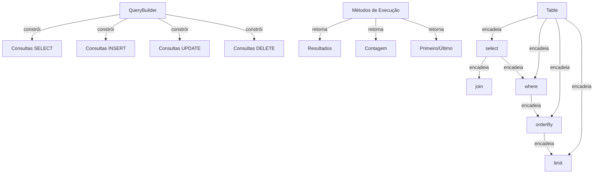

O Construtor de Consultas do XOOPS fornece uma interface fluente e moderna para construir consultas SQL. Ajuda a prevenir injeção de SQL, melhora a legibilidade e fornece abstração de banco de dados para múltiplos sistemas de banco de dados.

## Arquitetura do Construtor de Consultas



## Classe QueryBuilder

A classe construtora de consultas principal com interface fluente.

### Visão Geral da Classe

```php
namespace Xoops\Database;

class QueryBuilder
{
    protected string $table = '';
    protected string $type = 'SELECT';
    protected array $selects = [];
    protected array $joins = [];
    protected array $wheres = [];
    protected array $orders = [];
    protected int $limit = 0;
    protected int $offset = 0;
    protected array $bindings = [];
}
```

### Métodos Estáticos

#### table

Cria um novo construtor de consultas para uma tabela.

```php
public static function table(string $table): QueryBuilder
```

**Parâmetros:**

| Parâmetro | Tipo | Descrição |
|-----------|------|-------------|
| `$table` | string | Nome da tabela (com ou sem prefixo) |

**Retorna:** `QueryBuilder` - Instância do construtor de consultas

**Exemplo:**
```php
$query = QueryBuilder::table('users');
$query = QueryBuilder::table('xoops_users'); // Com prefixo
```

## Consultas SELECT

### select

Especifica as colunas a selecionar.

```php
public function select(...$columns): self
```

**Parâmetros:**

| Parâmetro | Tipo | Descrição |
|-----------|------|-------------|
| `...$columns` | array | Nomes de colunas ou expressões |

**Retorna:** `self` - Para encadeamento de método

**Exemplo:**
```php
// Seleção simples
QueryBuilder::table('users')
    ->select('id', 'username', 'email')
    ->get();

// Seleção com aliases
QueryBuilder::table('users')
    ->select('id as user_id', 'username as name')
    ->get();

// Selecionar todas as colunas
QueryBuilder::table('users')
    ->select('*')
    ->get();

// Seleção com expressões
QueryBuilder::table('orders')
    ->select('id', 'COUNT(*) as total_items')
    ->groupBy('id')
    ->get();
```

### where

Adiciona uma condição WHERE.

```php
public function where(string $column, string $operator = '=', mixed $value = null): self
```

**Parâmetros:**

| Parâmetro | Tipo | Descrição |
|-----------|------|-------------|
| `$column` | string | Nome da coluna |
| `$operator` | string | Operador de comparação |
| `$value` | mixed | Valor a comparar |

**Retorna:** `self` - Para encadeamento de método

**Operadores:**

| Operador | Descrição | Exemplo |
|----------|-------------|---------|
| `=` | Igual | `->where('status', '=', 'active')` |
| `!=` ou `<>` | Não igual | `->where('status', '!=', 'deleted')` |
| `>` | Maior que | `->where('price', '>', 100)` |
| `<` | Menor que | `->where('price', '<', 100)` |
| `>=` | Maior ou igual | `->where('age', '>=', 18)` |
| `<=` | Menor ou igual | `->where('age', '<=', 65)` |
| `LIKE` | Correspondência de padrão | `->where('name', 'LIKE', '%john%')` |
| `IN` | Na lista | `->where('status', 'IN', ['active', 'pending'])` |
| `NOT IN` | Não na lista | `->where('id', 'NOT IN', [1, 2, 3])` |
| `BETWEEN` | Intervalo | `->where('age', 'BETWEEN', [18, 65])` |
| `IS NULL` | É nulo | `->where('deleted_at', 'IS NULL')` |
| `IS NOT NULL` | Não é nulo | `->where('deleted_at', 'IS NOT NULL')` |

**Exemplo:**
```php
// Condição única
QueryBuilder::table('users')
    ->select('*')
    ->where('status', '=', 'active')
    ->get();

// Múltiplas condições (AND)
QueryBuilder::table('users')
    ->select('*')
    ->where('status', '=', 'active')
    ->where('age', '>=', 18)
    ->get();

// Operador IN
QueryBuilder::table('products')
    ->select('*')
    ->where('category_id', 'IN', [1, 2, 3])
    ->get();

// Operador LIKE
QueryBuilder::table('users')
    ->select('*')
    ->where('email', 'LIKE', '%@example.com')
    ->get();

// Verificação NULL
QueryBuilder::table('users')
    ->select('*')
    ->where('deleted_at', 'IS NULL')
    ->get();
```

### orWhere

Adiciona uma condição OR.

```php
public function orWhere(string $column, string $operator = '=', mixed $value = null): self
```

**Exemplo:**
```php
QueryBuilder::table('users')
    ->select('*')
    ->where('status', '=', 'active')
    ->orWhere('premium', '=', 1)
    ->get();
    // SELECT * FROM users WHERE status = 'active' OR premium = 1
```

### whereIn / whereNotIn

Métodos de conveniência para IN/NOT IN.

```php
public function whereIn(string $column, array $values): self
public function whereNotIn(string $column, array $values): self
```

**Exemplo:**
```php
QueryBuilder::table('posts')
    ->select('*')
    ->whereIn('status', ['published', 'scheduled'])
    ->get();

QueryBuilder::table('comments')
    ->select('*')
    ->whereNotIn('spam_score', [8, 9, 10])
    ->get();
```

### whereNull / whereNotNull

Métodos de conveniência para verificações NULL.

```php
public function whereNull(string $column): self
public function whereNotNull(string $column): self
```

**Exemplo:**
```php
QueryBuilder::table('users')
    ->select('*')
    ->whereNotNull('verified_at')
    ->get();
```

### whereBetween

Verifica se o valor está entre dois valores.

```php
public function whereBetween(string $column, array $values): self
```

**Exemplo:**
```php
QueryBuilder::table('products')
    ->select('*')
    ->whereBetween('price', [10, 100])
    ->get();

QueryBuilder::table('orders')
    ->select('*')
    ->whereBetween('created_at', ['2024-01-01', '2024-12-31'])
    ->get();
```

### join

Adiciona um INNER JOIN.

```php
public function join(
    string $table,
    string $first,
    string $operator = '=',
    string $second = null
): self
```

**Exemplo:**
```php
QueryBuilder::table('posts')
    ->select('posts.*', 'users.username', 'categories.name')
    ->join('users', 'posts.user_id', '=', 'users.id')
    ->join('categories', 'posts.category_id', '=', 'categories.id')
    ->where('posts.published', '=', 1)
    ->get();
```

### leftJoin / rightJoin

Tipos de join alternativos.

```php
public function leftJoin(
    string $table,
    string $first,
    string $operator = '=',
    string $second = null
): self

public function rightJoin(
    string $table,
    string $first,
    string $operator = '=',
    string $second = null
): self
```

**Exemplo:**
```php
QueryBuilder::table('users')
    ->select('users.*', 'COUNT(posts.id) as post_count')
    ->leftJoin('posts', 'users.id', '=', 'posts.user_id')
    ->groupBy('users.id')
    ->get();
```

### groupBy

Agrupa resultados por coluna(s).

```php
public function groupBy(...$columns): self
```

**Exemplo:**
```php
QueryBuilder::table('orders')
    ->select('user_id', 'COUNT(*) as order_count', 'SUM(total) as total_spent')
    ->groupBy('user_id')
    ->get();

QueryBuilder::table('sales')
    ->select('department', 'region', 'SUM(amount) as total')
    ->groupBy('department', 'region')
    ->get();
```

### having

Adiciona uma condição HAVING.

```php
public function having(string $column, string $operator = '=', mixed $value = null): self
```

**Exemplo:**
```php
QueryBuilder::table('orders')
    ->select('user_id', 'COUNT(*) as order_count')
    ->groupBy('user_id')
    ->having('order_count', '>', 5)
    ->get();
```

### orderBy

Ordena os resultados.

```php
public function orderBy(string $column, string $direction = 'ASC'): self
```

**Parâmetros:**

| Parâmetro | Tipo | Descrição |
|-----------|------|-------------|
| `$column` | string | Coluna para ordenar por |
| `$direction` | string | `ASC` ou `DESC` |

**Exemplo:**
```php
// Ordem única
QueryBuilder::table('users')
    ->select('*')
    ->orderBy('created_at', 'DESC')
    ->get();

// Múltiplas ordens
QueryBuilder::table('posts')
    ->select('*')
    ->orderBy('category_id', 'ASC')
    ->orderBy('created_at', 'DESC')
    ->get();

// Ordem aleatória
QueryBuilder::table('quotes')
    ->select('*')
    ->orderBy('RAND()')
    ->get();
```

### limit / offset

Limita e offset de resultados.

```php
public function limit(int $limit): self
public function offset(int $offset): self
```

**Exemplo:**
```php
// Limite simples
QueryBuilder::table('posts')
    ->select('*')
    ->limit(10)
    ->get();

// Paginação
$page = 2;
$perPage = 20;
$offset = ($page - 1) * $perPage;

QueryBuilder::table('posts')
    ->select('*')
    ->limit($perPage)
    ->offset($offset)
    ->get();
```

## Métodos de Execução

### get

Executa a consulta e retorna todos os resultados.

```php
public function get(): array
```

**Retorna:** `array` - Array de linhas de resultado

**Exemplo:**
```php
$users = QueryBuilder::table('users')
    ->select('id', 'username', 'email')
    ->where('status', '=', 'active')
    ->orderBy('username')
    ->get();

foreach ($users as $user) {
    echo $user['username'] . ' (' . $user['email'] . ')' . "\n";
}
```

### first

Obtém o primeiro resultado.

```php
public function first(): ?array
```

**Retorna:** `?array` - Primeira linha ou null

**Exemplo:**
```php
$user = QueryBuilder::table('users')
    ->select('*')
    ->where('id', '=', 123)
    ->first();

if ($user) {
    echo 'Encontrado: ' . $user['username'];
}
```

### last

Obtém o último resultado.

```php
public function last(): ?array
```

**Exemplo:**
```php
$latestPost = QueryBuilder::table('posts')
    ->select('*')
    ->orderBy('created_at', 'DESC')
    ->last();
```

### count

Obtém a contagem de resultados.

```php
public function count(): int
```

**Retorna:** `int` - Número de linhas

**Exemplo:**
```php
$activeUsers = QueryBuilder::table('users')
    ->where('status', '=', 'active')
    ->count();

echo "Usuários ativos: $activeUsers";
```

### exists

Verifica se a consulta retorna resultados.

```php
public function exists(): bool
```

**Retorna:** `bool` - Verdadeiro se existirem resultados

**Exemplo:**
```php
if (QueryBuilder::table('users')->where('email', '=', 'test@example.com')->exists()) {
    echo 'Usuário já existe';
}
```

### aggregate

Obtém valores agregados.

```php
public function aggregate(string $function, string $column): mixed
```

**Exemplo:**
```php
$maxPrice = QueryBuilder::table('products')
    ->aggregate('MAX', 'price');

$avgAge = QueryBuilder::table('users')
    ->aggregate('AVG', 'age');

$totalSales = QueryBuilder::table('orders')
    ->aggregate('SUM', 'total');
```

## Consultas INSERT

### insert

Insere uma linha.

```php
public function insert(array $values): bool
```

**Exemplo:**
```php
QueryBuilder::table('users')->insert([
    'username' => 'john',
    'email' => 'john@example.com',
    'password' => password_hash('secret', PASSWORD_BCRYPT),
    'created_at' => date('Y-m-d H:i:s')
]);
```

### insertMany

Insere múltiplas linhas.

```php
public function insertMany(array $rows): bool
```

**Exemplo:**
```php
QueryBuilder::table('log_entries')->insertMany([
    ['action' => 'login', 'user_id' => 1, 'timestamp' => time()],
    ['action' => 'logout', 'user_id' => 2, 'timestamp' => time()],
    ['action' => 'update', 'user_id' => 3, 'timestamp' => time()]
]);
```

## Consultas UPDATE

### update

Atualiza linhas.

```php
public function update(array $values): int
```

**Retorna:** `int` - Número de linhas afetadas

**Exemplo:**
```php
// Atualizar usuário único
QueryBuilder::table('users')
    ->where('id', '=', 123)
    ->update([
        'email' => 'newemail@example.com',
        'updated_at' => date('Y-m-d H:i:s')
    ]);

// Atualizar múltiplas linhas
QueryBuilder::table('posts')
    ->where('status', '=', 'draft')
    ->where('created_at', '<', date('Y-m-d', strtotime('-30 days')))
    ->update([
        'status' => 'archived'
    ]);
```

### increment / decrement

Incrementa ou decrementa uma coluna.

```php
public function increment(string $column, int $amount = 1): int
public function decrement(string $column, int $amount = 1): int
```

**Exemplo:**
```php
// Incrementar contagem de visualizações
QueryBuilder::table('posts')
    ->where('id', '=', 123)
    ->increment('views');

// Decrementar estoque
QueryBuilder::table('products')
    ->where('id', '=', 456)
    ->decrement('stock', 5);
```

## Consultas DELETE

### delete

Deleta linhas.

```php
public function delete(): int
```

**Retorna:** `int` - Número de linhas deletadas

**Exemplo:**
```php
// Deletar registro único
QueryBuilder::table('comments')
    ->where('id', '=', 789)
    ->delete();

// Deletar múltiplos registros
QueryBuilder::table('log_entries')
    ->where('created_at', '<', date('Y-m-d', strtotime('-30 days')))
    ->delete();
```

### truncate

Deleta todas as linhas da tabela.

```php
public function truncate(): bool
```

**Exemplo:**
```php
// Limpar todas as sessões
QueryBuilder::table('sessions')->truncate();
```

## Recursos Avançados

### Expressões Brutos

```php
QueryBuilder::table('products')
    ->select('id', 'name', QueryBuilder::raw('price * quantity as total'))
    ->get();
```

### Subconsultas

```php
$recentPostIds = QueryBuilder::table('posts')
    ->select('id')
    ->where('created_at', '>', date('Y-m-d', strtotime('-7 days')))
    ->toSql();

$comments = QueryBuilder::table('comments')
    ->select('*')
    ->whereIn('post_id', $recentPostIds)
    ->get();
```

### Obtendo o SQL

```php
public function toSql(): string
```

**Exemplo:**
```php
$sql = QueryBuilder::table('users')
    ->select('id', 'username')
    ->where('status', '=', 'active')
    ->toSql();

echo $sql;
// SELECT id, username FROM xoops_users WHERE status = ?
```

## Exemplos Completos

### SELECT Complexa com Joins

```php
<?php
/**
 * Obter posts com informações de autor e categoria
 */

$posts = QueryBuilder::table('posts')
    ->select(
        'posts.id',
        'posts.title',
        'posts.content',
        'posts.created_at',
        'users.username as author',
        'categories.name as category'
    )
    ->join('users', 'posts.user_id', '=', 'users.id')
    ->join('categories', 'posts.category_id', '=', 'categories.id')
    ->where('posts.published', '=', 1)
    ->orderBy('posts.created_at', 'DESC')
    ->limit(10)
    ->get();

foreach ($posts as $post) {
    echo '<article>';
    echo '<h2>' . htmlspecialchars($post['title']) . '</h2>';
    echo '<p class="meta">Por ' . htmlspecialchars($post['author']) . ' em ' . htmlspecialchars($post['category']) . '</p>';
    echo '<p>' . htmlspecialchars($post['content']) . '</p>';
    echo '</article>';
}
```

### Paginação com QueryBuilder

```php
<?php
/**
 * Resultados paginados
 */

$page = isset($_GET['page']) ? (int)$_GET['page'] : 1;
$perPage = 20;
$offset = ($page - 1) * $perPage;

// Obter contagem total
$total = QueryBuilder::table('articles')
    ->where('status', '=', 'published')
    ->count();

// Obter resultados da página
$articles = QueryBuilder::table('articles')
    ->select('*')
    ->where('status', '=', 'published')
    ->orderBy('created_at', 'DESC')
    ->limit($perPage)
    ->offset($offset)
    ->get();

// Calcular paginação
$pages = ceil($total / $perPage);

// Exibir resultados
foreach ($articles as $article) {
    echo '<div class="article">' . htmlspecialchars($article['title']) . '</div>';
}

// Exibir links de paginação
if ($pages > 1) {
    echo '<nav class="pagination">';
    for ($i = 1; $i <= $pages; $i++) {
        if ($i == $page) {
            echo '<span class="current">' . $i . '</span>';
        } else {
            echo '<a href="?page=' . $i . '">' . $i . '</a>';
        }
    }
    echo '</nav>';
}
```

### Análise de Dados com Agregados

```php
<?php
/**
 * Análise de vendas
 */

// Vendas totais por região
$regionSales = QueryBuilder::table('orders')
    ->select('region', QueryBuilder::raw('SUM(total) as total_sales'), QueryBuilder::raw('COUNT(*) as order_count'))
    ->groupBy('region')
    ->orderBy('total_sales', 'DESC')
    ->get();

foreach ($regionSales as $region) {
    echo $region['region'] . ': $' . number_format($region['total_sales'], 2) . ' (' . $region['order_count'] . ' pedidos)' . "\n";
}

// Valor médio de pedido
$avgOrderValue = QueryBuilder::table('orders')
    ->aggregate('AVG', 'total');

echo 'Valor médio de pedido: $' . number_format($avgOrderValue, 2);
```

## Melhores Práticas

1. **Use Consultas Parametrizadas** - QueryBuilder manipula ligação de parâmetros automaticamente
2. **Encadeie Métodos** - Aproveite a interface fluente para código legível
3. **Teste Saída SQL** - Use `toSql()` para verificar consultas geradas
4. **Use Índices** - Garanta que colunas consultadas frequentemente sejam indexadas
5. **Limite Resultados** - Sempre use `limit()` para conjuntos de dados grandes
6. **Use Agregados** - Deixe o banco de dados fazer contagem/soma em vez de PHP
7. **Escape de Saída** - Sempre escape dados exibidos com `htmlspecialchars()`
8. **Desempenho de Índices** - Monitore consultas lentas e otimize conforme necessário

## Documentação Relacionada

- XoopsDatabase - Camada de banco de dados e conexões
- Criteria - Sistema legado de consultas baseado em Criteria
- ../Core/XoopsObject - Persistência de objeto de dados
- ../Module/Module-System - Operações de banco de dados de módulo

---

*Veja também: [API de Banco de Dados do XOOPS](https://github.com/XOOPS/XoopsCore27/tree/master/htdocs/class)*
