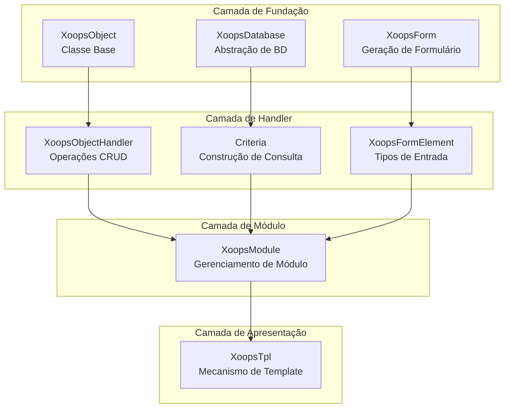
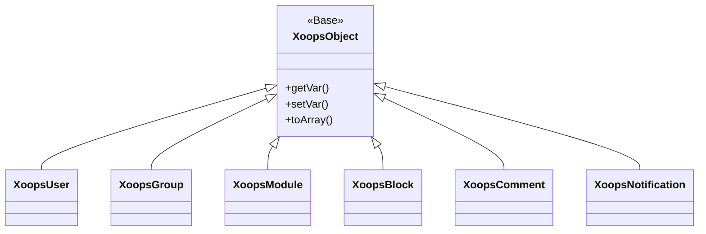
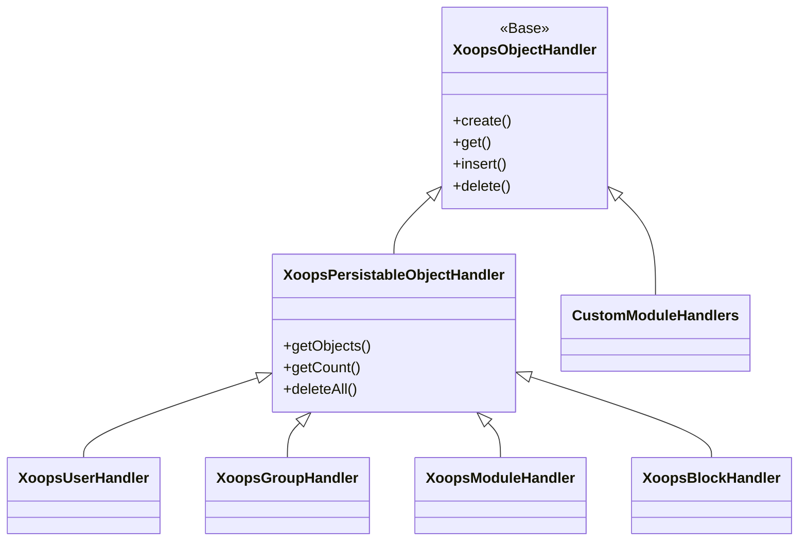
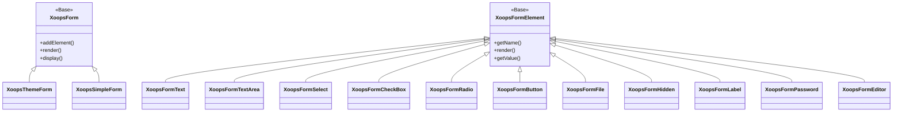

Bem-vindo à documentação abrangente da Referência da API do XOOPS. Esta seção fornece documentação detalhada para todas as classes principais, métodos e sistemas que compõem o Sistema de Gerenciamento de Conteúdo XOOPS.

## Visão Geral

A API do XOOPS é organizada em vários subsistemas principais, cada um responsável por um aspecto específico da funcionalidade do CMS. Entender essas APIs é essencial para desenvolver módulos, temas e extensões para XOOPS.

## Seções da API

### Classes Principais

As classes de fundação que todos os outros componentes do XOOPS se baseiam.

| Documentação | Descrição |
|--------------|-------------|
| XoopsObject | Classe base para todos os objetos de dados no XOOPS |
| XoopsObjectHandler | Padrão de handler para operações CRUD |

### Camada de Banco de Dados

Abstração de banco de dados e utilitários de construção de consultas.

| Documentação | Descrição |
|--------------|-------------|
| XoopsDatabase | Camada de abstração de banco de dados |
| Sistema Criteria | Criteria de consulta e condições |
| QueryBuilder | Construção moderna de consultas fluentes |

### Sistema de Formulários

Geração de formulários HTML e validação.

| Documentação | Descrição |
|--------------|-------------|
| XoopsForm | Contêiner de formulário e renderização |
| Elementos de Formulário | Todos os tipos de elementos de formulário disponíveis |

### Classes do Kernel

Componentes do sistema principal e serviços.

| Documentação | Descrição |
|--------------|-------------|
| Classes do Kernel | Kernel do sistema e componentes principais |

### Sistema de Módulo

Gerenciamento de módulo e ciclo de vida.

| Documentação | Descrição |
|--------------|-------------|
| Sistema de Módulo | Carregamento, instalação e gerenciamento de módulo |

### Sistema de Template

Integração com template Smarty.

| Documentação | Descrição |
|--------------|-------------|
| Sistema de Template | Integração Smarty e gerenciamento de template |

### Sistema de Usuário

Gerenciamento de usuário e autenticação.

| Documentação | Descrição |
|--------------|-------------|
| Sistema de Usuário | Contas de usuário, grupos e permissões |

## Visão Geral da Arquitetura



## Hierarquia de Classe

### Modelo de Objeto



### Modelo de Handler



### Modelo de Formulário



## Padrões de Design

A API do XOOPS implementa vários padrões de design bem conhecidos:

### Padrão Singleton
Usado para serviços globais como conexões de banco de dados e instâncias de contêiner.

```php
$db = XoopsDatabase::getInstance();
$container = XoopsContainer::getInstance();
```

### Padrão Factory
Os handlers de objetos criam objetos de domínio de forma consistente.

```php
$handler = xoops_getHandler('user');
$user = $handler->create();
```

### Padrão Composite
Os formulários contêm múltiplos elementos de formulário; criteria podem conter criteria aninhadas.

```php
$criteria = new CriteriaCompo();
$criteria->add(new Criteria('status', 1));
$criteria->add(new CriteriaCompo(...)); // Aninhada
```

### Padrão Observer
O sistema de eventos permite acoplamento solto entre módulos.

```php
$dispatcher->addListener('module.news.article_published', $callback);
```

## Exemplos de Início Rápido

### Criando e Salvando um Objeto

```php
// Obter o handler
$handler = xoops_getHandler('user');

// Criar um novo objeto
$user = $handler->create();
$user->setVar('uname', 'newuser');
$user->setVar('email', 'user@example.com');

// Salvar no banco de dados
$handler->insert($user);
```

### Consultando com Criteria

```php
// Construir criteria
$criteria = new CriteriaCompo();
$criteria->add(new Criteria('level', 0, '>'));
$criteria->setSort('uname');
$criteria->setOrder('ASC');
$criteria->setLimit(10);

// Obter objetos
$handler = xoops_getHandler('user');
$users = $handler->getObjects($criteria);
```

### Criando um Formulário

```php
$form = new XoopsThemeForm('User Profile', 'userform', 'save.php', 'post', true);
$form->addElement(new XoopsFormText('Username', 'uname', 50, 255, $user->getVar('uname')));
$form->addElement(new XoopsFormTextArea('Bio', 'bio', $user->getVar('bio')));
$form->addElement(new XoopsFormButton('', 'submit', _SUBMIT, 'submit'));
echo $form->render();
```

## Convenções da API

### Convenções de Nomenclatura

| Tipo | Convenção | Exemplo |
|------|-----------|---------|
| Classes | PascalCase | `XoopsUser`, `CriteriaCompo` |
| Métodos | camelCase | `getVar()`, `setVar()` |
| Propriedades | camelCase (protegida) | `$_vars`, `$_handler` |
| Constantes | UPPER_SNAKE_CASE | `XOBJ_DTYPE_INT` |
| Tabelas de Banco de Dados | snake_case | `users`, `groups_users_link` |

### Tipos de Dados

XOOPS define tipos de dados padrão para variáveis de objeto:

| Constante | Tipo | Descrição |
|----------|------|-------------|
| `XOBJ_DTYPE_TXTBOX` | String | Entrada de texto (sanitizada) |
| `XOBJ_DTYPE_TXTAREA` | String | Conteúdo de textarea |
| `XOBJ_DTYPE_INT` | Integer | Valores numéricos |
| `XOBJ_DTYPE_URL` | String | Validação de URL |
| `XOBJ_DTYPE_EMAIL` | String | Validação de email |
| `XOBJ_DTYPE_ARRAY` | Array | Arrays serializados |
| `XOBJ_DTYPE_OTHER` | Mixed | Manipulação personalizada |
| `XOBJ_DTYPE_SOURCE` | String | Código-fonte (sanitização mínima) |
| `XOBJ_DTYPE_STIME` | Integer | Timestamp curto |
| `XOBJ_DTYPE_MTIME` | Integer | Timestamp médio |
| `XOBJ_DTYPE_LTIME` | Integer | Timestamp longo |

## Métodos de Autenticação

A API suporta múltiplos métodos de autenticação:

### Autenticação por Chave de API
```
X-API-Key: sua-chave-api
```

### Token Bearer OAuth
```
Authorization: Bearer seu-token-oauth
```

### Autenticação Baseada em Sessão
Usa a sessão existente do XOOPS quando conectado.

## Endpoints da API REST

Quando a API REST está ativada:

| Endpoint | Método | Descrição |
|----------|--------|-------------|
| `/api.php/rest/users` | GET | Listar usuários |
| `/api.php/rest/users/{id}` | GET | Obter usuário por ID |
| `/api.php/rest/users` | POST | Criar usuário |
| `/api.php/rest/users/{id}` | PUT | Atualizar usuário |
| `/api.php/rest/users/{id}` | DELETE | Deletar usuário |
| `/api.php/rest/modules` | GET | Listar módulos |

## Documentação Relacionada

- Guia de Desenvolvimento de Módulo
- Guia de Desenvolvimento de Tema
- Configuração do Sistema
- Melhores Práticas de Segurança

## Histórico de Versão

| Versão | Alterações |
|---------|---------|
| 2.5.11 | Lançamento estável atual |
| 2.5.10 | Suporte para API GraphQL adicionado |
| 2.5.9 | Sistema Criteria melhorado |
| 2.5.8 | Suporte para carregamento automático PSR-4 |

---

*Esta documentação faz parte da Base de Conhecimento XOOPS. Para as atualizações mais recentes, visite o [repositório GitHub do XOOPS](https://github.com/XOOPS).*
