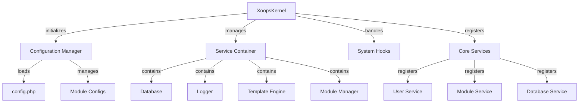

O Kernel do XOOPS fornece a estrutura fundamental para inicializar o sistema, gerenciar configurações, processar eventos do sistema e fornecer utilitários principais. Essas classes formam a espinha dorsal da aplicação XOOPS.

## Arquitetura do Sistema



## Classe XoopsKernel

A classe kernel principal que inicializa e gerencia o sistema XOOPS.

### Visão Geral da Classe

```php
namespace Xoops;

class XoopsKernel
{
    private static ?XoopsKernel $instance = null;
    protected ServiceContainer $services;
    protected ConfigurationManager $config;
    protected array $modules = [];
    protected bool $isLoaded = false;
}
```

### Construtor

```php
private function __construct()
```

Construtor privado que força o padrão singleton.

### getInstance

Recupera a instância singleton do kernel.

```php
public static function getInstance(): XoopsKernel
```

**Retorna:** `XoopsKernel` - A instância singleton do kernel

**Example:**
```php
$kernel = XoopsKernel::getInstance();
```

### Processo de Boot

O processo de boot do kernel segue estas etapas:

1. **Inicialização** - Configurar manipuladores de erro, definir constantes
2. **Configuração** - Carregar arquivos de configuração
3. **Registro de Serviços** - Registrar serviços principais
4. **Detecção de Módulos** - Escanear e identificar módulos ativos
5. **Inicialização do Banco de Dados** - Conectar ao banco de dados
6. **Limpeza** - Preparar para tratamento de requisições

```php
public function boot(): void
```

**Exemplo:**
```php
$kernel = XoopsKernel::getInstance();
$kernel->boot();
```

### Métodos do Container de Serviços

#### registerService

Registra um serviço no container de serviços.

```php
public function registerService(
    string $name,
    callable|object $definition
): void
```

**Parâmetros:**

| Parâmetro | Tipo | Descrição |
|-----------|------|-----------|
| `$name` | string | Identificador do serviço |
| `$definition` | callable\|object | Factory do serviço ou instância |

**Exemplo:**
```php
$kernel->registerService('custom.handler', function($c) {
    return new CustomHandler();
});
```

#### getService

Recupera um serviço registrado.

```php
public function getService(string $name): mixed
```

**Parâmetros:**

| Parâmetro | Tipo | Descrição |
|-----------|------|-----------|
| `$name` | string | Identificador do serviço |

**Retorna:** `mixed` - O serviço solicitado

**Exemplo:**
```php
$database = $kernel->getService('database');
$logger = $kernel->getService('logger');
```

#### hasService

Verifica se um serviço está registrado.

```php
public function hasService(string $name): bool
```

**Exemplo:**
```php
if ($kernel->hasService('cache')) {
    $cache = $kernel->getService('cache');
}
```

## Gerenciador de Configuração

Gerencia a configuração da aplicação e as definições do módulo.

### Visão Geral da Classe

```php
namespace Xoops\Core;

class ConfigurationManager
{
    protected array $config = [];
    protected array $defaults = [];
    protected string $configPath;
}
```

### Methods

#### load

Carrega a configuração de um arquivo ou array.

```php
public function load(string|array $source): void
```

**Parâmetros:**

| Parâmetro | Tipo | Descrição |
|-----------|------|-----------|
| `$source` | string\|array | Caminho do arquivo de config ou array |

**Exemplo:**
```php
$config = $kernel->getService('config');
$config->load(XOOPS_ROOT_PATH . '/include/config.php');
$config->load(['sitename' => 'Meu Site', 'admin_email' => 'admin@example.com']);
```

#### get

Recupera um valor de configuração.

```php
public function get(string $key, mixed $default = null): mixed
```

**Parâmetros:**

| Parâmetro | Tipo | Descrição |
|-----------|------|-----------|
| `$key` | string | Chave de configuração (notação de ponto) |
| `$default` | mixed | Valor padrão se não encontrado |

**Retorna:** `mixed` - Valor de configuração

**Exemplo:**
```php
$siteName = $config->get('sitename');
$adminEmail = $config->get('admin.email', 'admin@example.com');
```

#### set

Define um valor de configuração.

```php
public function set(string $key, mixed $value): void
```

**Parâmetros:**

| Parâmetro | Tipo | Descrição |
|-----------|------|-----------|
| `$key` | string | Chave de configuração |
| `$value` | mixed | Valor de configuração |

**Exemplo:**
```php
$config->set('sitename', 'Novo Nome do Site');
$config->set('features.cache_enabled', true);
```

#### getModuleConfig

Obtém a configuração de um módulo específico.

```php
public function getModuleConfig(
    string $moduleName
): array
```

**Parâmetros:**

| Parâmetro | Tipo | Descrição |
|-----------|------|-----------|
| `$moduleName` | string | Nome do diretório do módulo |

**Retorna:** `array` - Array de configuração do módulo

**Exemplo:**
```php
$publisherConfig = $config->getModuleConfig('publisher');
```

## Ganchos de Sistema

Os ganchos de sistema permitem que módulos e plugins executem código em pontos específicos do ciclo de vida da aplicação.

### Classe HookManager

```php
namespace Xoops\Core;

class HookManager
{
    protected array $hooks = [];
    protected array $listeners = [];
}
```

### Métodos

#### addHook

Registra um ponto de gancho.

```php
public function addHook(string $name): void
```

**Parâmetros:**

| Parâmetro | Tipo | Descrição |
|-----------|------|-----------|
| `$name` | string | Identificador do gancho |

**Exemplo:**
```php
$hooks = $kernel->getService('hooks');
$hooks->addHook('system.startup');
$hooks->addHook('user.login');
$hooks->addHook('module.install');
```

#### listen

Anexa um ouvinte a um gancho.

```php
public function listen(
    string $hookName,
    callable $callback,
    int $priority = 10
): void
```

**Parâmetros:**

| Parâmetro | Tipo | Descrição |
|-----------|------|-----------|
| `$hookName` | string | Identificador do gancho |
| `$callback` | callable | Função a executar |
| `$priority` | int | Prioridade de execução (maior executa primeiro) |

**Exemplo:**
```php
$hooks->listen('user.login', function($user) {
    error_log('Usuário ' . $user->uname . ' conectou');
}, 10);

$hooks->listen('module.install', function($module) {
    // Lógica personalizada de instalação de módulo
    echo "Instalando " . $module->getName();
}, 5);
```

#### trigger

Executa todos os ouvintes de um gancho.

```php
public function trigger(
    string $hookName,
    mixed $arguments = null
): array
```

**Parâmetros:**

| Parâmetro | Tipo | Descrição |
|-----------|------|-----------|
| `$hookName` | string | Identificador do gancho |
| `$arguments` | mixed | Dados a passar para os ouvintes |

**Retorna:** `array` - Resultados de todos os ouvintes

**Exemplo:**
```php
$results = $hooks->trigger('system.startup');
$results = $hooks->trigger('user.created', $newUser);
```

## Visão Geral dos Serviços Principais

O kernel registra vários serviços principais durante o boot:

| Serviço | Classe | Objetivo |
|---------|--------|----------|
| `database` | XoopsDatabase | Camada de abstração do banco de dados |
| `config` | ConfigurationManager | Gerenciamento de configuração |
| `logger` | Logger | Registro de aplicação |
| `template` | XoopsTpl | Mecanismo de template |
| `user` | UserManager | Serviço de gerenciamento de usuários |
| `module` | ModuleManager | Gerenciamento de módulos |
| `cache` | CacheManager | Camada de cache |
| `hooks` | HookManager | Ganchos de eventos do sistema |

## Exemplo de Uso Completo

```php
<?php
/**
 * Processo personalizado de boot do módulo utilizando o kernel
 */

// Obter instância do kernel
$kernel = XoopsKernel::getInstance();

// Boot do sistema
$kernel->boot();

// Obter serviços
$config = $kernel->getService('config');
$database = $kernel->getService('database');
$logger = $kernel->getService('logger');
$hooks = $kernel->getService('hooks');

// Acessar configuração
$siteName = $config->get('sitename');
$adminEmail = $config->get('admin.email');

// Registrar ganchos específicos do módulo
$hooks->listen('user.login', function($user) {
    // Registrar login do usuário
    $logger->info('Login do usuário: ' . $user->uname);

    // Rastrear no banco de dados
    $database->query(
        'INSERT INTO ' . $database->prefix('event_log') .
        ' (type, user_id, message, timestamp) VALUES (?, ?, ?, ?)',
        ['login', $user->uid(), 'Login do usuário', time()]
    );
});

$hooks->listen('module.install', function($module) {
    $logger->info('Módulo instalado: ' . $module->getName());
});

// Disparar ganchos
$hooks->trigger('system.startup');

// Usar serviço de banco de dados
$result = $database->query(
    'SELECT * FROM ' . $database->prefix('users') .
    ' LIMIT 10'
);

while ($row = $database->fetchArray($result)) {
    echo "Usuário: " . htmlspecialchars($row['uname']) . "\n";
}

// Registrar serviço personalizado
$kernel->registerService('custom.repository', function($c) {
    return new CustomRepository($c->getService('database'));
});

// Acessar serviço personalizado posteriormente
$repo = $kernel->getService('custom.repository');
```

## Constantes Principais

O kernel define várias constantes importantes durante o boot:

```php
// Caminhos do sistema
define('XOOPS_ROOT_PATH', '/var/www/xoops');
define('XOOPS_HTDOCS_PATH', XOOPS_ROOT_PATH . '/htdocs');
define('XOOPS_MODULES_PATH', XOOPS_ROOT_PATH . '/htdocs/modules');
define('XOOPS_THEMES_PATH', XOOPS_ROOT_PATH . '/htdocs/themes');

// Caminhos web
define('XOOPS_URL', 'http://example.com');
define('XOOPS_HTDOCS_URL', XOOPS_URL . '/htdocs');

// Banco de dados
define('XOOPS_DB_PREFIX', 'xoops_');
```

## Tratamento de Erros

O kernel configura manipuladores de erro durante o boot:

```php
// Definir manipulador de erro personalizado
set_error_handler(function($errno, $errstr, $errfile, $errline) {
    $kernel->getService('logger')->error(
        "Erro: $errstr em $errfile:$errline"
    );
});

// Definir manipulador de exceção
set_exception_handler(function($exception) {
    $kernel->getService('logger')->critical(
        "Exceção: " . $exception->getMessage()
    );
});
```

## Melhores Práticas

1. **Boot Único** - Chamar `boot()` apenas uma vez durante a inicialização da aplicação
2. **Usar Container de Serviços** - Registrar e recuperar serviços através do kernel
3. **Lidar com Ganchos Cedo** - Registrar ouvintes de ganchos antes de dispará-los
4. **Registrar Eventos Importantes** - Usar o serviço de logger para depuração
5. **Cache de Configuração** - Carregar config uma vez e reutilizar
6. **Tratamento de Erros** - Sempre configurar manipuladores de erro antes de processar requisições

## Documentação Relacionada

- ../Module/Module-System - Sistema de módulo e ciclo de vida
- ../Template/Template-System - Integração do mecanismo de template
- ../User/User-System - Autenticação e gerenciamento de usuários
- ../Database/XoopsDatabase - Camada de banco de dados

---

*Veja também: [Fonte do Kernel do XOOPS](https://github.com/XOOPS/XoopsCore27/tree/master/htdocs/class)*
