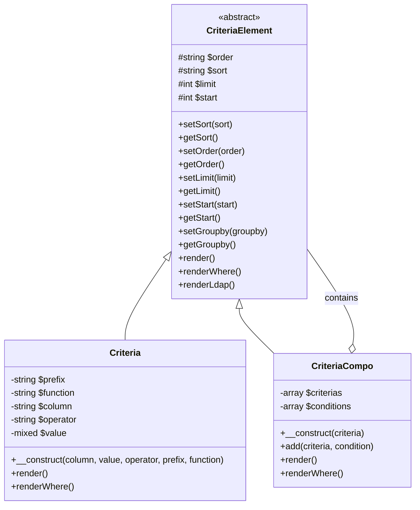
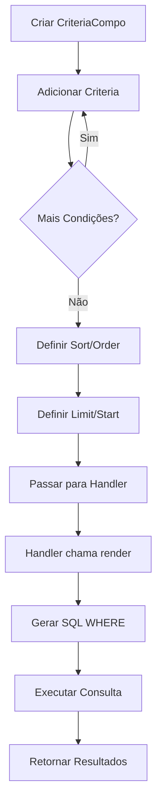
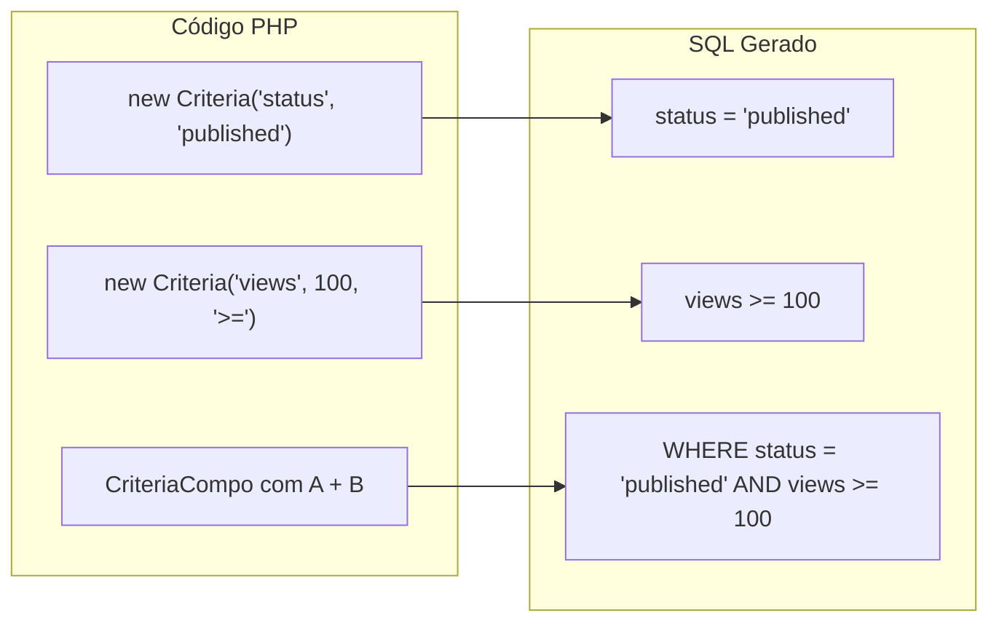
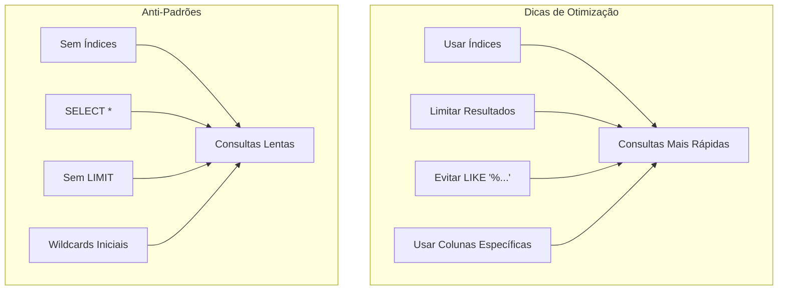

> Documentação completa da API para o sistema de construção de consultas Criteria do XOOPS.

---

## Arquitetura do Sistema Criteria



---

## Classe Criteria

### Construtor

```php
public function __construct(
    string $column,           // Nome da coluna
    mixed $value = '',        // Valor a comparar
    string $operator = '=',   // Operador de comparação
    string $prefix = '',      // Prefixo da tabela
    string $function = ''     // Wrapper de função SQL
)
```

### Operadores

| Operador | Exemplo | Saída SQL |
|----------|---------|-----------|
| `=` | `new Criteria('status', 1)` | `status = 1` |
| `!=` | `new Criteria('status', 0, '!=')` | `status != 0` |
| `<>` | `new Criteria('status', 0, '<>')` | `status <> 0` |
| `<` | `new Criteria('age', 18, '<')` | `age < 18` |
| `<=` | `new Criteria('age', 18, '<=')` | `age <= 18` |
| `>` | `new Criteria('age', 18, '>')` | `age > 18` |
| `>=` | `new Criteria('age', 18, '>=')` | `age >= 18` |
| `LIKE` | `new Criteria('title', '%php%', 'LIKE')` | `title LIKE '%php%'` |
| `NOT LIKE` | `new Criteria('title', '%spam%', 'NOT LIKE')` | `title NOT LIKE '%spam%'` |
| `IN` | `new Criteria('id', '(1,2,3)', 'IN')` | `id IN (1,2,3)` |
| `NOT IN` | `new Criteria('id', '(1,2,3)', 'NOT IN')` | `id NOT IN (1,2,3)` |
| `IS NULL` | `new Criteria('deleted', null, 'IS NULL')` | `deleted IS NULL` |
| `IS NOT NULL` | `new Criteria('email', null, 'IS NOT NULL')` | `email IS NOT NULL` |
| `BETWEEN` | `new Criteria('created', '1000 AND 2000', 'BETWEEN')` | `created BETWEEN 1000 AND 2000` |

### Exemplos de Uso

```php
// Igualdade simples
$criteria = new Criteria('status', 'published');

// Comparação numérica
$criteria = new Criteria('views', 100, '>=');

// Correspondência de padrão
$criteria = new Criteria('title', '%XOOPS%', 'LIKE');

// Com prefixo de tabela
$criteria = new Criteria('uid', 1, '=', 'u');
// Renderiza: u.uid = 1

// Com função SQL
$criteria = new Criteria('title', '', '!=', '', 'LOWER');
// Renderiza: LOWER(title) != ''
```

---

## Classe CriteriaCompo

### Construtor e Métodos

```php
// Criar compo vazio
$criteria = new CriteriaCompo();

// Ou com criteria inicial
$criteria = new CriteriaCompo(new Criteria('status', 'active'));

// Adicionar criteria (AND por padrão)
$criteria->add(new Criteria('views', 10, '>='));

// Adicionar com OR
$criteria->add(new Criteria('featured', 1), 'OR');

// Aninhamento
$subCriteria = new CriteriaCompo();
$subCriteria->add(new Criteria('author', 1));
$subCriteria->add(new Criteria('author', 2), 'OR');
$criteria->add($subCriteria); // (author = 1 OR author = 2)
```

### Ordenação e Paginação

```php
$criteria = new CriteriaCompo();
$criteria->add(new Criteria('status', 'published'));

// Ordenação simples
$criteria->setSort('created');
$criteria->setOrder('DESC');

// Múltiplas colunas de ordenação
$criteria->setSort('category_id, created');
$criteria->setOrder('ASC, DESC');

// Paginação
$criteria->setLimit(10);    // Itens por página
$criteria->setStart(0);     // Offset (página * limite)

// Agrupar por
$criteria->setGroupby('category_id');
```

---

## Fluxo de Construção de Consulta



---

## Exemplos de Consulta Complexa

### Busca com Múltiplas Condições

```php
$criteria = new CriteriaCompo();

// Status deve ser publicado
$criteria->add(new Criteria('status', 'published'));

// Categoria é 1, 2 ou 3
$criteria->add(new Criteria('category_id', '(1, 2, 3)', 'IN'));

// Criado nos últimos 30 dias
$thirtyDaysAgo = time() - (30 * 24 * 60 * 60);
$criteria->add(new Criteria('created', $thirtyDaysAgo, '>='));

// Termo de busca no título OU conteúdo
$searchCriteria = new CriteriaCompo();
$searchCriteria->add(new Criteria('title', '%' . $searchTerm . '%', 'LIKE'));
$searchCriteria->add(new Criteria('content', '%' . $searchTerm . '%', 'LIKE'), 'OR');
$criteria->add($searchCriteria);

// Ordenar por visualizações descendente
$criteria->setSort('views');
$criteria->setOrder('DESC');

// Paginar
$criteria->setLimit($perPage);
$criteria->setStart($page * $perPage);

// Executar
$items = $itemHandler->getObjects($criteria);
$total = $itemHandler->getCount($criteria);
```

### Consulta de Intervalo de Data

```php
$criteria = new CriteriaCompo();

// Entre duas datas
$startDate = strtotime('2024-01-01');
$endDate = strtotime('2024-12-31');

$criteria->add(new Criteria('created', $startDate, '>='));
$criteria->add(new Criteria('created', $endDate, '<='));

// Ou usando BETWEEN
$criteria->add(new Criteria('created', "$startDate AND $endDate", 'BETWEEN'));
```

### Filtro de Permissão de Usuário

```php
$criteria = new CriteriaCompo();
$criteria->add(new Criteria('status', 'published'));

// Se não for admin, mostrar apenas itens próprios ou públicos
if (!$xoopsUser || !$xoopsUser->isAdmin()) {
    $permCriteria = new CriteriaCompo();
    $permCriteria->add(new Criteria('visibility', 'public'));

    if (is_object($xoopsUser)) {
        $permCriteria->add(new Criteria('author_id', $xoopsUser->getVar('uid')), 'OR');
    }

    $criteria->add($permCriteria);
}
```

### Consulta Similar a Join

```php
// Obter itens onde a categoria está ativa
// (Usando abordagem de subconsulta)
$categoryHandler = xoops_getHandler('category');
$activeCatCriteria = new Criteria('status', 'active');
$activeCategories = $categoryHandler->getIds($activeCatCriteria);

if (!empty($activeCategories)) {
    $criteria->add(new Criteria('category_id', '(' . implode(',', $activeCategories) . ')', 'IN'));
}
```

---

## Visualização de Criteria para SQL



---

## Integração com Handler

```php
// Métodos padrão de handler que aceitam Criteria

// Obter múltiplos objetos
$objects = $handler->getObjects($criteria);
$objects = $handler->getObjects($criteria, true);  // Como array
$objects = $handler->getObjects($criteria, true, true); // Como array, id como chave

// Obter contagem
$count = $handler->getCount($criteria);

// Obter lista (id => identificador)
$list = $handler->getList($criteria);

// Deletar correspondentes
$deleted = $handler->deleteAll($criteria);

// Atualizar correspondentes
$handler->updateAll('status', 'archived', $criteria);
```

---

## Considerações de Desempenho



### Melhores Práticas

1. **Sempre definir LIMIT** para tabelas grandes
2. **Usar índices** em colunas usadas em criteria
3. **Evitar wildcards iniciais** em LIKE (`'%term'` é lento)
4. **Pré-filtrar em PHP** quando possível para lógica complexa
5. **Usar COUNT raramente** - cache de resultados quando possível

---

## Documentação Relacionada

- Camada de Banco de Dados
- API XoopsObjectHandler
- Prevenção de Injeção SQL

---

#xoops #api #criteria #database #query #reference
