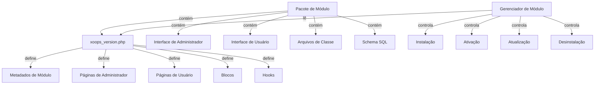

O Sistema de Módulo XOOPS fornece um framework completo para desenvolver, instalar, gerenciar e estender a funcionalidade do módulo. Os módulos são pacotes auto-contidos que estendem o XOOPS com recursos e capacidades adicionais.

## Arquitetura do Módulo



## Estrutura do Módulo

Estrutura de diretório padrão de módulo XOOPS:

```
mymodule/
├── xoops_version.php          # Manifesto de módulo e configuração
├── admin.php                  # Página principal do administrador
├── index.php                  # Página principal do usuário
├── admin/                     # Diretório de páginas de administrador
│   ├── main.php
│   ├── manage.php
│   └── settings.php
├── class/                     # Classes do módulo
│   ├── Handler/
│   │   ├── ItemHandler.php
│   │   └── CategoryHandler.php
│   └── Objects/
│       ├── Item.php
│       └── Category.php
├── sql/                       # Schemas de banco de dados
│   ├── mysql.sql
│   └── postgres.sql
├── include/                   # Arquivos de inclusão
│   ├── common.inc.php
│   └── functions.php
├── templates/                 # Templates de módulo
│   ├── admin/
│   │   └── main.tpl
│   └── user/
│       ├── index.tpl
│       └── item.tpl
├── blocks/                    # Blocos de módulo
│   └── blocks.php
├── tests/                     # Testes unitários
├── language/                  # Arquivos de idioma
│   ├── english/
│   │   └── main.php
│   └── spanish/
│       └── main.php
└── docs/                      # Documentação
```

## Classe XoopsModule

A classe XoopsModule representa um módulo XOOPS instalado.

### Visão Geral da Classe

```php
namespace Xoops\Core\Module;

class XoopsModule extends XoopsObject
{
    protected int $moduleid = 0;
    protected string $name = '';
    protected string $dirname = '';
    protected string $version = '';
    protected string $description = '';
    protected array $config = [];
    protected array $blocks = [];
    protected array $adminPages = [];
    protected array $userPages = [];
}
```

### Propriedades

| Propriedade | Tipo | Descrição |
|----------|------|-------------|
| `$moduleid` | int | ID de módulo único |
| `$name` | string | Nome de exibição do módulo |
| `$dirname` | string | Nome do diretório do módulo |
| `$version` | string | Versão atual do módulo |
| `$description` | string | Descrição do módulo |
| `$config` | array | Configuração do módulo |
| `$blocks` | array | Blocos do módulo |
| `$adminPages` | array | Páginas do painel de administrador |
| `$userPages` | array | Páginas voltadas para o usuário |

### Construtor

```php
public function __construct()
```

Cria uma nova instância de módulo e inicializa variáveis.

### Métodos Principais

#### getName

Obtém o nome de exibição do módulo.

```php
public function getName(): string
```

**Retorna:** `string` - Nome de exibição do módulo

**Exemplo:**
```php
$module = new XoopsModule();
$module->setVar('name', 'Publisher');
echo $module->getName(); // "Publisher"
```

#### getDirname

Obtém o nome do diretório do módulo.

```php
public function getDirname(): string
```

**Retorna:** `string` - Nome do diretório do módulo

**Exemplo:**
```php
echo $module->getDirname(); // "publisher"
```

#### getVersion

Obtém a versão atual do módulo.

```php
public function getVersion(): string
```

**Retorna:** `string` - String de versão

**Exemplo:**
```php
echo $module->getVersion(); // "2.1.0"
```

#### getDescription

Obtém a descrição do módulo.

```php
public function getDescription(): string
```

**Retorna:** `string` - Descrição do módulo

**Exemplo:**
```php
$desc = $module->getDescription();
```

#### getConfig

Recupera a configuração do módulo.

```php
public function getConfig(string $key = null): mixed
```

**Parâmetros:**

| Parâmetro | Tipo | Descrição |
|-----------|------|-------------|
| `$key` | string | Chave de configuração (null para todas) |

**Retorna:** `mixed` - Valor de configuração ou array

**Exemplo:**
```php
$config = $module->getConfig();
$itemsPerPage = $module->getConfig('items_per_page');
```

#### setConfig

Define a configuração do módulo.

```php
public function setConfig(string $key, mixed $value): void
```

**Parâmetros:**

| Parâmetro | Tipo | Descrição |
|-----------|------|-------------|
| `$key` | string | Chave de configuração |
| `$value` | mixed | Valor de configuração |

**Exemplo:**
```php
$module->setConfig('items_per_page', 20);
$module->setConfig('enable_cache', true);
```

#### getPath

Obtém o caminho do sistema de arquivos completo para o módulo.

```php
public function getPath(): string
```

**Retorna:** `string` - Caminho de diretório de módulo absoluto

**Exemplo:**
```php
$path = $module->getPath(); // "/var/www/xoops/modules/publisher"
$classPath = $module->getPath() . '/class';
```

#### getUrl

Obtém a URL para o módulo.

```php
public function getUrl(): string
```

**Retorna:** `string` - URL do módulo

**Exemplo:**
```php
$url = $module->getUrl(); // "http://example.com/modules/publisher"
```

## Processo de Instalação do Módulo

### Função xoops_module_install

A função de instalação do módulo definida em `xoops_version.php`:

```php
function xoops_module_install_modulename($module)
{
    // $module é uma instância de XoopsModule

    // Criar tabelas de banco de dados
    // Inicializar configuração padrão
    // Criar pastas padrão
    // Definir permissões de arquivo

    return true; // Sucesso
}
```

**Parâmetros:**

| Parâmetro | Tipo | Descrição |
|-----------|------|-------------|
| `$module` | XoopsModule | O módulo sendo instalado |

**Retorna:** `bool` - Verdadeiro em sucesso, falso em falha

**Exemplo:**
```php
function xoops_module_install_publisher($module)
{
    // Obter caminho do módulo
    $modulePath = $module->getPath();

    // Criar diretório de uploads
    $uploadsPath = XOOPS_ROOT_PATH . '/uploads/publisher';
    if (!is_dir($uploadsPath)) {
        mkdir($uploadsPath, 0755, true);
    }

    // Obter conexão de banco de dados
    global $xoopsDB;

    // Executar script de instalação SQL
    $sqlFile = $modulePath . '/sql/mysql.sql';
    if (file_exists($sqlFile)) {
        $sqlQueries = file_get_contents($sqlFile);
        // Executar consultas (simplificado)
        $xoopsDB->queryFromFile($sqlFile);
    }

    // Definir configuração padrão
    $module->setConfig('items_per_page', 10);
    $module->setConfig('enable_comments', true);

    return true;
}
```

### Função xoops_module_uninstall

A função de desinstalação do módulo:

```php
function xoops_module_uninstall_modulename($module)
{
    // Descartar tabelas de banco de dados
    // Remover arquivos carregados
    // Limpar configuração

    return true;
}
```

**Exemplo:**
```php
function xoops_module_uninstall_publisher($module)
{
    global $xoopsDB;

    // Descartar tabelas
    $tables = ['publisher_items', 'publisher_categories', 'publisher_comments'];
    foreach ($tables as $table) {
        $xoopsDB->query('DROP TABLE IF EXISTS ' . $xoopsDB->prefix($table));
    }

    // Remover pasta de upload
    $uploadsPath = XOOPS_ROOT_PATH . '/uploads/publisher';
    if (is_dir($uploadsPath)) {
        // Exclusão recursiva de diretório
        $this->recursiveRemoveDir($uploadsPath);
    }

    return true;
}
```

## Hooks do Módulo

Os hooks do módulo permitem que os módulos se integrem com outros módulos e o sistema.

### Declaração de Hook

Em `xoops_version.php`:

```php
$modversion['hooks'] = [
    'system.page.footer' => [
        'function' => 'publisher_page_footer'
    ],
    'user.profile.view' => [
        'function' => 'publisher_user_articles'
    ],
];
```

### Implementação de Hook

```php
// Em um arquivo de módulo (ex: include/hooks.php)

function publisher_page_footer()
{
    // Retornar HTML para rodapé
    return '<div class="publisher-footer">Publisher Footer Content</div>';
}

function publisher_user_articles($user_id)
{
    global $xoopsDB;

    // Obter artigos do usuário
    $result = $xoopsDB->query(
        'SELECT * FROM ' . $xoopsDB->prefix('publisher_articles') .
        ' WHERE author_id = ? ORDER BY published DESC LIMIT 5',
        [$user_id]
    );

    $articles = [];
    while ($row = $xoopsDB->fetchAssoc($result)) {
        $articles[] = $row;
    }

    return $articles;
}
```

### Hooks de Sistema Disponíveis

| Hook | Parâmetros | Descrição |
|------|-----------|-------------|
| `system.page.header` | Nenhum | Saída de cabeçalho de página |
| `system.page.footer` | Nenhum | Saída de rodapé de página |
| `user.login.success` | Objeto $user | Após login do usuário |
| `user.logout` | Objeto $user | Após logout do usuário |
| `user.profile.view` | $user_id | Visualizando perfil do usuário |
| `module.install` | Objeto $module | Instalação do módulo |
| `module.uninstall` | Objeto $module | Desinstalação do módulo |

## Serviço de Gerenciador de Módulo

O serviço ModuleManager manipula operações de módulo.

### Métodos

#### getModule

Recupera um módulo pelo nome.

```php
public function getModule(string $dirname): ?XoopsModule
```

**Parâmetros:**

| Parâmetro | Tipo | Descrição |
|-----------|------|-------------|
| `$dirname` | string | Nome do diretório do módulo |

**Retorna:** `?XoopsModule` - Instância do módulo ou null

**Exemplo:**
```php
$moduleManager = $kernel->getService('module');
$publisher = $moduleManager->getModule('publisher');
if ($publisher) {
    echo $publisher->getName();
}
```

#### getAllModules

Obtém todos os módulos instalados.

```php
public function getAllModules(bool $activeOnly = true): array
```

**Parâmetros:**

| Parâmetro | Tipo | Descrição |
|-----------|------|-------------|
| `$activeOnly` | bool | Retornar apenas módulos ativos |

**Retorna:** `array` - Array de objetos XoopsModule

**Exemplo:**
```php
$activeModules = $moduleManager->getAllModules(true);
foreach ($activeModules as $module) {
    echo $module->getName() . " - " . $module->getVersion() . "\n";
}
```

#### isModuleActive

Verifica se um módulo está ativo.

```php
public function isModuleActive(string $dirname): bool
```

**Exemplo:**
```php
if ($moduleManager->isModuleActive('publisher')) {
    // Módulo Publisher está ativo
}
```

#### activateModule

Ativa um módulo.

```php
public function activateModule(string $dirname): bool
```

**Exemplo:**
```php
if ($moduleManager->activateModule('publisher')) {
    echo "Publisher ativado";
}
```

#### deactivateModule

Desativa um módulo.

```php
public function deactivateModule(string $dirname): bool
```

**Exemplo:**
```php
if ($moduleManager->deactivateModule('publisher')) {
    echo "Publisher desativado";
}
```

## Configuração do Módulo (xoops_version.php)

Exemplo completo de manifesto de módulo:

```php
<?php
/**
 * Manifesto de módulo para Publisher
 */

$modversion = [
    'name' => 'Publisher',
    'version' => '2.1.0',
    'description' => 'Módulo profissional de publicação de conteúdo',
    'author' => 'Comunidade XOOPS',
    'credits' => 'Baseado no trabalho original de...',
    'license' => 'GPL v2',
    'official' => 1,
    'image' => 'images/logo.png',
    'dirname' => 'publisher',
    'onInstall' => 'xoops_module_install_publisher',
    'onUpdate' => 'xoops_module_update_publisher',
    'onUninstall' => 'xoops_module_uninstall_publisher',

    // Páginas de administrador
    'hasAdmin' => 1,
    'adminindex' => 'admin/main.php',
    'adminmenu' => [
        [
            'title' => 'Dashboard',
            'link' => 'admin/main.php',
            'icon' => 'dashboard.png'
        ],
        [
            'title' => 'Manage Items',
            'link' => 'admin/items.php',
            'icon' => 'items.png'
        ],
        [
            'title' => 'Settings',
            'link' => 'admin/settings.php',
            'icon' => 'settings.png'
        ]
    ],

    // Páginas de usuário
    'hasMain' => 1,
    'main_file' => 'index.php',

    // Blocos
    'blocks' => [
        [
            'file' => 'blocks/recent.php',
            'name' => 'Recent Articles',
            'description' => 'Display recent published articles',
            'show_func' => 'publisher_recent_show',
            'edit_func' => 'publisher_recent_edit',
            'options' => '5|0|0',
            'template' => 'publisher_block_recent.tpl'
        ],
        [
            'file' => 'blocks/featured.php',
            'name' => 'Featured Articles',
            'description' => 'Display featured articles',
            'show_func' => 'publisher_featured_show',
            'edit_func' => 'publisher_featured_edit'
        ]
    ],

    // Hooks de módulo
    'hooks' => [
        'system.page.footer' => [
            'function' => 'publisher_page_footer'
        ],
        'user.profile.view' => [
            'function' => 'publisher_user_articles'
        ]
    ],

    // Itens de configuração
    'config' => [
        [
            'name' => 'items_per_page',
            'title' => '_MI_PUBLISHER_ITEMS_PER_PAGE',
            'description' => '_MI_PUBLISHER_ITEMS_PER_PAGE_DESC',
            'formtype' => 'text',
            'valuetype' => 'int',
            'default' => '10'
        ],
        [
            'name' => 'enable_comments',
            'title' => '_MI_PUBLISHER_ENABLE_COMMENTS',
            'description' => '_MI_PUBLISHER_ENABLE_COMMENTS_DESC',
            'formtype' => 'yesno',
            'valuetype' => 'int',
            'default' => '1'
        ]
    ]
];

function xoops_module_install_publisher($module)
{
    // Lógica de instalação
    return true;
}

function xoops_module_update_publisher($module)
{
    // Lógica de atualização
    return true;
}

function xoops_module_uninstall_publisher($module)
{
    // Lógica de desinstalação
    return true;
}
```

## Melhores Práticas

1. **Namespace Suas Classes** - Use namespaces específicos de módulo para evitar conflitos

2. **Use Handlers** - Sempre use classes de handler para operações de banco de dados

3. **Internacionalize Conteúdo** - Use constantes de idioma para todas as strings voltadas para o usuário

4. **Crie Scripts de Instalação** - Forneça schemas SQL para tabelas de banco de dados

5. **Documente Hooks** - Documente claramente quais hooks seu módulo fornece

6. **Version Seu Módulo** - Incremente números de versão com lançamentos

7. **Teste Instalação** - Teste completamente processos de install/uninstall

8. **Manipule Permissões** - Verifique permissões de usuário antes de permitir ações

## Exemplo Completo de Módulo

```php
<?php
/**
 * Página Principal do Módulo de Artigos Personalizados
 */

include __DIR__ . '/include/common.inc.php';

// Obter instância de módulo
$module = xoops_getModuleByDirname('mymodule');

// Verificar se módulo está ativo
if (!$module) {
    die('Módulo não encontrado');
}

// Obter configuração do módulo
$itemsPerPage = $module->getConfig('items_per_page');

// Obter handler de item
$itemHandler = xoops_getModuleHandler('item', 'mymodule');

// Buscar itens com paginação
$criteria = new CriteriaCompo();
$criteria->add(new Criteria('status', 1));
$items = $itemHandler->getObjects($criteria, $itemsPerPage);

// Preparar template
$xoopsTpl->assign('items', $items);
$xoopsTpl->assign('module_name', $module->getName());
$xoopsTpl->display($module->getPath() . '/templates/user/index.tpl');
```

## Documentação Relacionada

- ../Kernel/Kernel-Classes - Inicialização do kernel e serviços principais
- ../Template/Template-System - Templates do módulo e integração de tema
- ../Database/QueryBuilder - Construção de consultas de banco de dados
- ../Core/XoopsObject - Classe base de objetos

---

*Veja também: [Guia de Desenvolvimento de Módulo XOOPS](https://github.com/XOOPS/XoopsCore27/wiki/Module-Development)*
