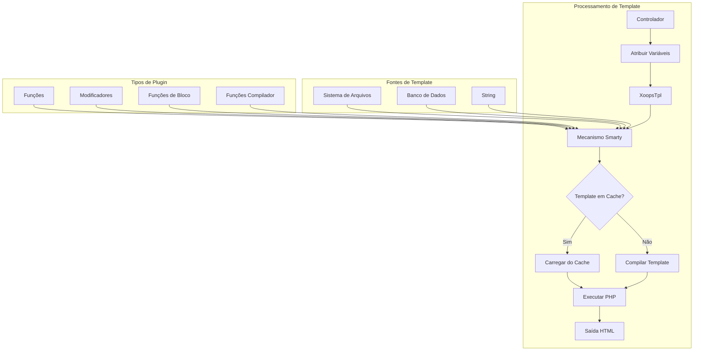
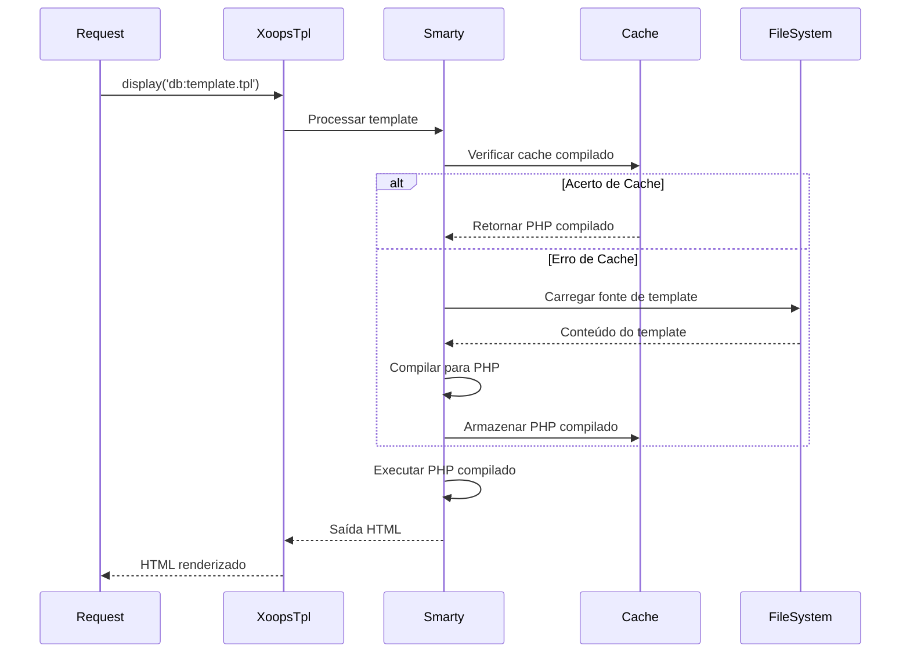
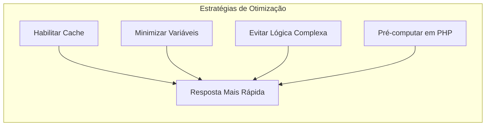

> Documentação completa da API para templates Smarty em XOOPS.

---

## Arquitetura do Mecanismo de Template



---

## Classe XoopsTpl

### Inicialização

```php
// Objeto de template global
global $xoopsTpl;

// Ou obter nova instância
$tpl = new XoopsTpl();

// Disponível em módulos
$GLOBALS['xoopsTpl']->assign('myvar', $value);
```

### Métodos Principais

| Método | Parâmetros | Descrição |
|--------|-----------|-----------|
| `assign` | `string $name, mixed $value` | Atribuir variável ao template |
| `assignByRef` | `string $name, mixed &$value` | Atribuir por referência |
| `append` | `string $name, mixed $value, bool $merge = false` | Adicionar à variável de array |
| `display` | `string $template` | Renderizar e exibir template |
| `fetch` | `string $template` | Renderizar e retornar template |
| `clearAssign` | `string $name` | Limpar variável atribuída |
| `clearAllAssign` | - | Limpar todas as variáveis |
| `getTemplateVars` | `string $name = null` | Obter variáveis atribuídas |
| `templateExists` | `string $template` | Verificar se template existe |
| `isCached` | `string $template` | Verificar se template está em cache |
| `clearCache` | `string $template = null` | Limpar cache de template |

### Atribuição de Variáveis

```php
// Atribuição simples
$xoopsTpl->assign('title', 'Título da Minha Página');
$xoopsTpl->assign('count', 42);
$xoopsTpl->assign('is_admin', true);

// Atribuição de array
$xoopsTpl->assign('items', [
    ['id' => 1, 'name' => 'Item 1'],
    ['id' => 2, 'name' => 'Item 2'],
]);

// Atribuição de objeto
$xoopsTpl->assign('user', $xoopsUser);

// Atribuições múltiplas
$xoopsTpl->assign([
    'title' => 'Meu Título',
    'content' => 'Meu Conteúdo',
    'author' => 'João Silva'
]);

// Adicionar ao array
$xoopsTpl->append('items', ['id' => 3, 'name' => 'Item 3']);
```

### Carregamento de Template

```php
// Do banco de dados (compilado)
$xoopsTpl->display('db:mymodule_index.tpl');

// Do sistema de arquivos
$xoopsTpl->display('file:' . XOOPS_ROOT_PATH . '/modules/mymodule/templates/custom.tpl');

// Buscar sem saída
$html = $xoopsTpl->fetch('db:mymodule_item.tpl');

// De string
$template = '<h1>{$title}</h1><p>{$content}</p>';
$html = $xoopsTpl->fetch('string:' . $template);
```

---

## Referência de Sintaxe do Smarty

### Variáveis

```smarty
{* Variável simples *}
<{$title}>

{* Acesso a array *}
<{$item.name}>
<{$item['name']}>

{* Propriedade de objeto *}
<{$user->name}>
<{$user->getVar('uname')}>

{* Variável de config *}
<{$xoops_sitename}>

{* Constante *}
<{$smarty.const._MD_MYMODULE_TITLE}>

{* Variáveis de servidor *}
<{$smarty.server.REQUEST_URI}>
<{$smarty.get.id}>
<{$smarty.post.name}>
```

### Modificadores

```smarty
{* Modificadores de string *}
<{$title|upper}>
<{$title|lower}>
<{$title|capitalize}>
<{$title|truncate:50:"..."}>
<{$content|strip_tags}>
<{$content|nl2br}>
<{$text|escape:'html'}>
<{$text|escape:'url'}>

{* Formatação de data *}
<{$timestamp|date_format:"%Y-%m-%d"}>
<{$timestamp|date_format:"%B %e, %Y"}>

{* Formatação de número *}
<{$price|number_format:2:".":","}>

{* Valor padrão *}
<{$optional|default:"N/A"}>

{* Modificadores encadeados *}
<{$title|strip_tags|truncate:50|escape}>

{* Contar array *}
<{$items|@count}>
```

### Estruturas de Controle

```smarty
{* If/else *}
<{if $is_admin}>
    <p>Conteúdo de admin</p>
<{elseif $is_moderator}>
    <p>Conteúdo de moderador</p>
<{else}>
    <p>Conteúdo de usuário</p>
<{/if}>

{* Loop foreach *}
<{foreach from=$items item=item key=key}>
    <li><{$key}>: <{$item.name}></li>
<{/foreach}>

{* Foreach com propriedades *}
<{foreach from=$items item=item name=itemLoop}>
    <{if $smarty.foreach.itemLoop.first}>
        <ul>
    <{/if}>

    <li class="<{if $smarty.foreach.itemLoop.iteration is odd}>odd<{else}>even<{/if}>">
        <{$smarty.foreach.itemLoop.iteration}>. <{$item.name}>
    </li>

    <{if $smarty.foreach.itemLoop.last}>
        </ul>
        <p>Total: <{$smarty.foreach.itemLoop.total}></p>
    <{/if}>
<{/foreach}>

{* Loop for *}
<{for $i=1 to 10}>
    <{$i}>
<{/for}>

{* Loop while *}
<{while $count < 10}>
    <{$count}>
    <{$count = $count + 1}>
<{/while}>
```

### Includes

```smarty
{* Incluir outro template *}
<{include file="db:mymodule_header.tpl"}>

{* Incluir com variáveis *}
<{include file="db:mymodule_item.tpl" item=$currentItem showAuthor=true}>

{* Incluir do tema *}
<{include file="$theme_template_set/header.tpl"}>
```

### Comentários

```smarty
{* Este é um comentário Smarty - não renderizado na saída *}

{*
    Comentário multi-linha
    explicando o template
*}
```

---

## Funções Específicas do XOOPS

### Renderização de Bloco

```smarty
{* Renderizar bloco por ID *}
<{xoBlock id=5}>

{* Renderizar bloco por nome *}
<{xoBlock name="mymodule_recent"}>

{* Renderizar todos os blocos na posição *}
<{foreach item=block from=$xoBlocks.canvas_left}>
    <div class="block">
        <h3><{$block.title}></h3>
        <{$block.content}>
    </div>
<{/foreach}>
```

### Tratamento de Imagem e Recurso

```smarty
{* Imagem de módulo *}
/modules/<{$xoops_dirname}>/assets/images/logo.png">

{* Imagem de tema *}
icon.png">

{* Diretório de upload *}
/<{$item.image}>">
```

### Geração de URL

```smarty
{* URL de módulo *}
<a href="<{$xoops_url}>/modules/<{$xoops_dirname}>/item.php?id=<{$item.id}>">
    <{$item.title}>
</a>

{* Com URL amigável ao SEO (se habilitado) *}
<a href="<{$item.url}>"><{$item.title}></a>
```

---

## Fluxo de Compilação de Template



---

## Plugins Smarty Personalizado

### Plugin de Função

```php
// plugins/function.myfunction.php
function smarty_function_myfunction($params, $smarty)
{
    $name = $params['name'] ?? 'Mundo';
    return "Olá, {$name}!";
}

// Uso no template:
// <{myfunction name="João"}>
```

### Plugin Modificador

```php
// plugins/modifier.timeago.php
function smarty_modifier_timeago($timestamp)
{
    $diff = time() - $timestamp;

    if ($diff < 60) {
        return 'agora mesmo';
    } elseif ($diff < 3600) {
        $mins = floor($diff / 60);
        return "{$mins} minuto(s) atrás";
    } elseif ($diff < 86400) {
        $hours = floor($diff / 3600);
        return "{$hours} hora(s) atrás";
    } else {
        $days = floor($diff / 86400);
        return "{$days} dia(s) atrás";
    }
}

// Uso no template:
// <{$item.created|timeago}>
```

### Plugin de Bloco

```php
// plugins/block.cache.php
function smarty_block_cache($params, $content, $smarty, &$repeat)
{
    if ($repeat) {
        // Tag de abertura
        return '';
    } else {
        // Tag de fechamento - processar conteúdo
        $ttl = $params['ttl'] ?? 3600;
        $key = md5($content);

        // Verificar cache...
        return $content;
    }
}

// Uso no template:
// <{cache ttl=3600}>
//     Conteúdo caro aqui
// <{/cache}>
```

---

## Dicas de Desempenho



### Melhores Práticas

1. **Habilitar cache de template** em produção
2. **Atribuir apenas variáveis necessárias** - não passar objetos inteiros
3. **Usar modificadores com moderação** - pré-formatar em PHP quando possível
4. **Evitar loops aninhados** - reestruturar dados em PHP
5. **Cache de blocos caros** - usar cache de bloco para consultas complexas

---

## Documentação Relacionada

- Básico do Smarty
- Desenvolvimento de Tema
- Migração Smarty 4

---

#xoops #api #smarty #templates #reference
