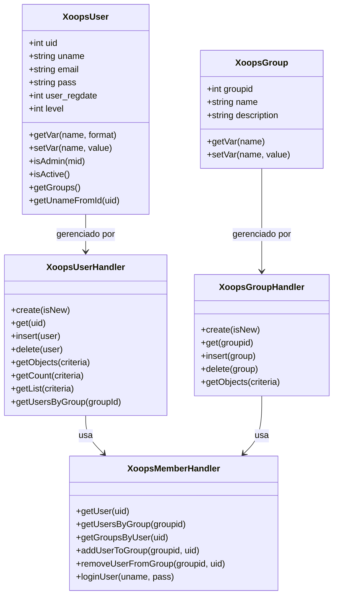
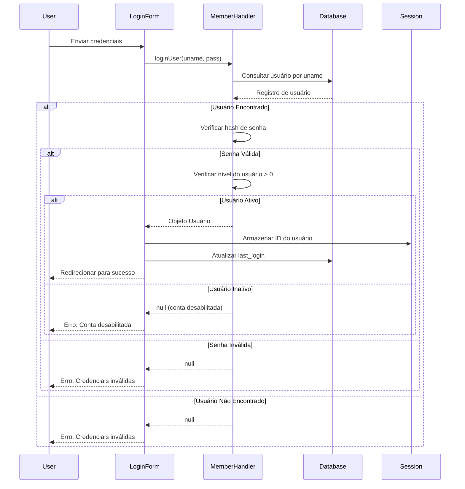
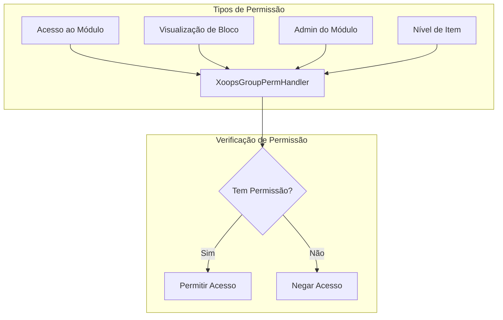
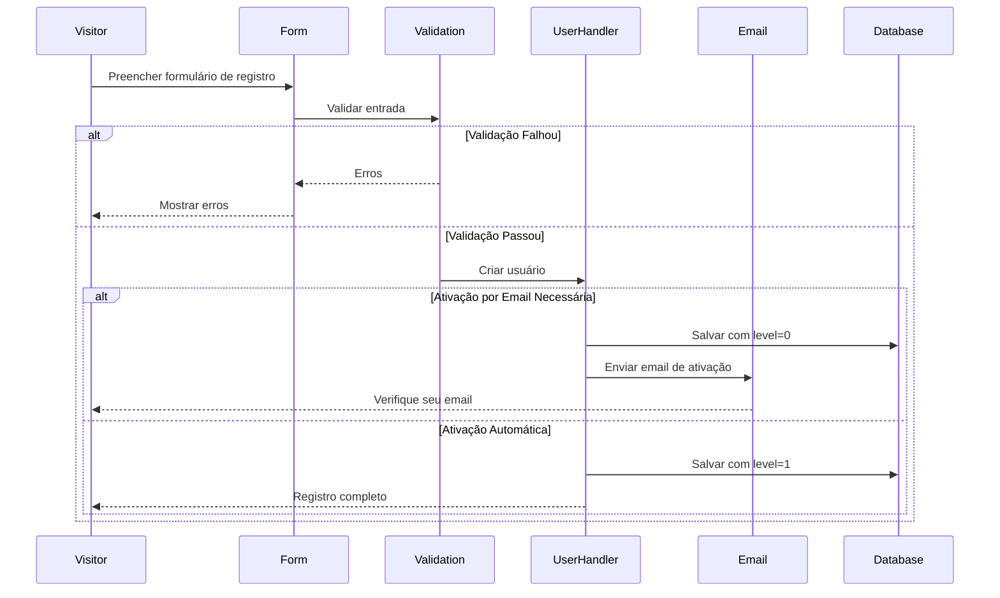

> Documentação completa da API para o sistema de usuário XOOPS.

---

## Arquitetura do Sistema de Usuário



---

## Classe XoopsUser

### Propriedades

| Propriedade | Tipo | Descrição |
|-------------|------|-----------|
| `uid` | int | ID do usuário (chave primária) |
| `uname` | string | Nome de usuário |
| `name` | string | Nome real |
| `email` | string | Endereço de email |
| `pass` | string | Hash de senha |
| `url` | string | URL do website |
| `user_avatar` | string | Nome do arquivo de avatar |
| `user_regdate` | int | Timestamp de registro |
| `user_from` | string | Localização |
| `user_sig` | string | Assinatura |
| `user_occ` | string | Ocupação |
| `user_intrest` | string | Interesses |
| `bio` | string | Biografia |
| `posts` | int | Contagem de posts |
| `rank` | int | Classificação do usuário |
| `level` | int | Nível de usuário (0=inativo, 1=ativo) |
| `theme` | string | Tema preferido |
| `timezone` | float | Offset de fuso horário |
| `last_login` | int | Timestamp do último login |

### Métodos Principais

```php
// Obter usuário atual
global $xoopsUser;

// Verificar se conectado
if (is_object($xoopsUser)) {
    // Usuário está conectado
    $uid = $xoopsUser->getVar('uid');
    $username = $xoopsUser->getVar('uname');
}

// Obter valores formatados
$uname = $xoopsUser->getVar('uname');           // Valor bruto
$unameDisplay = $xoopsUser->getVar('uname', 's'); // Sanitizado para exibição
$unameEdit = $xoopsUser->getVar('uname', 'e');    // Para edição de formulário

// Verificar se admin
$isAdmin = $xoopsUser->isAdmin();              // Admin do site
$isModuleAdmin = $xoopsUser->isAdmin($mid);    // Admin do módulo

// Obter grupos do usuário
$groups = $xoopsUser->getGroups();             // Array de IDs de grupo

// Verificar se ativo
$isActive = $xoopsUser->isActive();
```

---

## XoopsUserHandler

### Operações CRUD do Usuário

```php
// Obter handler
$userHandler = xoops_getHandler('user');

// Criar novo usuário
$user = $userHandler->create();
$user->setVar('uname', 'novousuario');
$user->setVar('email', 'usuario@example.com');
$user->setVar('pass', password_hash('senha123', PASSWORD_DEFAULT));
$user->setVar('user_regdate', time());
$user->setVar('level', 1);

if ($userHandler->insert($user)) {
    $newUid = $user->getVar('uid');
}

// Obter usuário por ID
$user = $userHandler->get(123);

// Atualizar usuário
$user->setVar('email', 'novoemail@example.com');
$userHandler->insert($user);

// Deletar usuário
$userHandler->delete($user);
```

### Consultar Usuários

```php
// Obter todos os usuários ativos
$criteria = new Criteria('level', 1);
$users = $userHandler->getObjects($criteria);

// Obter usuários por criteria
$criteria = new CriteriaCompo();
$criteria->add(new Criteria('level', 1));
$criteria->add(new Criteria('posts', 10, '>='));
$criteria->setSort('posts');
$criteria->setOrder('DESC');
$criteria->setLimit(10);
$activePosters = $userHandler->getObjects($criteria);

// Obter contagem de usuários
$count = $userHandler->getCount($criteria);

// Obter lista de usuários (uid => uname)
$userList = $userHandler->getList($criteria);

// Buscar usuários
$criteria = new CriteriaCompo();
$criteria->add(new Criteria('uname', '%joao%', 'LIKE'));
$criteria->add(new Criteria('email', '%joao%', 'LIKE'), 'OR');
$searchResults = $userHandler->getObjects($criteria);
```

---

## XoopsMemberHandler

### Gerenciamento de Grupo

```php
$memberHandler = xoops_getHandler('member');

// Obter usuário com grupos
$user = $memberHandler->getUser($uid);
$groups = $memberHandler->getGroupsByUser($uid);

// Obter usuários em grupo
$users = $memberHandler->getUsersByGroup($groupId);
$users = $memberHandler->getUsersByGroup($groupId, true); // Objetos
$users = $memberHandler->getUsersByGroup($groupId, false); // Apenas UIDs

// Adicionar usuário ao grupo
$memberHandler->addUserToGroup($groupId, $uid);

// Remover usuário do grupo
$memberHandler->removeUserFromGroup($groupId, $uid);
```

### Autenticação

```php
// Login do usuário
$user = $memberHandler->loginUser($username, $password);

if ($user) {
    // Login com sucesso
    $_SESSION['xoopsUserId'] = $user->getVar('uid');
    $user->setVar('last_login', time());
    $userHandler->insert($user);
} else {
    // Falha de login
}

// Logout
$_SESSION = [];
session_destroy();
redirect_header(XOOPS_URL, 3, 'Desconectado');
```

---

## Fluxo de Autenticação



---

## Sistema de Grupo

### Grupos Padrão

| ID do Grupo | Nome | Descrição |
|-------------|------|-----------|
| 1 | Webmasters | Acesso administrativo completo |
| 2 | Usuários Registrados | Usuários registrados padrão |
| 3 | Anônimo | Visitantes não conectados |

### Permissões de Grupo



### Verificar Permissões

```php
$gpermHandler = xoops_getHandler('groupperm');

// Verificar acesso ao módulo
$groups = is_object($xoopsUser) ? $xoopsUser->getGroups() : [XOOPS_GROUP_ANONYMOUS];
$hasAccess = $gpermHandler->checkRight('module_read', $moduleId, $groups);

// Verificar admin do módulo
$isAdmin = $gpermHandler->checkRight('module_admin', $moduleId, $groups);

// Verificar permissão personalizada
$hasPermission = $gpermHandler->checkRight(
    'item_view',      // Nome da permissão
    $itemId,          // ID do item
    $groups,          // IDs de grupo
    $moduleId         // ID do módulo
);

// Obter itens que o usuário pode acessar
$itemIds = $gpermHandler->getItemIds('item_view', $groups, $moduleId);
```

---

## Fluxo de Registro de Usuário



---

## Complete Example

```php
<?php
require_once __DIR__ . '/mainfile.php';

use Xmf\Request;

$memberHandler = xoops_getHandler('member');
$userHandler = xoops_getHandler('user');

// Registration handler
if (Request::hasVar('register', 'POST')) {
    // Verify CSRF
    if (!$GLOBALS['xoopsSecurity']->check()) {
        redirect_header('register.php', 3, 'Security error');
    }

    $uname = Request::getString('uname', '', 'POST');
    $email = Request::getEmail('email', '', 'POST');
    $pass = Request::getString('pass', '', 'POST');
    $passConfirm = Request::getString('pass_confirm', '', 'POST');

    $errors = [];

    // Validate username
    if (strlen($uname) < 3 || strlen($uname) > 25) {
        $errors[] = 'Username must be 3-25 characters';
    }

    // Check if username exists
    $criteria = new Criteria('uname', $uname);
    if ($userHandler->getCount($criteria) > 0) {
        $errors[] = 'Username already taken';
    }

    // Validate email
    if (!filter_var($email, FILTER_VALIDATE_EMAIL)) {
        $errors[] = 'Invalid email address';
    }

    // Check if email exists
    $criteria = new Criteria('email', $email);
    if ($userHandler->getCount($criteria) > 0) {
        $errors[] = 'Email already registered';
    }

    // Validate password
    if (strlen($pass) < 8) {
        $errors[] = 'Password must be at least 8 characters';
    }

    if ($pass !== $passConfirm) {
        $errors[] = 'Passwords do not match';
    }

    if (empty($errors)) {
        // Create user
        $user = $userHandler->create();
        $user->setVar('uname', $uname);
        $user->setVar('email', $email);
        $user->setVar('pass', password_hash($pass, PASSWORD_DEFAULT));
        $user->setVar('user_regdate', time());
        $user->setVar('level', 1); // Auto-activate

        if ($userHandler->insert($user)) {
            // Add to Registered Users group
            $memberHandler->addUserToGroup(XOOPS_GROUP_USERS, $user->getVar('uid'));

            redirect_header('index.php', 3, 'Registration successful!');
        } else {
            $errors[] = 'Error creating account';
        }
    }
}

// Display registration form
require_once XOOPS_ROOT_PATH . '/header.php';

if (!empty($errors)) {
    foreach ($errors as $error) {
        echo "<div class='errorMsg'>$error</div>";
    }
}

// Registration form here...

require_once XOOPS_ROOT_PATH . '/footer.php';
```

---

## Documentação Relacionada

- Guia de Gerenciamento de Usuário
- Sistema de Permissão
- Autenticação

---

#xoops #api #user #authentication #reference
