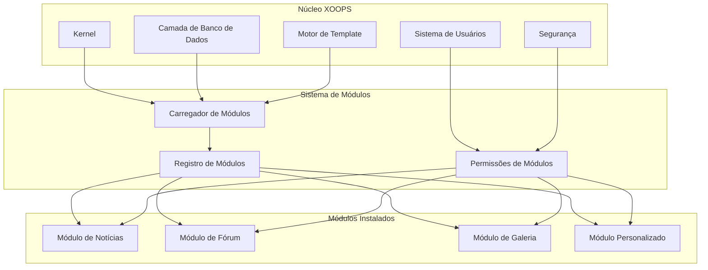
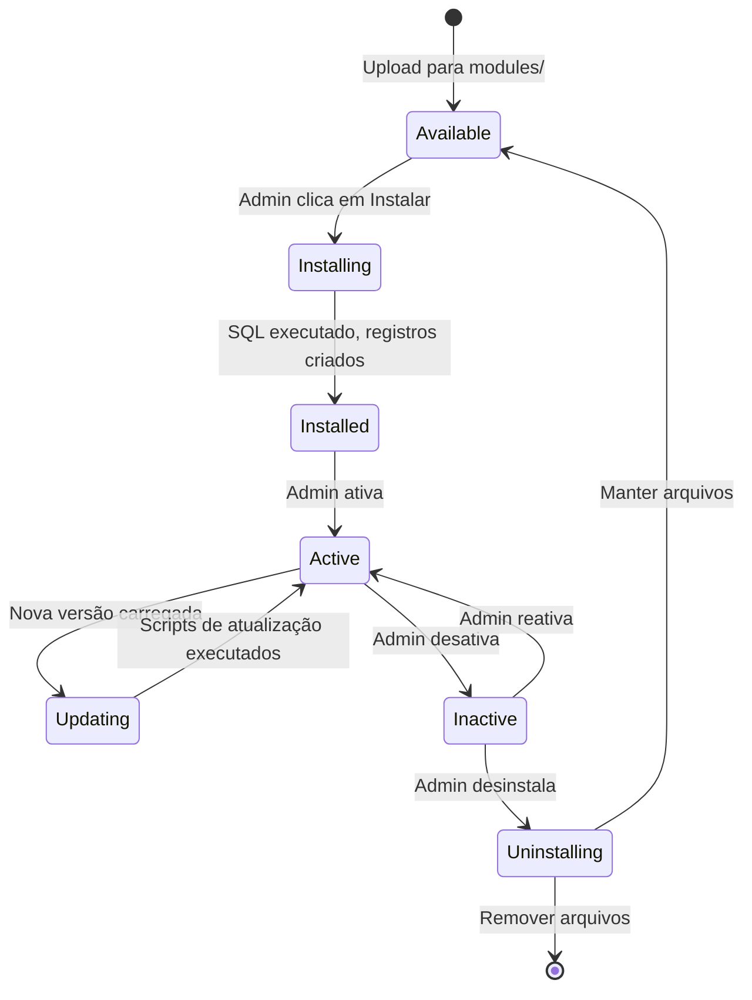

# ADR-001: Arquitetura Modular

> Registro de Decisão de Arquitetura para a filosofia de design modular do núcleo do XOOPS.

---

## Status

**Aceito** - Decisão fundamental desde o início do XOOPS

---

## Contexto

XOOPS (eXtensible Object-Oriented Portal System) precisava de uma arquitetura que:

1. Permitisse que desenvolvedores terceirizados estendessem a funcionalidade
2. Permitisse que administradores de sites personalizassem sem codificação
3. Suportasse desenvolvimento e atualizações independentes
4. Proporcionasse isolamento entre diferentes recursos
5. Escalasse desde blogs simples a portais complexos

A paisagem de CMS do início dos anos 2000 oferecia sistemas monolíticos que eram difíceis de personalizar e estender.

---

## Diagrama de Decisão



---

## Decisão

Implementaremos uma **arquitetura modular** onde:

### 1. Núcleo Fornece Infraestrutura
- Abstração de banco de dados
- Autenticação de usuários e permissões
- Renderização de template (Smarty)
- Utilitários de segurança
- Geração de formulários
- Utilitários comuns

### 2. Módulos são Auto-Contidos
Cada módulo:
- Possui sua própria estrutura de diretórios
- Contém suas próprias classes, templates, SQL
- Define sua própria configuração
- Pode ser instalado/desinstalado independentemente
- Possui rastreamento de versão

### 3. Estrutura de Módulo Padrão
```
modules/modulename/
├── admin/                  # Interface de administração
│   ├── index.php
│   └── menu.php
├── class/                  # Classes PHP
├── include/                # Arquivos de inclusão
├── language/               # Traduções
├── sql/                    # Esquema de banco de dados
├── templates/              # Templates Smarty
├── blocks/                 # Definições de blocos
├── xoops_version.php       # Manifesto de módulo
├── index.php               # Ponto de entrada
└── header.php              # Bootstrap de módulo
```

### 4. Manifesto de Módulo (xoops_version.php)
```php
<?php
$modversion['name']        = 'Module Name';
$modversion['version']     = '1.0.0';
$modversion['description'] = 'Descrição do módulo';
$modversion['dirname']     = basename(__DIR__);
$modversion['hasMain']     = 1;
$modversion['hasAdmin']    = 1;
$modversion['sqlfile']['mysql'] = 'sql/mysql.sql';
$modversion['tables']      = ['modulename_table1'];
$modversion['templates']   = [...];
$modversion['config']      = [...];
$modversion['blocks']      = [...];
```

### 5. Comunicação de Módulos
- Através de APIs do núcleo (manipuladores, eventos)
- Relacionamentos de banco de dados
- Ganchos de pré-carregamento
- Serviços compartilhados

---

## Ciclo de Vida do Módulo



---

## Consequências

### Positivas

1. **Extensibilidade**: Milhares de módulos criados pela comunidade
2. **Independência**: Módulos podem ser desenvolvidos separadamente
3. **Flexibilidade**: Sites podem combinar e combinar recursos
4. **Manutenibilidade**: Atualizações não afetam outros módulos
5. **Marketplace**: Ecossistema de módulos emergiu
6. **Curva de aprendizado**: Desenvolvedores aprendem um padrão

### Negativas

1. **Overhead**: Cada módulo tem custo de bootstrap
2. **Duplicação**: Código comum pode ser repetido
3. **Integração**: Recursos entre módulos precisam de design cuidadoso
4. **Versionamento**: Gerenciamento de compatibilidade de módulos necessário
5. **Variância de qualidade**: Qualidade de módulos terceirizados varia

### Neutras

1. **Banco de dados**: Cada módulo gerencia suas próprias tabelas
2. **Templates**: O tema deve acomodar vários módulos
3. **Atualizações**: Núcleo e módulos são atualizados independentemente

---

## Alternativas Consideradas

### 1. Arquitetura Monolítica
**Rejeitada** - Muito rígida, difícil de personalizar

### 2. Arquitetura de Plugin (estilo WordPress)
**Parcialmente adotada** - Blocos e pré-carregamentos fornecem ganchos semelhantes a plugins dentro de módulos

### 3. Arquitetura de Componentes (estilo Joomla)
**Rejeitada** - Mais complexa, menos amigável ao desenvolvedor

### 4. Microsserviços
**Não aplicável** - Muito complexo para era de hospedagem compartilhada

---

## Decisões Relacionadas

- ADR-002: Acesso ao Banco de Dados Orientado a Objetos
- ADR-003: Motor de Template Smarty
- ADR-005: Sistema de Permissão

---

## Referências

- Histórico do Projeto XOOPS
- Padrões de Arquitetura de Aplicações PHP
- Estudos de Comparação de CMS (2001-2005)

---

#xoops #architecture #adr #modules #design-decision
