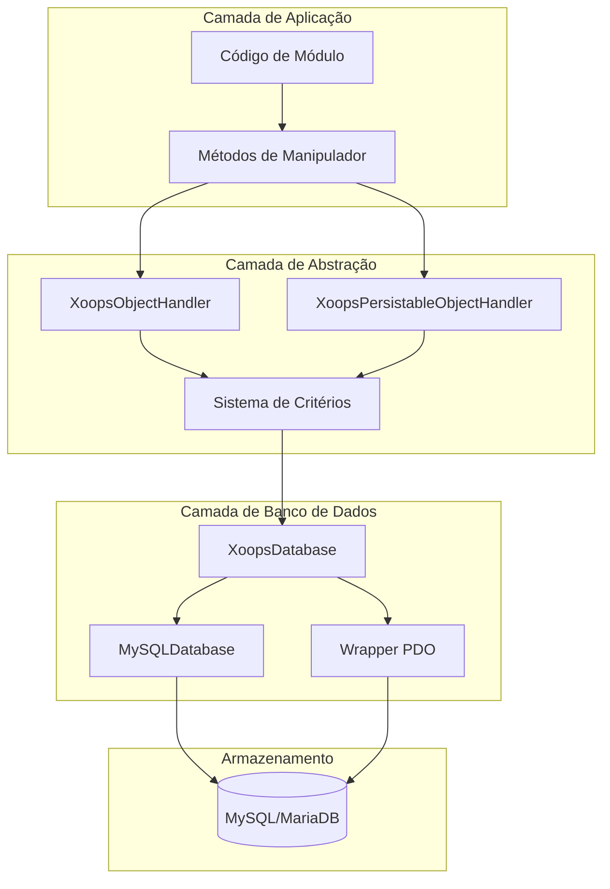
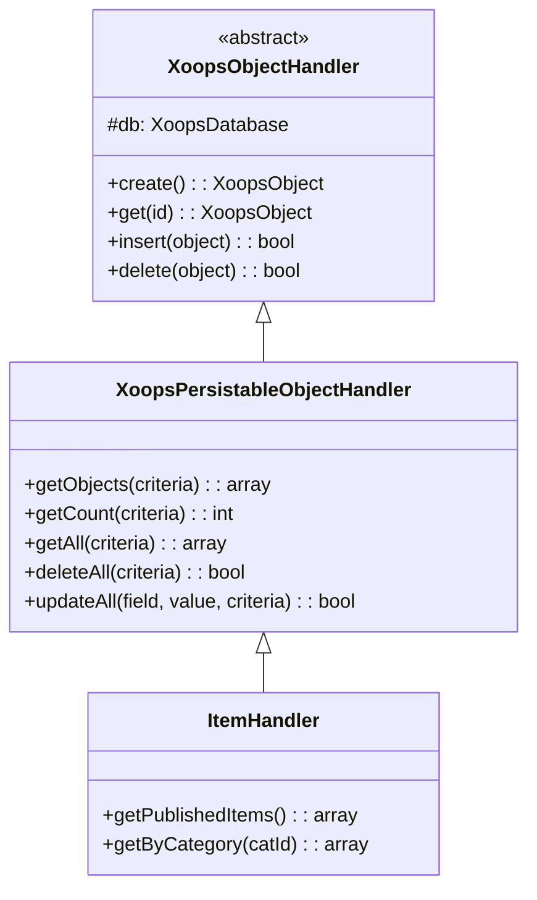
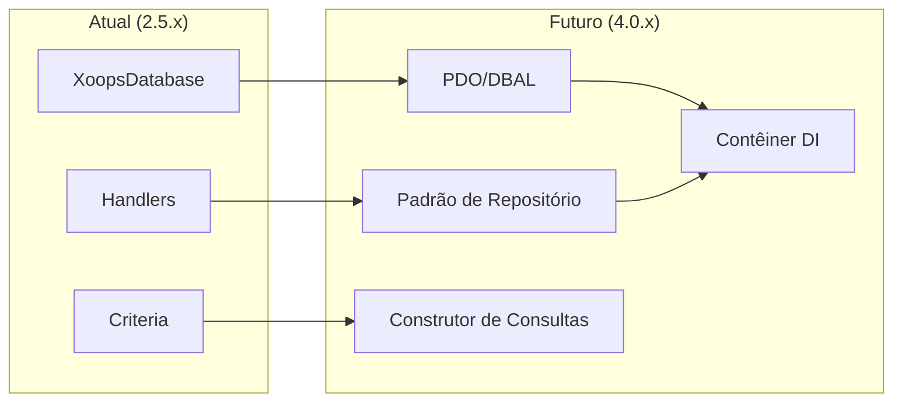

# ADR-002: Abstração de Banco de Dados

> Registro de Decisão de Arquitetura para padrão de acesso ao banco de dados orientado a objetos do XOOPS.

---

## Status

**Aceito** - Padrão principal desde XOOPS 2.0

---

## Contexto

XOOPS precisava de uma estratégia de interação com banco de dados que:

1. Abstraísse sintaxe SQL específica do banco de dados
2. Fornecesse operações CRUD consistentes em todos os módulos
3. Permitisse desinfecção automática de dados e escape
4. Suportasse futuras mudanças de mecanismo de banco de dados
5. Simplificasse operações comuns para desenvolvedores

As alternativas eram:
- SQL bruto em toda a base de código
- ORM completo (Doctrine, Eloquent)
- Abstração customizada leve

---

## Diagrama de Decisão



---

## Decisão

Implementaremos um **Padrão de Manipulador** com:

### 1. XoopsObject - Recipiente de Dados

Cada entidade de dados estende XoopsObject:

```php
class Item extends XoopsObject
{
    public function __construct()
    {
        $this->initVar('id', XOBJ_DTYPE_INT, null, false);
        $this->initVar('title', XOBJ_DTYPE_TXTBOX, '', true, 255);
        $this->initVar('content', XOBJ_DTYPE_TXTAREA, '', false);
        $this->initVar('status', XOBJ_DTYPE_INT, 0, false);
    }
}
```

### 2. Manipulador - Gerenciador de Operações

Cada objeto possui um manipulador correspondente:

```php
class ItemHandler extends XoopsPersistableObjectHandler
{
    public function __construct($db)
    {
        parent::__construct($db, 'mymodule_items', Item::class, 'id', 'title');
    }

    // Métodos CRUD herdados:
    // - create(), get(), insert(), delete()
    // - getObjects(), getCount(), getAll()
}
```

### 3. Critérios - Construtor de Consultas

Condições de consulta orientadas a objetos:

```php
$criteria = new CriteriaCompo();
$criteria->add(new Criteria('status', 1));
$criteria->add(new Criteria('created', time() - 86400, '>='));
$criteria->setSort('created');
$criteria->setOrder('DESC');
$criteria->setLimit(10);

$items = $handler->getObjects($criteria);
```

---

## Constantes de Tipo de Dados

```php
// Tipos de variáveis com sanitização automática
XOBJ_DTYPE_INT       // Inteiro
XOBJ_DTYPE_TXTBOX    // Texto de uma linha (escapado)
XOBJ_DTYPE_TXTAREA   // Texto de múltiplas linhas (escapado)
XOBJ_DTYPE_EMAIL     // Validação de email
XOBJ_DTYPE_URL       // Validação de URL
XOBJ_DTYPE_ARRAY     // Array serializado
XOBJ_DTYPE_OTHER     // Sem processamento
XOBJ_DTYPE_FLOAT     // Ponto flutuante
```

---

## Herança de Manipulador



---

## Consequências

### Positivas

1. **Consistência**: Todos os módulos usam os mesmos padrões
2. **Segurança**: Escape automático previne injeção SQL
3. **Simplicidade**: Operações comuns requerem código mínimo
4. **Manutenibilidade**: Mudanças na camada de banco de dados não afetam módulos
5. **Testabilidade**: Manipuladores podem ser simulados para testes

### Negativas

1. **Performance**: Overhead de abstração extra
2. **Complexidade**: Curva de aprendizado para novos desenvolvedores
3. **Limitações**: Consultas complexas podem precisar de SQL bruto
4. **Problema N+1**: Sem carregamento aprimorado integrado

### Mitigações

- **Performance**: Cache de objetos acessados frequentemente
- **Consultas complexas**: Permitir SQL bruto quando necessário
- **N+1**: Use getAll() com critérios apropriados

---

## Evolução para XOOPS 4.0



Planos do XOOPS 4.0:
- Doctrine DBAL para abstração de banco de dados
- Padrão de repositório substituindo manipuladores
- Construtor de consultas para consultas complexas
- Integração completa de contêiner PSR-11

---

## Exemplos de Código

### CRUD Básico

```php
$helper = Helper::getInstance();
$handler = $helper->getHandler('Item');

// Criar
$item = $handler->create();
$item->setVar('title', 'Novo Item');
$handler->insert($item);

// Ler
$item = $handler->get($id);
$title = $item->getVar('title');

// Atualizar
$item->setVar('title', 'Título Atualizado');
$handler->insert($item);

// Deletar
$handler->delete($item);
```

### Consulta Complexa

```php
$criteria = new CriteriaCompo();
$criteria->add(new Criteria('status', 'published'));
$criteria->add(new Criteria('category_id', '(1,2,3)', 'IN'));
$criteria->add(new Criteria('created', strtotime('-30 days'), '>='));
$criteria->setSort('views');
$criteria->setOrder('DESC');
$criteria->setLimit(10);
$criteria->setStart(0);

$items = $handler->getObjects($criteria);
$total = $handler->getCount($criteria);
```

---

## Decisões Relacionadas

- ADR-001: Arquitetura Modular
- ADR-003: Motor de Template Smarty

---

## Referências

- Martin Fowler - Patterns of Enterprise Application Architecture
- Conceitos de Domain-Driven Design
- Padrões Active Record vs Data Mapper

---

#xoops #architecture #adr #database #handler #design-decision
