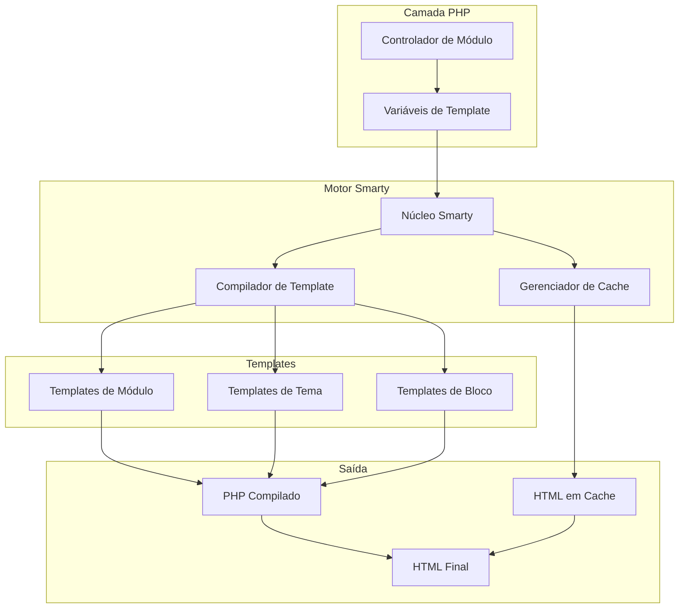
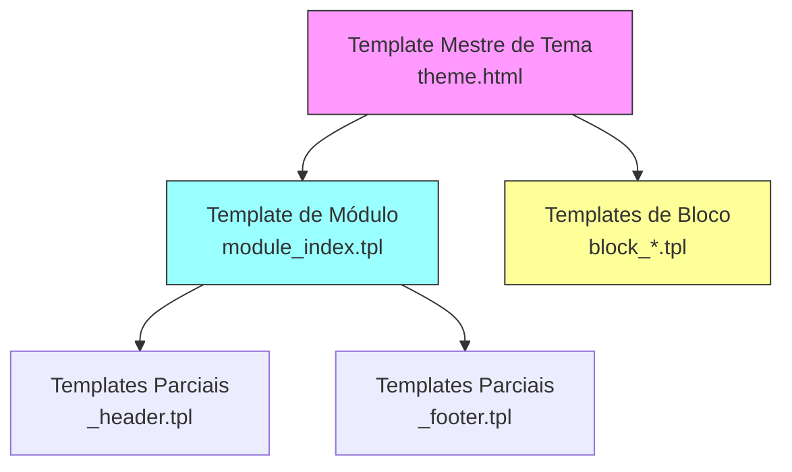
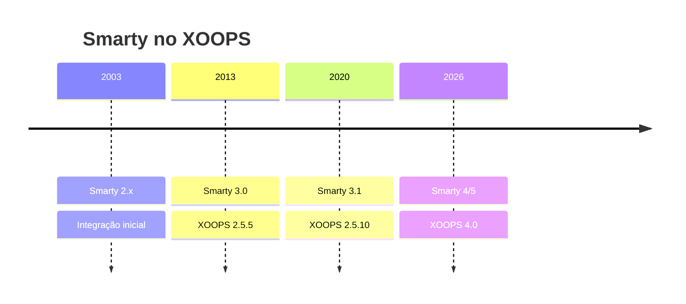

# ADR-003: Motor de Template (Smarty)

> Registro de Decisão de Arquitetura para adoção do motor de template Smarty do XOOPS.

---

## Status

**Aceito** - Decisão principal desde XOOPS 2.0

**Em Evolução** - Migração para Smarty 4/5 planejada para XOOPS 4.0

---

## Contexto

XOOPS precisava de uma solução de template que:

1. Separasse apresentação da lógica de negócios
2. Permitisse que designers de tema funcionassem sem conhecimento de PHP
3. Suportasse herança de template e inclusões
4. Fornecesse cache para performance
5. Habilitasse templates personalizáveis pelo usuário
6. Suportasse internacionalização

---

## Diagrama de Decisão



---

## Decisão

Usaremos **Smarty** como o motor de template porque:

### 1. Separação de Preocupações

```php
// PHP (Controlador) - Lógica de negócios
$items = $itemHandler->getPublishedItems();
$xoopsTpl->assign('items', $items);

// Smarty (Visão) - Apresentação
// templates/items.tpl
```

```smarty
{* Template Smarty - Sem lógica PHP *}
<{foreach item=item from=$items}>
    <article>
        <h2><{$item.title}></h2>
        <p><{$item.summary}></p>
    </article>
<{/foreach}>
```

### 2. Delimitadores do XOOPS

XOOPS usa `<{` e `}>` em vez de padrão `{` `}`:

```smarty
{* Smarty padrão *}
{$variable}

{* Smarty XOOPS - Evita conflitos com JavaScript *}
<{$variable}>
```

### 3. Hierarquia de Template



### 4. Armazenamento de Template

- **Banco de dados**: Templates personalizados armazenados para capacidade de reverter
- **Sistema de arquivos**: Templates originais em diretórios de módulos
- **Cache**: Templates compilados para performance

---

## Configuração do Smarty

```php
// Inicialização do Smarty XOOPS
$xoopsTpl = new XoopsTpl();

// Delimitadores customizados
$xoopsTpl->left_delim = '<{';
$xoopsTpl->right_delim = '}>';

// Cache
$xoopsTpl->caching = XOOPS_TEMPLATE_CACHE;
$xoopsTpl->cache_lifetime = 3600;

// Segurança
$xoopsTpl->security_policy = new Smarty_Security($xoopsTpl);
$xoopsTpl->security_policy->php_functions = [];
$xoopsTpl->security_policy->php_modifiers = ['escape', 'count'];
```

---

## Recursos de Template Utilizados

### Variáveis

```smarty
{* Variável simples *}
<{$title}>

{* Propriedade de objeto *}
<{$item.title}>

{* Com modificador *}
<{$content|truncate:200:'...'}>

{* Saída escapada *}
<{$userInput|escape:'html'}>
```

### Estruturas de Controle

```smarty
{* Condicional *}
<{if $isAdmin}>
    <a href="admin.php">Admin</a>
<{elseif $isUser}>
    <a href="profile.php">Perfil</a>
<{else}>
    <a href="login.php">Login</a>
<{/if}>

{* Loop *}
<{foreach item=item from=$items name=itemloop}>
    <{$smarty.foreach.itemloop.index}>: <{$item.title}>
<{/foreach}>
```

### Inclusões

```smarty
{* Incluir outro template *}
<{include file="db:mymodule_header.tpl"}>

{* Incluir com variáveis *}
<{include file="db:mymodule_item.tpl" item=$currentItem}>

{* Incluir do tema *}
<{include file="file:$theme_path/partials/sidebar.tpl"}>
```

---

## Consequências

### Positivas

1. **Amigável ao designer**: Sintaxe semelhante a HTML
2. **Cache**: Cache de template integrado
3. **Segurança**: Isolamento de código PHP
4. **Flexibilidade**: Modificadores, funções, plugins
5. **Personalização**: Usuários podem modificar templates
6. **Comunidade**: Grande ecossistema Smarty

### Negativas

1. **Curva de aprendizado**: Sintaxe específica do Smarty
2. **Overhead**: Etapa de compilação necessária
3. **Depuração**: Erros de template podem ser cryptográficos
4. **Problemas de versão**: Mudanças de ruptura entre versões

### Mitigações

- **Aprendizado**: Documentação abrangente
- **Performance**: Cache agressivo
- **Depuração**: Console de depuração, mensagens de erro claras
- **Versões**: Camada de compatibilidade em XOOPS

---

## Histórico de Versões



---

## Migração: Smarty 3 para 4/5

### Mudanças de Ruptura

```smarty
{* Smarty 3 - Descontinuado *}
<{php}>echo date('Y');<{/php}>

{* Smarty 4+ - Use modificadores ou atribua de PHP *}
<{$current_year}>

{* Smarty 3 - {section} descontinuado *}
<{section name=i loop=$items}>
    <{$items[i].title}>
<{/section}>

{* Smarty 4+ - Use {foreach} *}
<{foreach $items as $item}>
    <{$item.title}>
<{/foreach}>
```

### Camada de Compatibilidade

XOOPS fornece uma camada de compatibilidade para transições suaves:

```php
// XoopsTpl estende Smarty com métodos de compatibilidade
class XoopsTpl extends Smarty
{
    public function assign($tpl_var, $value = null)
    {
        // Manipula sintaxe Smarty 3 e 4
        return parent::assign($tpl_var, $value);
    }
}
```

---

## Alternativas Consideradas

### 1. Twig
**Prós**: Moderno, ecossistema Symfony
**Contras**: Sintaxe diferente, esforço de migração
**Decisão**: Opção futura possível para XOOPS 3.x

### 2. Blade (Laravel)
**Prós**: Sintaxe limpa, popular
**Contras**: Específico do Laravel
**Decisão**: Não adequado para uso independente

### 3. Templates PHP Nativos
**Prós**: Sem curva de aprendizado, rápido
**Contras**: Riscos de segurança, sem separação
**Decisão**: Rejeitado pela manutenibilidade

---

## Decisões Relacionadas

- ADR-001: Arquitetura Modular
- ADR-002: Abstração de Banco de Dados

---

## Referências

- Documentação Smarty: https://www.smarty.net/docs/en/
- Guia de Sistema de Template XOOPS
- Padrão MVC em Aplicações Web

---

#xoops #architecture #adr #smarty #templates #design-decision
