# ADR-004: Arquitetura do Sistema de Segurança

> Arquitetura de segurança abrangente para XOOPS CMS protegendo contra ameaças modernas.

---

## Status

**Aceito** - Camada de segurança principal desde XOOPS 2.5

---

## Contexto

### Declaração de Problema

XOOPS precisa de um sistema de segurança robusto que:

1. **Proteja contra vulnerabilidades web comuns** (OWASP Top 10)
2. **Forneça controle de permissão granular** em módulos
3. **Habilite autenticação segura de usuário** com padrões modernos
4. **Previna violações de dados** e acesso não autorizado
5. **Suporte controle de acesso multi-nível** (administrador, moderador, usuário, convidado)
6. **Integre-se a todos os módulos** perfeitamente

### Ameaças Atuais

Ataques web modernos incluem:

- **Injeção SQL** - SQL malicioso em entrada de usuário
- **XSS (Cross-Site Scripting)** - JavaScript injetado em páginas
- **CSRF (Cross-Site Request Forgery)** - Envio de formulário não autorizado
- **Bypass de autenticação** - Manipulação fraca de sessão/senha
- **Bypass de autorização** - Escalação de privilégio
- **Exposição de dados** - Dados sensíveis em URLs, logs ou caches

### Requisitos de Segurança do XOOPS

1. Autenticação de usuário e gerenciamento de sessão
2. Controle de acesso baseado em função (RBAC)
3. Sistema de permissão para módulos e objetos
4. Validação de entrada e escape de saída
5. Proteção contra ataques comuns
6. Registro de auditoria de eventos de segurança
7. Manipulação segura de senha
8. Proteção de token CSRF

---

## Decisão

### Arquitetura de Segurança Principal

```mermaid
graph TB
    subgraph "Camada de Autenticação"
        A["Autenticação de Usuário<br/>(Login/Sessões)"]
        B["Gerenciamento de Sessão<br/>(Tokens/Cookies)"]
        C["Segurança de Senha<br/>(Hashing/Salts)"]
    end

    subgraph "Camada de Autorização"
        D["Gerenciamento de Função<br/>(Admin/Usuário/Convidado)"]
        E["Sistema de Permissão<br/>(Nível de Módulo)"]
        F["Permissões de Objeto<br/>(Nível de Item)"]
    end

    subgraph "Camada de Proteção"
        G["Validação de Entrada<br/>(Tipo/Formato)"]
        H["Escape de Saída<br/>(HTML/JavaScript)"]
        I["Proteção CSRF<br/>(Validação de Token)"]
    end

    subgraph "Camada de Monitoramento"
        J["Registro de Auditoria<br/>(Eventos de Segurança)"]
        K["Limitação de Taxa<br/>(Força Bruta)"]
        L["Detecção de Intrusão<br/>(Atividade Suspeita)"]
    end

    A --> B
    A --> C
    D --> E
    E --> F
    G --> I
    H --> I
    J --> K
    K --> L
```



---

## Componentes de Segurança

### 1. Sistema de Autenticação

**Processo de Login do Usuário:**

```php
<?php
// 1. Validar credenciais
$user = $userHandler->findByLogin($username);
if (!$user || !password_verify($password, $user->getVar('pass'))) {
    throw new AuthenticationException('Credenciais inválidas');
}

// 2. Verificar se a conta está ativa
if (!$user->getVar('uactive')) {
    throw new AuthenticationException('Conta inativa');
}

// 3. Criar sessão segura
session_regenerate_id(true);
$_SESSION['uid'] = $user->getVar('uid');
$_SESSION['token'] = bin2hex(random_bytes(32));
$_SESSION['created'] = time();

// 4. Registrar o login
$this->auditLog('USER_LOGIN', $user->getVar('uid'));
```

**Segurança de Senha:**

```php
<?php
// Use password_hash (não MD5 ou SHA1)
$hashed = password_hash($password, PASSWORD_BCRYPT, [
    'cost' => 12, // Custo alto = força bruta lenta
]);

// Verificar senha
if (!password_verify($inputPassword, $hashed)) {
    throw new Exception('Senha inválida');
}

// Re-fazer hash se algoritmo ou custo mudou
if (password_needs_rehash($hashed, PASSWORD_BCRYPT, ['cost' => 12])) {
    $newHash = password_hash($password, PASSWORD_BCRYPT, ['cost' => 12]);
    $user->setVar('pass', $newHash);
    $userHandler->insert($user);
}
```

### 2. Gerenciamento de Sessão

**Manipulação Segura de Sessão:**

```php
<?php
// Configuração de sessão
ini_set('session.cookie_httponly', true);  // Sem acesso JS
ini_set('session.cookie_secure', true);     // Apenas HTTPS
ini_set('session.cookie_samesite', 'Strict'); // Proteção CSRF
ini_set('session.gc_maxlifetime', 3600);   // Timeout de 1 hora
ini_set('session.sid_length', 64);         // ID de sessão de 64 caracteres

// Validar sessão
function validateSession() {
    // Verificar timeout
    if (time() - $_SESSION['created'] > 3600) {
        session_destroy();
        throw new SessionExpiredException();
    }

    // Validar user agent (previne sequestro de sessão)
    if ($_SESSION['user_agent'] !== $_SERVER['HTTP_USER_AGENT']) {
        throw new SessionInvalidException();
    }

    // Validar IP (opcional, pode ser muito restritivo)
    if (!in_array($_SERVER['REMOTE_ADDR'], $_SESSION['ips'])) {
        $_SESSION['ips'][] = $_SERVER['REMOTE_ADDR'];
    }
}
```

### 3. Autorização (RBAC)

**Controle de Acesso Baseado em Função:**

```php
<?php
class XoopsUser {
    public function hasPermission(string $permissionName): bool
    {
        // Obter grupos de usuário
        $groups = $this->getGroups();

        // Verificar se algum grupo tem permissão
        foreach ($groups as $groupId) {
            if ($this->checkGroupPermission($groupId, $permissionName)) {
                return true;
            }
        }

        return false;
    }

    /**
     * Grupos de usuário e suas permissões
     * Admin: Acesso completo
     * Moderador: Gerenciamento de conteúdo
     * Usuário: Criar próprio conteúdo
     * Convidado: Acesso apenas leitura
     */
    private function checkGroupPermission(int $groupId, string $permission): bool
    {
        $permissions = [
            1 => ['admin_access'],                 // Grupo Admin
            2 => ['moderate_content', 'edit_own'], // Grupo Moderador
            3 => ['create_content', 'edit_own'],   // Grupo Usuário
            4 => [],                               // Grupo Convidado (sem permissões)
        ];

        return in_array($permission, $permissions[$groupId] ?? []);
    }
}
```

### 4. Validação de Entrada

**Prevenir Injeção SQL e Erros de Tipo:**

```php
<?php
// Sempre use declarações preparadas
$sql = 'SELECT * FROM users WHERE id = ?';
$result = $db->query($sql, [$userId]); // ✅ Seguro

// Validação de entrada
function validateUserInput(array $data): array
{
    return [
        'email' => filter_var($data['email'] ?? '', FILTER_VALIDATE_EMAIL),
        'age' => filter_var($data['age'] ?? 0, FILTER_VALIDATE_INT),
        'website' => filter_var($data['website'] ?? '', FILTER_VALIDATE_URL),
        'title' => substr(trim($data['title'] ?? ''), 0, 255),
    ];
}

// Classe de Entrada Segura do XOOPS
$safe = \Xmf\Request::getHtmlRequest('var_name', '');
$int = \Xmf\Request::getInt('page', 1);
```

### 5. Escape de Saída

**Prevenir Ataques XSS:**

```php
<?php
// Em templates PHP
echo htmlspecialchars($userInput, ENT_QUOTES, 'UTF-8');

// Em templates Smarty (escape automático)
<{$user_input}>  {* Escapado por padrão *}
<{$html|escape:false}>  {* Apenas quando necessário *}

// Contexto JavaScript
<script>
var message = "<{$userMessage|escape:'javascript'}>";
</script>

// Contexto URL
<a href="<{$url|escape:'url'}>">Link</a>
```

### 6. Proteção CSRF

**Prevenção de Cross-Site Request Forgery:**

```php
<?php
// Gerar token CSRF
session_start();
if (empty($_SESSION['csrf_token'])) {
    $_SESSION['csrf_token'] = bin2hex(random_bytes(32));
}

// Em formulários
<form method="POST">
    <input type="hidden" name="csrf_token" value="<{$csrf_token}>">
    <button type="submit">Enviar</button>
</form>

// Validar token
if ($_SERVER['REQUEST_METHOD'] === 'POST') {
    if (hash_equals($_SESSION['csrf_token'], $_POST['csrf_token'] ?? '')) {
        // Processar formulário
    } else {
        throw new InvalidTokenException('Token CSRF inválido');
    }
}
```

---

## Consequências

### Efeitos Positivos

1. **Proteção Abrangente** - Cobre principais classes de vulnerabilidade
2. **Segurança em Camadas** - Múltiplas camadas de defesa
3. **RBAC Flexível** - Controle de permissão fino
4. **Trilha de Auditoria** - Rastreamento de eventos de segurança
5. **Padrão da Indústria** - Alinhado com recomendações OWASP
6. **Integração de Módulo** - Fácil para módulos usar APIs de segurança

### Efeitos Negativos

1. **Complexidade** - Mais código e configuração necessários
2. **Performance** - Hashing e validação adicionam overhead
3. **Experiência de Usuário** - Segurança às vezes inconveniente
4. **Manutenção** - Requer atualizações de segurança contínuas
5. **Treinamento Necessário** - Desenvolvedores devem seguir práticas

### Riscos e Mitigações

| Risco | Severidade | Mitigação |
|------|----------|-----------|
| Desenvolvedor ignora segurança | Alta | Revisão de código, treinamento de segurança |
| Novas vulnerabilidades descobertas | Média | Auditorias de segurança regulares, atualizações |
| Impacto de performance | Baixa | Otimizar caminhos quentes, cache |
| Permissões excessivamente complexas | Média | Documentação clara, exemplos |

---

## Melhores Práticas de Segurança

### Para Desenvolvedores de Módulos

```php
<?php
// ✅ FAÇA: Use declarações preparadas
$result = $db->prepare('SELECT * FROM table WHERE id = ?')->execute([$id]);

// ❌ NÃO: Concatene consultas
$result = $db->query("SELECT * FROM table WHERE id = $id");

// ✅ FAÇA: Escape de saída
echo htmlspecialchars($user_input, ENT_QUOTES, 'UTF-8');

// ❌ NÃO: Saída de dados brutos do usuário
echo $user_input;

// ✅ FAÇA: Verificar permissões
if (!$user->hasPermission('edit_content')) {
    throw new PermissionException();
}

// ❌ NÃO: Confiar em funções de usuário diretas
if ($_POST['is_admin']) {
    // Fazer usuário ser admin - BURACO DE SEGURANÇA!
}

// ✅ FAÇA: Validar tipos de entrada
$page = (int)$_GET['page'];

// ❌ NÃO: Usar valores não confiáveis diretamente
$sql .= " LIMIT " . $_GET['limit'];
```

---

## Alternativas Consideradas

### OAuth/OpenID Connect

**Por que não escolhido inicialmente:** Muito complexo para ambiente de hospedagem compartilhada, mas bom para integração futura com sistemas de auth externos.

### Autenticação de Dois Fatores (2FA)

**Status:** Aceito como extensão, não requisito principal, ver ADR-006

### Cookies de Sessão Apenas HTTP

**Status:** Implementado - previne acesso JavaScript aos dados de sessão

---

## Decisões Relacionadas

- ADR-001: Arquitetura Modular - Módulos implementam segurança
- ADR-005: Sistema de Permissão de Módulo
- ADR-006: Autenticação de Dois Fatores (futuro)

---

## Referências

### Padrões de Segurança

- [OWASP Top 10](https://owasp.org/www-project-top-ten/)
- [Framework de Cibersegurança NIST](https://www.nist.gov/cyberframework)
- [CWE Top 25](https://cwe.mitre.org/top25/)

### Segurança PHP

- [Manual de Segurança PHP](https://www.php.net/manual/en/security.php)
- [Documentação de password_hash()](https://www.php.net/manual/en/function.password-hash.php)
- [Segurança de Sessão](https://www.php.net/manual/en/session.security.php)

### Ferramentas

- [OWASP ZAP](https://www.zaproxy.org/) - Teste de segurança
- [Snyk](https://snyk.io/) - Varredura de vulnerabilidade
- [SonarQube](https://www.sonarqube.org/) - Qualidade de código

---

## Lista de Verificação de Implementação

- [ ] Sistema de autenticação de usuário
- [ ] Gerenciamento de sessão
- [ ] Hashing de senha (bcrypt)
- [ ] Controle de acesso baseado em função
- [ ] Permissões de módulo
- [ ] Framework de validação de entrada
- [ ] Escape de saída (PHP + Smarty)
- [ ] Proteção de token CSRF
- [ ] Registro de auditoria de segurança
- [ ] Limitação de taxa
- [ ] Cabeçalhos de segurança

---

## Histórico de Versões

| Versão | Data | Mudanças |
|---------|------|---------|
| 1.0.0 | 2024-01-28 | Documento inicial |

---

#xoops #adr #security #architecture #authentication #authorization #rbac
