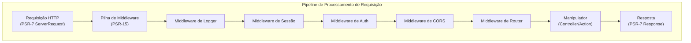

# ADR-005: Padrão de Middleware PSR-15 para XOOPS 4.0

> Adote manipuladores de requisição de servidor HTTP PSR-15 (middleware) para pipeline de processamento de requisição melhorado.

:::caution[Proposta XOOPS 4.0 — Não Disponível em 2.5.x]
Este ADR descreve uma **arquitetura proposta para XOOPS 4.0**. Middleware PSR-15 **não está disponível em XOOPS 2.5.x**. Módulos atuais 2.5.x usam o padrão Page Controller com bootstrap `mainfile.php`. Ver Arquitetura XOOPS para o ciclo de vida de requisição atual.
:::

---

## Status

**Proposto** - Sob avaliação para lançamento XOOPS 4.0

---

## Contexto

### Abordagem Atual

XOOPS 2.5 usa uma abordagem monolítica de manipulação de requisição:

```php
// Atual: Processamento sequencial
require_once 'mainfile.php';
// → Inicialização do kernel
// → Autenticação de usuário
// → Carregamento de módulo
// → Renderização de página

// Tudo em um fluxo, preocupações misturadas
```

### Problemas com Abordagem Atual

1. **Preocupações Misturadas** - Autenticação, logging, roteamento todos entrelaçados
2. **Difícil de Testar** - Difícil fazer teste unitário de etapas de processamento de requisição individual
3. **Difícil de Estender** - Módulos apenas podem usar preload/eventos
4. **Separação Pobre** - Lógica de processamento de requisição espalhada por codebase
5. **Não Componível** - Não é fácil encadear ou reordenar etapas de processamento

### O que é Middleware PSR-15?

PSR-15 define uma interface padrão para middleware HTTP:

```php
<?php
interface RequestHandlerInterface {
    public function handle(ServerRequestInterface $request): ResponseInterface;
}

interface MiddlewareInterface {
    public function process(
        ServerRequestInterface $request,
        RequestHandlerInterface $handler
    ): ResponseInterface;
}
```

**Cadeia de Middleware:**

```
Requisição
  ↓
[Logger] → registra requisição
  ↓
[Auth] → valida sessão de usuário
  ↓
[CORS] → verifica origem cruzada
  ↓
[Router] → despacha para manipulador
  ↓
[Handler] → gera resposta
  ↓
Resposta
```

---

## Decisão

### Adotar Pilha de Middleware PSR-15 para XOOPS 4.0

Implementar um pipeline de processamento de requisição baseado em middleware seguindo padrão PSR-15.

### Visão Geral da Arquitetura



### Componentes Principais de Middleware

#### 1. Middleware de Aplicação (Camada Central)

```php
<?php
declare(strict_types=1);

namespace XoopsCore;

use Psr\Http\Message\ResponseInterface;
use Psr\Http\Message\ServerRequestInterface;
use Psr\Http\Server\MiddlewareInterface;
use Psr\Http\Server\RequestHandlerInterface;

class SessionMiddleware implements MiddlewareInterface
{
    public function process(
        ServerRequestInterface $request,
        RequestHandlerInterface $handler
    ): ResponseInterface {
        // 1. Recuperar sessão (ou iniciar nova)
        $sessionId = $request->getCookieParams()['PHPSESSID'] ?? null;
        $session = $this->sessionManager->load($sessionId);

        // 2. Anexar sessão à requisição
        $request = $request->withAttribute('session', $session);

        // 3. Passar para próximo middleware
        $response = $handler->handle($request);

        // 4. Definir cookie de sessão se necessário
        if ($session->isModified()) {
            $response = $response->withAddedHeader(
                'Set-Cookie',
                'PHPSESSID=' . $session->getId() . '; HttpOnly; SameSite=Strict'
            );
        }

        return $response;
    }
}
```

#### 2. Middleware de Autenticação

```php
<?php
class AuthMiddleware implements MiddlewareInterface
{
    public function process(
        ServerRequestInterface $request,
        RequestHandlerInterface $handler
    ): ResponseInterface {
        // Obter sessão do middleware anterior
        $session = $request->getAttribute('session');

        // Autenticar usuário da sessão
        $user = $this->authenticate($session);

        // Anexar usuário à requisição
        $request = $request->withAttribute('user', $user);

        return $handler->handle($request);
    }

    private function authenticate(?Session $session): User
    {
        if ($session && $session->has('uid')) {
            return $this->userRepository->findById($session->get('uid'));
        }

        return new AnonymousUser();
    }
}
```

#### 3. Middleware de Autorização

```php
<?php
class AuthorizationMiddleware implements MiddlewareInterface
{
    public function __construct(private AuthorizationChecker $checker)
    {
    }

    public function process(
        ServerRequestInterface $request,
        RequestHandlerInterface $handler
    ): ResponseInterface {
        $user = $request->getAttribute('user');
        $route = $request->getAttribute('route');

        // Verificar se usuário tem permissão para esta rota
        if (!$this->checker->isGranted($user, $route)) {
            return new JsonResponse(
                ['error' => 'Não autorizado'],
                403
            );
        }

        return $handler->handle($request);
    }
}
```

#### 4. Middleware de Módulo

```php
<?php
// Módulos podem fornecer seu próprio middleware
class PublisherAccessMiddleware implements MiddlewareInterface
{
    public function process(
        ServerRequestInterface $request,
        RequestHandlerInterface $handler
    ): ResponseInterface {
        $user = $request->getAttribute('user');

        // Controle de acesso específico do módulo
        if (!$user->hasPermission('publisher_view')) {
            return new HtmlResponse('Acesso negado', 403);
        }

        return $handler->handle($request);
    }
}
```

### Exemplo de Implementação

```php
<?php
// bootstrap.php - Configuração de aplicação

use Psr\Http\Message\ServerRequestInterface;
use Psr\Http\Server\RequestHandlerInterface;
use Xoops\Core\Middleware\{
    LoggerMiddleware,
    SessionMiddleware,
    AuthMiddleware,
    CorsMiddleware,
    ErrorHandlingMiddleware
};

// Criar pipeline de middleware
$middlewareStack = [
    // 1. Manipulação de erro (mais externo)
    new ErrorHandlingMiddleware(),

    // 2. Logging
    new LoggerMiddleware($logger),

    // 3. Manipulação CORS
    new CorsMiddleware($corsConfig),

    // 4. Gerenciamento de sessão
    new SessionMiddleware($sessionManager),

    // 5. Autenticação
    new AuthMiddleware($userRepository),

    // 6. Autorização
    new AuthorizationMiddleware($authChecker),

    // 7. Roteamento e despacho
    new RoutingMiddleware($router),

    // 8. Middleware de módulo (dinâmico)
    ...$this->loadModuleMiddleware(),
];

// Processar requisição através pilha de middleware
$request = ServerRequestFactory::fromGlobals();
$dispatcher = new MiddlewareDispatcher($middlewareStack);
$response = $dispatcher->dispatch($request);

// Enviar resposta
http_response_code($response->getStatusCode());
foreach ($response->getHeaders() as $name => $values) {
    foreach ($values as $value) {
        header("$name: $value", false);
    }
}
echo $response->getBody();
```

### Integração de Módulo

Módulos podem fornecer middleware:

```php
<?php
// Módulo Publisher - xoops_version.php

$modversion['middleware'] = [
    'PublisherAccessMiddleware' => true,      // Auto-carregamento
    'PublisherLogMiddleware' => true,
];

// Ou customizado:
$modversion['middleware_factory'] = function() {
    return [
        new PublisherCacheMiddleware(),
        new PublisherPermissionMiddleware(),
    ];
};
```

---

## Consequências

### Efeitos Positivos

1. **Separação de Preocupações** - Cada middleware manipula uma responsabilidade
2. **Testabilidade** - Fácil fazer teste unitário de componentes de middleware individuais
3. **Componibilidade** - Middleware pode ser combinado e reordenado
4. **Em Conformidade com Padrões** - Usa padrões PSR-15 e PSR-7
5. **Extensibilidade** - Módulos podem adicionar middleware customizado facilmente
6. **Depuração** - Fluxo de requisição claro através pipeline
7. **Performance** - Pode otimizar camadas de middleware específicas
8. **Interoperabilidade** - Pode usar middleware PSR-15 de terceiros

### Efeitos Negativos

1. **Curva de Aprendizado** - Desenvolvedores devem entender PSR-15
2. **Overhead de Performance** - Mais chamadas de função em pipeline
3. **Complexidade** - Mais partes móveis que abordagem monolítica
4. **Esforço de Migração** - Requer refatoração de código existente
5. **Dependências** - Requer biblioteca HTTP PSR-7

### Riscos e Mitigações

| Risco | Severidade | Mitigação |
|------|----------|-----------|
| Cadeias de middleware complexas | Média | Documentação clara, exemplos |
| Degradação de performance | Média | Benchmark, otimizar caminhos quentes |
| Uso incorreto do desenvolvedor | Média | Revisão de código, guia de melhores práticas |
| Mudanças de ruptura de migração | Alta | Período de deprecação, helpers |
| Problemas de ordenação de middleware | Média | Gráfico de dependência claro |

---

## Plano de Implementação

### Fase 1: Fundação (Q2 2026)

- [ ] Implementar wrapper de mensagem HTTP PSR-7
- [ ] Criar MiddlewareDispatcher
- [ ] Implementar middleware principal (sessão, auth)
- [ ] Atualizar kernel para usar middleware

### Fase 2: Integração (Q3 2026)

- [ ] Migrar funcionalidade existente para middleware
- [ ] Adicionar suporte de middleware de módulo
- [ ] Criar utilitários de teste de middleware
- [ ] Escrever documentação abrangente

### Fase 3: Migração (Q4 2026)

- [ ] Fornecer camada de compatibilidade para código antigo
- [ ] Ajudar módulos a atualizar para novo middleware
- [ ] Otimização de performance
- [ ] Auditoria de segurança

### Fase 4: Lançamento (Q1 2027)

- [ ] Lançamento XOOPS 4.0 com middleware
- [ ] Deprecar sistema antigo de preload/hook
- [ ] Feedback da comunidade e atualizações

---

## Critérios de Sucesso

- [ ] Todas funcionalidade principal migrada para middleware
- [ ] Cobertura de teste 90%+ para middleware
- [ ] Documentação completa com exemplos
- [ ] Performance dentro de 10% de versão anterior
- [ ] Módulos usam com sucesso novo sistema de middleware
- [ ] Taxa de adoção da comunidade >80%

---

## Melhores Práticas de Middleware

### Faça

- Manter middleware focado (responsabilidade única)
- Usar imutabilidade (criar nova requisição/resposta)
- Manipular erros gracefully
- Documentar dependências
- Adicionar type hints
- Escrever testes para middleware
- Usar interfaces padrão PSR-15

### Não Faça

- Não modificar objetos de requisição/resposta compartilhados
- Não acessar globais diretamente
- Não criar dependências em ordem de middleware
- Não capturar todas exceções
- Não misturar lógica de negócios com middleware
- Não fazer middleware fazer muito

---

## Exemplos

### Middleware Customizado

```php
<?php
// Exemplo: Middleware de limitação de taxa

use Psr\Http\Message\ResponseInterface;
use Psr\Http\Message\ServerRequestInterface;
use Psr\Http\Server\MiddlewareInterface;
use Psr\Http\Server\RequestHandlerInterface;

class RateLimitMiddleware implements MiddlewareInterface
{
    public function __construct(
        private RateLimiter $limiter,
        private int $limit = 100,
        private int $window = 3600
    ) {
    }

    public function process(
        ServerRequestInterface $request,
        RequestHandlerInterface $handler
    ): ResponseInterface {
        $user = $request->getAttribute('user');
        $identifier = $user->getId() ?? $request->getClientIp();

        // Verificar limite de taxa
        $remaining = $this->limiter->check($identifier, $this->limit, $this->window);

        if ($remaining < 0) {
            return new JsonResponse(
                ['error' => 'Limite de taxa excedido'],
                429
            );
        }

        // Adicionar cabeçalhos de limite de taxa
        $response = $handler->handle($request);
        return $response
            ->withAddedHeader('X-RateLimit-Limit', (string)$this->limit)
            ->withAddedHeader('X-RateLimit-Remaining', (string)$remaining);
    }
}
```

---

## Decisões Relacionadas

- ADR-001: Arquitetura Modular - Fundação
- ADR-004: Sistema de Segurança - Usa middleware para auth
- ADR-006: Auth de Dois Fatores - Pode ser middleware

---

## Referências

### Padrões PSR

- [PSR-7: Interface de Mensagem HTTP](https://www.php-fig.org/psr/psr-7/)
- [PSR-15: Manipuladores de Requisição de Servidor HTTP](https://www.php-fig.org/psr/psr-15/)

### Estruturas de Middleware

- [Slim Framework](https://www.slimframework.com/) - Exemplos de middleware
- [Zend Expressive](https://docs.zendframework.com/zend-expressive/) - Framework PSR-15
- [Guzzle](https://docs.guzzlephp.org/) - Middleware de cliente HTTP

### Ferramentas

- [RelayPHP](https://relayphp.com/) - Biblioteca de middleware
- [PSR-15 Middleware](https://github.com/middlewares) - Coleção de middlewares

---

## Histórico de Versões

| Versão | Data | Mudanças |
|---------|------|---------|
| 1.0.0 | 2024-01-28 | Proposta inicial |

---

#xoops #adr #psr-15 #middleware #architecture #psr-7
