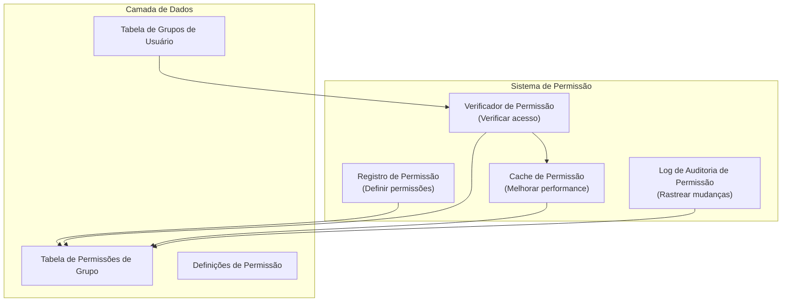

# ADR-006: Sistema de Permissão de Módulo

> Sistema de permissão hierárquico e fino para módulos XOOPS habilitando controle de acesso granular.

---

## Status

**Aceito** - Implementado em XOOPS 2.5.x e estendido em XOOPS 4.0

---

## Contexto

### Declaração de Problema

Módulos XOOPS precisam de controles de permissão flexíveis que permitam:

1. **Permissões de nível de módulo** - Usuário pode acessar este módulo?
2. **Permissões de nível de objeto** - Usuário pode acessar este item específico?
3. **Permissões de nível de ação** - Usuário pode executar esta ação?
4. **Permissões customizadas** - Módulos podem definir suas próprias permissões?

### Estado Atual

XOOPS 2.5 usa sistema XoopsGroupPermission:

```php
<?php
$perm_handler = xoops_getHandler('groupperm');
$isAllowed = $perm_handler->checkRight(
    'modulename',
    'action',
    $itemId,
    $groupId
);
```

### Desafios

1. **Consultas Complexas** - Verificações de permissão requerem joins de banco de dados
2. **Hierarquia Limitada** - Difícil criar grupos de permissão
3. **Cache Pobre** - Sem cache de permissão integrado
4. **Variações de Módulo** - Cada módulo implementa diferentemente
5. **Performance** - Múltiplas queries de DB para verificações de permissão

---

## Decisão

### Implementar Sistema de Permissão Hierárquico

Criar sistema de permissão padronizado e em cache suportando:

1. **Permissões Hierárquicas** - Herança de grupos pai
2. **Acesso Baseado em Função** - Mapear permissões a funções (admin, moderador, usuário, convidado)
3. **Permissões de Objeto** - Controle fino por item
4. **Cache** - Cache de permissões para reduzir queries
5. **Permissões Customizadas** - Módulos definem as suas
6. **Trilha de Auditoria** - Registrar mudanças de permissão

### Hierarquia de Permissão

```
Usuário
  └── Grupo 1 (Admin)
      └── Permissão: admin_module
      └── Permissão: edit_all_items
      └── Permissão: delete_all_items
  └── Grupo 2 (Moderador)
      └── Permissão: moderate_comments
      └── Permissão: edit_own_items
  └── Grupo 3 (Usuário)
      └── Permissão: view_published_items
      └── Permissão: edit_own_items
  └── Grupo 4 (Convidado)
      └── Permissão: view_published_items
```

### Arquitetura



---

## Componentes Principais

### 1. Definição de Permissão

```php
<?php
// Módulo define suas permissões em xoops_version.php

$modversion['permissions'] = [
    [
        'name' => 'module_view',
        'description' => 'Pode visualizar módulo',
        'level' => 'module',
    ],
    [
        'name' => 'item_view',
        'description' => 'Pode visualizar itens',
        'level' => 'item',
    ],
    [
        'name' => 'item_create',
        'description' => 'Pode criar itens',
        'level' => 'item',
    ],
    [
        'name' => 'item_edit',
        'description' => 'Pode editar itens',
        'level' => 'item',
    ],
    [
        'name' => 'item_delete',
        'description' => 'Pode deletar itens',
        'level' => 'item',
    ],
    [
        'name' => 'admin_manage',
        'description' => 'Pode gerenciar módulo',
        'level' => 'admin',
    ],
];

// Permissões padrão por grupo
$modversion['group_permissions'] = [
    // Grupo Admin recebe todas as permissões
    '1' => [
        'module_view' => 1,
        'item_view' => 1,
        'item_create' => 1,
        'item_edit' => 1,
        'item_delete' => 1,
        'admin_manage' => 1,
    ],
    // Grupo Usuário
    '3' => [
        'module_view' => 1,
        'item_view' => 1,
        'item_create' => 1,
        'item_edit' => 0,
        'item_delete' => 0,
        'admin_manage' => 0,
    ],
    // Grupo Convidado
    '4' => [
        'module_view' => 1,
        'item_view' => 1,
        'item_create' => 0,
        'item_edit' => 0,
        'item_delete' => 0,
        'admin_manage' => 0,
    ],
];
```

### 2. Verificador de Permissão

```php
<?php
declare(strict_types=1);

namespace XoopsCore\Permission;

class PermissionChecker
{
    private PermissionCache $cache;
    private PermissionRepository $repository;

    public function hasPermission(
        User $user,
        string $permissionName,
        ?int $itemId = null
    ): bool {
        // Verificar cache primeiro
        $cacheKey = "perm_{$user->getId()}_{$permissionName}_{$itemId}";
        if ($this->cache->has($cacheKey)) {
            return $this->cache->get($cacheKey);
        }

        $hasPermission = false;

        // Verificar todos os grupos de usuário
        foreach ($user->getGroups() as $group) {
            if ($this->checkGroupPermission($group, $permissionName, $itemId)) {
                $hasPermission = true;
                break;
            }
        }

        // Cache resultado
        $this->cache->set($cacheKey, $hasPermission, 3600);

        // Registrar verificações de acesso de alto nível
        if ($hasPermission && $this->shouldAuditLog($permissionName)) {
            $this->auditLog('PERMISSION_CHECKED', [
                'user_id' => $user->getId(),
                'permission' => $permissionName,
                'item_id' => $itemId,
                'result' => 'ALLOWED',
            ]);
        }

        return $hasPermission;
    }

    private function checkGroupPermission(
        Group $group,
        string $permissionName,
        ?int $itemId = null
    ): bool {
        $sql = 'SELECT COUNT(*) FROM ' . $this->table . '
                WHERE groupid = ?
                AND permission = ?
                AND itemid = ?
                AND granted = 1';

        $stmt = $this->db->prepare($sql);
        $stmt->execute([$group->getId(), $permissionName, $itemId ?? 0]);

        return $stmt->fetchColumn() > 0;
    }
}
```

### 3. Níveis de Permissão

```php
<?php
// Diferentes níveis de permissão com escopos diferentes

class PermissionLevel
{
    // Nível de módulo: Afeta módulo inteiro
    public const LEVEL_MODULE = 'module';

    // Nível de admin: Acesso a painel de admin
    public const LEVEL_ADMIN = 'admin';

    // Nível de item: Objetos/itens específicos
    public const LEVEL_ITEM = 'item';

    // Nível de campo: Campos de objeto específicos
    public const LEVEL_FIELD = 'field';

    // Nível de ação: Ações/operações específicas
    public const LEVEL_ACTION = 'action';
}
```

### 4. Permissões de Nível de Objeto

```php
<?php
// Controle fino para itens específicos

class Item extends XoopsObject
{
    /**
     * Verificar se usuário pode visualizar este item
     */
    public function canView(User $user): bool
    {
        // Itens públicos qualquer um pode visualizar
        if ($this->getVar('status') === 'published') {
            return true;
        }

        // Proprietário pode sempre visualizar seus itens
        if ($this->getVar('user_id') === $user->getId()) {
            return true;
        }

        // Verificar permissões de grupo
        $permChecker = xoops_getActiveModule()->getPermissionChecker();
        return $permChecker->hasPermission(
            $user,
            'item_view',
            $this->getVar('id')
        );
    }

    public function canEdit(User $user): bool
    {
        // Proprietário pode editar seus itens
        if ($this->getVar('user_id') === $user->getId()) {
            return $permChecker->hasPermission($user, 'item_edit', $this->getVar('id'));
        }

        // Verificar se usuário pode editar todos itens
        return $permChecker->hasPermission($user, 'item_edit_all', $this->getVar('id'));
    }

    public function canDelete(User $user): bool
    {
        return $permChecker->hasPermission($user, 'item_delete', $this->getVar('id'));
    }
}
```

### 5. Uso em Controladores

```php
<?php
// Exemplo: Controlador de artigo

class ArticleController
{
    private PermissionChecker $permChecker;

    public function view(int $id, User $user): Response
    {
        $article = $this->repository->find($id);

        // Verificar permissão
        if (!$article->canView($user)) {
            throw new AccessDeniedException('Não pode visualizar este artigo');
        }

        return new HtmlResponse($this->renderArticle($article));
    }

    public function edit(int $id, User $user): Response
    {
        $article = $this->repository->find($id);

        // Verificar permissão
        if (!$article->canEdit($user)) {
            throw new AccessDeniedException('Não pode editar este artigo');
        }

        // Manipular envio de formulário
        if ($this->request->isMethod('POST')) {
            $article->setVar('title', $this->request->getPost('title'));
            $article->setVar('content', $this->request->getPost('content'));
            $this->repository->insert($article);

            $this->auditLog('ARTICLE_EDITED', ['id' => $id, 'user_id' => $user->getId()]);

            // Invalidar cache de permissão
            $this->permChecker->clearCache($user->getId());

            return new RedirectResponse('/article/' . $id);
        }

        return new HtmlResponse($this->renderForm($article));
    }

    public function delete(int $id, User $user): Response
    {
        $article = $this->repository->find($id);

        if (!$article->canDelete($user)) {
            throw new AccessDeniedException('Não pode deletar este artigo');
        }

        $this->repository->delete($article);

        $this->auditLog('ARTICLE_DELETED', ['id' => $id, 'user_id' => $user->getId()]);

        // Invalidar cache
        $this->permChecker->clearCache($user->getId());

        return new JsonResponse(['success' => true]);
    }
}
```

---

## Consequências

### Efeitos Positivos

1. **Controle Granular** - Gerenciamento de permissão fino
2. **Padronizado** - Consistente em módulos
3. **Em Cache** - Melhor performance com cache
4. **Auditável** - Rastrear quem mudou o quê
5. **Flexível** - Suportar permissões customizadas
6. **Escalável** - Manipula hierarquias de permissão complexas
7. **Testável** - Fácil fazer teste unitário

### Efeitos Negativos

1. **Complexidade** - Mais código para gerenciar
2. **Overhead de Banco de Dados** - Mais tabelas e joins
3. **Invalidação de Cache** - Deve limpar cache em mudanças
4. **Curva de Aprendizado** - Desenvolvedores devem entender sistema
5. **Performance** - Se cache não configurado apropriadamente

### Riscos e Mitigações

| Risco | Severidade | Mitigação |
|------|----------|-----------|
| Permissões excessivamente complexas | Média | Bons padrões, documentação |
| Cache dados obsoletos | Alta | TTL, invalidação inteligente |
| Regressão de performance | Média | Benchmark, otimizar queries |
| Bypass de permissão | Alta | Auditoria de segurança, testes |

---

## Padrões de Design de Permissão

### Padrão 1: Permissões Baseadas em Proprietário

```php
<?php
// Usuário pode editar seus itens mas não os de outros

public function canEdit(User $user): bool
{
    // Proprietário pode sempre editar
    if ($this->isOwner($user)) {
        return true;
    }

    // Verificar permissões de grupo para editar itens de outros
    return $this->permChecker->hasPermission($user, 'edit_all_items');
}

private function isOwner(User $user): bool
{
    return $this->getVar('user_id') === $user->getId();
}
```

### Padrão 2: Permissões Baseadas em Status

```php
<?php
// Diferentes permissões baseado em status

public function canView(User $user): bool
{
    switch ($this->getVar('status')) {
        case 'published':
            // Qualquer um com permissão de módulo pode visualizar
            return $this->permChecker->hasPermission($user, 'item_view');

        case 'draft':
            // Apenas proprietário ou admin pode visualizar
            return $this->isOwner($user) ||
                   $this->permChecker->hasPermission($user, 'admin_manage');

        case 'archived':
            // Apenas admin pode visualizar
            return $this->permChecker->hasPermission($user, 'admin_manage');

        default:
            return false;
    }
}
```

### Padrão 3: Permissões Baseadas em Função

```php
<?php
// Verificar contra funções específicas

public function hasAdminRole(User $user): bool
{
    return $user->getGroups()->contains('admin_group');
}

public function hasModeratorRole(User $user): bool
{
    return $user->getGroups()->contains('moderator_group') ||
           $this->hasAdminRole($user);
}

public function canModerate(User $user): bool
{
    return $this->hasModeratorRole($user);
}
```

---

## Decisões Relacionadas

- ADR-001: Arquitetura Modular - Módulos definem permissões
- ADR-004: Sistema de Segurança - Fundação para segurança
- ADR-005: Middleware - Pode fazer cumprir permissões

---

## Referências

### Modelos de Permissão

- [RBAC (Role-Based Access Control)](https://en.wikipedia.org/wiki/Role-based_access_control)
- [ABAC (Attribute-Based Access Control)](https://en.wikipedia.org/wiki/Attribute-based_access_control)
- [ACL (Access Control List)](https://en.wikipedia.org/wiki/Access-control_list)

### Implementação

- [Segurança Symfony](https://symfony.com/doc/current/security.html)
- [Autorização Laravel](https://laravel.com/docs/authorization)

---

## Lista de Verificação de Implementação

- [ ] Definir níveis de permissão padrão
- [ ] Criar classe PermissionChecker
- [ ] Implementar estratégia de cache
- [ ] Adicionar registro de auditoria
- [ ] Criar funções auxiliares
- [ ] Escrever testes abrangentes
- [ ] Documentar para desenvolvedores
- [ ] Atualizar todos os módulos
- [ ] Otimização de performance
- [ ] Revisão de segurança

---

## Histórico de Versões

| Versão | Data | Mudanças |
|---------|------|---------|
| 1.0.0 | 2024-01-28 | Documento inicial |

---

#xoops #adr #permissions #authorization #rbac #security
