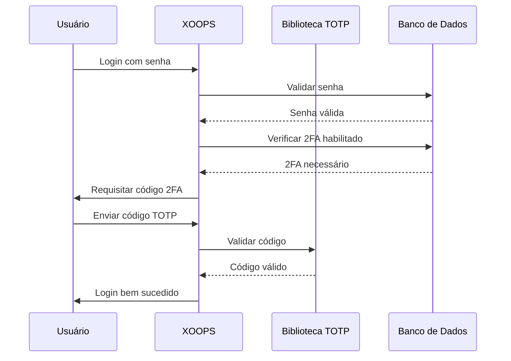

## Status

Proposto

## Contexto

XOOPS precisa de segurança aprimorada para autenticação de usuário. Autenticação de dois fatores (2FA) fornece uma camada adicional de segurança além de senhas, protegendo contas mesmo se senhas forem comprometidas.

Considerações principais:
- Compatibilidade com autenticação existente
- Suportar múltiplos métodos 2FA
- Experiência de usuário durante configuração e login
- Mecanismos de recuperação para dispositivos perdidos
- Integração com sistema de permissão existente

## Decisão

Implementaremos TOTP (Senha Única Baseada em Tempo) como método 2FA primário com suporte a códigos de backup.

### Abordagem de Implementação



### Esquema de Banco de Dados

```sql
CREATE TABLE `{PREFIX}_users_2fa` (
    `user_id` INT(11) NOT NULL,
    `secret` VARCHAR(32) NOT NULL,
    `enabled` TINYINT(1) DEFAULT 0,
    `backup_codes` TEXT,
    `last_used` INT(11),
    `created` INT(11) NOT NULL,
    PRIMARY KEY (`user_id`),
    FOREIGN KEY (`user_id`) REFERENCES `{PREFIX}_users`(`uid`)
);
```

### Interface de Serviço

```php
interface TwoFactorAuthInterface
{
    public function enable(int $userId): TwoFactorSetup;
    public function disable(int $userId): void;
    public function verify(int $userId, string $code): bool;
    public function generateBackupCodes(int $userId): array;
    public function isEnabled(int $userId): bool;
}
```

### Integração de Middleware

```php
class TwoFactorMiddleware implements MiddlewareInterface
{
    public function process(
        ServerRequestInterface $request,
        RequestHandlerInterface $handler
    ): ResponseInterface {
        $session = $request->getAttribute('session');

        if ($session->has('pending_2fa_user_id')) {
            // Usuário precisa completar 2FA
            if ($this->isVerificationRequest($request)) {
                return $handler->handle($request);
            }
            return new RedirectResponse('/2fa/verify');
        }

        return $handler->handle($request);
    }
}
```

## Consequências

### Positivo

- Segurança de conta significativamente melhorada
- Compatibilidade TOTP padrão da indústria (Google Authenticator, Authy, etc.)
- Códigos de backup previnem bloqueio de conta
- Opcional por usuário - não força adoção
- Middleware PSR-15 permite integração limpa

### Negativo

- Etapa de login adicional impacta experiência de usuário
- Usuários devem gerenciar apps autenticador
- Dispositivos perdidos requerem processo de recuperação
- Armazenamento e queries de banco de dados adicionais
- Requer dependência de biblioteca criptográfica

### Caminho de Migração

1. Adicionar tabela de banco de dados para dados 2FA
2. Implementar serviço TOTP com dependência de biblioteca
3. Adicionar middleware à cadeia de autenticação
4. Criar UI de configuração e verificação
5. Opção de admin para exigir 2FA para grupos específicos

## Alternativas Consideradas

### OTP Baseado em SMS

Rejeitado devido a:
- Vulnerabilidades de SIM swapping
- Custo de gateway SMS
- Complexidade de verificação de número de telefone
- Preocupações de privacidade

### Chaves de Segurança de Hardware (WebAuthn)

Adiado para ADR futuro:
- Implementação mais complexa
- Suporte de navegador historicamente limitado
- Custo de usuário mais alto
- Pode ser adicionado junto com TOTP depois

### OTP Baseado em Email

Rejeitado devido a:
- Compromisso de conta de email derrota propósito
- Atrasos de entrega impactam UX
- Problemas de filtro de spam

## Referências

- [RFC 6238 - TOTP](https://tools.ietf.org/html/rfc6238)
- [Formato de Chave Google Authenticator](https://github.com/google/google-authenticator/wiki/Key-Uri-Format)
- ../../02-Core-Concepts/Security/Security-Best-Practices - Diretrizes de segurança
- ../../02-Core-Concepts/Users-Permissions/Authentication - Documentação de sistema de auth
