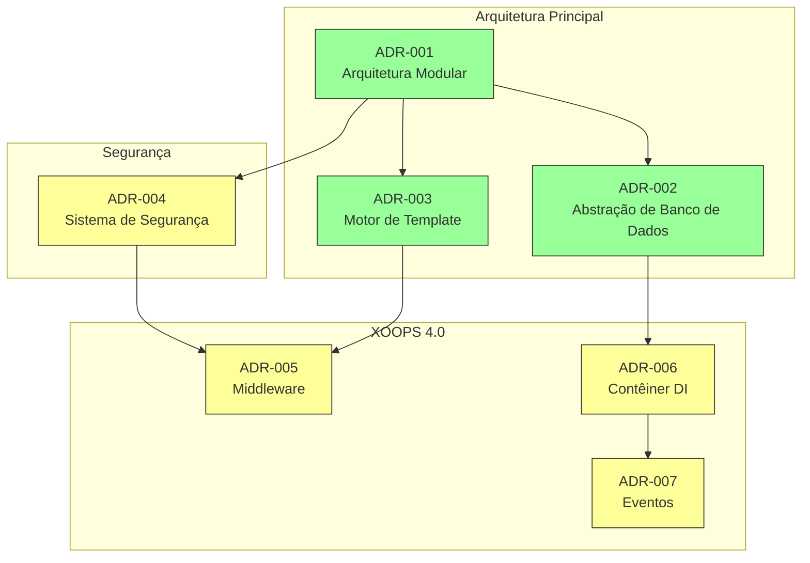
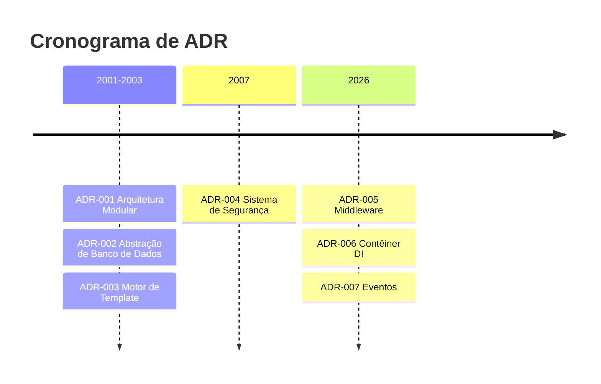

# 📋 Índice de Registros de Decisão de Arquitetura

> Índice abrangente de decisões arquiteturais que formaram XOOPS CMS.

---

## O que são ADRs?

Registros de Decisão de Arquitetura (ADRs) documentam decisões arquiteturais significativas feitas durante desenvolvimento do XOOPS. Eles capturam contexto, decisão e consequências de cada escolha, fornecendo contexto histórico valioso para mantenedores e contribuidores.

---

## Legenda de Status de ADR

| Status | Significado |
|--------|---------|
| **Proposto** | Em discussão, ainda não aceito |
| **Aceito** | Decisão foi adotada |
| **Descontinuado** | Não mais recomendado |
| **Supersedido** | Substituído por outro ADR |

---

## ADRs Atuais

### Decisões Fundamentais

| ADR | Título | Status | Impacto |
|-----|--------|--------|--------|
| ADR-001 | Arquitetura Modular | Aceito | Principal |
| ADR-002 | Acesso ao Banco de Dados Orientado a Objetos | Aceito | Principal |
| ADR-003 | Motor de Template Smarty | Aceito | Principal |

### ADRs Planejados (XOOPS 4.0)

| ADR | Título | Status | Impacto |
|-----|--------|--------|--------|
| ADR-004 | Design de Sistema de Segurança | Proposto | Segurança |
| ADR-005 | Middleware PSR-15 | Proposto | Arquitetura |
| ADR-006 | Contêiner de Injeção de Dependência | Proposto | Arquitetura |
| ADR-007 | Redesenho de Sistema de Evento | Proposto | Arquitetura |

---

## Relações de ADR



---

## Cronograma



---

## Criando Novos ADRs

Ao propor uma nova decisão arquitetural:

1. Copiar o Modelo de ADR
2. Preencher todas as seções
3. Enviar como Pull Request
4. Discutir em Problemas do GitHub
5. Atualizar status após decisão

### Estrutura de Modelo de ADR

```markdown
# ADR-XXX: Título

## Status
Proposto | Aceito | Descontinuado | Supersedido

## Contexto
Qual é o problema motivando esta decisão?

## Decisão
Qual é a mudança que estamos propondo?

## Consequências
O que fica mais fácil ou mais difícil como resultado?

## Alternativas Consideradas
Quais outras opções foram avaliadas?
```

---

## 🔗 Documentação Relacionada

- Conceitos Principais
- Diretrizes de Contribuição
- Roteiro XOOPS 4.0

---

#xoops #adr #architecture #index #decisions
